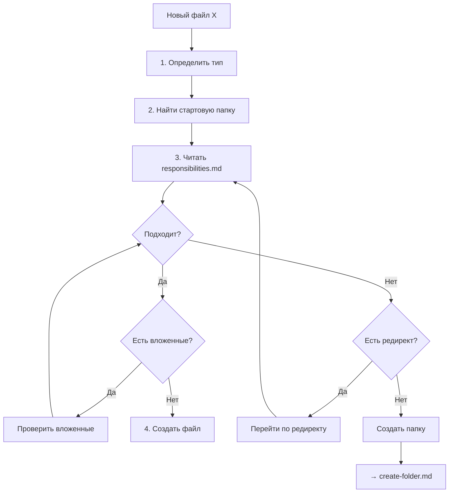

# Создание файла

Флоу при создании нового файла (поиск правильной папки).

---

## Когда использовать

- Нужно создать файл, но неясно куда
- Хочу убедиться, что кладу в правильное место

---

## Флоу



---

## Шаги

### Шаг 1. Определить тип файла

| Тип файла | Описание |
|-----------|----------|
| Код сервиса | handlers, services, models |
| Общий код | библиотеки для нескольких сервисов |
| Тест сервиса | unit, integration тесты сервиса |
| Системный тест | e2e, load, smoke |
| Инфраструктура | docker, k8s, monitoring |
| Спецификация | ADR, план, обсуждение |
| Конфиг | настройки окружения |
| Инструкция | правила для LLM |
| Скилл/агент | автоматизация Claude |

### Шаг 2. Найти стартовую папку

| Тип файла | Стартовая папка |
|-----------|-----------------|
| Код сервиса | `/src/` |
| Общий код | `/shared/` |
| Тест сервиса | `/src/{service}/tests/` |
| Системный тест | `/tests/` |
| Инфраструктура | `/platform/` |
| Спецификация | `/specs/` |
| Конфиг | `/config/` |
| Инструкция | `/.claude/.instructions/` |
| Скилл/агент | `/.claude/` |
| GitHub workflow | `/.github/` |

### Шаг 3. Найти папку по зоне

1. Открыть `/.structure/responsibilities.md`
2. Найти секцию стартовой папки
3. Проверить:
   - [ ] Файл подходит под **IN**?
   - [ ] Файл НЕ подходит под **Границы** (исключения)?

**Если подходит** — проверить вложенные папки (более конкретная лучше).

**Если не подходит** — посмотреть редирект в Границах.

### Шаг 4. Создать файл

```bash
touch /path/to/folder/filename.ext
```

---

## Примеры

### Пример 1: Handler для auth

**Файл:** `register.ts` — handler регистрации

```
1. Тип: код сервиса
2. Стартовая папка: /src/
3. Читаю responsibilities.md:
   - /src/auth/backend/v1/ — "handlers, routes"
4. Ответ: /src/auth/backend/v1/handlers/register.ts
```

### Пример 2: Общая библиотека

**Файл:** `email-validator.ts` — валидация email для всех сервисов

```
1. Тип: общий код
2. Стартовая папка: /shared/
3. Читаю responsibilities.md:
   - /shared/libs/ — "errors/, logging/, validation/"
4. Ответ: /shared/libs/validation/email-validator.ts
```

### Пример 3: E2E тест

**Файл:** `checkout-flow.test.ts` — e2e тест покупки

```
1. Тип: системный тест
2. Стартовая папка: /tests/
3. Читаю responsibilities.md:
   - /tests/e2e/ — "User flows, сценарии"
4. Ответ: /tests/e2e/checkout-flow.test.ts
```

---

## Файлы в корне

Корень проекта `/` имеет ограниченную зону:

**Допустимы:**
- `README.md` — описание проекта
- `CLAUDE.md` — точка входа для Claude
- `Makefile` — команды разработки
- `.gitignore` — git ignore
- Конфиги инструментов (`.eslintrc`, `pyproject.toml`)

**НЕ допустимы:**
- Код → `/src/`
- Документация → `*/docs/`
- Скрипты → `/platform/scripts/` или `/.claude/scripts/`

---

## Если папка не найдена

Если ни одна существующая папка не подходит:

1. Убедиться, что проверил все варианты
2. Если действительно нет — создать папку
3. → [create-folder.md](./create-folder.md)
