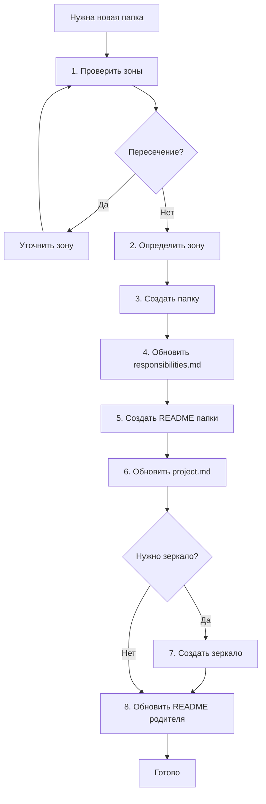

# Создание папки

Флоу при создании новой папки в проекте.

---

## Когда использовать

- Нужна новая папка для организации кода
- Появился новый сервис/модуль/компонент
- Существующие папки не покрывают зону ответственности
- Накопилось 3+ файлов одного типа

---

## Флоу



---

## Шаги

### Шаг 1. Проверить зоны

1. Открыть `/.structure/responsibilities.md`
2. Найти папку-родителя
3. Проверить: новая зона не пересекается с существующими?

**Если пересекается:**
- Уточнить зону (сузить или расширить)
- Или использовать существующую папку

### Шаг 2. Определить зону ответственности

Сформулировать:
- **IN:** Что будет храниться
- **Границы:** Что здесь, что не здесь (с редиректами)

### Шаг 3. Создать папку

```bash
mkdir /path/to/new-folder
```

### Шаг 4. Обновить /.structure/responsibilities.md

Добавить секцию:

```markdown
### /path/to/new-folder/

**IN:** {что хранится}

**Границы:**
- {что здесь} → здесь
- {что не здесь} → {куда}
```

### Шаг 5. Создать README папки

Создать `/path/to/new-folder/README.md`:

```markdown
# {Название}

## Зона ответственности

{Копия из responsibilities.md}

> **Все зоны:** [/.structure/responsibilities.md](/.structure/responsibilities.md)

---

## Содержимое

{Пока пусто}
```

### Шаг 6. Обновить /.structure/project.md

Добавить папку в дерево.

### Шаг 7. Создать зеркало (если нужно)

Для папок в `/src/`, `/platform/`, `/shared/`, `/tests/`, `/specs/`, `/config/`, `/.github/`:

```bash
mkdir /.claude/.instructions/{path}/
```

Создать `README.md` зеркала с индексом правил.

### Шаг 8. Обновить README родителя

Добавить ссылку на новую папку в README родительской папки.

---

## Чек-лист

- [ ] Проверены пересечения зон
- [ ] Добавлена зона в `/.structure/responsibilities.md`
- [ ] Создан `README.md` папки с копией зоны
- [ ] Обновлён `/.structure/project.md`
- [ ] Создано зеркало (если нужно)
- [ ] Обновлён README родителя

---

## Пример

**Задача:** Создать папку `/src/notifications/` для нового сервиса.

**Шаги:**

1. ✅ Проверил `responsibilities.md` — нет пересечений
2. ✅ Зона: "Сервис уведомлений (email, SMS, push)"
3. ✅ `mkdir /src/notifications`
4. ✅ Добавил в `responsibilities.md`:
   ```markdown
   ### /src/notifications/
   **IN:** backend/, database/, tests/, docs/
   **Границы:**
   - код уведомлений → здесь
   - шаблоны писем → /shared/templates/
   ```
5. ✅ Создал `/src/notifications/README.md`
6. ✅ Добавил в `project.md`
7. ✅ Создал `/.claude/.instructions/src/notifications/`
8. ✅ Обновил `/src/README.md`
