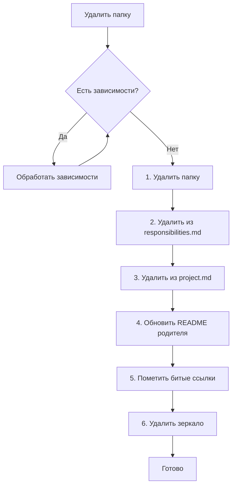

# Удаление

Флоу при удалении папки или файла.

---

## Когда использовать

- Удаление ненужной папки
- Удаление файла
- Очистка структуры

---

## Флоу для папки



---

## Шаги для папки

### Шаг 0. Проверить зависимости

Перед удалением проверить:
- Есть ли ссылки на эту папку?
- Зависит ли другой код от этой папки?

```bash
grep -r "/path/to/folder" --include="*.md"
grep -r "from.*path/to/folder" --include="*.ts" --include="*.py"
```

### Шаг 1. Удалить папку

```bash
rm -rf /path/to/folder
```

### Шаг 2. Удалить из /.structure/responsibilities.md

Убрать секцию папки.

### Шаг 3. Удалить из /.structure/project.md

Убрать из дерева.

### Шаг 4. Обновить README родителя

Убрать ссылку на удалённую папку.

### Шаг 5. Пометить битые ссылки

Найти и пометить ссылки на удалённую папку:

```markdown
[~~deleted~~](path/to/deleted)
```

Или использовать скилл `/links-delete`.

### Шаг 6. Удалить зеркало (если есть)

```bash
rm -rf /.claude/.instructions/path/to/folder
```

---

## Шаги для файла

1. Удалить файл
2. Обновить README папки (если файл был там указан)
3. Пометить битые ссылки

---

## Чек-лист для папки

- [ ] Проверены зависимости
- [ ] Папка удалена
- [ ] Удалено из `/.structure/responsibilities.md`
- [ ] Удалено из `/.structure/project.md`
- [ ] Обновлён README родителя
- [ ] Помечены битые ссылки
- [ ] Удалено зеркало

---

## Скиллы

| Скилл | Назначение |
|-------|------------|
| `/links-delete` | Пометить битые ссылки после удаления |
