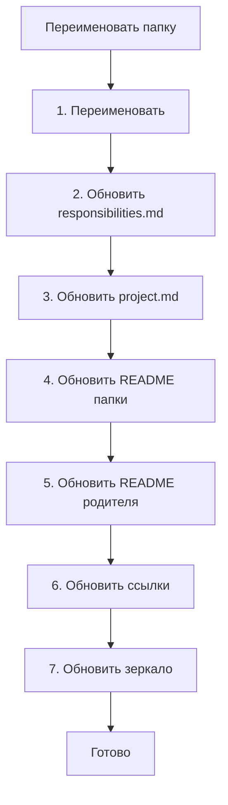

# Переименование/перемещение

Флоу при переименовании или перемещении папки/файла.

---

## Когда использовать

- Переименование папки или файла
- Перемещение в другую папку
- Реструктуризация

---

## Флоу для папки



---

## Шаги для папки

### Шаг 1. Переименовать папку

```bash
mv /old/path /new/path
```

### Шаг 2. Обновить /.structure/responsibilities.md

Изменить путь в заголовке секции:
```markdown
### /new/path/  ← было /old/path/
```

### Шаг 3. Обновить /.structure/project.md

Изменить путь в дереве.

### Шаг 4. Обновить README папки

Обновить заголовок и ссылки внутри.

### Шаг 5. Обновить README родителя

Изменить ссылку на папку.

### Шаг 6. Обновить ссылки в проекте

Найти и обновить все ссылки на старый путь:

```bash
grep -r "/old/path" --include="*.md"
```

### Шаг 7. Обновить зеркало (если есть)

Переименовать `/.claude/.instructions/old/path/` → `/.claude/.instructions/new/path/`

---

## Шаги для файла

1. Переименовать файл
2. Обновить ссылки на файл
3. Если файл в README — обновить README

---

## Чек-лист для папки

- [ ] Папка переименована
- [ ] Обновлён `/.structure/responsibilities.md`
- [ ] Обновлён `/.structure/project.md`
- [ ] Обновлён README папки
- [ ] Обновлён README родителя
- [ ] Обновлены ссылки в проекте
- [ ] Обновлено зеркало в инструкциях

---

## Скиллы

| Скилл | Назначение |
|-------|------------|
| `/links-update` | Обновить ссылки после переименования |
