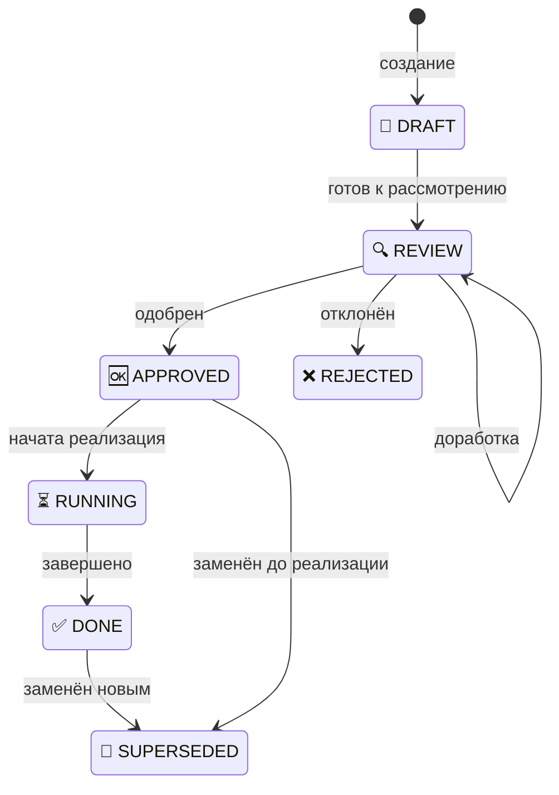

# Статусы документов /specs/

Унифицированная система статусов для всех типов документов в `/specs/`:
- Discussion
- Impact
- ADR
- Plan

**Индекс:** [/.claude/.instructions/README.md](/.claude/.instructions/README.md) | **Папка:** [specs/README.md](./README.md)

## Оглавление

- [Все статусы](#все-статусы)
- [Схема переходов](#схема-переходов)
- [Правила перехода](#правила-перехода)
- [Специфика по типам](#специфика-по-типам)
- [Отображение в README](#отображение-в-readme)
- [Правила для REJECTED](#правила-для-rejected)
- [Каскадные проверки](#каскадные-проверки)
- [Связанные инструкции](#связанные-инструкции)

---

## Все статусы

| Статус | Emoji | Описание |
|--------|-------|----------|
| `DRAFT` | 📝 | Черновик, начальная работа |
| `REVIEW` | 🔍 | На рассмотрении, активная работа |
| `APPROVED` | 🆗 | Одобрен, готов к следующему этапу |
| `RUNNING` | ⏳ | В реализации |
| `DONE` | ✅ | Завершён успешно |
| `REJECTED` | ❌ | Отклонён (с указанием причины) |
| `SUPERSEDED` | 🚫 | Заменён новым документом |

---

## Схема переходов



**Примечания:**
- `APPROVED → SUPERSEDED` — для ADR, который решили не реализовывать и заменить другим
- Условия перехода `APPROVED → RUNNING` различаются по типам документов

---

## Правила перехода

### Общие правила

```
📝 DRAFT → 🔍 REVIEW       : документ готов к рассмотрению
🔍 REVIEW → 🆗 APPROVED    : документ одобрен
🆗 APPROVED → ⏳ RUNNING   : начата реализация
⏳ RUNNING → ✅ DONE       : реализация завершена

🔍 REVIEW → ❌ REJECTED    : документ отклонён (с причиной)
✅ DONE → 🚫 SUPERSEDED    : документ заменён новым
```

---

## Специфика по типам

### Discussion

| Переход | Условие |
|---------|---------|
| `DRAFT → REVIEW` | Начато обсуждение |
| `REVIEW → APPROVED` | Решение принято, создаётся Impact |
| `APPROVED → RUNNING` | Первый Plan перешёл в RUNNING |
| `RUNNING → DONE` | Все ADR в финальном статусе, минимум один DONE |
| `REVIEW → REJECTED` | Дискуссия неактуальна |
| `DONE → SUPERSEDED` | Заменена новой дискуссией |

### Impact

| Переход | Условие |
|---------|---------|
| `DRAFT → REVIEW` | Начат анализ |
| `REVIEW → REVIEW` | Возврат из ADR (новая бизнес-логика → Discussion) |
| `REVIEW → APPROVED` | ВСЕ ADR в статусе APPROVED |
| `APPROVED → RUNNING` | ВСЕ планы связанных ADR в статусе APPROVED |
| `RUNNING → DONE` | ВСЕ ADR в финальном статусе, минимум один DONE |
| `REVIEW → REJECTED` | Импакт отклонён |
| `DONE → SUPERSEDED` | Заменён новым импактом |

### ADR

| Переход | Условие |
|---------|---------|
| `DRAFT → REVIEW` | ADR написан |
| `REVIEW → REVIEW` | Обновление Impact (новая бизнес-логика) |
| `REVIEW → APPROVED` | Бизнес-логика проверена, ждём другие ADR |
| `APPROVED → RUNNING` | План в статусе APPROVED |
| `APPROVED → SUPERSEDED` | Решили не реализовывать, заменён другим ADR |
| `RUNNING → DONE` | Реализация завершена, architecture.md обновлён |
| `REVIEW → REJECTED` | ADR отклонён (с причиной) |
| `DONE → SUPERSEDED` | Заменён новым ADR |

> **При ADR → DONE обязательно:**
> 1. Обновить `/specs/services/{service}/architecture.md`
> 2. Добавить ссылку на ADR в затронутых разделах
> 3. Добавить запись в "История изменений"

### Plan

| Переход | Условие |
|---------|---------|
| `DRAFT → REVIEW` | План готов к согласованию |
| `REVIEW → APPROVED` | Пользователь согласовал |
| `APPROVED → RUNNING` | Начата реализация |
| `RUNNING → DONE` | Все задачи выполнены |
| `REVIEW → REJECTED` | План отклонён |
| `DONE → SUPERSEDED` | Заменён новым планом |

---

## Отображение в README

```markdown
| # | Тема | Статус | Дата |
|---|------|--------|------|
| [001](001-auth.md) | Auth Strategy | 🔍 REVIEW | 2025-01-21 |
| [002](002-payments.md) | Payments | 📝 DRAFT | 2025-01-20 |
```

---

## Правила для REJECTED

### Что происходит при отклонении

| Ситуация | Действие | Родительский документ |
|----------|----------|----------------------|
| ADR → REJECTED | Создать новый ADR или скорректировать Impact | Impact остаётся REVIEW |
| Plan → REJECTED | Создать новый план | ADR возвращается в APPROVED |
| Impact → REJECTED | Вернуться к Discussion | Discussion остаётся APPROVED |
| Discussion → REJECTED | Закрыть обсуждение | — |

### Финальные статусы

Документ считается в **финальном статусе**, если он в одном из:
- ✅ **DONE** — успешно завершён
- ❌ **REJECTED** — отклонён
- 🚫 **SUPERSEDED** — заменён новым

### Правило завершения родительского документа

```
Родитель → DONE когда:
  1. ВСЕ дочерние документы в финальном статусе (DONE | REJECTED | SUPERSEDED)
  2. И минимум ОДИН дочерний документ в статусе DONE
```

**Примеры:**
- Impact с 3 ADR: ADR-1 DONE, ADR-2 DONE, ADR-3 REJECTED → Impact → DONE ✓
- Impact с 3 ADR: ADR-1 REJECTED, ADR-2 REJECTED, ADR-3 REJECTED → Impact → REJECTED ✗

---

## Каскадные проверки

При изменении статуса документа необходимо проверить родительские и дочерние документы.

### Матрица каскадных проверок

| Событие | Проверить | Возможное действие |
|---------|-----------|-------------------|
| ADR → APPROVED | Все ADR этого Impact | Impact → APPROVED |
| ADR → DONE | Все ADR этого Impact | Impact → DONE, Discussion → DONE |
| ADR → REJECTED | Impact | Impact остаётся REVIEW или → REJECTED |
| Plan → APPROVED | Все планы для Impact | ADR → RUNNING, Impact → RUNNING |
| Plan → RUNNING | Discussion | Discussion → RUNNING (если первый) |
| Plan → DONE | ADR | ADR → DONE |
| Plan → REJECTED | ADR | ADR возвращается в APPROVED |

### Порядок проверки (снизу вверх)

```
Plan изменился
    ↓
Проверить ADR (все планы ADR в финальном?)
    ↓
Проверить Impact (все ADR Impact в финальном?)
    ↓
Проверить Discussion (все ADR в финальном?)
```

### Скиллы

Каскадные проверки выполняются скиллом [/specs-health](/.claude/skills/specs-health/SKILL.md):
- Проверка консистентности статусов
- Выявление "застрявших" документов
- Рекомендации по обновлению статусов

Синхронизация статусов выполняется скиллом [/specs-sync](/.claude/skills/specs-sync/SKILL.md).

---

## Связанные инструкции

- [workflow.md](./workflow.md) — полный workflow от идеи до реализации
- [discussions.md](./discussions.md) — формат и чек-листы переходов Discussion
- [impact.md](./impact.md) — формат и чек-листы переходов Impact
- [adr.md](./adr.md) — формат и чек-листы переходов ADR
- [plans.md](./plans.md) — формат и чек-листы переходов Plan
