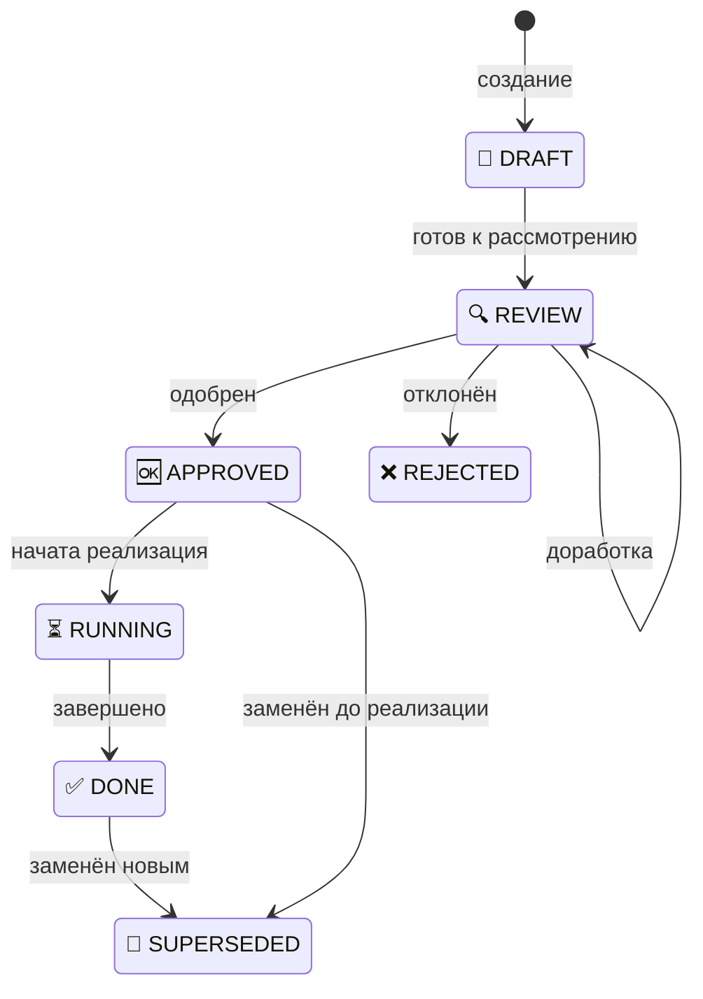

# Предложение по организации документации

> **Дата:** 2025-01-21
> **Статус:** REVIEW 🔍
> **Цель:** Структурировать подход к документированию проекта

---

## Навигация по документу

Этот документ содержит полную информацию для создания инструкций:

| Секция | Будущая инструкция | Описание |
|--------|-------------------|----------|
| [1. Обзор](#1-обзор-readme) | `specs/README.md` | Структура /specs, принятые решения |
| [2. Статусы](#2-статусы-statusesmd) | `specs/statuses.md` | Унифицированная система статусов |
| [3. Workflow](#3-workflow-workflowmd) | `specs/workflow.md` | Полный workflow с возвратами |
| [4. Discussions](#4-discussions-discussionsmd) | `specs/discussions.md` | Как вести дискуссии |
| [5. Impact](#5-impact-impactmd) | `specs/impact.md` | Импакт-анализ, связь с ADR |
| [6. ADR](#6-adr-adrmd) | `specs/adr.md` | Формат ADR, проверка бизнес-логики |
| [7. Plans](#7-plans-plansmd) | `specs/plans.md` | Планы, согласование |
| [8. Architecture](#8-architecture-architecturemd) | `specs/architecture.md` | Архитектура, ссылки на ADR |
| [9. Glossary](#9-glossary-glossarymd) | `specs/glossary.md` | Правила глоссария |
| [10. Правила](#10-правила) | `specs/rules.md` | Скиллы, запреты, автоматизация |

---

# 1. Обзор (README)

> **Инструкция:** `/.claude/instructions/specs/README.md`

## 1.1. Контекст

Рефакторинг системы документации. Анализ двух подходов:
- **Старый** (llm_instructions_old) — сложный многоуровневый workflow
- **Текущий** (structure.md) — упрощённый с зеркалированием

**Ключевые решения:**
- `/specs` — проектная документация (решения, планы, архитектура)
- `/doc` — документация кода (текущее состояние сервисов)
- Двухуровневая структура: общее (discussions, impact) + по сервисам (adr, plans, architecture)
- Один Impact → несколько ADR (разные сервисы)
- ADR обязательно ссылается на Impact
- Единая структура статусов документов

## 1.2. Принятые решения

| Вопрос | Решение |
|--------|---------|
| Название папки спецификаций | `/specs` |
| Где хранить глоссарий | `/specs/glossary.md` |
| Где хранить дискуссии | `/specs/discussions/` (только общий уровень) |
| Где хранить импакт-анализ | `/specs/impact/` (только общий уровень) |
| Структура | Двухуровневая: общее + по сервисам |
| ADR и архитектура | Только по сервисам |
| Формат названий | Порядковые номера: `001-topic.md` |
| README.md в папках | Индексные файлы с навигацией и статусами |
| ADR → Impact | Обязательная ссылка на родительский Impact |
| Impact → ADR | Один Impact может создать несколько ADR |
| Статусы | Унифицированные: DRAFT, REVIEW, APPROVED, RUNNING, DONE, REJECTED, SUPERSEDED |
| Индикаторы статусов | Emoji: 📝🔍🆗⏳✅❌🚫 |

## 1.3. Структура /specs

```
/specs/
├── README.md                         # ИНДЕКС: навигация по спецификациям
├── glossary.md                       # Глоссарий терминов проекта
│
├── discussions/                      # Общие дискуссии (межсервисные)
│   ├── README.md                     # ИНДЕКС: список дискуссий, статусы
│   └── 001-{topic}.md                # Формат: 001-auth-strategy.md
│
├── impact/                           # Импакт-анализ (какие сервисы затронуты)
│   ├── README.md                     # ИНДЕКС: список импактов, статусы
│   └── 001-{topic}.md                # Формат: 001-auth-strategy-impact.md
│
└── services/                         # Спецификации по сервисам
    └── {service}/
        ├── README.md                 # ИНДЕКС: обзор сервиса, ссылки на ADR
        │
        ├── adr/                      # История ADR сервиса
        │   ├── README.md             # ИНДЕКС: список ADR с статусами
        │   └── 001-{topic}.md        # Формат: 001-jwt-refresh-tokens.md
        │
        ├── architecture.md           # ТЕКУЩАЯ архитектура (ссылки на ADR)
        │
        └── plans/                    # Планы по сервису
            ├── README.md             # ИНДЕКС: список планов, статусы
            └── {topic}-plan.md       # Формат: jwt-migration-plan.md
```

## 1.4. Связи между документами

```
Discussion → Impact → ADR → Plan → Implementation
```

### Граф зависимостей

```
┌─────────────────┐
│   Discussion    │
│ 001-auth-flow   │
│ status: APPROVED│
└────────┬────────┘
         │ создаёт
         ▼
┌─────────────────┐
│     Impact      │
│ 001-auth-flow   │
│ status: APPROVED│
└────────┬────────┘
         │ создаёт несколько ADR
         ├──────────────────────────────┐
         ▼                              ▼
┌─────────────────────┐    ┌─────────────────────┐
│ ADR: auth/001-jwt   │    │ ADR: gateway/001-.. │
│ impact: 001-auth    │    │ impact: 001-auth    │
│ status: APPROVED    │    │ status: APPROVED    │
└─────────────────────┘    └─────────────────────┘
```

### Обязательные ссылки

| Документ | Обязательно ссылается на |
|----------|--------------------------|
| Impact | Discussion (родительская) |
| ADR | Impact (родительский) |
| Plan | ADR (родительский) |
| Architecture раздел | ADR (который его ввёл) |

## 1.5. Структура /doc

```
/doc/
├── README.md                         # ИНДЕКС: точка входа
│
├── src/                              # Зеркало /src/
│   └── {service}/
│       ├── README.md                 # ИНДЕКС: ссылки на specs, статусы ADR
│       ├── api.md
│       ├── database.md
│       └── runbooks/
│           └── README.md             # ИНДЕКС
│
├── shared/
│   └── README.md                     # ИНДЕКС
│
├── platform/
│   └── README.md                     # ИНДЕКС
│
└── runbooks/
    └── README.md                     # ИНДЕКС
```

## 1.6. Связь /specs ↔ /doc

### Назначение папок

| Папка | Назначение | Что хранит | Когда обновляется |
|-------|------------|------------|-------------------|
| `/specs/` | **Проектная документация** | Решения, планы, архитектура | При принятии решений, планировании |
| `/doc/` | **Документация кода** | API, компоненты, runbooks | При изменении кода |

### Принцип разделения

```
/specs/ — "ПОЧЕМУ и ЧТО решили делать"
  └── Discussion → Impact → ADR → Plan

/doc/ — "КАК это сделано сейчас"
  └── API docs, компоненты, runbooks
```

### Ссылки между папками

**Из /doc/ → /specs/:**
- README сервиса ссылается на ADR, которые привели к текущему состоянию
- Runbook может ссылаться на ADR для понимания контекста решения

**Из /specs/ → /doc/:**
- ADR ссылается на документацию для описания "текущего состояния"
- architecture.md может ссылаться на API docs для деталей реализации

### Пример связей

```
/specs/services/auth/
├── adr/002-jwt-tokens.md        # Решение: внедрить JWT
│   └── Ссылается на: /doc/src/auth/api.md (текущее состояние)
└── architecture.md               # Как выглядит сервис сейчас
    └── Ссылается на: /doc/src/auth/README.md

/doc/src/auth/
├── README.md                     # Обзор сервиса
│   └── Ссылается на: /specs/services/auth/README.md (спецификации)
└── api.md                        # Документация API
    └── Ссылается на: ADR где endpoint был введён
```

### Синхронизация

| Событие | /specs/ | /doc/ |
|---------|---------|-------|
| ADR → DONE | architecture.md обновлён | README/api.md обновлены |
| Рефакторинг кода | Не меняется (если не меняется архитектура) | Обновляется |
| Новое ADR | Новый документ | Не меняется (пока ADR не DONE) |

---

## 1.7. Обратные ссылки (Backlinks)

### Правило

При создании дочернего документа **родительский документ обновляется** со ссылкой на дочерний.

### Матрица обратных ссылок

| Действие | Родитель | Что обновить |
|----------|----------|--------------|
| `/impact-create <discussion>` | Discussion | Секция "Связанные документы" → добавить ссылку на Impact |
| `/adr-create <impact> <service>` | Impact | Таблица "Затронутые сервисы" → добавить ссылку на ADR |
| `/plan-create <adr>` | ADR | Секция "План реализации" → добавить ссылку на Plan |

### Пример: Discussion после создания Impact

```markdown
## Связанные документы

- **Impact:** [001-auth-flow](/specs/impact/001-auth-flow.md) 🔍 REVIEW
- **ADR:** (создаются после Impact)
```

### Пример: Impact после создания ADR

```markdown
## Затронутые сервисы

| Сервис | Тип изменений | ADR | Статус |
|--------|---------------|-----|--------|
| auth | Существенные | [001-jwt-tokens](/specs/services/auth/adr/001-jwt-tokens.md) | 🔍 REVIEW |
| gateway | Средние | [001-auth-middleware](/specs/services/gateway/adr/001-auth-middleware.md) | 📝 DRAFT |
```

### Автоматизация

Скиллы `/impact-create`, `/adr-create`, `/plan-create` автоматически обновляют родительские документы.

---

## 1.8. Связанные инструкции

| Инструкция | Описание |
|------------|----------|
| [statuses.md](#2-статусы-statusesmd) | Система статусов документов |
| [workflow.md](#3-workflow-workflowmd) | Полный workflow |
| [discussions.md](#4-discussions-discussionsmd) | Формат дискуссий |
| [impact.md](#5-impact-impactmd) | Импакт-анализ |
| [adr.md](#6-adr-adrmd) | Architecture Decision Records |
| [plans.md](#7-plans-plansmd) | Планы реализации |
| [architecture.md](#8-architecture-architecturemd) | Документы архитектуры |
| [glossary.md](#9-glossary-glossarymd) | Правила глоссария |

---

# 2. Статусы (statuses.md)

> **Инструкция:** `/.claude/instructions/specs/statuses.md`

## 2.1. Назначение

Унифицированная система статусов для всех типов документов в `/specs/`:
- Discussion
- Impact
- ADR
- Plan

## 2.2. Все статусы

| Статус | Emoji | Описание |
|--------|-------|----------|
| `DRAFT` | 📝 | Черновик, начальная работа |
| `REVIEW` | 🔍 | На рассмотрении, активная работа |
| `APPROVED` | 🆗 | Одобрен, готов к следующему этапу |
| `RUNNING` | ⏳ | В реализации |
| `DONE` | ✅ | Завершён успешно |
| `REJECTED` | ❌ | Отклонён (с указанием причины) |
| `SUPERSEDED` | 🚫 | Заменён новым документом |

## 2.3. Схема переходов



**Примечания:**
- `APPROVED → SUPERSEDED` — для ADR, который решили не реализовывать и заменить другим
- Условия перехода `APPROVED → RUNNING` различаются по типам документов (см. 2.5)

## 2.4. Правила перехода (общие)

```
📝 DRAFT → 🔍 REVIEW       : документ готов к рассмотрению
🔍 REVIEW → 🆗 APPROVED    : документ одобрен
🆗 APPROVED → ⏳ RUNNING   : начата реализация
⏳ RUNNING → ✅ DONE       : реализация завершена

🔍 REVIEW → ❌ REJECTED    : документ отклонён (с причиной)
✅ DONE → 🚫 SUPERSEDED    : документ заменён новым
```

## 2.5. Специфика по типам

### Discussion

| Переход | Условие |
|---------|---------|
| `DRAFT → REVIEW` | Начато обсуждение |
| `REVIEW → APPROVED` | Решение принято, создаётся Impact |
| `APPROVED → RUNNING` | Первый Plan перешёл в RUNNING (началась реальная работа) |
| `RUNNING → DONE` | Все ADR в финальном статусе (DONE/REJECTED/SUPERSEDED), минимум один DONE |
| `REVIEW → REJECTED` | Дискуссия неактуальна |
| `DONE → SUPERSEDED` | Заменена новой дискуссией |

### Impact

| Переход | Условие |
|---------|---------|
| `DRAFT → REVIEW` | Начат анализ |
| `REVIEW → REVIEW` | Возврат из ADR (новая бизнес-логика → Discussion) |
| `REVIEW → APPROVED` | ВСЕ ADR в статусе APPROVED |
| `APPROVED → RUNNING` | ВСЕ планы связанных ADR в статусе APPROVED |
| `RUNNING → DONE` | ВСЕ ADR в финальном статусе (DONE/REJECTED/SUPERSEDED), минимум один DONE |
| `REVIEW → REJECTED` | Импакт отклонён (все ADR отклонены или нет ADR) |
| `DONE → SUPERSEDED` | Заменён новым импактом |

### ADR

| Переход | Условие |
|---------|---------|
| `DRAFT → REVIEW` | ADR написан |
| `REVIEW → REVIEW` | Обновление Impact (новая бизнес-логика) |
| `REVIEW → APPROVED` | Бизнес-логика проверена, ждём другие ADR |
| `APPROVED → RUNNING` | План в статусе APPROVED |
| `APPROVED → SUPERSEDED` | Решили не реализовывать, заменён другим ADR |
| `RUNNING → DONE` | Реализация завершена, architecture.md обновлён* |
| `REVIEW → REJECTED` | ADR отклонён (с причиной) |
| `DONE → SUPERSEDED` | Заменён новым ADR |

**\* При ADR → DONE обязательно:**
1. Обновить `/specs/services/{service}/architecture.md`
2. Добавить ссылку на ADR в затронутых разделах
3. Добавить запись в "История изменений"

### Plan

| Переход | Условие |
|---------|---------|
| `DRAFT → REVIEW` | План готов к согласованию |
| `REVIEW → APPROVED` | Пользователь согласовал |
| `APPROVED → RUNNING` | Начата реализация |
| `RUNNING → DONE` | Все задачи выполнены |
| `REVIEW → REJECTED` | План отклонён |
| `DONE → SUPERSEDED` | Заменён новым планом |

## 2.6. Отображение в README.md

```markdown
| # | Тема | Статус | Дата |
|---|------|--------|------|
| [001](001-auth.md) | Auth Strategy | 🔍 REVIEW | 2025-01-21 |
| [002](002-payments.md) | Payments | 📝 DRAFT | 2025-01-20 |
```

## 2.7. Правила для REJECTED

### Что происходит при отклонении

| Ситуация | Действие | Родительский документ |
|----------|----------|----------------------|
| ADR → REJECTED | Создать новый ADR или скорректировать Impact | Impact остаётся REVIEW |
| Plan → REJECTED | Создать новый план | ADR возвращается в APPROVED |
| Impact → REJECTED | Вернуться к Discussion | Discussion остаётся APPROVED* |
| Discussion → REJECTED | Закрыть обсуждение | — |

**\* При Impact → REJECTED:**
- Discussion остаётся в APPROVED
- Варианты действий:
  1. Создать новый Impact с учётом причин отклонения
  2. Перевести Discussion в REJECTED (если тема неактуальна)
  3. Вернуть Discussion в REVIEW для переосмысления

### Финальные статусы

Документ считается в **финальном статусе**, если он в одном из:
- ✅ **DONE** — успешно завершён
- ❌ **REJECTED** — отклонён
- 🚫 **SUPERSEDED** — заменён новым

### Правило завершения родительского документа

```
Родитель → DONE когда:
  1. ВСЕ дочерние документы в финальном статусе (DONE | REJECTED | SUPERSEDED)
  2. И минимум ОДИН дочерний документ в статусе DONE
```

**Примеры:**
- Impact с 3 ADR: ADR-1 DONE, ADR-2 DONE, ADR-3 REJECTED → Impact может перейти в DONE ✓
- Impact с 3 ADR: ADR-1 REJECTED, ADR-2 REJECTED, ADR-3 REJECTED → Impact → REJECTED ✗

## 2.8. Каскадные проверки статусов

При изменении статуса документа необходимо проверить родительские и дочерние документы.

### Матрица каскадных проверок

| Событие | Проверить | Возможное действие |
|---------|-----------|-------------------|
| ADR → APPROVED | Все ADR этого Impact | Impact → APPROVED |
| ADR → DONE | Все ADR этого Impact | Impact → DONE, Discussion → DONE |
| ADR → REJECTED | Impact | Impact остаётся REVIEW или → REJECTED |
| Plan → APPROVED | Все планы для Impact | ADR → RUNNING, Impact → RUNNING |
| Plan → RUNNING | Discussion | Discussion → RUNNING (если первый) |
| Plan → DONE | ADR | ADR → DONE |
| Plan → REJECTED | ADR | ADR возвращается в APPROVED |

### Порядок проверки (снизу вверх)

```
Plan изменился
    ↓
Проверить ADR (все планы ADR в финальном?)
    ↓
Проверить Impact (все ADR Impact в финальном?)
    ↓
Проверить Discussion (все ADR в финальном?)
```

### Автоматизация

Каскадные проверки должны выполняться скиллом `/specs-health`:
- Проверка консистентности статусов
- Выявление "застрявших" документов
- Рекомендации по обновлению статусов

## 2.9. Чек-листы переходов

> **Правило:** Все изменения статусов выполняются ТОЛЬКО через скиллы.
> Скилл проверяет чек-лист и выполняет каскадные действия автоматически.

### Discussion

#### 📝 DRAFT → 🔍 REVIEW

| | |
|---|---|
| **Скилл** | `/discussion-status <id> review` |
| **Когда** | Документ готов к обсуждению |

**Чек-лист (проверяется скиллом):**
- [ ] Заполнена секция "Контекст" (проблема, область обсуждения)
- [ ] Описаны минимум 2 варианта решения с плюсами/минусами
- [ ] Указаны критерии оценки вариантов
- [ ] Заполнена таблица сравнения вариантов

**Каскадные действия:** нет

---

#### 🔍 REVIEW → 🆗 APPROVED

| | |
|---|---|
| **Скилл** | `/discussion-status <id> approved` |
| **Когда** | Решение по дискуссии принято |

**Чек-лист (проверяется скиллом):**
- [ ] Выбран один из вариантов решения
- [ ] Заполнена секция "Решение" (выбранный вариант, обоснование)
- [ ] Заполнена секция "Ревью решения" (возможности, ограничения, риски)
- [ ] Отвечены все вопросы из секции "Вопросы и допущения"

**Каскадные действия:**
- Скилл предлагает выполнить `/impact-create <discussion-id>`

---

#### 🆗 APPROVED → ⏳ RUNNING

| | |
|---|---|
| **Скилл** | `/plan-status <id> running` (каскадно) |
| **Когда** | Первый Plan перешёл в RUNNING |

**Чек-лист (проверяется автоматически):**
- [ ] Impact создан и в статусе APPROVED или выше
- [ ] Минимум один ADR создан
- [ ] Минимум один Plan перешёл в RUNNING

**Каскадные действия:** Выполняется автоматически при `/plan-status <id> running`

---

#### ⏳ RUNNING → ✅ DONE

| | |
|---|---|
| **Скилл** | `/specs-sync` или каскадно от ADR |
| **Когда** | Все ADR завершены |

**Чек-лист (проверяется автоматически):**
- [ ] Все ADR этой Discussion в финальном статусе (DONE/REJECTED/SUPERSEDED)
- [ ] Минимум один ADR в статусе DONE
- [ ] Impact в статусе DONE

**Каскадные действия:** Выполняется автоматически при `/adr-status <id> done`

---

#### 🔍 REVIEW → ❌ REJECTED

| | |
|---|---|
| **Скилл** | `/discussion-status <id> rejected` |
| **Когда** | Дискуссия больше не актуальна |

**Чек-лист (проверяется скиллом):**
- [ ] Указана причина отклонения в документе
- [ ] Impact не создан (или также отклонён)

**Каскадные действия:** нет

---

### Impact

#### 📝 DRAFT → 🔍 REVIEW

| | |
|---|---|
| **Скилл** | `/impact-status <id> review` |
| **Когда** | Анализ влияния готов к рассмотрению |

**Чек-лист (проверяется скиллом):**
- [ ] Указана ссылка на родительскую Discussion
- [ ] Заполнена секция "Область анализа"
- [ ] Заполнена таблица "Затронутые сервисы"
- [ ] Описана бизнес-логика изменений
- [ ] Для каждого сервиса с существенными изменениями — технический анализ

**Каскадные действия:** нет

---

#### 🔍 REVIEW → 🆗 APPROVED

| | |
|---|---|
| **Скилл** | `/adr-status <id> approved` (каскадно) или `/impact-status <id> approved` |
| **Когда** | Все ADR этого Impact одобрены |

**Чек-лист (проверяется скиллом):**
- [ ] Создан минимум один ADR для затронутых сервисов
- [ ] ВСЕ ADR в статусе `🆗 APPROVED`
- [ ] Бизнес-логика в Impact покрывает все правила из ADR

**Каскадные действия:** Выполняется автоматически при последнем `/adr-status <id> approved`

---

#### 🆗 APPROVED → ⏳ RUNNING

| | |
|---|---|
| **Скилл** | `/plan-status <id> approved` (каскадно) |
| **Когда** | Все планы согласованы |

**Чек-лист (проверяется автоматически):**
- [ ] Для каждого ADR создан Plan
- [ ] ВСЕ планы в статусе `🆗 APPROVED`

**Каскадные действия:** Выполняется автоматически при последнем `/plan-status <id> approved`

---

#### ⏳ RUNNING → ✅ DONE

| | |
|---|---|
| **Скилл** | `/adr-status <id> done` (каскадно) или `/specs-sync` |
| **Когда** | Все ADR завершены |

**Чек-лист (проверяется автоматически):**
- [ ] ВСЕ ADR в финальном статусе (DONE/REJECTED/SUPERSEDED)
- [ ] Минимум один ADR в статусе DONE

**Каскадные действия:** Выполняется автоматически при последнем `/adr-status <id> done`

---

#### 🔍 REVIEW → ❌ REJECTED

| | |
|---|---|
| **Скилл** | `/impact-status <id> rejected` |
| **Когда** | Все ADR отклонены или анализ неактуален |

**Чек-лист (проверяется скиллом):**
- [ ] Указана причина отклонения
- [ ] Все ADR отклонены или не созданы

**Каскадные действия:**
- Скилл предлагает варианты для Discussion:
  1. `/impact-create` — создать новый Impact
  2. `/discussion-status <id> rejected` — закрыть Discussion

---

### ADR

#### 📝 DRAFT → 🔍 REVIEW

| | |
|---|---|
| **Скилл** | `/adr-status <id> review` |
| **Когда** | ADR написан и готов к проверке |

**Чек-лист (проверяется скиллом):**
- [ ] Указана ссылка на родительский Impact
- [ ] Заполнена секция "Контекст" (проблема, требования)
- [ ] Заполнена секция "Решение"
- [ ] Заполнена секция "Обоснование" (почему, преимущества, недостатки)
- [ ] Описаны минимум 2 альтернативы с причинами отказа
- [ ] Заполнена секция "Бизнес-логика" с чек-листом проверки Impact
- [ ] Заполнена таблица "Риски"
- [ ] Если есть breaking changes — поле в метаданных = ⚠️ YES, секция "Breaking Changes" заполнена
- [ ] Если заменяет другой ADR — секция "Заменяет" заполнена

**Каскадные действия:** нет

---

#### 🔍 REVIEW → 🆗 APPROVED

| | |
|---|---|
| **Скилл** | `/adr-status <id> approved` |
| **Когда** | Бизнес-логика согласована с Impact |

**Чек-лист (проверяется скиллом):**
- [ ] ВСЯ бизнес-логика в ADR описана в Impact (все ✅ в таблице)
- [ ] Если были ❌ — Impact обновлён
- [ ] Секция "Влияние на архитектуру" заполнена

**Каскадные действия:**
- Проверяет: все ли ADR Impact в APPROVED?
- Если да → Impact → APPROVED

---

#### 🆗 APPROVED → ⏳ RUNNING

| | |
|---|---|
| **Скилл** | `/plan-status <id> approved` (каскадно) |
| **Когда** | Plan для этого ADR в статусе APPROVED |

**Чек-лист (проверяется автоматически):**
- [ ] Создан Plan для этого ADR
- [ ] Plan в статусе `🆗 APPROVED` (согласован с пользователем)

**Каскадные действия:** Выполняется автоматически при `/plan-status <id> approved`

---

#### ⏳ RUNNING → ✅ DONE

| | |
|---|---|
| **Скилл** | `/adr-status <id> done` |
| **Когда** | Реализация завершена, архитектура обновлена |

**Чек-лист (проверяется скиллом):**
- [ ] Plan в статусе DONE (все GitHub Issues закрыты)
- [ ] Код реализован и протестирован
- [ ] **Обновлён `/specs/services/{service}/architecture.md`:**
  - [ ] Добавлена ссылка на ADR в затронутых разделах
  - [ ] Добавлена запись в "История изменений"

**Каскадные действия:**
- Проверяет: все ли ADR Impact в финальном статусе?
- Если да → Impact → DONE → Discussion → DONE

---

#### 🆗 APPROVED → 🚫 SUPERSEDED

| | |
|---|---|
| **Скилл** | `/adr-status <id> superseded <new-adr-id>` |
| **Когда** | Решили не реализовывать ADR, заменить другим |

**Чек-лист (проверяется скиллом):**
- [ ] Указана причина и ссылка на заменяющий ADR
- [ ] Plan не создан или также отменён

**Каскадные действия:**
- Проверяет: все ли ADR Impact в финальном статусе?
- Если да → проверка Impact/Discussion

---

#### 🔍 REVIEW → ❌ REJECTED

| | |
|---|---|
| **Скилл** | `/adr-status <id> rejected` |
| **Когда** | ADR отклонён по техническим или бизнес-причинам |

**Чек-лист (проверяется скиллом):**
- [ ] Указана причина отклонения

**Каскадные действия:**
- Impact остаётся в REVIEW
- Скилл предлагает варианты:
  1. `/adr-create` — создать новый ADR
  2. `/impact-status <id> rejected` — отклонить Impact

---

### Plan

#### 📝 DRAFT → 🔍 REVIEW

| | |
|---|---|
| **Скилл** | `/plan-status <id> review` |
| **Когда** | План готов к согласованию |

**Чек-лист (проверяется скиллом):**
- [ ] Указана ссылка на родительский ADR
- [ ] Задачи разбиты по фазам
- [ ] Указаны зависимости между задачами
- [ ] Указана оценка сложности

**Каскадные действия:** нет

---

#### 🔍 REVIEW → 🆗 APPROVED

| | |
|---|---|
| **Скилл** | `/plan-status <id> approved` |
| **Когда** | Пользователь согласовал план |

**Чек-лист (проверяется скиллом):**
- [ ] Пользователь просмотрел план
- [ ] Пользователь подтвердил согласие (явно)
- [ ] Все вопросы по плану разрешены

**Каскадные действия:**
- Проверяет: все ли планы Impact в APPROVED?
- Если да → ADR → RUNNING, Impact → RUNNING

---

#### 🆗 APPROVED → ⏳ RUNNING

| | |
|---|---|
| **Скилл** | `/plan-status <id> running` |
| **Когда** | Началась реализация задач |

**Чек-лист (проверяется скиллом):**
- [ ] Создан первый GitHub Issue для задач плана
- [ ] Начата работа над первой задачей

**Каскадные действия:**
- Добавляет ссылки на GitHub Issues в секцию документа
- **Если это первый RUNNING план:** Discussion → RUNNING

---

#### ⏳ RUNNING → ✅ DONE

| | |
|---|---|
| **Скилл** | `/plan-status <id> done` |
| **Когда** | Все задачи выполнены |

**Чек-лист (проверяется скиллом):**
- [ ] ВСЕ GitHub Issues из секции "GitHub Issues" закрыты
- [ ] Все задачи в документе отмечены как выполненные

**Каскадные действия:**
- Предлагает выполнить `/adr-status <adr-id> done`

---

#### 🔍 REVIEW → ❌ REJECTED

| | |
|---|---|
| **Скилл** | `/plan-status <id> rejected` |
| **Когда** | План не согласован, нужен другой подход |

**Чек-лист (проверяется скиллом):**
- [ ] Указана причина отклонения

**Каскадные действия:**
- ADR → APPROVED (если был в RUNNING)
- Скилл предлагает `/plan-create <adr-id>` — создать новый план

---

# 3. Workflow (workflow.md)

> **Инструкция:** `/.claude/instructions/specs/workflow.md`

## 3.1. Назначение

Полный workflow от идеи до реализации с точками возврата и параллельной работой.

## 3.2. Краткая схема

```
Discussion (🆗 APPROVED)
     │
     ▼
Impact (🔍 REVIEW → 🆗 APPROVED)
     │
     ├──→ ADR service-A (🆗 APPROVED) ──→ Plan-A (🆗 APPROVED) ──┐
     ├──→ ADR service-B (🆗 APPROVED) ──→ Plan-B (🆗 APPROVED) ──┼──→ ⏳ RUNNING
     └──→ ADR service-C (🆗 APPROVED) ──→ Plan-C (🆗 APPROVED) ──┘    + Документация
                                                                      (параллельно)
                                                                           │
                                                                           ▼
                                                                      ✅ DONE
```

## 3.3. Фазы workflow

### Фаза 1: Исследование (Discussion)

```
/specs/discussions/001-{topic}.md
Статус: 📝 DRAFT → 🔍 REVIEW → 🆗 APPROVED

Выход: решение о начале импакт-анализа
```

**Что делаем:**
- Формулируем проблему или идею
- Собираем информацию
- Обсуждаем варианты решения

### Фаза 2: Импакт-анализ (Impact)

```
/specs/impact/001-{topic}.md
Статус: 📝 DRAFT → 🔍 REVIEW → 🆗 APPROVED

Выход: список ADR для создания (может быть несколько!)
```

**Что делаем:**
- Определяем какие сервисы затронуты
- Для каждого сервиса: что нужно изменить
- Описываем бизнес-логику изменений

**⚠️ Возврат:** Если возникают вопросы по бизнес-логике → ВОЗВРАТ к Discussion для уточнения

### Фаза 3: Решение (ADR)

```
/specs/services/{service}/adr/001-{topic}.md
Статус: 📝 DRAFT → 🔍 REVIEW → 🆗 APPROVED

⚠️ ADR ждёт в 🆗 APPROVED пока ВСЕ ADR этого Impact не будут в статусе 🆗 APPROVED
```

**Что делаем:**
- Ссылаемся на родительский Impact
- Сравниваем "что есть" с "что будет"
- Проверяем: бизнес-логика описана в Impact?
  - Если нет → обновить Impact

### Точка синхронизации

Когда ВСЕ ADR в 🆗 APPROVED:
- Impact → 🆗 APPROVED
- Discussion → ⏳ RUNNING
- Начинается создание планов (параллельно для всех ADR)

### Фаза 4: Планирование (Plan)

```
/specs/services/{service}/plans/{topic}-plan.md
Статус: 📝 DRAFT → 🔍 REVIEW → 🆗 APPROVED
```

**Что делаем:**
- Декомпозиция ADR на задачи
- Согласование с пользователем
- После 🆗 APPROVED: ADR → ⏳ RUNNING, Impact → ⏳ RUNNING

### Фазы 5+6: Реализация + Документация (параллельно)

```
┌─────────────────────────┐    ┌─────────────────────────────┐
│ РЕАЛИЗАЦИЯ              │    │ ДОКУМЕНТИРОВАНИЕ            │
│ /src/{service}/         │    │ /doc/src/{service}/         │
│ /tests/                 │    │                             │
│                         │    │ • Обновляем API docs        │
│ • Выполняем задачи      │ ←→ │ • Обновляем runbooks        │
│ • Обновляем arch.md     │    │ • Обновляем README          │
│ • Ссылки на ADR         │    │                             │
└─────────────────────────┘    └─────────────────────────────┘
```

**Переходы статусов:**
- Plan: 🆗 APPROVED → ⏳ RUNNING → ✅ DONE
- ADR: ⏳ RUNNING → ✅ DONE
- Impact: ⏳ RUNNING → ✅ DONE (когда все ADR ✅ DONE)
- Discussion: ⏳ RUNNING → ✅ DONE

## 3.4. Полная диаграмма

```
┌─────────────────────────────────────────────────────────────────┐
│  ФАЗА 1: ИССЛЕДОВАНИЕ (Discussion)                              │
│  /specs/discussions/001-{topic}.md                              │
│  Статус: 📝 DRAFT → 🔍 REVIEW → 🆗 APPROVED                      │
└─────────────────────────────────────────────────────────────────┘
         │
         ▼
┌─────────────────────────────────────────────────────────────────┐
│  ФАЗА 2: ИМПАКТ-АНАЛИЗ (Impact)                                 │
│  /specs/impact/001-{topic}.md                                   │
│  Статус: 📝 DRAFT → 🔍 REVIEW → 🆗 APPROVED                      │
│                                                                 │
│  ⚠️ Если возникают вопросы по бизнес-логике:                   │
│     → ВОЗВРАТ к Discussion для уточнения                        │
└─────────────────────────────────────────────────────────────────┘
         │
         │ создаёт несколько ADR параллельно
         ├────────────────┬────────────────┐
         ▼                ▼                ▼
┌─────────────────────────────────────────────────────────────────┐
│  ФАЗА 3: РЕШЕНИЕ (ADR) — параллельно для каждого сервиса        │
│  /specs/services/{service}/adr/001-{topic}.md                   │
│  Статус: 📝 DRAFT → 🔍 REVIEW → 🆗 APPROVED                      │
│                                                                 │
│  ⚠️ ADR ждёт в 🆗 APPROVED пока ВСЕ ADR этого Impact не будут  │
│     в статусе 🆗 APPROVED                                       │
└─────────────────────────────────────────────────────────────────┘
         │
         │ когда ВСЕ ADR в 🆗 APPROVED
         ▼
┌─────────────────────────────────────────────────────────────────┐
│  СИНХРОНИЗАЦИЯ (все ADR в 🆗 APPROVED)                          │
│  • Impact → 🆗 APPROVED                                         │
│  • Discussion остаётся 🆗 APPROVED                              │
│  • Начинается создание планов (параллельно для всех ADR)        │
└─────────────────────────────────────────────────────────────────┘
         │
         │ планы создаются параллельно
         ├────────────────┬────────────────┐
         ▼                ▼                ▼
┌─────────────────────────────────────────────────────────────────┐
│  ФАЗА 4: ПЛАНИРОВАНИЕ — параллельно для каждого ADR             │
│  /specs/services/{service}/plans/{topic}-plan.md                │
│  Статус: 📝 DRAFT → 🔍 REVIEW → 🆗 APPROVED                      │
│                                                                 │
│  После 🆗 APPROVED всех планов:                                 │
│  • ADR → ⏳ RUNNING                                             │
│  • Impact → ⏳ RUNNING                                          │
│  При первом Plan → ⏳ RUNNING:                                  │
│  • Discussion → ⏳ RUNNING                                      │
└─────────────────────────────────────────────────────────────────┘
         │
         │ после согласования планов
         ▼
┌─────────────────────────────────────────────────────────────────┐
│  ФАЗЫ 5+6: РЕАЛИЗАЦИЯ + ДОКУМЕНТИРОВАНИЕ (ПАРАЛЛЕЛЬНО)          │
│                                                                 │
│  Plan: 🆗 APPROVED → ⏳ RUNNING → ✅ DONE (все Issues закрыты)  │
│  ADR: ⏳ RUNNING → ✅ DONE (план выполнен)                      │
│  Impact: ⏳ RUNNING → ✅ DONE (все ADR в финальном статусе*)    │
│  Discussion: ⏳ RUNNING → ✅ DONE (все ADR в финальном статусе*)│
│                                                                 │
│  * Финальный статус: DONE | REJECTED | SUPERSEDED               │
│    При этом минимум один ADR должен быть DONE                   │
└─────────────────────────────────────────────────────────────────┘
```

---

# 4. Discussions (discussions.md)

> **Инструкция:** `/.claude/instructions/specs/discussions.md`

## 4.1. Назначение

Дискуссии — точка входа для новых идей и изменений. Исследование проблемы, сбор информации, принятие решения о дальнейших действиях.

## 4.2. Расположение

```
/specs/discussions/
├── README.md              # ИНДЕКС: список дискуссий, статусы
└── 001-{topic}.md         # Формат: 001-auth-strategy.md
```

## 4.3. Формат документа

```markdown
# 001: {Название дискуссии}

## Метаданные

| Поле | Значение |
|------|----------|
| **Статус** | 📝 DRAFT |
| **Область** | [Backend/API | Frontend | Database | Infrastructure | Architecture] |
| **Дата создания** | 2025-01-21 |
| **Автор** | @username |

## Контекст

**Проблема:** Какую проблему решаем?

**Область обсуждения:**
- Что входит в область обсуждения
- ...

**Вне области:** Что НЕ обсуждаем в этой дискуссии

## Варианты решения

| # | Вариант | Плюсы | Минусы |
|---|---------|-------|--------|
| A | [Описание] | [+] | [-] |
| B | [Описание] | [+] | [-] |

### Вариант A: ...

**Описание:** ...

**Плюсы:**
- ...

**Минусы:**
- ...

### Вариант B: ...

## Критерии оценки

| Критерий | Вес | Описание |
|----------|-----|----------|
| Производительность | Высокий | Скорость обработки запросов |
| Простота реализации | Средний | Сложность кода и поддержки |
| Масштабируемость | Высокий | Возможность роста нагрузки |

## Сравнение вариантов

**Шкала:** ⭐⭐⭐ отлично | ⭐⭐ хорошо | ⭐ удовлетворительно | — плохо

| Критерий | Вариант A | Вариант B | Вариант C |
|----------|-----------|-----------|-----------|
| Производительность | ⭐⭐⭐ | ⭐⭐ | ⭐ |
| Простота реализации | ⭐⭐ | ⭐⭐⭐ | ⭐⭐ |
| Масштабируемость | ⭐⭐⭐ | ⭐ | ⭐⭐ |
| **Итого** | **8/9** | **6/9** | **5/9** |

**Результаты:** 🏆 **Вариант A** | 🥈 **Вариант B** | 🥉 **Вариант C**

## Текстовое сравнение

**Вариант A vs Вариант B:**
- В чём ключевое отличие
- Когда лучше A, когда лучше B

**Общие наблюдения:**
- Что объединяет лидеров
- Какой критерий оказался решающим

## Вопросы и допущения

**Вопросы для уточнения:**
- [Вопрос, требующий ответа]
- **Ответ:** [Заполняется после обсуждения]

**Неявные допущения:**
- [Допущение, которое делается]

## Решение

> Заполняется после перехода в APPROVED

**Выбран вариант:** ...

**Обоснование:** Почему выбран этот вариант (2-3 предложения)

**Почему не другие:**
- Вариант B: [причина отказа]
- Вариант C: [причина отказа]

## Ревью решения

> Заполняется перед переходом REVIEW → APPROVED

### Что вы СМОЖЕТЕ сделать
1. **[Возможность 1]** — описание (связано с критерием X ⭐⭐⭐)
2. **[Возможность 2]** — описание

### Что вы НЕ СМОЖЕТЕ сделать (или будет сложно)
1. **[Ограничение 1]** — описание (связано с критерием Y ⭐)
2. **[Ограничение 2]** — описание

### Риски и mitigation

| Риск | Вероятность | Влияние | Как минимизировать |
|------|-------------|---------|-------------------|
| [Риск 1] | Высокая | Высокое | [План действий] |
| [Риск 2] | Средняя | Среднее | [План действий] |

### Вывод

[Рекомендуется / С оговорками / Не рекомендуется]

## Связанные документы

- Impact: (создаётся после APPROVED)
- ADR: (создаются после Impact)

## История обсуждения

| Дата | Событие |
|------|---------|
| 2025-01-21 | Создана дискуссия |
| 2025-01-22 | Добавлен вариант C |
```

## 4.4. Статусы Discussion

| Статус | Значение |
|--------|----------|
| 📝 `DRAFT` | Черновик, сбор информации |
| 🔍 `REVIEW` | Активное обсуждение |
| 🆗 `APPROVED` | Решение принято, создаётся Impact |
| ⏳ `RUNNING` | Impact и ADR в работе |
| ✅ `DONE` | Все ADR реализованы |
| ❌ `REJECTED` | Дискуссия отклонена (неактуально) |
| 🚫 `SUPERSEDED` | _(Практически не используется)_ |

> **Примечание:** Статус SUPERSEDED для Discussion фактически невозможен. Каждая дискуссия заканчивается либо в DONE (успешная реализация), либо в REJECTED (отклонена). "Замена" дискуссии — это просто новая дискуссия.

## 4.5. Формат README.md

```markdown
# Дискуссии

## Все дискуссии

| # | Тема | Статус | Impact | Дата |
|---|------|--------|--------|------|
| [001](001-auth-strategy.md) | Auth Strategy | 🆗 APPROVED | [001](/specs/impact/001-auth-strategy.md) | 2025-01-21 |
| [002](002-payments.md) | Payments | 🔍 REVIEW | — | 2025-01-20 |

## По статусам

### 🔍 REVIEW
- [002-payments](002-payments.md) — обсуждение платежей

### 🆗 APPROVED
- [001-auth-strategy](001-auth-strategy.md) → Impact создан
```

---

# 5. Impact (impact.md)

> **Инструкция:** `/.claude/instructions/specs/impact.md`

## 5.1. Назначение

Impact-анализ определяет какие сервисы затронуты изменением и описывает бизнес-логику. Один Impact может создать несколько ADR для разных сервисов.

## 5.2. Расположение

```
/specs/impact/
├── README.md              # ИНДЕКС: список импактов, статусы
└── 001-{topic}.md         # Формат: 001-auth-strategy-impact.md
```

## 5.3. Формат документа

```markdown
# 001: {Название}

## Метаданные

| Поле | Значение |
|------|----------|
| **Статус** | 🔍 REVIEW |
| **Discussion** | [001-auth-strategy](/specs/discussions/001-auth-strategy.md) |
| **Дата** | 2025-01-21 |

## Область анализа

**Что анализируем:**
- Влияние на существующие сервисы аутентификации
- Изменения в API контрактах
- Новые зависимости между сервисами

**Вне области:**
- Миграция существующих пользователей (отдельный Impact)
- UI/UX изменения (только backend)

## Затронутые сервисы

| Сервис | Тип изменений | ADR | Статус |
|--------|---------------|-----|--------|
| auth | Существенные | [001-jwt-tokens](/specs/services/auth/adr/001-jwt-tokens.md) | 🆗 APPROVED |
| gateway | Средние | [001-auth-middleware](/specs/services/gateway/adr/001-auth-middleware.md) | 🔍 REVIEW |

**Типы изменений:**
- **Существенные** — новая функциональность, изменение архитектуры
- **Средние** — модификация существующего кода, интеграция

> **Правило:** Каждый затронутый сервис ОБЯЗАН иметь ADR. Если сервис в таблице — для него создаётся ADR.

## Бизнес-логика

### Аутентификация
- Пользователь логинится с email + password
- Получает access token (1 час) + refresh token (7 дней)
- Максимум 5 активных сессий на пользователя

### Refresh
- При истечении access token → запрос с refresh token
- Получает новую пару токенов

### Logout
- Инвалидация текущей сессии
- Опционально: инвалидация всех сессий

## Технический анализ по сервисам

### auth (Существенные изменения)

**Компоненты:**
| Компонент | Изменение | Описание |
|-----------|-----------|----------|
| TokenService | Модификация | Добавить генерацию refresh token |
| AuthController | Модификация | Новый endpoint /refresh |
| SessionRepository | Новый | Хранение сессий |

**База данных:**
| Таблица | Изменение | Описание |
|---------|-----------|----------|
| refresh_tokens | Новая | user_id, token, expires_at, created_at |
| user_sessions | Новая | Отслеживание активных сессий |

**Зависимости:**
- Redis (новая) — хранение сессий
- JWT library — уже используется

### gateway (Средние изменения)

**Компоненты:**
| Компонент | Изменение | Описание |
|-----------|-----------|----------|
| AuthMiddleware | Модификация | Проверка access token |
| RefreshProxy | Новый | Проксирование к auth/refresh |

**Конфигурация:**
- Добавить route для /auth/refresh
- Настроить таймауты

## Риски и зависимости

| Риск | Сервис | Вероятность | Митигация |
|------|--------|-------------|-----------|
| Рост нагрузки на Redis | auth | Средняя | Настроить TTL, мониторинг |
| Breaking changes в API | gateway | Низкая | Версионирование API |
```

## 5.4. Статусы Impact

| Статус | Значение |
|--------|----------|
| 📝 `DRAFT` | Черновик анализа |
| 🔍 `REVIEW` | Анализ влияния на сервисы |
| 🆗 `APPROVED` | Все ADR в статусе APPROVED |
| ⏳ `RUNNING` | Планы согласованы, идёт реализация |
| ✅ `DONE` | Все ADR реализованы |
| ❌ `REJECTED` | Импакт отклонён |
| 🚫 `SUPERSEDED` | Заменён новым импактом |

**Важно:** Impact → `APPROVED` только когда ВСЕ связанные ADR в статусе `APPROVED`.

## 5.5. Создание нового сервиса

### Когда создаётся новый сервис

При анализе Impact может быть определено, что для реализации требуется **новый сервис**.

**Признаки необходимости нового сервиса:**
- Функциональность не вписывается в существующие сервисы
- Требуется изоляция по причинам безопасности/производительности
- Новый bounded context в доменной модели

### Что создаётся для нового сервиса

При создании нового сервиса скилл `/adr-create` автоматически создаёт структуру:

| Папка | Назначение |
|-------|------------|
| `/src/{service}/` | Код сервиса |
| `/tests/{service}/` | Тесты сервиса |
| `/specs/services/{service}/` | Спецификации (ADR, планы, архитектура) |
| `/doc/src/{service}/` | Документация кода |

### Структура /specs/services/{service}/

```
/specs/services/{service}/
├── README.md                 # Описание и статус сервиса
├── adr/
│   ├── README.md             # Индекс ADR
│   └── 001-initial.md        # Начальный ADR (создаётся автоматически)
├── architecture.md           # Архитектура сервиса (начальный шаблон)
└── plans/
    └── README.md             # Индекс планов
```

### Формат README.md сервиса

```markdown
# {Service}

## Метаданные

| Поле | Значение |
|------|----------|
| **Создан из Impact** | [NNN-{topic}](/specs/impact/NNN-{topic}.md) |
| **Дата создания** | YYYY-MM-DD |

## Назначение

Краткое описание: что делает сервис, какую проблему решает.

## Спецификации

| Документ | Описание |
|----------|----------|
| [ADR](adr/README.md) | Архитектурные решения |
| [architecture.md](architecture.md) | Текущая архитектура |
| [plans](plans/README.md) | Планы реализации |

## Документация кода

- [/doc/src/{service}/](/doc/src/{service}/) — документация API, компонентов

## Связанные сервисы

| Сервис | Тип связи | Описание |
|--------|-----------|----------|
| gateway | upstream | Проксирование запросов |
| users | downstream | Запросы к данным пользователей |
```

### Начальный шаблон architecture.md

При создании нового сервиса architecture.md создаётся с минимальным содержимым:

```markdown
# Архитектура {Service}

> Архитектура будет заполнена после завершения первого ADR.

## Принципы и ограничения

_(Заполняется при первом ADR → DONE)_

## Текущее состояние

_(Заполняется при первом ADR → DONE)_

## История изменений

| Версия | ADR | Дата | Автор | Что изменилось |
|--------|-----|------|-------|----------------|
| 0.1 | — | {DATE} | — | Сервис создан |
```

> **Правило:** Полноценное заполнение architecture.md происходит при переводе первого ADR в статус DONE.

### Workflow создания нового сервиса

```
Impact определяет: нужен новый сервис
    │
    ▼
/adr-create <impact> <new-service> --new
    │
    ├── Создаёт /src/{service}/
    ├── Создаёт /tests/{service}/
    ├── Создаёт /specs/services/{service}/ со структурой
    ├── Создаёт /doc/src/{service}/README.md
    └── Создаёт начальный ADR 001-initial.md
    │
    ▼
ADR в статусе DRAFT
```

---

## 5.6. Связь Impact ↔ ADR

### Один Impact → несколько ADR

```
Impact 001-auth-strategy
├── ADR auth/001-jwt-tokens
├── ADR gateway/001-auth-middleware
└── ADR users/002-session-storage
```

### Правило бизнес-логики

**Если ADR вводит новую бизнес-логику, она ДОЛЖНА быть описана в Impact.**

### Workflow проверки

```
ADR в статусе REVIEW
    │
    ▼
Проверка: Бизнес-логика в ADR описана в Impact?
    │
    ├── ДА → ADR → APPROVED
    │
    └── НЕТ → Обновить Impact
              (если вопросы → вернуться к Discussion)
              → Impact обновлён
              → ADR → APPROVED
```

### Что считается бизнес-логикой

- Правила валидации
- Сценарии поведения системы
- Ограничения и лимиты
- Форматы данных для пользователей
- Интеграционные контракты

## 5.7. Формат README.md

```markdown
# Импакт-анализы

## Все импакты

| # | Тема | Discussion | Статус | Сервисы |
|---|------|------------|--------|---------|
| [001](001-auth-flow.md) | Auth Flow | [001](../discussions/001-auth-strategy.md) | 🆗 APPROVED | auth, gateway, users |
| [002](002-payments.md) | Payments | [002](../discussions/002-payments.md) | 🔍 REVIEW | payments, billing |

## По статусам

### 🔍 REVIEW
- [002-payments](002-payments.md) — анализ в процессе

### 🆗 APPROVED
- [001-auth-flow](001-auth-flow.md) — все ADR готовы
```

---

# 6. ADR (adr.md)

> **Инструкция:** `/.claude/instructions/specs/adr.md`

## 6.1. Назначение

ADR (Architecture Decision Records) — фиксация архитектурных решений для конкретного сервиса. Каждый ADR обязательно ссылается на родительский Impact.

## 6.2. Расположение

```
/specs/services/{service}/adr/
├── README.md              # ИНДЕКС: список ADR с статусами
└── 001-{topic}.md         # Формат: 001-jwt-refresh-tokens.md
```

## 6.3. Формат документа

```markdown
# 001: JWT Refresh Tokens

## Метаданные

| Поле | Значение |
|------|----------|
| **Статус** | 🔍 REVIEW |
| **Impact** | [001-auth-flow](/specs/impact/001-auth-flow.md) |
| **Сервис** | auth |
| **Breaking Changes** | — / ⚠️ YES |
| **Дата** | 2025-01-21 |

## Контекст

**Проблема:** Текущая система использует только access tokens с коротким сроком жизни, что заставляет пользователей часто перелогиниваться.

**Требования:**
- Увеличить время сессии без снижения безопасности
- Возможность отзыва сессий
- Ограничение количества активных сессий

## Решение

Внедрить систему refresh tokens с хранением в Redis.

**Краткая суть:** Access token (1 час) + Refresh token (7 дней) с возможностью отзыва через Redis.

## Обоснование

**Почему выбрали это решение:**
1. Стандартный подход OAuth 2.0
2. Баланс между UX и безопасностью
3. Возможность отзыва без инвалидации всех токенов

**Преимущества:**
- ✅ Пользователь остаётся залогиненным до 7 дней
- ✅ Можно отозвать конкретную сессию
- ✅ Access token короткоживущий — меньше риск при утечке

**Недостатки (принимаем осознанно):**
- ⚠️ Дополнительная сложность — требуется Redis
- ⚠️ Больше запросов — refresh каждый час

## Рассмотренные альтернативы

### Альтернатива 1: Долгоживущий access token

**Описание:** Увеличить время жизни access token до 7 дней.

**Почему отклонено:**
- Нельзя отозвать токен до истечения
- Высокий риск при утечке токена

### Альтернатива 2: Session-based аутентификация

**Описание:** Классические сессии в Redis без JWT.

**Почему отклонено:**
- Требует проверки Redis на каждый запрос
- Не подходит для микросервисной архитектуры

### Альтернатива 3: Sliding session с JWT

**Описание:** Автоматическое продление токена при активности.

**Почему отклонено:**
- Сложнее реализация
- Нет возможности отзыва

## Бизнес-логика

> ⚠️ Вся бизнес-логика ниже ДОЛЖНА быть описана в Impact

| Правило | Описано в Impact? |
|---------|-------------------|
| Refresh token живёт 7 дней | ✅ да |
| Одновременно только 5 сессий | ✅ да |
| При logout — инвалидация всех токенов | ❌ НЕТ → обновить Impact |

## Влияние на архитектуру

**Текущее состояние** (из architecture.md):
- TokenService: только access tokens

**Планируемое состояние**:
- TokenService: access + refresh tokens
- Новая таблица: refresh_tokens
- Redis: хранение активных сессий

## Задачи для плана
- [ ] Создать таблицу refresh_tokens
- [ ] Обновить TokenService
- [ ] Добавить endpoint /refresh
- [ ] Настроить Redis
- [ ] Обновить architecture.md

## Риски

| Риск | Вероятность | Влияние | Митигация |
|------|-------------|---------|-----------|
| Redis недоступен | Низкая | Высокое | Fallback на БД, алерты |
| Утечка refresh token | Низкая | Среднее | Привязка к IP/fingerprint |
| Превышение лимита сессий | Средняя | Низкое | Удаление старых сессий |

## Последствия

**Позитивные:**
- Улучшение UX — реже перелогиниваться
- Контроль над сессиями — можно отозвать

**Негативные:**
- Увеличение сложности системы
- Зависимость от Redis

## Breaking Changes

> Заполняется, если ADR содержит breaking changes (поле в метаданных = ⚠️ YES).
> Иначе секцию удалить.

| Компонент | Было | Стало | Затронутые потребители |
|-----------|------|-------|------------------------|
| `POST /auth/login` | `{token}` | `{access_token, refresh_token}` | gateway, mobile |

### План миграции
1. Добавить новые поля (обратно совместимо)
2. Обновить потребителей
3. Удалить старые поля

### Версионирование
- API версия: v1 → v2
- Deprecation period: 30 дней

## Заменяет

> Заполняется, если ADR заменяет другой (старый ADR → SUPERSEDED).
> Иначе секцию удалить.

- [XXX-old-approach](XXX-old-approach.md) — причина замены

## План реализации

> Заполняется после создания Plan. До этого: "План не создан".

- **План:** [jwt-migration-plan](/specs/services/auth/plans/jwt-migration-plan.md) 🔍 REVIEW
```

## 6.4. Расширенные метаданные (опционально)

Дополнительные поля для метаданных ADR:

| Поле | Описание | Пример |
|------|----------|--------|
| **ID** | Уникальный идентификатор | ADR-AUTH-001 |
| **Категория** | Тип решения | Auth / Database / API / Infrastructure |
| **Приоритет** | Важность | Критичный / Высокий / Средний / Низкий |
| **Теги** | Ключевые слова | #jwt #security #redis |
| **Автор** | Кто принял решение | @username |
| **Reviewers** | Кто проверял | @reviewer1, @reviewer2 |

**Вопрос для обсуждения:** Какие поля нужны в проекте?

## 6.5. Статусы ADR

| Статус | Значение |
|--------|----------|
| 📝 `DRAFT` | Черновик ADR |
| 🔍 `REVIEW` | ADR написан, проверка бизнес-логики |
| 🆗 `APPROVED` | Готов к планированию |
| ⏳ `RUNNING` | План согласован, идёт реализация |
| ✅ `DONE` | Реализован, архитектура обновлена |
| ❌ `REJECTED` | ADR отклонён (с причиной) |
| 🚫 `SUPERSEDED` | Заменён новым ADR |

**Важно:**
- ADR → `APPROVED` только после проверки бизнес-логики с Impact
- ADR → `RUNNING` только после согласования плана с пользователем
- ADR → `DONE` **необратим** — откат невозможен

> **Правило:** Статус `DONE` присваивается только после успешного тестирования.
> Если после деплоя обнаружены баги — они исправляются в рамках текущего ADR, не откатывая статус.
> Откат архитектурного решения = новый ADR с обоснованием.

## 6.6. Проверка бизнес-логики

### Правило

**Если ADR вводит новую бизнес-логику, она ДОЛЖНА быть описана в Impact.**

### Workflow проверки

```
ADR в статусе REVIEW
    │
    ▼
Проверка: Бизнес-логика в ADR описана в Impact?
    │
    ├── ДА → ADR → APPROVED
    │
    └── НЕТ → Обновить Impact
              (если вопросы → вернуться к Discussion)
              → Impact обновлён
              → ADR → APPROVED
```

### Чек-лист бизнес-логики

В секции "Бизнес-логика" ADR должна быть таблица:

```markdown
| Правило | Описано в Impact? |
|---------|-------------------|
| ... | ✅ да / ❌ НЕТ |
```

Если хотя бы одно "❌ НЕТ" → обновить Impact перед APPROVED.

## 6.7. Формат README.md

```markdown
# ADR — {Service}

## Все ADR

| # | Тема | Статус | Impact | Дата |
|---|------|--------|--------|------|
| [001](001-initial.md) | Initial Architecture | ✅ DONE | — | 2025-01-01 |
| [002](002-jwt-tokens.md) | JWT Refresh Tokens | ⏳ RUNNING | [001](/specs/impact/001-auth-flow.md) | 2025-01-15 |
| [003](003-redis-cache.md) | Redis Cache | 🔍 REVIEW | [002](/specs/impact/002-caching.md) | 2025-01-21 |

## По статусам

### 🔍 REVIEW
- [003-redis-cache](003-redis-cache.md) — ждёт проверки бизнес-логики

### ⏳ RUNNING
- [002-jwt-tokens](002-jwt-tokens.md) — в реализации

### ✅ DONE
- [001-initial](001-initial.md) — начальная архитектура
```

## 6.8. Проверка конфликтующих ADR

### Когда проверять

При создании нового ADR (`/adr-create`) скилл **обязан** проверить конфликты с существующими ADR.

### Что проверять

1. **architecture.md** — текущая архитектура сервиса
2. **Незавершённые ADR** — ADR без финального статуса (не DONE/REJECTED/SUPERSEDED)

### Workflow проверки конфликтов

```
/adr-create <impact> <service>
    │
    ▼
Читаем /specs/services/{service}/architecture.md
    │
    ▼
Читаем /specs/services/{service}/adr/README.md
    │
    ▼
Фильтруем ADR без финального статуса (DRAFT, REVIEW, APPROVED, RUNNING)
    │
    ▼
Сравниваем функции нового ADR с существующими
    │
    ├── Нет пересечений → Создаём новый ADR
    │
    └── Есть пересечения → Конфликт!
         │
         ▼
    Определяем: какой ADR актуальнее?
         │
         ├── Новый заменяет старый:
         │     1. Старый ADR → 🚫 SUPERSEDED
         │     2. Если есть Plan старого ADR:
         │        - Plan → 🚫 SUPERSEDED
         │        - Закрыть связанные GitHub Issues
         │     3. Создаём новый ADR
         │
         └── Старый остаётся:
               → Не создаём новый ADR
               → Возврат к Impact для переосмысления
```

### Определение пересечений

Функции пересекаются, если:
- Затрагивают одни и те же компоненты (таблицы, сервисы, endpoints)
- Решают одну и ту же проблему разными способами
- Изменяют одни и те же контракты (API, events)

### Пример конфликта

```
Существующий ADR: 002-session-storage (🔍 REVIEW)
  → Хранение сессий в PostgreSQL

Новый ADR: 003-redis-sessions
  → Хранение сессий в Redis

Конфликт: оба решают задачу хранения сессий
Решение: 002 → SUPERSEDED, создаём 003
```

### Документирование замены

При замене старого ADR в новом ADR добавить секцию:

```markdown
## Заменяет

- [002-session-storage](002-session-storage.md) — заменён, причина: Redis предпочтительнее для сессий
```

## 6.9. Breaking Changes

### Определение

**Breaking change** — изменение, которое ломает обратную совместимость:
- Удаление или переименование API endpoints
- Изменение формата запросов/ответов
- Удаление или переименование полей в БД
- Изменение контрактов между сервисами
- Удаление deprecated функций

### Обязательная маркировка

ADR, содержащий breaking changes, **обязан** иметь маркировку в метаданных:

```markdown
## Метаданные

| Поле | Значение |
|------|----------|
| **Статус** | 🔍 REVIEW |
| **Impact** | [001-auth-flow](/specs/impact/001-auth-flow.md) |
| **Сервис** | auth |
| **Breaking Changes** | ⚠️ YES |
| **Дата** | 2025-01-21 |
```

### Секция Breaking Changes в ADR

```markdown
## Breaking Changes

> ⚠️ **ВНИМАНИЕ:** Это изменение ломает обратную совместимость.

### Что ломается

| Компонент | Было | Стало | Затронутые потребители |
|-----------|------|-------|------------------------|
| `POST /auth/login` | Response: `{token}` | Response: `{access_token, refresh_token}` | gateway, mobile-app |
| Таблица `users` | Поле `session_token` | Удалено | — |

### План миграции

1. **Фаза 1:** Добавить новые поля (обратно совместимо)
2. **Фаза 2:** Обновить потребителей
3. **Фаза 3:** Удалить старые поля (breaking)

### Версионирование

- API версия: v1 → v2
- Deprecation period: 30 дней
- Sunset date: 2025-03-01

### Коммуникация

- [ ] Уведомить команды: gateway, mobile
- [ ] Обновить документацию API
- [ ] Добавить deprecation warnings в логи
```

### Workflow для Breaking Changes

```
ADR с Breaking Changes
    │
    ▼
Обязательно заполнить:
  - Секция "Breaking Changes"
  - План миграции
  - Версионирование
    │
    ▼
Impact должен содержать:
  - Список затронутых потребителей
  - Оценку влияния на каждого
    │
    ▼
Plan должен включать:
  - Фазу обновления потребителей
  - Фазу коммуникации
  - Фазу deprecation
```

### Категории Breaking Changes

| Категория | Пример | Требования |
|-----------|--------|------------|
| **API** | Удаление endpoint | Версионирование, deprecation period |
| **Database** | Удаление поля | Миграция данных |
| **Contract** | Изменение формата event | Координация с потребителями |
| **Config** | Удаление env variable | Документация, уведомление |

---

# 7. Plans (plans.md)

> **Инструкция:** `/.claude/instructions/specs/plans.md`

## 7.1. Назначение

План — декомпозиция ADR на конкретные задачи. Создаётся после APPROVED ADR, требует согласования с пользователем.

## 7.2. Расположение

```
/specs/services/{service}/plans/
├── README.md              # ИНДЕКС: список планов, статусы
└── {topic}-plan.md        # Формат: jwt-migration-plan.md
```

## 7.3. Формат документа

```markdown
# План: JWT Migration

## Метаданные

| Поле | Значение |
|------|----------|
| **Статус** | 🔍 REVIEW |
| **ADR** | [002-jwt-tokens](/specs/services/auth/adr/002-jwt-tokens.md) |
| **Сервис** | auth |
| **Дата** | 2025-01-21 |

## Задачи

### Фаза 1: База данных
- [ ] Создать миграцию для таблицы `refresh_tokens`
- [ ] Добавить индексы

### Фаза 2: Backend
- [ ] Обновить `TokenService`
- [ ] Добавить endpoint `POST /auth/refresh`
- [ ] Добавить endpoint `DELETE /auth/sessions`

### Фаза 3: Тесты
- [ ] Unit-тесты для `TokenService`
- [ ] Integration-тесты для endpoints

### Фаза 4: Документация
- [ ] Обновить `architecture.md`
- [ ] Обновить API docs

## Зависимости

| Задача | Зависит от |
|--------|------------|
| Backend | База данных |
| Тесты | Backend |
| Документация | — |

## Оценка

| Фаза | Сложность |
|------|-----------|
| База данных | Low |
| Backend | Medium |
| Тесты | Medium |
| Документация | Low |

## GitHub Issues

| Issue | Фаза | Статус |
|-------|------|--------|
| [#123](link) | База данных | Open |
| [#124](link) | Backend | Open |
| [#125](link) | Тесты | Open |

## Критерий готовности

**План выполнен (✅ DONE), когда все связанные GitHub Issues закрыты.**
```

## 7.4. Критерий готовности

**Правило:** План переходит в статус ✅ DONE, когда все связанные GitHub Issues закрыты.

```
Plan (⏳ RUNNING)
    │
    ▼
Проверка: Все GitHub Issues закрыты?
    │
    ├── ДА → Plan → ✅ DONE
    │         ADR → ✅ DONE (если все планы DONE)
    │
    └── НЕТ → Остаётся ⏳ RUNNING
```

## 7.5. Статусы Plan

| Статус | Значение |
|--------|----------|
| 📝 `DRAFT` | Черновик плана |
| 🔍 `REVIEW` | На согласовании с пользователем |
| 🆗 `APPROVED` | Согласован, готов к выполнению |
| ⏳ `RUNNING` | В работе |
| ✅ `DONE` | Выполнен |
| ❌ `REJECTED` | План отклонён |
| 🚫 `SUPERSEDED` | Заменён новым планом |

## 7.6. Согласование с пользователем

**ВАЖНО:** План должен быть согласован с пользователем перед началом реализации.

### Workflow согласования

```
Plan создан (DRAFT)
    │
    ▼
Claude: "План готов к согласованию. Хотите внести изменения?"
    │
    ├── Пользователь: "Да, добавь..." → Обновить план → DRAFT
    │
    └── Пользователь: "Нет, всё ок" → Plan → APPROVED
                                      │
                                      ▼
                                ADR → RUNNING
                                Impact → RUNNING
```

## 7.7. Формат README.md

```markdown
# Планы — {Service}

## Все планы

| План | ADR | Статус | Дата |
|------|-----|--------|------|
| [jwt-migration](jwt-migration-plan.md) | [002-jwt-tokens](../adr/002-jwt-tokens.md) | 🆗 APPROVED | 2025-01-21 |
| [redis-cache](redis-cache-plan.md) | [003-redis-cache](../adr/003-redis-cache.md) | 📝 DRAFT | 2025-01-22 |

## По статусам

### 📝 DRAFT
- [redis-cache](redis-cache-plan.md) — ждёт согласования

### 🆗 APPROVED
- [jwt-migration](jwt-migration-plan.md) — готов к выполнению
```

## 7.8. Автоматическое создание GitHub Issues

### Правило

При переходе Plan → RUNNING скилл `/plan-status <id> running` **автоматически создаёт GitHub Issues** для всех задач плана.

### Workflow

```
/plan-status jwt-migration running
    │
    ▼
Скилл читает секцию "Задачи" из плана
    │
    ▼
Для каждой задачи создаёт GitHub Issue:
  - Title: [SERVICE] Задача из плана
  - Body: Ссылка на план, описание задачи
  - Labels: service:{service}, plan:{plan-name}
    │
    ▼
Обновляет секцию "GitHub Issues" в плане
    │
    ▼
Plan → ⏳ RUNNING
```

### Формат создаваемых Issues

```markdown
## [AUTH] Создать миграцию для таблицы refresh_tokens

**План:** [jwt-migration-plan](/specs/services/auth/plans/jwt-migration-plan.md)
**ADR:** [002-jwt-tokens](/specs/services/auth/adr/002-jwt-tokens.md)
**Фаза:** 1. База данных

### Описание задачи

Создать миграцию для таблицы `refresh_tokens`

### Критерии готовности

- [ ] Миграция создана
- [ ] Миграция применена на dev
- [ ] Тесты проходят
```

### Связь Issue ↔ Plan

| В Plan | В Issue |
|--------|---------|
| Ссылка на Issue | Ссылка на Plan |
| Статус Issue | Labels: plan:{name} |
| Фаза задачи | Указана в body |

### Закрытие Issues

При закрытии всех Issues плана:
- Скилл `/plan-status <id> done` проверяет, что все Issues закрыты
- Если да → Plan → DONE
- Если нет → ошибка с указанием открытых Issues

## 7.9. Версионирование планов

### Правило

При отклонении плана (Plan → REJECTED) и создании нового плана для того же ADR используется суффикс версии.

### Формат имени

```
{topic}-plan.md      # Первая версия
{topic}-plan-v2.md   # После отклонения первой
{topic}-plan-v3.md   # После отклонения второй
```

### Пример

```
jwt-migration-plan.md      # ❌ REJECTED — слишком сложный
jwt-migration-plan-v2.md   # 🆗 APPROVED — упрощённый вариант
```

### Workflow

```
Plan "jwt-migration-plan.md" (🔍 REVIEW)
    │
    ▼
Пользователь: "Слишком сложно, нужен другой подход"
    │
    ▼
/plan-status jwt-migration rejected
    │
    └── Plan → ❌ REJECTED
        ADR остаётся в 🆗 APPROVED
    │
    ▼
/plan-create auth/002-jwt-tokens
    │
    └── Создаёт "jwt-migration-plan-v2.md" (📝 DRAFT)
```

### Связь версий

В новом плане указать ссылку на предыдущую версию:

```markdown
## Метаданные

| Поле | Значение |
|------|----------|
| **Статус** | 📝 DRAFT |
| **ADR** | [002-jwt-tokens](../adr/002-jwt-tokens.md) |
| **Предыдущий план** | [jwt-migration-plan](jwt-migration-plan.md) ❌ REJECTED |
```

### Правило: один активный Plan на ADR

**Один ADR = один активный Plan.** Не может быть двух планов в статусах DRAFT/REVIEW/APPROVED/RUNNING для одного ADR одновременно.

Если ADR расширяется (появляются новые требования):
1. Текущий Plan → SUPERSEDED
2. Создаётся Plan v2 с учётом изменений

```
ADR 002-jwt-tokens (⏳ RUNNING)
    │
    ├── jwt-migration-plan.md (❌ REJECTED) — отклонён
    └── jwt-migration-plan-v2.md (⏳ RUNNING) — активный
```

> **Ошибка:** Нельзя создать jwt-migration-plan-v3.md, пока v2 не завершён или не отклонён.

---

# 8. Architecture (architecture.md)

> **Инструкция:** `/.claude/instructions/specs/architecture.md`

## 8.1. Назначение

Документ архитектуры — описание текущего состояния сервиса. Каждый раздел ссылается на ADR, который его ввёл.

## 8.2. Расположение

```
/specs/services/{service}/architecture.md
```

## 8.3. Формат документа

```markdown
# Архитектура {Service}

## Принципы и ограничения

### Принципы
- **Stateless** — сервис не хранит состояние между запросами
- **Single Responsibility** — один сервис = одна ответственность
- **Fail Fast** — быстрое обнаружение и обработка ошибок

### Ограничения
- **Compliance** — GDPR, хранение данных в EU
- **Производительность** — latency p99 < 100ms
- **Доступность** — SLA 99.9%

### Технические ограничения
- PostgreSQL как основная БД (без NoSQL)
- Redis только для кэша и сессий
- Все API через REST (без GraphQL)

## Текущее состояние

### Компоненты

#### UserService
> Введён в [001-initial](adr/001-initial.md)

Управление пользователями...

#### TokenService
> Введён в [001-initial](adr/001-initial.md)
> Обновлён в [002-jwt-tokens](adr/002-jwt-tokens.md)

Генерация и валидация токенов...

#### Redis Cache
> Введён в [003-redis-cache](adr/003-redis-cache.md)

Кэширование сессий...

### Зависимости

| Компонент | Зависимость | ADR |
|-----------|-------------|-----|
| UserService | PostgreSQL | [001-initial](adr/001-initial.md) |
| TokenService | Redis | [002-jwt-tokens](adr/002-jwt-tokens.md) |

## Диаграммы

### Компоненты

```
┌─────────────┐     ┌─────────────┐
│ UserService │────▶│  PostgreSQL │
└─────────────┘     └─────────────┘
       │
       ▼
┌──────────────┐    ┌─────────────┐
│ TokenService │───▶│    Redis    │
└──────────────┘    └─────────────┘
```

## История изменений

| Версия | ADR | Дата | Автор | Что изменилось |
|--------|-----|------|-------|----------------|
| 1.2 | [003-redis-cache](adr/003-redis-cache.md) | 2025-01-21 | @dev | Redis для кэша |
| 1.1 | [002-jwt-tokens](adr/002-jwt-tokens.md) | 2025-01-15 | @dev | Refresh tokens |
| 1.0 | [001-initial](adr/001-initial.md) | 2025-01-01 | @architect | Начальная архитектура |
```

## 8.4. Правила ссылок на ADR

### Каждый раздел ссылается на ADR

```markdown
#### {Компонент}
> Введён в [XXX-...](adr/XXX-....md)
> Обновлён в [YYY-...](adr/YYY-....md)  # если были изменения
```

### Обновление architecture.md

При завершении ADR (→ DONE):
1. Обновить соответствующий раздел
2. Добавить ссылку на ADR
3. Добавить запись в "История изменений"

---

# 9. Glossary (glossary.md)

> **Инструкция:** `/.claude/instructions/specs/glossary.md`

## 9.1. Назначение

Глоссарий — единое место для терминов проекта. Обеспечивает консистентность терминологии во всех документах.

## 9.2. Расположение

```
/specs/glossary.md
```

## 9.3. Формат документа

```markdown
# Глоссарий

> **Терминов:** 14 | **Категорий:** 3 | **Последнее обновление:** 2025-01-21

## Категории

| Категория | Терминов | Описание |
|-----------|----------|----------|
| [Аутентификация](#аутентификация) | 5 | Токены, сессии, авторизация |
| [Документация](#документация) | 6 | ADR, Impact, Discussion |
| [Инфраструктура](#инфраструктура) | 3 | Redis, PostgreSQL, API |

---

## Аутентификация

### Access Token
- **Определение:** Короткоживущий токен (1 час) для доступа к API
- **Контекст:** Используется в auth сервисе для авторизации запросов
- **Связанные термины:** [Refresh Token](#refresh-token), [Session](#session)
- **Источник:** [ADR auth/002-jwt-tokens](/specs/services/auth/adr/002-jwt-tokens.md)

### Refresh Token
- **Определение:** Долгоживущий токен (7 дней) для обновления access token
- **Контекст:** Хранится в Redis, позволяет получить новый access token
- **Связанные термины:** [Access Token](#access-token), [Session](#session)
- **Источник:** [ADR auth/002-jwt-tokens](/specs/services/auth/adr/002-jwt-tokens.md)

### Session
- **Определение:** Сессия пользователя в системе
- **Контекст:** Максимум 5 активных сессий на пользователя
- **Связанные термины:** [Access Token](#access-token), [Refresh Token](#refresh-token)
- **Источник:** [ADR auth/002-jwt-tokens](/specs/services/auth/adr/002-jwt-tokens.md)

---

## Документация

### ADR
- **Определение:** Architecture Decision Record — документ, фиксирующий архитектурное решение
- **Контекст:** Хранится в /specs/services/{service}/adr/
- **Синонимы:** Architecture Decision, Decision Record
- **Связанные термины:** [Impact](#impact), [Discussion](#discussion)
- **Источник:** [specs/adr.md](/.claude/instructions/specs/adr.md)

### Impact
- **Определение:** Анализ влияния изменения на сервисы системы
- **Контекст:** Создаётся после Discussion, порождает ADR
- **Связанные термины:** [ADR](#adr), [Discussion](#discussion)
- **Источник:** [specs/impact.md](/.claude/instructions/specs/impact.md)

### Discussion
- **Определение:** Документ обсуждения идеи или проблемы
- **Контекст:** Точка входа для новых изменений
- **Связанные термины:** [Impact](#impact)
- **Источник:** [specs/discussions.md](/.claude/instructions/specs/discussions.md)
```

## 9.4. Структура термина

### Обязательные поля

| Поле | Описание |
|------|----------|
| **Определение** | Краткое, чёткое определение (1-2 предложения) |
| **Источник** | Ссылка на ADR/Impact/Discussion, где термин введён |

### Опциональные поля

| Поле | Описание |
|------|----------|
| **Контекст** | В каком модуле/сервисе используется |
| **Синонимы** | Альтернативные названия |
| **Антонимы** | Противоположные понятия |
| **Связанные термины** | Ссылки на другие термины глоссария |

### Формат записи

```markdown
### {Термин}
- **Определение:** {Краткое определение}
- **Контекст:** {Где используется}
- **Синонимы:** {Если есть}
- **Связанные термины:** [{Термин 1}](#термин-1), [{Термин 2}](#термин-2)
- **Источник:** [{ADR/Impact}]({путь})
```

## 9.5. Категории

Термины группируются по категориям для удобства навигации:

| Категория | Описание |
|-----------|----------|
| **Аутентификация** | Токены, сессии, авторизация |
| **Документация** | ADR, Impact, Discussion, Plan |
| **Инфраструктура** | Базы данных, кэши, очереди |
| **Бизнес-логика** | Доменные термины проекта |

**Добавление новой категории:**
1. Добавить в таблицу категорий в начале глоссария
2. Создать раздел с заголовком `## {Категория}`
3. Обновить счётчик категорий

## 9.6. Пороги масштабирования

| Порог | Действие |
|-------|----------|
| **50 терминов** | Проверить актуальность категорий |
| **100 терминов** | Рассмотреть разделение на файлы по категориям |
| **150 терминов** | Обязательное разделение: `/specs/glossary/{category}.md` |

**При разделении:**
```
/specs/
├── glossary.md              # Индекс с ссылками на категории
└── glossary/
    ├── auth.md              # Аутентификация
    ├── docs.md              # Документация
    └── infra.md             # Инфраструктура
```

## 9.7. Правила ведения глоссария

### Когда добавлять термин

- Новый термин появляется в Discussion/Impact/ADR
- Термин специфичен для проекта
- Термин может быть понят неоднозначно
- Термин используется в нескольких документах

### Связь с документами

- Термины в документах могут ссылаться на глоссарий: `[📖 термин](/specs/glossary.md#термин)`
- Записи глоссария ссылаются на ADR/Impact, где термин введён
- При изменении термина — обновить все ссылающиеся документы

## 9.8. Workflow глоссария

### Формат ссылки на глоссарий

```markdown
[📖 Термин](/specs/glossary.md#термин)
```

**Эмодзи `📖`** — визуально отличает ссылки на глоссарий от обычных ссылок.

### Структура глоссария

```markdown
# Глоссарий

## Термины
### Access Token
- **Определение:** ...
- **Источник:** [ADR auth/002](/specs/services/auth/adr/002-jwt-tokens.md)

## Кандидаты
### [Термин]
- **Источник:** [путь к документу]
- **Контекст:** [цитата]
- **Статус:** ожидает рассмотрения / отложен
```

### Скиллы для глоссария

| Скилл | Назначение |
|-------|------------|
| `/glossary-candidates <file>` | Найти термины в документе, добавить в "Кандидаты" |
| `/glossary-review` | Интерактивно обработать кандидатов (добавить/отложить/удалить) |
| `/glossary-link` | Добавить ссылки `[📖 Термин]` во все .md файлы проекта |

### Workflow

```
Создан/обновлён документ (ADR, Discussion, Impact)
    │
    ▼
/glossary-candidates <путь к документу>
    │
    ├── Анализирует документ на наличие терминов
    ├── Исключает: общеизвестные (HTTP, JSON), уже в глоссарии
    └── Добавляет новые термины в "Кандидаты"
    │
    ▼
/glossary-review
    │
    ├── Показывает кандидатов с предложенными определениями
    ├── Спрашивает пользователя: Добавить / Отложить / Удалить
    └── Перемещает одобренные в "Термины"
    │
    ▼
/glossary-link
    │
    ├── Находит все .md файлы
    ├── Заменяет первое вхождение термина в каждом разделе на ссылку
    └── Вычисляет относительные пути к glossary.md
```

### Правила /glossary-link

1. **Не заменять в заголовках** — термины в `#`, `##`, `###` не трогать
2. **Не заменять в code blocks** — внутри ``` ... ``` не трогать
3. **Не заменять уже существующие ссылки** — `[текст](url)` не трогать
4. **Первое вхождение в разделе** — повторные упоминания не делать ссылками
5. **Относительные пути** — всегда использовать относительные пути к glossary.md

### Пример результата

**До:**
```markdown
## Аутентификация

Пользователь получает Access Token при логине. Access Token используется для запросов к API.
```

**После:**
```markdown
## Аутентификация

Пользователь получает [📖 Access Token](/specs/glossary.md#access-token) при логине. Access Token используется для запросов к API.
```

---

# 10. Правила

## 10.1. Инструкции для создания

```
/.claude/instructions/specs/
├── README.md                     # ИНДЕКС
├── workflow.md                   # Полный workflow с возвратами
├── statuses.md                   # Структура статусов
├── discussions.md                # Как вести дискуссии
├── impact.md                     # Импакт-анализ, связь с ADR
├── adr.md                        # Формат ADR, проверка бизнес-логики
├── plans.md                      # Планы, согласование
├── architecture.md               # Архитектура, ссылки на ADR
└── glossary.md                   # Правила глоссария
```

## 10.2. Скиллы для автоматизации

> **Правило:** Все изменения в `/specs/` выполняются ТОЛЬКО через скиллы. Прямое редактирование заблокировано hook'ом.

### Три универсальных скилла

| Скилл | Назначение |
|-------|------------|
| `/spec-create <type> [parent] [options]` | Создание документов |
| `/spec-status <path> <status>` | Изменение статуса |
| `/spec-update <path>` | Работа с документом (редактирование, валидация, переход) |

> **Тип документа определяется автоматически** по пути. Один скилл вместо четырёх.

### /spec-create — создание документов

```
/spec-create discussion "Auth Strategy"
/spec-create impact 001-auth-strategy
/spec-create adr 001-auth-strategy auth
/spec-create plan auth/002-jwt-tokens
```

| Тип | Parent | Результат |
|-----|--------|-----------|
| `discussion` | — | `/specs/discussions/NNN-{topic}.md` |
| `impact` | discussion ID | `/specs/impact/NNN-{topic}.md` |
| `adr` | impact ID + service | `/specs/services/{service}/adr/NNN-{topic}.md` |
| `plan` | adr path | `/specs/services/{service}/plans/{topic}-plan.md` |

### /spec-status — изменение статуса

```
/spec-status discussions/001 review
/spec-status impact/002 approved
/spec-status auth/adr/003 done
/spec-status auth/plans/jwt-migration rejected
```

**Каскадные переходы выполняются автоматически:**

| Переход | Каскад |
|---------|--------|
| Plan → APPROVED | ADR → RUNNING, Impact → RUNNING |
| Plan → RUNNING | Discussion → RUNNING (если первый план) |
| Plan → DONE | ADR → DONE → Impact → DONE → Discussion → DONE |

### /spec-update — работа с документом

> **Основной скилл** для редактирования документов. Вызывает `/spec-status` при переходе по workflow.

#### Методология работы с документами

**Способы начать работу с документом:**

```
/spec-update discussions/001          # Явный вызов скилла
/spec-update /specs/impact/002.md     # Полный путь
"поработаем с дискуссией 001"         # Естественный язык
"открой ADR auth/003"                 # Естественный язык
```

**Workflow работы:**

```
Пользователь: "поработаем с дискуссией 001"
    │
    ▼
LLM читает документ, определяет:
  - Тип: Discussion
  - Текущий статус: DRAFT
  - Позиция в workflow: начало
    │
    ▼
LLM помогает редактировать/дополнять документ
    │
    ▼
Пользователь: "пошли дальше" / "готово" / "закончили"
    │
    ▼
LLM проверяет чек-лист для перехода:
    │
    ├── ✅ Чек-лист пройден
    │     └── Вызывает /{type}-status <id> <next-status>
    │         └── Предлагает следующий шаг по workflow
    │
    └── ❌ Чек-лист НЕ пройден
          └── Сообщает что нужно доделать:
              "Для перехода в REVIEW нужно:
               - [ ] Добавить секцию 'Варианты решения'
               - [ ] Заполнить 'Критерии выбора'"
```

**Триггеры перехода:**

| Фраза пользователя | Действие LLM |
|--------------------|--------------|
| "пошли дальше", "готово", "закончили" | Проверить чек-лист → вызвать `-status` |
| "отложим", "потом" | Сохранить прогресс, не менять статус |
| "отклонить", "не нужно" | Предложить перевод в REJECTED |

**Каскадные переходы:**

Когда `/spec-update` вызывает `-status`, каскадные переходы происходят автоматически:

```
/plan-status jwt-migration approved
    │
    └── Каскад: ADR → RUNNING, Impact → RUNNING

/plan-status jwt-migration done
    │
    └── Каскад: ADR → DONE
        └── Если все ADR этого Impact DONE → Impact → DONE
            └── Если все Impact этой Discussion DONE → Discussion → DONE
```

### Служебные скиллы

| Скилл | Назначение |
|-------|------------|
| `/specs-health` | Проверить целостность: статусы, ссылки, "застрявшие" документы |
| `/specs-sync` | Синхронизировать каскадные статусы (пересчитать все зависимости) |
| `/specs-index` | Обновить все README.md индексы в /specs/ |

#### Проверки /specs-health

Скилл `/specs-health` выявляет следующие проблемы:

| Проблема | Описание | Рекомендация |
|----------|----------|--------------|
| **Orphan Discussion** | Discussion в APPROVED без Impact >7 дней | Создать Impact или перевести в REJECTED |
| **Orphan Impact** | Impact в REVIEW без ADR >7 дней | Создать ADR или перевести в REJECTED |
| **Stuck ADR** | ADR в APPROVED без Plan >14 дней | Создать Plan или объяснить причину |
| **Stuck Plan** | Plan в RUNNING с закрытыми Issues | Перевести в DONE |
| **Inconsistent status** | Дочерние документы завершены, родитель нет | Обновить статус родителя |
| **Broken links** | Ссылки на несуществующие документы | Исправить или удалить ссылки |
| **Missing backlinks** | Родитель не ссылается на дочерний документ | Добавить обратную ссылку |
| **Service without specs** | Сервис в /src/ без папки в /specs/services/ | Создать ADR для "легализации" существующего кода |

> **Service without specs** — ошибка workflow. Каждый сервис должен иметь минимум один ADR, описывающий его архитектуру. Для существующего кода без документации нужно создать "легализующий" ADR.

### Паттерн скиллов

```
/spec-create <type> [parent] [options]   # Создать документ
/spec-status <path> <status>             # Изменить статус
/spec-update <path>                      # Работа с документом
```

### Workflow через скиллы

```
/spec-create discussion "Auth Strategy"
    ↓
/spec-status discussions/001 review
    ↓
/spec-status discussions/001 approved
    ↓
/spec-create impact 001-auth-strategy
    ↓
/spec-status impact/001 review
    ↓
/spec-create adr 001-auth-strategy auth
    ↓
/spec-status auth/adr/001 review
    ↓
/spec-status auth/adr/001 approved
    ↓  (когда все ADR approved → impact автоматически approved)
/spec-create plan auth/001-jwt-tokens
    ↓
/spec-status auth/plans/jwt-migration review
    ↓
/spec-status auth/plans/jwt-migration approved
    ↓  (ADR/Impact → RUNNING)
/spec-status auth/plans/jwt-migration running
    ↓  (Discussion → RUNNING)
/spec-status auth/plans/jwt-migration done
    ↓  (каскад: ADR → DONE → Impact → DONE → Discussion → DONE)
```

### Hook защиты /specs/

Прямое редактирование файлов в `/specs/` заблокировано hook'ом `protect-specs.py`.

```
Попытка Write/Edit в /specs/
    │
    ▼
Hook проверяет путь
    │
    ├── Путь содержит /specs/ → ❌ Блокировка
    │   "Используй /spec-create, /spec-update, /spec-status"
    │
    └── Другой путь → ✅ Разрешено
```

## 10.3. Шаблоны

```
/.claude/templates/specs/
├── discussion.md
├── impact.md
├── adr.md
├── plan.md
└── architecture.md
```

## 10.4. Запрет миграции

> **ПРАВИЛО:** Миграция существующих документов в новую структуру ЗАПРЕЩЕНА.

### Обоснование

- Старые документы сохраняются в git history
- Новая структура применяется только для новых документов
- Избегаем сложной логики маппинга старое ↔ новое
- Контекст старых решений остаётся в истории

### Что делать со старыми документами

| Ситуация | Действие |
|----------|----------|
| Нужна информация из старого документа | Найти в git history |
| Старое решение актуально | Создать новый ADR со ссылкой на историю |
| Старое решение устарело | Игнорировать, создать новое |

### Исключения

Если пользователь явно просит миграцию конкретного документа:
1. Создать новый документ по шаблону
2. Перенести релевантный контент вручную
3. Старый документ НЕ удалять (остаётся в истории)

## 10.5. Запрет удаления документов

> **ПРАВИЛО:** Физическое удаление документов из `/specs/` ЗАПРЕЩЕНО.

### Вместо удаления — статус

| Ситуация | Действие |
|----------|----------|
| Документ неактуален | Перевести в ❌ REJECTED с указанием причины |
| Документ заменён новым | Перевести в 🚫 SUPERSEDED со ссылкой на замену |
| Ошибочно создан | Перевести в ❌ REJECTED с причиной "Создан ошибочно" |

### Обоснование

- Git history сохраняет контекст принятых решений
- Ссылки из других документов остаются рабочими
- Можно понять "почему так решили" даже для отклонённых идей

### Workflow "удаления"

```
Документ нужно "удалить"
    │
    ├── Заменён новым? → /xxx-status <id> superseded <new-id>
    │
    └── Просто неактуален? → /xxx-status <id> rejected
                              └── Указать причину в документе
```

## 10.6. Запрет архивирования

> **ПРАВИЛО:** Архивирование документов (перенос в `/archive/` и т.п.) ЗАПРЕЩЕНО.

### Обоснование

- Архивирование создаёт "мёртвый код" в документации
- Ломает ссылки между документами
- Усложняет поиск и навигацию
- Git history уже является архивом

### Вместо архивирования

| Ситуация | Действие |
|----------|----------|
| Старый документ | Оставить на месте со статусом DONE/SUPERSEDED |
| Устаревшая информация | Обновить документ или создать новый |
| "Слишком много документов" | Использовать фильтрацию по статусам в README |

### Фильтрация в README индексах

README.md индексы группируют документы по статусам, что позволяет легко найти актуальные:

```markdown
## По статусам

### 🔍 REVIEW (активные)
- [003-new-feature](003-new-feature.md)

### ✅ DONE (завершённые)
- [001-initial](001-initial.md)
- [002-auth](002-auth.md)

### 🚫 SUPERSEDED (заменённые)
- [001-old-approach](001-old-approach.md) → заменён [003-new-feature](003-new-feature.md)
```

## 10.7. Следующие шаги

1. [ ] Создать папку `/specs/` со структурой
2. [ ] Создать инструкции `/.claude/instructions/specs/`
3. [ ] Рефакторить `/.claude/instructions/doc/`
4. [ ] Создать шаблоны в `/.claude/templates/specs/`
5. [ ] Создать скиллы
6. [ ] Перенести дискуссии из `/.claude/discussions/` в `/specs/discussions/`

---

# 11. История обсуждения

| Дата | Решение |
|------|---------|
| 2025-01-21 | Начальный анализ и предложение |
| 2025-01-21 | Разделение на `/specs` и `/doc` |
| 2025-01-21 | Глоссарий → `/specs/glossary.md` |
| 2025-01-21 | Дискуссии → `/specs/discussions/` |
| 2025-01-21 | Двухуровневая структура: общее + по сервисам |
| 2025-01-21 | Порядковые номера: `001-topic.md` |
| 2025-01-21 | README.md — индексные файлы |
| 2025-01-21 | Каждый раздел architecture.md ссылается на ADR |
| 2025-01-21 | Discussion ↔ Impact работают в паре с возвратом |
| 2025-01-21 | ADR обязательно ссылается на Impact |
| 2025-01-21 | Один Impact → несколько ADR |
| 2025-01-21 | Проверка бизнес-логики ADR vs Impact |
| 2025-01-21 | Структура статусов документов |
| 2025-01-21 | Impact → APPROVED только когда все ADR APPROVED |
| 2025-01-21 | Планы создаются параллельно после APPROVED |
| 2025-01-21 | Согласование плана с пользователем |
| 2025-01-21 | Фазы 5 и 6 параллельны (реализация + документация) |
| 2025-01-21 | Унифицированная система статусов для всех документов |
| 2025-01-21 | 7 статусов: DRAFT, REVIEW, APPROVED, RUNNING, DONE, REJECTED, SUPERSEDED |
| 2025-01-21 | Emoji индикаторы: 📝🔍🆗⏳✅❌🚫 |
| 2025-01-21 | Переструктурирование документа под будущие инструкции |
| 2025-01-21 | Анализ и улучшение статусной модели |
| 2025-01-21 | Discussion → RUNNING только когда первый Plan → RUNNING |
| 2025-01-21 | Добавлены правила для REJECTED (секция 2.7) |
| 2025-01-21 | Финальные статусы: DONE, REJECTED, SUPERSEDED |
| 2025-01-21 | ADR: добавлен переход APPROVED → SUPERSEDED |
| 2025-01-21 | Уточнение: Impact REJECTED → варианты действий для Discussion |
| 2025-01-21 | ADR → DONE: обязательное обновление architecture.md |
| 2025-01-21 | Добавлена секция 2.8: Каскадные проверки статусов |
| 2025-01-21 | Добавлена секция 2.9: Чек-листы переходов для всех типов документов |
| 2025-01-21 | Все изменения статусов — ТОЛЬКО через скиллы |
| 2025-01-21 | Переработана секция 10.2: полный список скиллов для /specs |
| 2025-01-21 | Скиллы: /{type}-create, /{type}-status, /specs-health, /specs-sync, /specs-index |
| 2025-01-21 | Обновлена секция 2.9: "Кто инициирует" → "Скилл" |
| 2025-01-21 | Добавлена секция 5.5: Создание нового сервиса (Impact → папки /src, /tests, /specs, /doc) |
| 2025-01-21 | Добавлен формат README.md для сервиса в /specs/services/{service}/ |
| 2025-01-21 | Добавлена секция 1.6: Связь /specs ↔ /doc (назначение, ссылки, синхронизация) |
| 2025-01-21 | Добавлена секция 10.4: Запрет миграции существующих документов |
| 2025-01-21 | Добавлена секция 1.7: Обратные ссылки (Backlinks) — автоматическое обновление родителей |
| 2025-01-21 | Добавлена секция 10.5: Запрет удаления документов (использовать статусы) |
| 2025-01-21 | Добавлена секция 10.6: Запрет архивирования документов |
| 2025-01-21 | Добавлена секция 6.8: Проверка конфликтующих ADR при создании |
| 2025-01-21 | Добавлена секция 6.9: Breaking Changes (маркировка, документирование, workflow) |
| 2025-01-21 | Добавлена секция 7.8: Автоматическое создание GitHub Issues из Plan |
| 2025-01-21 | Формат ADR: добавлено поле Breaking Changes в метаданные |
| 2025-01-21 | Формат ADR: добавлены секции Breaking Changes, Заменяет, План реализации |
| 2025-01-21 | Чек-лист ADR → REVIEW: добавлены проверки Breaking Changes и Заменяет |
| 2025-01-21 | Навигация: добавлена секция 10 (Правила) |
| 2025-01-21 | Добавлены статусы сервиса: DEVELOPING, ACTIVE, DEPRECATED |
| 2025-01-21 | Исправлена нумерация секций: 5.6 дубликат → 5.7 |
| 2025-01-21 | Исправлен якорь навигации: #10-план-реализации → #10-правила |
| 2025-01-21 | Переименована секция 10: "План реализации" → "Правила" |
| 2025-01-21 | Добавлена таблица проверок /specs-health (orphan, stuck, broken links) |
| 2025-01-21 | Убран статус "Минимальные | Не требуется" из Impact (каждый сервис → ADR) |
| 2025-01-21 | Добавлен начальный шаблон architecture.md для новых сервисов |
| 2025-01-21 | Добавлена секция 9.8: Workflow глоссария (candidates → review → link) |
| 2025-01-21 | Добавлена секция 7.9: Версионирование планов (v2 при отклонении) |
| 2025-01-21 | Добавлено правило: ADR → DONE необратим (баги исправляются в рамках ADR) |
| 2025-01-21 | Добавлено правило: один активный Plan на ADR (секция 7.9) |
| 2025-01-21 | Уточнён статус SUPERSEDED для Discussion (практически не используется) |
| 2025-01-21 | Добавлена проверка "Service without specs" в /specs-health |
| 2025-01-21 | Удалены статусы сервисов (DEVELOPING, ACTIVE, DEPRECATED) — отложены на будущее |
| 2025-01-21 | Добавлен скилл `/spec-update` — универсальный скилл работы с документами |
| 2025-01-21 | Добавлена секция "Методология работы с документами" (workflow LLM с пользователем) |
| 2025-01-21 | Обновлён паттерн скиллов: `/{type}-update` → `/spec-update` |
| 2025-01-21 | Объединены все скиллы в 3: `/spec-create`, `/spec-status`, `/spec-update` |
| 2025-01-21 | Добавлен hook `protect-specs.py` — блокировка прямого редактирования /specs/ |
| 2025-01-21 | Добавлено правило защиты /specs/ в CLAUDE.md |

---

# 12. Связанные документы

- [analysis-2025-01-20-comprehensive.md](analysis-2025-01-20-comprehensive.md) — комплексный анализ .claude/
- [/.claude/instructions/doc/structure.md](/.claude/instructions/doc/structure.md) — текущая инструкция
- [/llm_instructions_old/general_docs.md](/llm_instructions_old/general_docs.md) — старый подход
