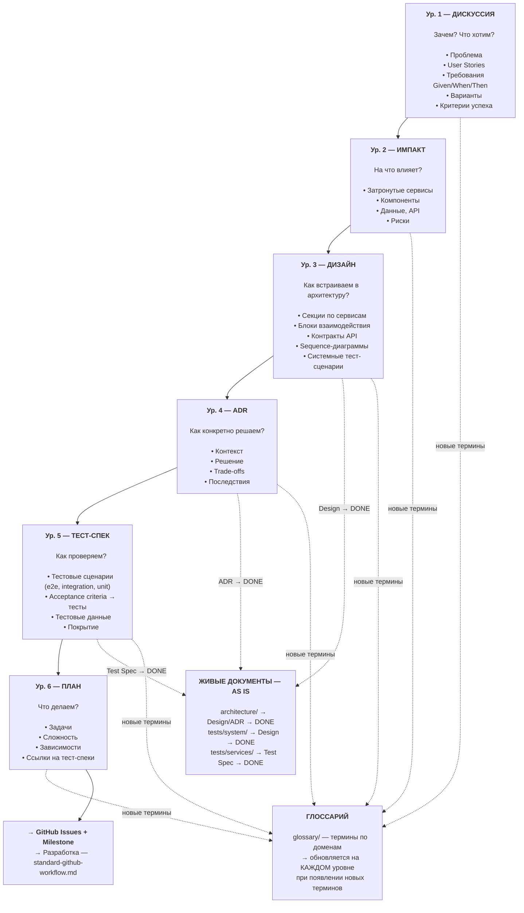
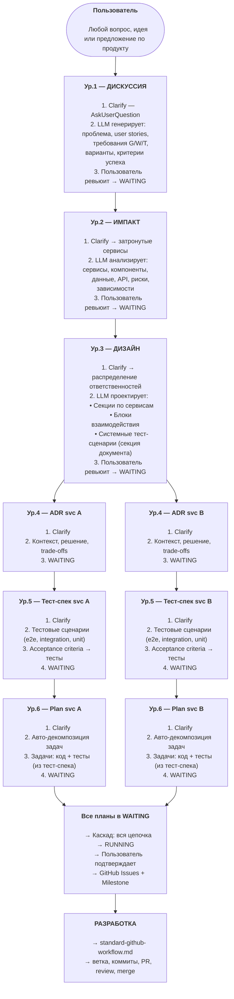
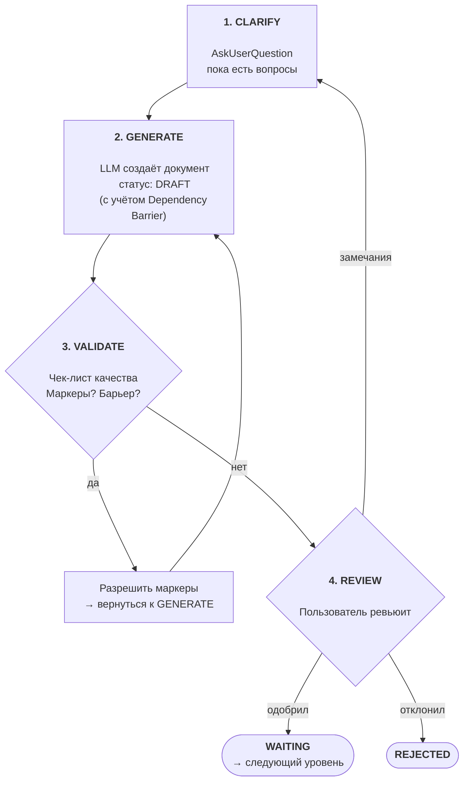
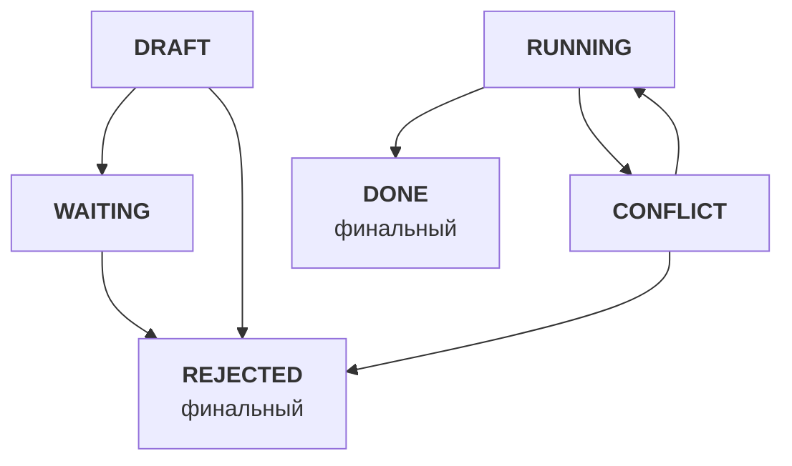
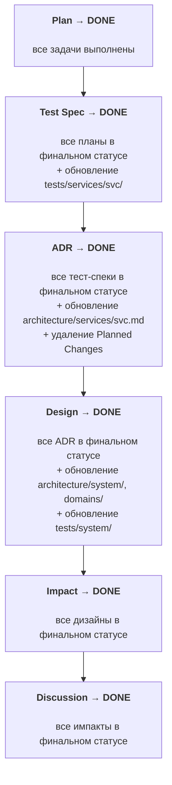

# Архитектура specs/: верхнеуровневое проектирование

Верхнеуровневая архитектура Specification-Driven Development — объекты, их иерархия, потоки данных и зоны ответственности.

## Оглавление

- [Контекст](#контекст)
- [Содержание](#содержание)
  - [1. Философия](#1-философия)
  - [2. Объекты и иерархия](#2-объекты-и-иерархия)
  - [3. Полный воркфлоу](#3-полный-воркфлоу)
  - [4. Зоны ответственности](#4-зоны-ответственности)
  - [5. Структура папок](#5-структура-папок)
  - [6. Блокирующие правила](#6-блокирующие-правила)
  - [7. Clarify на каждом уровне](#7-clarify-на-каждом-уровне)
  - [8. Статусы и каскады](#8-статусы-и-каскады)
  - [9. Инструкции](#9-инструкции)
- [Решения](#решения)
- [Открытые вопросы](#открытые-вопросы)

---

## Контекст

**Задача:** Определить верхнеуровневую архитектуру specs/ — какие объекты существуют, как связаны, как данные текут от намерения пользователя до задач на реализацию.

**Почему создан:** Перед созданием оркестратора и стандартов каждого объекта нужна общая карта системы.

**Связанные файлы:**
- [2026-02-08-specification-driven-development.md](./2026-02-08-specification-driven-development.md) — исследование подходов (Habr, Spec Kit, OpenSpec, Task Master)

---

## Содержание

### 1. Философия

#### Спецификация первична, код вторичен

Спецификации — SSOT проекта. Код — выражение спецификаций на конкретном языке. Обслуживание проекта = эволюция спецификаций. Пользователь описывает намерение, LLM собирает всё остальное.

#### LLM не угадывает — уточняет

На **каждом** уровне иерархии LLM задаёт уточняющие вопросы (Clarify) через AskUserQuestion, пока все неясности не закрыты. Если что-то осталось неясным — ставится блокирующий маркер `[ТРЕБУЕТ УТОЧНЕНИЯ]`.

#### Тесты первичны, реализация вторична (ATDD)

Тестовые сценарии определяются **до** формирования плана реализации. Разработчик (или LLM) знает, что именно нужно покрыть тестами, ещё до написания первой строки кода. Acceptance Test-Driven Development на уровне спецификаций.

#### Инструкции распределены по объектам

Нет единого файла "конституции". Принципы и правила живут в `.instructions/` каждого объекта — загружаются только при работе с ним. Шаблоны встроены в `standard-*.md` (как в остальных инструкциях проекта).

---

### 2. Объекты и иерархия

#### Шесть уровней (расширяемо)



#### Таблица объектов

| Объект | Зона | Расположение | Отвечает на | Родитель → Дети |
|--------|------|-------------|-------------|-----------------|
| **Дискуссия** | ЗАЧЕМ и ЧТО | `specs/discussions/` | Что нужно? Какие требования? | — → Импакт(ы) |
| **Импакт** | НА ЧТО ВЛИЯЕТ | `specs/impact/` | Какие сервисы затронуты? Какие риски? | Дискуссия → Дизайн(ы) |
| **Дизайн** | КАК ВСТРАИВАЕМ | `specs/design/` | Как распределяем ответственности? Какие контракты? | Импакт → ADR(ы) |
| **ADR** | КАК КОНКРЕТНО | `specs/services/{svc}/adr/` | Какое техническое решение для сервиса? | Дизайн → Тест-спек(и) |
| **Тест-спек** | КАК ПРОВЕРЯЕМ | `specs/services/{svc}/test-specs/` | Как проверяем решение? Какие тестовые сценарии? | ADR → План(ы) |
| **План** | ЧТО ДЕЛАЕМ | `specs/services/{svc}/plans/` | Какие задачи? В каком порядке? | Тест-спек → (терминальный) |

**Живые документы** (текущее состояние системы):

| Объект | Расположение | Назначение | Когда обновляется |
|--------|-------------|------------|-------------------|
| **Архитектура (системная)** | `specs/architecture/system/` | overview, data-flows, infrastructure | Design → DONE |
| **Архитектура (сервисная)** | `specs/architecture/services/{svc}.md` | компоненты, tech stack, API, data model | ADR → DONE |
| **Архитектура (доменная)** | `specs/architecture/domains/` | bounded contexts, агрегаты, события, context map | Design → DONE |
| **Тесты (системные)** | `specs/tests/system/` | межсервисные e2e, integration, load. Зеркало `/tests/` | Design → DONE |
| **Тесты (сервисные)** | `specs/tests/services/{svc}/` | e2e, integration, unit внутри сервиса. Зеркало `/src/{svc}/tests/` | Test Spec → DONE |
| **Глоссарий** | `specs/glossary/` | терминология по доменам | На каждом уровне |

#### Дискуссия — гибкий контейнер с разделами

Дискуссия — точка входа в воркфлоу. Один документ содержит **разделы**, каждый из которых покрывает свой аспект:

| Раздел | Что содержит | Пример |
|--------|-------------|--------|
| **Проблема/Контекст** | Зачем это нужно, что не работает | "Текущая авторизация не масштабируется на 10k RPS" |
| **Фичи** | Конкретная функциональность | "OAuth2 авторизация для API, управление ролями" |
| **User Stories** | Кто и что хочет сделать | "Как администратор, я хочу управлять ролями..." |
| **Требования** | Given/When/Then формат | "GIVEN авторизованный пользователь, WHEN запрос к /api/users, THEN 200 OK" |
| **Предложения** | Варианты решений, изменения к фичам и user stories | "Предлагаю заменить JWT на OAuth2" |
| **Критерии успеха** | Как понять, что задача выполнена | "Время авторизации < 100ms, поддержка 10k RPS" |

Предложения могут **менять** фичи и user stories внутри той же дискуссии — итеративное уточнение до консенсуса. Все разделы опциональны — набор определяется на этапе Clarify.

#### Расширяемость

Текущая иерархия — 6 уровней. Добавление нового типа объекта = новая папка + новый `standard-*.md` в `.instructions/`. Существующие связи parent→children не меняются.

---

### 3. Полный воркфлоу

#### Диаграмма: от намерения до разработки



#### Воркфлоу каждого объекта (общий паттерн)

Каждый объект проходит одинаковый цикл:



Весь цикл CLARIFY → GENERATE → VALIDATE → REVIEW происходит в статусе **DRAFT**. Итераций может быть сколько угодно — пользователь возвращает документ на доработку через "замечания" до тех пор, пока не одобрит (→ WAITING) или не отклонит (→ REJECTED).

#### Фильтрация Design → ADR

Design содержит **два типа секций**:

**Секции по сервисам** — что каждый сервис отвечает за:

| Поле | Описание |
|------|----------|
| Ответственность | Что конкретно делает этот сервис в рамках фичи |
| Компоненты | Высокоуровневый список затронутых компонентов |
| Зависимости | От каких сервисов зависит (ссылки на блоки взаимодействия) |

**Блоки взаимодействия** — как сервисы общаются:

| Поле | Описание |
|------|----------|
| Участники | Какие сервисы участвуют (provider ↔ consumer) |
| Контракт | Endpoint, формат данных, протокол |
| Паттерн | sync/async, REST/gRPC/events |
| Sequence | Диаграмма последовательности |

**Системные тест-сценарии** — секция внутри Design-документа. Описывает межсервисные тестовые сценарии (e2e, integration, load), вытекающие из блоков взаимодействия. При Design → DONE переносятся в живой `specs/tests/system/`.

**Правило чтения для ADR:** ADR для сервиса X читает:
1. **Секцию сервиса X** из Design (ответственность, компоненты)
2. **Все блоки взаимодействия**, где участвует сервис X
3. **Текущий** `architecture/services/X.md` (AS IS, включая Planned Changes)

ADR **не читает** секции других сервисов, если они не связаны с X через блок взаимодействия.

#### Фильтрация ADR → Тест-спек

Тест-спек для сервиса X читает:
1. **ADR сервиса X** — техническое решение, которое нужно верифицировать
2. **Требования G/W/T из Дискуссии** — acceptance criteria для маппинга в тесты
3. **Блоки взаимодействия из Дизайна**, где участвует сервис X — для интеграционных тестов
4. **Текущий** `specs/tests/services/X/` (AS IS) — существующий ландшафт тестов

Тест-спек определяет **что тестировать** (сценарии, данные, ожидаемые результаты). **Как** реализовать тесты — задача Плана.

#### Обновление вышестоящих уровней (upward feedback)

При работе на уровне N может обнаружиться информация, затрагивающая уровень N-1 или выше. Обновление **обязательно**:

| Где обнаружили | Что обнаружили | Что обновить |
|----------------|----------------|--------------|
| **Импакт** | Новые требования пользователя | → Дискуссия |
| **Дизайн** | Новые технические подробности | → Импакт. Если затрагивает требования → также Дискуссия |
| **ADR** | Новые архитектурные ограничения | → Дизайн. Каскад выше при необходимости |
| **Тест-спек** | Непокрытые кейсы, влияющие на решение | → ADR. Каскад выше при необходимости |
| **План** | Новые зависимости или риски | → Тест-спек / ADR. Каскад выше при необходимости |

**Правило остановки:** Каскад вверх останавливается, когда новая информация не затрагивает следующий вышестоящий уровень.

Upward feedback происходит **во время проектирования** — это нормальная часть workflow. Обратный каскад Code → Specs (раздел 8) запускается **после начала разработки**.

#### Параллельные дискуссии: резервации

**Проблема:** Дискуссия А в работе, дискуссия Б стартует. Б не видит планируемых изменений от А — живые документы (`architecture/`) ещё не обновлены.

**Механизм — Planned Changes в архитектуре:**

Когда Design переходит в WAITING, в затронутых файлах `architecture/` добавляется секция:

```markdown
## Planned Changes

- **[Discussion 001: OAuth2 авторизация](../discussions/001-oauth2-authorization.md)**
  Статус: RUNNING | Затрагивает: API endpoints, data model
  Design: [001-oauth2-service-design.md](../design/001-oauth2-service-design.md)
```

LLM при чтении AS IS **обязан** учитывать Planned Changes. Секция удаляется при обновлении живого документа (ADR → DONE) или при каскаде REJECTED.

Отдельных маркеров конфликта не требуется — LLM учитывает Planned Changes естественным образом при генерации Impact/Design для новых дискуссий.

---

### 4. Зоны ответственности

#### Карта зон

| Зона | Папка | Вопрос | Содержит | НЕ содержит |
|------|-------|--------|----------|-------------|
| **ЗАЧЕМ и ЧТО** | `discussions/` | Зачем это нужно? | Проблему, требования, user stories, варианты, критерии | Технические детали |
| **НА ЧТО ВЛИЯЕТ** | `impact/` | Какие сервисы затронуты? | Список сервисов, риски, зависимости | Распределение ответственностей |
| **КАК ВСТРАИВАЕМ** | `design/` | Как распределяем ответственности? | Секции по сервисам, блоки взаимодействия, контракты, системные тест-сценарии | Детали реализации конкретного сервиса |
| **КАК КОНКРЕТНО** | `services/{svc}/adr/` | Какое решение для сервиса? | Контекст, решение, trade-offs, последствия | Тестовые сценарии, задачи |
| **КАК ПРОВЕРЯЕМ** | `services/{svc}/test-specs/` | Как проверяем решение? | Тестовые сценарии (e2e, integration, unit), acceptance criteria → тесты, тестовые данные | Реализацию тестов |
| **ЧТО ДЕЛАЕМ** | `services/{svc}/plans/` | Какие задачи? | Задачи, сложность, зависимости, ссылки на тест-спеки | Бизнес-обоснование |
| **АРХИТЕКТУРА** | `architecture/` | Как устроена система сейчас? | Живое AS IS: system/, services/, domains/. Planned Changes | Исторические решения (в ADR) |
| **ТЕСТЫ** | `tests/` | Какие тесты существуют? | Живое AS IS: system/, services/{svc}/. Зеркало кодовой базы | Сами тесты (в /tests/ и /src/) |
| **ТЕРМИНЫ** | `glossary/` | Что означает этот термин? | Определения по доменам | Решения и требования |
| **ПРАВИЛА** | `.instructions/` | Как создавать объекты? | Стандарты, чек-листы, шаблоны | Контент спецификаций |

#### Границы между specs/ и остальным проектом

```
specs/                        │  Остальной проект
                              │
ЗАЧЕМ, ЧТО, КАК, ПРОВЕРКА    │  РЕАЛИЗАЦИЯ
                              │
Discussion (требования)       │  src/ (код)
Impact (анализ влияния)       │  tests/ (тесты)
Design (проектирование)       │  .github/ (Issues, PR, CI/CD)
ADR (архитектурные решения)   │  config/ (конфигурации)
Test Spec (тестовые сценарии) │  platform/ (инфраструктура)
Plan (задачи)                 │
                              │
architecture/ (живое AS IS)   │
tests/ (тестовые спеки)       │
glossary/ (терминология)      │
                              │
────────── граница ────────────│──────────────────────────
                              │
Спецификация говорит ЧТО      │  Код говорит КАК (технически)
```

---

### 5. Структура папок

```
specs/
├── .instructions/                      # Правила для каждого объекта
│   ├── discussions/                    #   Стандарт дискуссий
│   ├── impact/                         #   Стандарт импакт-анализа
│   ├── design/                         #   Стандарт проектирования
│   ├── adr/                            #   Стандарт ADR
│   ├── test-specs/                     #   Стандарт тест-спеков (ATDD)
│   ├── plans/                          #   Стандарт планов
│   ├── architecture/                   #   Стандарт живых документов архитектуры
│   ├── tests/                          #   Стандарт живых тестовых документов
│   ├── glossary/                       #   Стандарт глоссария
│   ├── checklists/                     #   Чек-листы качества (по типу объекта)
│   ├── standard-specs-workflow.md      #   Оркестратор SDD-воркфлоу
│   └── README.md                       #   Индекс инструкций
│
├── discussions/                        # Уровень 1: ЗАЧЕМ и ЧТО
│   ├── NNN-topic.md
│   └── README.md
│
├── impact/                             # Уровень 2: НА ЧТО ВЛИЯЕТ
│   ├── NNN-topic.md
│   └── README.md
│
├── design/                             # Уровень 3: КАК ВСТРАИВАЕМ
│   ├── NNN-topic.md                    #   Секции по сервисам + блоки взаимодействия + системные тест-сценарии
│   └── README.md
│
├── services/                           # Уровни 4-6: по сервисам
│   └── {service}/
│       ├── adr/                        #   Уровень 4: КАК КОНКРЕТНО
│       │   ├── NNN-topic.md
│       │   └── README.md
│       ├── test-specs/                 #   Уровень 5: КАК ПРОВЕРЯЕМ (ATDD)
│       │   ├── NNN-topic.md
│       │   └── README.md
│       ├── plans/                      #   Уровень 6: ЧТО ДЕЛАЕМ
│       │   ├── topic-plan.md
│       │   └── README.md
│       └── README.md                   #   Индекс сервиса
│
├── architecture/                       # Живое состояние архитектуры
│   ├── system/                        #   Системная архитектура
│   │   ├── overview.md                #     Сервисы, потоки, высокоуровневая карта
│   │   ├── data-flows.md             #     Потоки данных между сервисами
│   │   └── infrastructure.md         #     Deployment, networking, monitoring
│   ├── services/                      #   Per-service архитектура
│   │   └── {service}.md               #     Компоненты, tech stack, API, data model
│   ├── domains/                       #   Доменная архитектура (DDD)
│   │   ├── {domain}.md                #     Один файл на bounded context
│   │   └── context-map.md             #     Карта взаимодействия контекстов
│   └── README.md
│
├── tests/                              # Живое состояние тестов
│   ├── system/                        #   Зеркало /tests/ — межсервисные
│   │   ├── e2e/
│   │   ├── integration/
│   │   ├── load/
│   │   └── README.md
│   ├── services/                      #   Зеркало /src/{svc}/tests/
│   │   └── {service}/
│   │       ├── e2e/
│   │       ├── integration/
│   │       ├── unit/
│   │       └── README.md
│   └── README.md
│
├── glossary/                            # Терминология (по доменам)
│   ├── {domain}.md
│   └── README.md
│
└── README.md                           # Точка входа
```

#### Живые документы

Три категории хранят **текущее состояние** системы. Каждая обновляется при завершении соответствующего уровня:

| Папка | Что хранит | Обновляется при |
|-------|-----------|-----------------|
| `architecture/system/` | Системная архитектура | Design → DONE |
| `architecture/services/{svc}.md` | Архитектура сервиса. Planned Changes для параллельных дискуссий | ADR → DONE (+ Planned Changes при Design → WAITING) |
| `architecture/domains/` | Bounded contexts, агрегаты, события | Design → DONE |
| `tests/system/` | Межсервисные тест-спеки (e2e, integration, load) | Design → DONE |
| `tests/services/{svc}/` | Внутрисервисные тест-спеки (e2e, integration, unit) | Test Spec → DONE |
| `glossary/{domain}.md` | Терминология домена | На каждом уровне |

**Создание vs обновление:** При первом обращении файл **создаётся**. При последующих — **обновляется** (AS IS → TO BE).

**Паттерн AS IS / TO BE:** LLM читает живые документы (включая Planned Changes) перед проектированием. Изменения фиксируются в объектах (TO BE), а при завершении — переносятся в живые документы (новый AS IS).

#### Именование

| Объект | Формат | Пример |
|--------|--------|--------|
| Дискуссия | `NNN-topic.md` | `001-oauth2-authorization.md` |
| Импакт | `NNN-topic.md` | `001-oauth2-authorization.md` |
| Дизайн | `NNN-topic.md` | `001-oauth2-service-design.md` |
| ADR | `NNN-topic.md` | `001-jwt-to-oauth2.md` |
| Тест-спек | `NNN-topic.md` | `001-oauth2-tests.md` |
| План | `topic-plan.md` | `jwt-migration-plan.md` |

`NNN` — трёхзначный автоинкремент. Номерация **независимая** в каждой папке.

---

### 6. Блокирующие правила

#### Правило [ТРЕБУЕТ УТОЧНЕНИЯ]

**БЛОКИРУЮЩЕЕ. НЕПРИКАСАЕМОЕ.**

При создании или обновлении ЛЮБОГО объекта в specs/, если LLM не имеет достаточной информации:

1. **ОБЯЗАН** поставить маркер:
   ```
   [ТРЕБУЕТ УТОЧНЕНИЯ: конкретный вопрос]
   ```
2. **ЗАПРЕЩЕНО** угадывать, домысливать, делать допущения
3. **ЗАПРЕЩЕНО** продолжать генерацию зависимых объектов
4. Документ **НЕ МОЖЕТ** покинуть статус DRAFT с неразрешёнными маркерами

**Разрешение:** LLM показывает маркеры пользователю → пользователь отвечает → LLM заменяет маркер на ответ.

#### Правило Dependency Barrier (барьер зависимости)

**БЛОКИРУЮЩЕЕ.**

При генерации документа LLM может ставить **независимые** маркеры `[ТРЕБУЕТ УТОЧНЕНИЯ]` и продолжать генерацию. Но если для генерации следующей секции **нужен ответ** на ранее поставленный маркер — срабатывает Dependency Barrier.

**Режим 1 — Полная генерация** (маркеры независимы друг от друга):

```markdown
## Секция А
Описание... [ТРЕБУЕТ УТОЧНЕНИЯ: какой протокол авторизации?]        ← x1

## Секция Б
Описание... [ТРЕБУЕТ УТОЧНЕНИЯ: какой SLA требуется?]               ← x2 (независим от x1)

## Секция В
Описание... [ТРЕБУЕТ УТОЧНЕНИЯ: какой формат логов?]                ← x3 (независим)
```

**Режим 2 — Барьер** (обнаружена зависимость от неразрешённого маркера):

```markdown
## Секция А
Описание... [ТРЕБУЕТ УТОЧНЕНИЯ: какой протокол авторизации?]        ← x1

## Секция Б
Описание... [ТРЕБУЕТ УТОЧНЕНИЯ: какой SLA требуется?]               ← x2

## Секция В
Описание...

---

### ⛔ DEPENDENCY BARRIER

Дальнейшая генерация остановлена: секция Г зависит от x1 (протокол авторизации).

**Требует дальнейшего описания:**

| Секция | Зависит от | Что будет описано |
|--------|-----------|-------------------|
| Секция Г: Механизм обмена токенами | x1 | Протокол обмена, формат токенов, TTL |
| Секция Д: Схема ротации секретов | x1 | Алгоритм ротации, хранение, backup |
| Секция Е: Rate limiting для API | x2 | Лимиты по тарифам, throttling |
| Секция Ж: Формат audit-лога | x3 | Поля, ротация, retention |
```

**Правило:** LLM **прекращает генерацию контента** и переключается на **перечисление** оставшихся секций с зависимостями. Экономит токены, предотвращает переписывание.

**Разрешение:** Пользователь отвечает на маркеры → LLM продолжает генерацию с точки барьера.

#### Правило версионирования

Документы не имеют файловых версий. Версионирование — через цепочку ADR:

```
ADR 001 (DONE) → architecture/services/{svc}.md + tests/ обновлены
ADR 002 (RUNNING) → LLM видит:
    AS IS: текущий architecture/services/{svc}.md
    TO BE: требования из ADR 002
```

ADR никогда не удаляется — это история решений.

#### Правило создания Issues

GitHub Issues и Milestones создаются **только отдельной командой**, **только после подтверждения плана** пользователем. LLM не создаёт Issues автоматически.

---

### 7. Clarify на каждом уровне

Clarify — **паттерн, повторяющийся на каждом уровне**:

| Уровень | Что уточняется |
|---------|---------------|
| **Дискуссия** | Проблема, scope, требования, критерии успеха |
| **Импакт** | Какие сервисы затронуты, компоненты, скрытые зависимости |
| **Дизайн** | Распределение ответственностей, контракты API, порядок взаимодействия |
| **ADR** | Технический выбор, trade-offs, совместимость с архитектурой |
| **Тест-спек** | Типы тестов, покрытие, тестовые данные, граничные кейсы |
| **План** | Приоритеты задач, порядок реализации, ресурсы |

**Механизм:** LLM использует AskUserQuestion. Вопросы задаются до тех пор, пока все неясности не закрыты. Если после Clarify что-то осталось неясным → маркер `[ТРЕБУЕТ УТОЧНЕНИЯ]`.

**Взаимодействие с Dependency Barrier:** Clarify происходит **до** генерации и снижает количество маркеров. Dependency Barrier срабатывает **во время** генерации, когда оставшиеся маркеры создают зависимости.

---

### 8. Статусы и каскады

#### 6 статусов



| Статус | Значение |
|--------|----------|
| **DRAFT** | Документ создаётся, итерируется, ревьюится пользователем |
| **WAITING** | Пользователь согласовал. Ожидает готовности всей цепочки |
| **RUNNING** | Все уровни согласованы. Идёт реализация (код) |
| **DONE** | Реализация завершена, живые документы обновлены |
| **CONFLICT** | Обратная связь от кода требует пересмотра (только из RUNNING) |
| **REJECTED** | Отклонён. Каскад вниз + сайблинги + родитель в DRAFT |

#### Прямой поток

Каждый документ проходит путь DRAFT → WAITING на своём уровне, затем вся цепочка переходит в RUNNING одновременно.

1. Discussion: DRAFT → [итерации с пользователем] → WAITING
2. Impact: создаётся в DRAFT → [итерации] → WAITING
3. Design: DRAFT → [итерации] → WAITING → Planned Changes добавляются в `architecture/`
4. ADR (по каждому сервису): DRAFT → [итерации] → WAITING
5. Test Spec (по каждому сервису): DRAFT → [итерации] → WAITING
6. Plan (по каждому сервису): DRAFT → [итерации] → WAITING

7. **Когда ВСЕ планы в WAITING:**
   - ВСЕ документы в цепочке переходят в RUNNING (каскад вверх)
   - Пользователь подтверждает создание GitHub Issues + Milestone
   - Начинается разработка

#### Каскад RUNNING

Когда последний Plan переходит в WAITING → **все** документы в цепочке (от Discussion до всех Plans) одновременно переходят в RUNNING. Это точка перехода к реализации — спецификации зафиксированы, дальше только код.

#### Каскадное завершение (DONE)



**Правило:** Родитель → DONE когда ВСЕ дети в финальном статусе И хотя бы ОДИН ребёнок DONE.

**Глоссарий и каскад:** Глоссарий **не участвует** в каскадном завершении. Обновляется непрерывно на каждом уровне при появлении новых терминов.

#### Каскад REJECTED

Когда документ отклоняется:

1. **Каскад вниз:** все дочерние документы → REJECTED (рекурсивно)
2. **Каскад по сайблингам:** все братья (дети того же родителя) → REJECTED + их дети → REJECTED (рекурсивно)
3. **Родитель → DRAFT:** общий контекст изменился — нужен пересмотр. Пользователь дорабатывает родителя → WAITING → новые дети генерируются заново

**Откат:** Planned Changes удаляются из `architecture/` для всех документов, перешедших в REJECTED.

**Пример:** Design → 3 ADR (auth, gateway, users). ADR auth отклонён:

```
ADR auth → REJECTED
  ├── вниз: Test Spec auth, Plan auth → REJECTED
  ├── сайблинги: ADR gateway → REJECTED (+ Test Spec gateway, Plan gateway → REJECTED)
  │             ADR users → REJECTED (+ Test Spec users, Plan users → REJECTED)
  └── вверх: Design → DRAFT
       Пользователь дорабатывает Design → WAITING → новые ADR генерируются
```

**Пример полного отката** (единственный ребёнок на каждом уровне):

```
ADR → REJECTED
  ├── вниз: Test Spec, Plan → REJECTED
  └── вверх: Design → DRAFT
       Если пользователь отклоняет Design → REJECTED
       └── вверх: Impact → DRAFT
            Если пользователь отклоняет Impact → REJECTED
            └── вверх: Discussion → DRAFT
```

На каждом уровне пользователь решает: доработать документ (→ WAITING) или отклонить (→ REJECTED → каскад продолжается вверх).

#### Обратная связь Code → Specs

При разработке (статус RUNNING) код может выявить несовместимость со спецификациями. Процесс состоит из двух фаз: обнаружение масштаба (снизу вверх) и разрешение (сверху вниз).

**Фаза 1 — Обнаружение (снизу вверх):**

LLM проверяет каждый уровень от Plan до Discussion: "Содержание этого документа стало неверным?"

- **Если затронуты только Plan / Test Spec** — рабочие правки, статус не меняется, пользователь информируется. Фаза 2 не нужна.
- **Если затронут ADR или выше** — все затронутые документы + все их дочерние → **CONFLICT**. Работы останавливаются. Проверка продолжается вверх до уровня, где содержание не затронуто → **СТОП**.

**Фаза 2 — Разрешение (сверху вниз):**

Начиная с самого высокого документа в CONFLICT, каждый уровень последовательно переписывается с учётом новых реалий:

1. Переписать самый высокий затронутый документ
2. На основе обновлённого — переписать дочерние
3. Продолжить вниз до Plans
4. Пользователь ревьюит все изменения → подтверждает
5. Вся цепочка CONFLICT → **RUNNING**

Если пользователь отклоняет изменения → **REJECTED** (каскад REJECTED).

**Пример:** проблема затрагивает только ADR:

```
Фаза 1 — Обнаружение (↑):
  Plan затронут? → Да
  Test Spec затронут? → Да
  ADR затронут? → Да → ADR, Test Spec, Plan → CONFLICT
  Design затронут? → Нет → СТОП

Фаза 2 — Разрешение (↓):
  1. ADR переписывается
  2. Test Spec пересматривается на основе обновлённого ADR
  3. Plan пересматривается на основе обновлённого Test Spec
  4. Пользователь подтверждает → всё → RUNNING
```

**Пример:** проблема затрагивает Design:

```
Фаза 1 — Обнаружение (↑):
  Plan затронут? → Да
  Test Spec затронут? → Да
  ADR затронут? → Да
  Design затронут? → Да → Design, все ADR, Test Spec, Plan → CONFLICT
  Impact затронут? → Нет → СТОП

Фаза 2 — Разрешение (↓):
  1. Design переписывается
  2. ADR пересматриваются на основе обновлённого Design
  3. Test Spec пересматриваются на основе обновлённых ADR
  4. Plan пересматриваются на основе обновлённых Test Spec
  5. Пользователь подтверждает → всё → RUNNING
```

#### Связи (frontmatter)

```yaml
---
parent: impact/001-oauth2-authorization.md
children:
  - services/auth/adr/001-jwt-to-oauth2.md
  - services/gateway/adr/001-oauth2-proxy.md
status: WAITING
---
```

#### Правила связей

1. **Дискуссия** → parent: нет, children: Импакт(ы)
2. **Импакт** → parent: Дискуссия, children: Дизайн(ы)
3. **Дизайн** → parent: Импакт, children: ADR(ы)
4. **ADR** → parent: Дизайн, children: Тест-спек(и)
5. **Тест-спек** → parent: ADR, children: План(ы)
6. **План** → parent: Тест-спек, children: нет (терминальный)

---

### 9. Инструкции

#### Принцип: каждый объект — свои инструкции

```
specs/.instructions/
├── discussions/                →  загружается при работе с дискуссиями
├── impact/                     →  загружается при работе с импактами
├── design/                     →  загружается при работе с дизайном
├── adr/                        →  загружается при работе с ADR
├── test-specs/                 →  загружается при работе с тест-спеками
├── plans/                      →  загружается при работе с планами
├── architecture/               →  загружается при обновлении живых документов
├── tests/                      →  загружается при обновлении живых тестовых документов
├── glossary/                   →  загружается при работе с глоссарием
├── checklists/                 →  загружается вместе с основным стандартом
├── standard-specs-workflow.md  →  загружается при полном цикле (оркестратор)
└── README.md
```

Каждый `standard-*.md` содержит:
- Правила создания объекта
- Принципы, специфичные для этого типа (архитектурные — в ADR, тестовые — в Test Specs)
- Шаблон документа (встроен, не отдельный файл)
- Ссылку на чек-лист качества

#### Порядок создания инструкций

Инструкции создаются **по мере работы над объектами**, не все сразу:

1. `standard-specs-workflow.md` — оркестратор (первым)
2. `discussions/standard-discussion.md` — первый объект в цепочке
3. `impact/standard-impact.md`
4. `design/standard-design.md`
5. `adr/standard-adr.md`
6. `test-specs/standard-test-spec.md` — стандарт тест-спеков (ATDD)
7. `plans/standard-plan.md`
8. `architecture/standard-architecture.md` — стандарт живых документов
9. `tests/standard-tests.md` — стандарт живых тестовых документов
10. `checklists/` — по одному вместе с каждым стандартом
11. `glossary/standard-glossary.md` — последним (вспомогательный)

---

## Решения

| # | Вопрос | Решение |
|---|--------|---------|
| 1 | Naming входного объекта | **Дискуссия** — гибкий контейнер для фич, user stories, предложений, требований |
| 2 | Уровни иерархии | **6 уровней** (Discussion → Impact → Design → ADR → Test Spec → Plan), расширяемо |
| 3 | Уровень между Impact и ADR | **Design** (Проектирование) — распределение ответственностей, контракты, взаимодействие |
| 4 | Принципы | **Распределены** по `.instructions/` объектов |
| 5 | Дельта-спеки | **Нет**. Версионирование через цепочку ADR (AS IS / TO BE) |
| 6 | GitHub Issues | **Отдельная команда** после подтверждения плана |
| 7 | Живое состояние архитектуры | **`specs/architecture/`** — отдельная папка: system/, services/{svc}, domains/ |
| 8 | [ТРЕБУЕТ УТОЧНЕНИЯ] | **Блокирующее правило**. Документ не покидает DRAFT |
| 9 | Clarify | На **каждом** уровне через AskUserQuestion |
| 10 | Формат задач | **Чеклисты**, детали определяются при работе над standard-plan.md |
| 11 | Скиллы | **Создаются** при работе над каждым объектом |
| 12 | Шаблоны | **Встроены** в `standard-*.md` |
| 13 | Оркестратор | Диаграммы + краткие описания шагов + ссылка на standard-github-workflow.md |
| 14 | Существующие инструкции specs/ | **Анализируем** отдельно. Применимое — применяем, остальное устарело |
| 15 | Тестовые спецификации | **Два типа.** Системные — секция внутри Design, при DONE → `specs/tests/system/`. Сервисные — формальный уровень 5 (`specs/services/{svc}/test-specs/`), при DONE → `specs/tests/services/{svc}/` |
| 16 | Доменная архитектура | **Включена** сразу: `specs/architecture/domains/` (bounded contexts, агрегаты, события) |
| 17 | Замена документов | **SUPERSEDED убран.** Для незавершённых → REJECTED. Для DONE → остаётся DONE (история решений). Ссылки `replaces` / `replaced-by` не нужны — живые документы = SSOT текущего состояния, ADR = хронология |
| 18 | Fast Track | **Нет**. Всегда 6 уровней. Единообразие важнее скорости |
| 19 | Связь с разработкой | Plan → Issues → Development (standard-github-workflow.md). Точка выхода из specs/ |
| 20 | Глоссарий | **Папка** `specs/glossary/` (по доменам). Последний в порядке реализации |
| 21 | Cross-cutting concerns (NFR) | **Через Discussion**. Обычный 6-уровневый поток |
| 22 | Обратная связь Code → Specs | **Последовательная проверка снизу вверх.** Plan/Test Spec — рабочие правки. ADR и выше — CONFLICT + каскад CONFLICT на всех детей. Проверка продолжается вверх до уровня, где содержание не затронуто |
| 23 | Версионирование Discussion | DRAFT — правится на месте. RUNNING — через обратный каскад (CONFLICT) или REJECTED |
| 24 | Именование: src/ vs services/ | **Оставляем как есть**. `src/` для кода, `services/` в specs — семантика |
| 25 | Системная архитектура | **Папка** `architecture/system/` (overview.md, data-flows.md, infrastructure.md) |
| 26 | Обновление глоссария | **На каждом уровне** при появлении новых терминов. Не привязан к каскаду |
| 27 | Фильтрация Design → ADR | ADR читает свою секцию + блоки взаимодействия своего сервиса. Не читает чужие секции |
| 28 | Upward feedback | Обязательное обновление вышестоящих уровней. Каскад вверх до точки, где влияние прекращается |
| 29 | Уровень Test Spec (ATDD) | **Уровень 5** между ADR и Plan. Тест-спек определяет сценарии ДО плана реализации |
| 30 | Параллельные дискуссии | **Planned Changes в architecture/.** Маркеры `[КОНФЛИКТ С: ...]` не нужны — LLM учитывает Planned Changes при чтении AS IS |
| 31 | Dependency Barrier | При зависимости маркера от неразрешённого → LLM прекращает генерацию, перечисляет оставшиеся секции |
| 32 | Системные тест-сценарии | **Секция внутри Design-документа**. При Design → DONE переносятся в живой `specs/tests/system/`. Паттерн AS IS / TO BE соблюдён |
| 33 | Модель статусов | **6 статусов:** DRAFT, WAITING, RUNNING, DONE, CONFLICT, REJECTED. REVIEW, AGREED, SUPERSEDED убраны |
| 34 | Каскад REJECTED | **Вниз** (дети) + **сайблинги** → REJECTED, **родитель** → DRAFT для пересмотра. Откат Planned Changes из architecture/ |

---

## Открытые вопросы

| # | Вопрос | Статус |
|---|--------|--------|
| 2 | Документирование кода в src/ | Анализ: per-file спеки избыточны (проблемы: синхронизация, дублирование, масштаб). Предложен 3-уровневый подход: сервис (`architecture/services/`), модуль (README.md в пакете), файл (docstring + types). Подвопросы: (a) мультиязычность — формат для не-Python (TS, Go и др.), (b) стандарт кодовой документации (аналог standard-frontmatter.md для кода), (c) визуализация на SDD-диаграммах — показать, что код тоже часть потока, (d) механизм синхронизации (автогенерация после PR vs ручное обновление) |
| 5 | Языково- и технологически-специфичные инструкции | В разных сервисах — разные языки и БД. Формировать ли инструкции как стандарты работы с конкретными языками/технологиями? (`standard-python.md`, `standard-postgresql.md`, `standard-typescript.md`) |

**Следующий шаг:** создание `standard-specs-workflow.md` (оркестратор).
