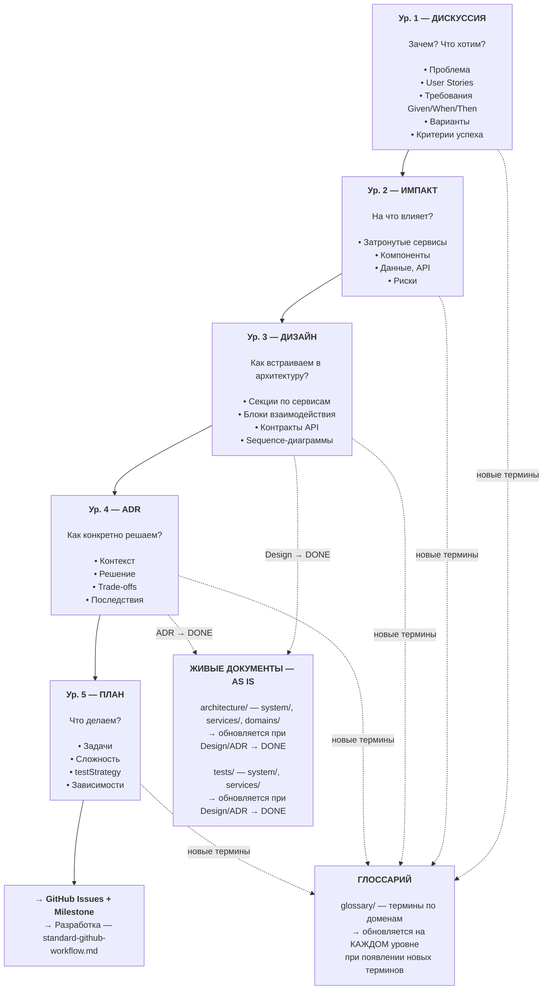
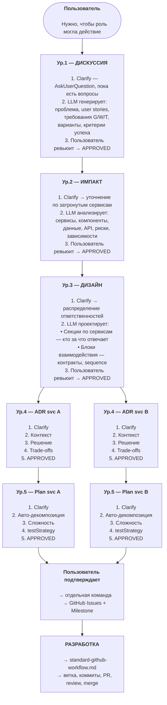
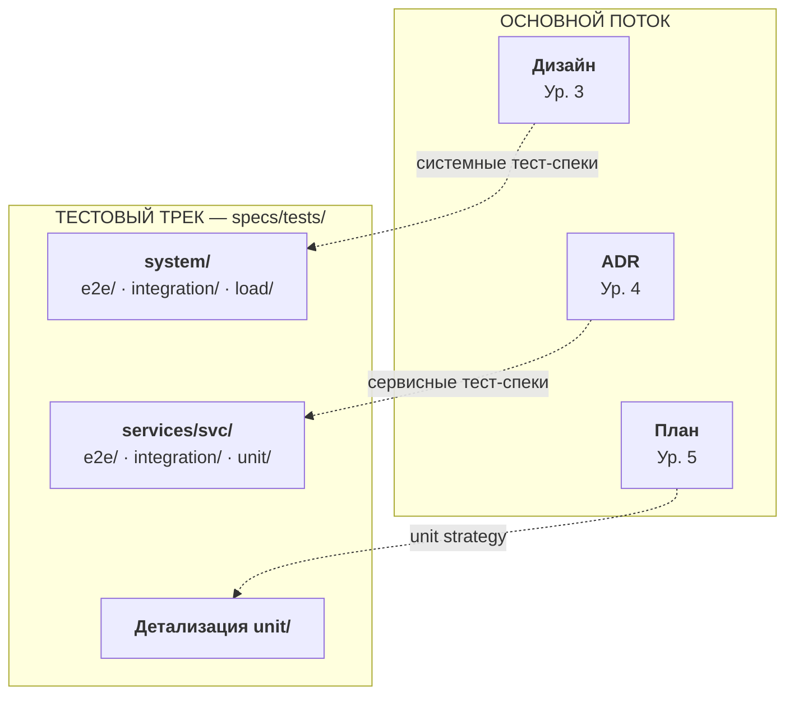
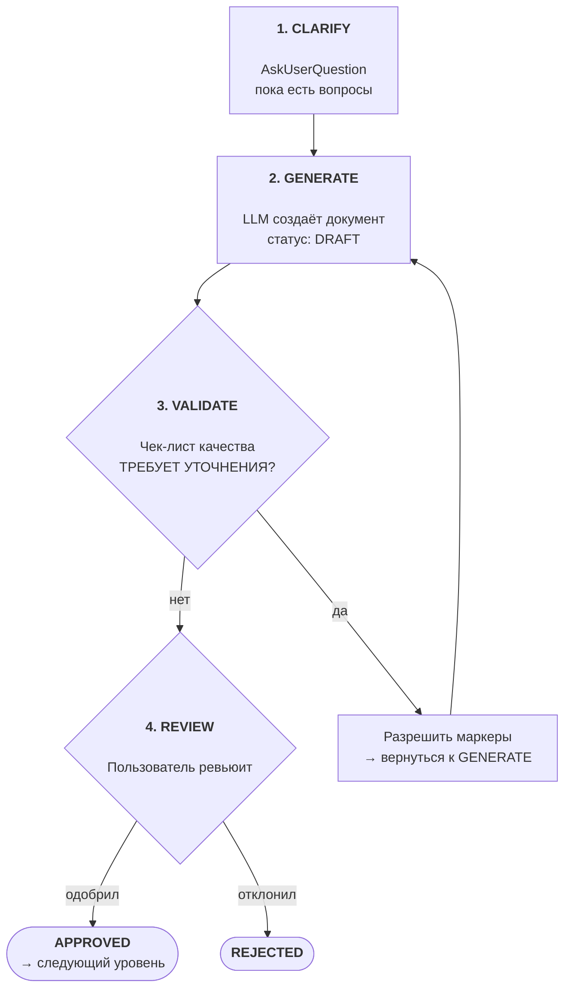
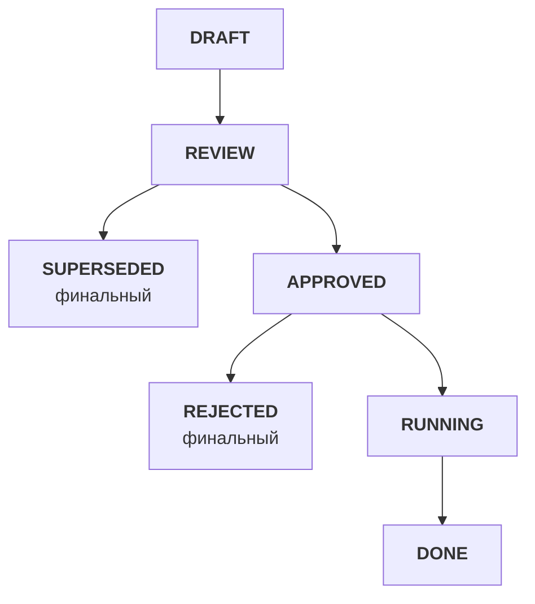
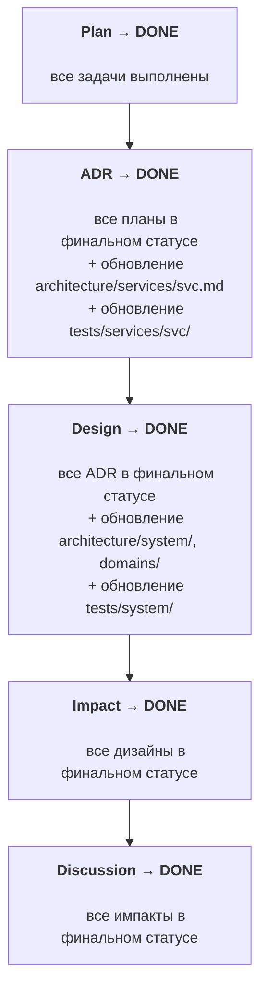

# Архитектура specs/: верхнеуровневое проектирование

Верхнеуровневая архитектура Specification-Driven Development — объекты, их иерархия, потоки данных и зоны ответственности.

## Оглавление

- [Контекст](#контекст)
- [Содержание](#содержание)
  - [1. Философия](#1-философия)
  - [2. Объекты и иерархия](#2-объекты-и-иерархия)
  - [3. Полный воркфлоу](#3-полный-воркфлоу)
  - [4. Зоны ответственности](#4-зоны-ответственности)
  - [5. Структура папок](#5-структура-папок)
  - [6. Блокирующие правила](#6-блокирующие-правила)
  - [7. Clarify на каждом уровне](#7-clarify-на-каждом-уровне)
  - [8. Статусы и каскады](#8-статусы-и-каскады)
  - [9. Инструкции](#9-инструкции)
- [Решения](#решения)
- [Открытые вопросы](#открытые-вопросы)

---

## Контекст

**Задача:** Определить верхнеуровневую архитектуру specs/ — какие объекты существуют, как связаны, как данные текут от намерения пользователя до задач на реализацию.

**Почему создан:** Перед созданием оркестратора и стандартов каждого объекта нужна общая карта системы.

**Связанные файлы:**
- [2026-02-08-specification-driven-development.md](./2026-02-08-specification-driven-development.md) — исследование подходов (Habr, Spec Kit, OpenSpec, Task Master)

---

## Содержание

### 1. Философия

#### Спецификация первична, код вторичен

Спецификации — SSOT проекта. Код — выражение спецификаций на конкретном языке. Обслуживание проекта = эволюция спецификаций. Пользователь описывает намерение, LLM собирает всё остальное.

#### LLM не угадывает — уточняет

На **каждом** уровне иерархии LLM задаёт уточняющие вопросы (Clarify) через AskUserQuestion, пока все неясности не закрыты. Если что-то осталось неясным — ставится блокирующий маркер `[ТРЕБУЕТ УТОЧНЕНИЯ]`.

#### Инструкции распределены по объектам

Нет единого файла "конституции". Принципы и правила живут в `.instructions/` каждого объекта — загружаются только при работе с ним. Шаблоны встроены в `standard-*.md` (как в остальных инструкциях проекта).

---

### 2. Объекты и иерархия

#### Пять уровней (расширяемо)



#### Таблица объектов

| Объект | Зона | Расположение | Отвечает на | Родитель → Дети |
|--------|------|-------------|-------------|-----------------|
| **Дискуссия** | ЗАЧЕМ и ЧТО | `specs/discussions/` | Что нужно? Какие требования? | — → Импакт(ы) |
| **Импакт** | НА ЧТО ВЛИЯЕТ | `specs/impact/` | Какие сервисы затронуты? Какие риски? | Дискуссия → Дизайн(ы) |
| **Дизайн** | КАК ВСТРАИВАЕМ | `specs/design/` | Как распределяем ответственности? Какие контракты? | Импакт → ADR(ы) |
| **ADR** | КАК КОНКРЕТНО | `specs/services/{svc}/adr/` | Какое техническое решение для сервиса? | Дизайн → План(ы) |
| **План** | ЧТО ДЕЛАЕМ | `specs/services/{svc}/plans/` | Какие задачи? В каком порядке? | ADR → (терминальный) |

**Дополнительные объекты** (живое состояние + вспомогательные):

| Объект | Расположение | Назначение |
|--------|-------------|------------|
| **Архитектура (системная)** | `specs/architecture/system/` | Живой документ: overview, data-flows, infrastructure |
| **Архитектура (сервисная)** | `specs/architecture/services/{svc}.md` | Живой документ: компоненты, tech stack, API, data model |
| **Архитектура (доменная)** | `specs/architecture/domains/` | Bounded contexts, агрегаты, доменные события, context map |
| **Тесты (системные)** | `specs/tests/system/` | Зеркало `/tests/` — межсервисные e2e, integration, load |
| **Тесты (сервисные)** | `specs/tests/services/{svc}/` | Зеркало `/src/{svc}/tests/` — e2e, integration, unit внутри сервиса |
| **Глоссарий** | `specs/glossary/` | Единая терминология проекта (папка, по доменам). Обновляется на каждом уровне |

#### Дискуссия — гибкий контейнер с разделами

Дискуссия — точка входа в воркфлоу. Один документ дискуссии содержит **разделы**, каждый из которых покрывает свой аспект:

| Раздел | Что содержит | Пример |
|--------|-------------|--------|
| **Проблема/Контекст** | Зачем это нужно, что не работает | "Текущая авторизация не масштабируется на 10k RPS" |
| **Фичи** | Конкретная функциональность, которую нужно реализовать | "OAuth2 авторизация для API, управление ролями" |
| **User Stories** | Кто и что хочет сделать | "Как администратор, я хочу управлять ролями пользователей, чтобы..." |
| **Требования** | Given/When/Then формат | "GIVEN авторизованный пользователь, WHEN запрос к /api/users, THEN 200 OK" |
| **Предложения** | Варианты решений, изменения к фичам и user stories | "Предлагаю заменить JWT на OAuth2" |
| **Критерии успеха** | Как понять, что задача выполнена | "Время авторизации < 100ms, поддержка 10k RPS" |

Предложения могут **менять** фичи и user stories внутри той же дискуссии — это и есть "дискуссия": итеративное уточнение до консенсуса.

Все разделы опциональны — конкретный набор определяется на этапе Clarify. Формат каждого раздела определяется в `standard-discussion.md`.

#### Расширяемость

Текущая иерархия — 5 уровней. Если между уровнями или после них понадобится новый объект, архитектура допускает расширение:
- Добавление нового типа объекта = новая папка + новый `standard-*.md` в `.instructions/`
- Существующие связи parent→children не меняются

---

### 3. Полный воркфлоу

#### Диаграмма: от намерения до разработки



#### Параллельный тестовый трек

Тестовые спецификации создаются **параллельно** основному потоку, питаясь от него на разных уровнях:



**Принцип AS IS / TO BE для тестов:** LLM читает текущие тестовые документы перед проектированием изменений, чтобы учитывать существующий ландшафт тестов. При завершении (Design→DONE, ADR→DONE) обновляются и архитектурные, и тестовые документы.

**Зеркалирование проекта:** `specs/tests/system/` → `/tests/`, `specs/tests/services/{svc}/` → `/src/{svc}/tests/`.

#### Воркфлоу каждого объекта (общий паттерн)

Каждый объект проходит одинаковый цикл:



#### Фильтрация Design → ADR

Design-документ содержит **два типа секций**, которые определяют, какую информацию получает каждый ADR:

**Секции по сервисам** — что каждый сервис отвечает за:

| Поле | Описание |
|------|----------|
| Ответственность | Что конкретно делает этот сервис в рамках фичи |
| Компоненты | Высокоуровневый список затронутых компонентов |
| Зависимости | От каких сервисов зависит (ссылки на блоки взаимодействия) |

**Блоки взаимодействия** — как сервисы общаются между собой:

| Поле | Описание |
|------|----------|
| Участники | Какие сервисы участвуют (provider ↔ consumer) |
| Контракт | Endpoint, формат данных, протокол |
| Паттерн | sync/async, REST/gRPC/events |
| Sequence | Диаграмма последовательности |

**Правило чтения для ADR:** ADR для сервиса X читает:
1. **Секцию сервиса X** из Design (ответственность, компоненты)
2. **Все блоки взаимодействия**, где участвует сервис X
3. **Текущий** `architecture/services/X.md` (AS IS)

ADR **не читает** секции других сервисов, если они не связаны с X через блок взаимодействия. Это фильтрация: Design содержит всю картину, ADR получает только релевантное.

#### Обновление вышестоящих уровней (upward feedback)

При работе на уровне N может обнаружиться информация, которая затрагивает уровень N-1 или выше. В этом случае **обязательно** обновление вышестоящих документов:

| Где обнаружили | Что обнаружили | Что обновить |
|----------------|----------------|--------------|
| **Импакт** | Новые требования пользователя | → Дискуссия |
| **Дизайн** | Новые технические подробности | → Импакт. Если затрагивает требования → также Дискуссия |
| **ADR** | Новые архитектурные ограничения | → Дизайн. Каскад выше при необходимости |
| **План** | Новые зависимости или риски | → ADR. Каскад выше при необходимости |

**Правило остановки:** Каскад вверх останавливается, когда новая информация не затрагивает следующий вышестоящий уровень.

**Отличие от обратного каскада Code → Specs (решение #22):** Обратный каскад запускается **после разработки** (баг в коде). Upward feedback происходит **во время проектирования** — это нормальная часть workflow, а не исключение.

---

### 4. Зоны ответственности

#### Карта зон

| Зона | Папка | Вопрос | Содержит | НЕ содержит |
|------|-------|--------|----------|-------------|
| **ЗАЧЕМ и ЧТО** | `discussions/` | Зачем это нужно? Что хотим? | Проблему, требования, user stories, варианты, критерии | Технические детали, выбор технологий |
| **НА ЧТО ВЛИЯЕТ** | `impact/` | Какие сервисы затронуты? | Список сервисов, что меняется, риски, зависимости | Распределение ответственностей |
| **КАК ВСТРАИВАЕМ** | `design/` | Как распределяем ответственности? | Секции по сервисам, блоки взаимодействия, контракты, диаграммы | Детали реализации конкретного сервиса |
| **КАК КОНКРЕТНО** | `services/{svc}/adr/` | Какое решение для сервиса? | Контекст, решение, альтернативы, trade-offs, последствия | Декомпозицию задач |
| **ЧТО ДЕЛАЕМ** | `services/{svc}/plans/` | Какие задачи? Какая сложность? | Задачи (чеклист), сложность, testStrategy, зависимости | Бизнес-обоснование |
| **АРХИТЕКТУРА** | `architecture/` | Как устроена система сейчас? | Живое состояние: system/, services/, domains/. Обновляется при Design/ADR → DONE | Исторические решения (это в ADR) |
| **ТЕСТЫ** | `tests/` | Какие тесты существуют? Что покрыто? | system/ (зеркало /tests/) + services/{svc}/ (зеркало /src/{svc}/tests/). Обновляется при Design/ADR → DONE | Сами тесты (они в /tests/ и /src/{svc}/tests/) |
| **ТЕРМИНЫ** | `glossary/` | Что означает этот термин? | Определения по доменам, категории, связи. Обновляется на каждом уровне | Решения и требования |
| **ПРАВИЛА** | `.instructions/` | Как создавать объекты? | Стандарты, чек-листы, шаблоны | Контент спецификаций |

#### Границы между specs/ и остальным проектом

```
specs/                        │  Остальной проект
                              │
ЗАЧЕМ, ЧТО, КАК              │  РЕАЛИЗАЦИЯ
                              │
Discussion (требования)       │  src/ (код)
Impact (анализ влияния)       │  tests/ (тесты)
Design (проектирование)       │  .github/ (Issues, PR, CI/CD)
ADR (архитектурные решения)   │  config/ (конфигурации)
Plan (задачи)                 │  platform/ (инфраструктура)
                              │
architecture/ (живое AS IS)   │
tests/ (тестовые спеки)       │
glossary/ (терминология)      │
                              │
────────── граница ────────────│──────────────────────────
                              │
Спецификация говорит ЧТО      │  Код говорит КАК (технически)
```

---

### 5. Структура папок

```
specs/
├── .instructions/                      # Правила для каждого объекта
│   ├── discussions/                    #   Стандарт дискуссий
│   ├── impact/                         #   Стандарт импакт-анализа
│   ├── design/                         #   Стандарт проектирования
│   ├── adr/                            #   Стандарт ADR + архитектурные принципы
│   ├── plans/                          #   Стандарт планов + декомпозиция + тесты
│   ├── architecture/                   #   Стандарт живых документов архитектуры
│   ├── tests/                          #   Стандарт тестовых спецификаций
│   ├── glossary/                       #   Стандарт глоссария
│   ├── checklists/                     #   Чек-листы качества (по типу объекта)
│   ├── standard-specs-workflow.md      #   Оркестратор SDD-воркфлоу
│   └── README.md                       #   Индекс инструкций
│
├── discussions/                        # Уровень 1: ЗАЧЕМ и ЧТО
│   ├── NNN-topic.md
│   └── README.md
│
├── impact/                             # Уровень 2: НА ЧТО ВЛИЯЕТ
│   ├── NNN-topic.md
│   └── README.md
│
├── design/                             # Уровень 3: КАК ВСТРАИВАЕМ
│   ├── NNN-topic.md                    #   Секции по сервисам + блоки взаимодействия
│   └── README.md
│
├── services/                           # Уровни 4-5: по сервисам
│   └── {service}/
│       ├── adr/                        #   Уровень 4: КАК КОНКРЕТНО
│       │   ├── NNN-topic.md
│       │   └── README.md
│       ├── plans/                      #   Уровень 5: ЧТО ДЕЛАЕМ
│       │   ├── topic-plan.md
│       │   └── README.md
│       └── README.md                   #   Индекс сервиса
│
├── architecture/                       # Живое состояние архитектуры
│   ├── system/                        #   Системная архитектура (папка)
│   │   ├── overview.md                #     Сервисы, потоки, высокоуровневая карта
│   │   ├── data-flows.md             #     Потоки данных между сервисами
│   │   └── infrastructure.md         #     Deployment, networking, monitoring
│   ├── services/                      #   Per-service архитектура
│   │   └── {service}.md               #     Компоненты, tech stack, API, data model
│   ├── domains/                       #   Доменная архитектура (DDD)
│   │   ├── {domain}.md                #     Один файл на bounded context
│   │   └── context-map.md             #     Карта взаимодействия контекстов
│   └── README.md
│
├── tests/                              # Живое состояние тестов
│   ├── system/                        #   Зеркало /tests/ — межсервисные
│   │   ├── e2e/                       #     E2E между сервисами
│   │   │   └── NNN-scenario.md
│   │   ├── integration/               #     Интеграция между сервисами
│   │   │   └── NNN-scenario.md
│   │   ├── load/                      #     Нагрузочные
│   │   │   └── NNN-scenario.md
│   │   └── README.md
│   ├── services/                      #   Зеркало /src/{svc}/tests/ — внутри сервиса
│   │   └── {service}/
│   │       ├── e2e/                   #     E2E внутри сервиса
│   │       ├── integration/           #     Интеграция внутри сервиса
│   │       ├── unit/                  #     Unit тесты
│   │       └── README.md
│   └── README.md
│
├── glossary/                            # Терминология (по доменам)
│   ├── {domain}.md                    #   Термины одного домена
│   └── README.md                      #   Индекс глоссария
│
└── README.md                           # Точка входа
```

#### Живые документы: architecture/, tests/, glossary/

Три категории хранят **текущее состояние** системы. Architecture и tests обновляются при завершении этапов. Glossary обновляется непрерывно.

| Папка | Что хранит | Когда обновляется |
|-------|-----------|-------------------|
| `architecture/system/` | Системная архитектура: overview, data-flows, infrastructure | При Design → DONE |
| `architecture/services/{svc}.md` | Архитектура сервиса: компоненты, tech stack, API, data model | При ADR → DONE |
| `architecture/domains/` | Bounded contexts, агрегаты, доменные события | При Design → DONE |
| `tests/system/` | Межсервисные тест-спеки (e2e, integration, load) | При Design → DONE |
| `tests/services/{svc}/` | Внутрисервисные тест-спеки (e2e, integration, unit) | При ADR → DONE |
| `glossary/{domain}.md` | Терминология домена | **На каждом уровне** при появлении новых терминов |

**Создание vs обновление:** При первом обращении файл/папка **создаётся** (первый ADR по сервису → создаётся `architecture/services/auth.md`). При последующих — **обновляется** (AS IS → TO BE).

**Паттерн AS IS / TO BE:** LLM читает живые документы перед проектированием, чтобы учитывать текущее состояние. Изменения фиксируются в Design/ADR (TO BE), а при завершении — переносятся в живые документы (новый AS IS).

#### Именование

| Объект | Формат | Пример |
|--------|--------|--------|
| Дискуссия | `NNN-topic.md` | `001-oauth2-authorization.md` |
| Импакт | `NNN-topic.md` | `001-oauth2-authorization.md` |
| Дизайн | `NNN-topic.md` | `001-oauth2-service-design.md` |
| ADR | `NNN-topic.md` | `001-jwt-to-oauth2.md` |
| План | `topic-plan.md` | `jwt-migration-plan.md` |

`NNN` — трёхзначный автоинкремент. Номерация **независимая** в каждой папке.

---

### 6. Блокирующие правила

#### Правило [ТРЕБУЕТ УТОЧНЕНИЯ]

**БЛОКИРУЮЩЕЕ. НЕПРИКАСАЕМОЕ.**

При создании или обновлении ЛЮБОГО объекта в specs/, если LLM не имеет достаточной информации:

1. **ОБЯЗАН** поставить маркер:
   ```
   [ТРЕБУЕТ УТОЧНЕНИЯ: конкретный вопрос]
   ```
2. **ЗАПРЕЩЕНО** угадывать, домысливать, делать допущения
3. **ЗАПРЕЩЕНО** продолжать генерацию зависимых объектов
4. Документ **НЕ МОЖЕТ** покинуть статус DRAFT с неразрешёнными маркерами

**Разрешение:** LLM показывает маркеры пользователю → пользователь отвечает → LLM заменяет маркер на ответ.

#### Правило версионирования

Документы не имеют файловых версий. Версионирование — через цепочку ADR:

```
ADR 001 (DONE) → architecture/services/{svc}.md + tests/ обновлены
ADR 002 (RUNNING) → LLM видит:
    AS IS: текущий architecture/services/{svc}.md
    TO BE: требования из ADR 002
```

ADR никогда не удаляется — это история решений.

#### Правило создания Issues

GitHub Issues и Milestones создаются **только отдельной командой**, **только после подтверждения плана** пользователем. LLM не создаёт Issues автоматически.

---

### 7. Clarify на каждом уровне

Clarify — не отдельный шаг перед дискуссией. Это **паттерн, повторяющийся на каждом уровне**:

| Уровень | Что уточняется |
|---------|---------------|
| **Дискуссия** | Проблема, scope, требования, критерии успеха |
| **Импакт** | Какие сервисы затронуты, какие компоненты, есть ли скрытые зависимости |
| **Дизайн** | Распределение ответственностей, контракты API, порядок взаимодействия |
| **ADR** | Технический выбор, trade-offs, совместимость с существующей архитектурой |
| **План** | Приоритеты задач, стратегия тестирования, порядок реализации |

**Механизм:** LLM использует AskUserQuestion. Вопросы задаются до тех пор, пока все неясности не закрыты. Если после Clarify что-то осталось неясным → маркер `[ТРЕБУЕТ УТОЧНЕНИЯ]`.

---

### 8. Статусы и каскады

#### 7 статусов



#### SUPERSEDED — замена объекта

Объект становится SUPERSEDED, когда создаётся новый объект того же типа, полностью заменяющий его. Старый документ не удаляется — это история.

**Механизм связей:**
- Старый объект: `status: SUPERSEDED`, `superseded-by: path/to/new.md`
- Новый объект: `supersedes: path/to/old.md`

**Примеры:** ADR-001 (выбрали JWT) → SUPERSEDED by ADR-003 (перешли на OAuth2). Дискуссия может быть SUPERSEDED, если требования полностью пересмотрены.

#### Каскадное завершение



**Правило:** Родитель → DONE когда ВСЕ дети в финальном статусе И хотя бы ОДИН ребёнок DONE.

**Глоссарий и каскад:** Глоссарий **не участвует** в каскадном завершении. Он обновляется непрерывно на каждом уровне при появлении новых терминов — независимо от статусов объектов.

#### Связи (frontmatter)

```yaml
---
parent: impact/001-oauth2-authorization.md
children:
  - services/auth/adr/001-jwt-to-oauth2.md
  - services/gateway/adr/001-oauth2-proxy.md
status: APPROVED
---
```

#### Правила связей

1. **Дискуссия** → parent: нет, children: Импакт(ы)
2. **Импакт** → parent: Дискуссия, children: Дизайн(ы)
3. **Дизайн** → parent: Импакт, children: ADR(ы)
4. **ADR** → parent: Дизайн, children: План(ы)
5. **План** → parent: ADR, children: нет (терминальный)

---

### 9. Инструкции

#### Принцип: каждый объект — свои инструкции

```
specs/.instructions/
├── discussions/                →  загружается при работе с дискуссиями
├── impact/                     →  загружается при работе с импактами
├── design/                     →  загружается при работе с дизайном
├── adr/                        →  загружается при работе с ADR
├── plans/                      →  загружается при работе с планами
├── architecture/               →  загружается при обновлении живых документов
├── tests/                      →  загружается при работе с тестовыми спеками
├── glossary/                   →  загружается при работе с глоссарием
├── checklists/                 →  загружается вместе с основным стандартом
├── standard-specs-workflow.md  →  загружается при полном цикле (оркестратор)
└── README.md
```

Каждый `standard-*.md` содержит:
- Правила создания объекта
- Принципы, специфичные для этого типа (архитектурные — в ADR, тестовые — в Plans)
- Шаблон документа (встроен, не отдельный файл)
- Ссылку на чек-лист качества

#### Порядок создания инструкций

Инструкции создаются **по мере работы над объектами**, не все сразу. Порядок:

1. `standard-specs-workflow.md` — оркестратор (первым, определяет общий поток)
2. `discussions/standard-discussion.md` — первый объект в цепочке
3. `impact/standard-impact.md`
4. `design/standard-design.md`
5. `adr/standard-adr.md`
6. `plans/standard-plan.md`
7. `architecture/standard-architecture.md` — стандарт живых документов
8. `tests/standard-tests.md` — стандарт тестовых спецификаций
9. `checklists/` — по одному вместе с каждым стандартом
10. `glossary/standard-glossary.md` — последним (вспомогательный)

---

## Решения

| # | Вопрос | Решение |
|---|--------|---------|
| 1 | Naming входного объекта | **Дискуссия** — гибкий контейнер для фич, user stories, предложений, требований |
| 2 | Уровни иерархии | **5 уровней** (Discussion → Impact → Design → ADR → Plan), расширяемо |
| 3 | Уровень между Impact и ADR | **Design** (Проектирование) — распределение ответственностей, контракты, взаимодействие |
| 4 | Принципы | **Распределены** по `.instructions/` объектов |
| 5 | Дельта-спеки | **Нет**. Версионирование через цепочку ADR (AS IS / TO BE) |
| 6 | GitHub Issues | **Отдельная команда** после подтверждения плана |
| 7 | Живое состояние архитектуры | **`specs/architecture/`** — отдельная папка: system/, services/{svc}, domains/ |
| 8 | [ТРЕБУЕТ УТОЧНЕНИЯ] | **Блокирующее правило**. Документ не покидает DRAFT |
| 9 | Clarify | На **каждом** уровне через AskUserQuestion |
| 10 | Формат задач | **Чеклисты**, детали определяются при работе над standard-plan.md |
| 11 | Скиллы | **Создаются** при работе над каждым объектом |
| 12 | Шаблоны | **Встроены** в `standard-*.md` |
| 13 | Оркестратор | Диаграммы + краткие описания шагов + ссылка на standard-github-workflow.md (разработка идёт оттуда) |
| 14 | Существующие инструкции specs/ | **Анализируем** отдельно. Применимое — применяем, остальное устарело |
| 15 | Тестовые спецификации | **`specs/tests/`** — зеркало проекта: `system/` (← Design) + `services/{svc}/` (← ADR). По типу внутри: e2e, integration, load, unit |
| 16 | Доменная архитектура | **Включена** сразу: `specs/architecture/domains/` (bounded contexts, агрегаты, события) |
| 17 | SUPERSEDED | Объект заменён новым. Связи: `superseded-by` / `supersedes`. Документ не удаляется |
| 18 | Fast Track | **Нет**. Всегда 5 уровней, даже для малых изменений. Единообразие важнее скорости |
| 19 | Связь с разработкой | Plan → Issues → Development (standard-github-workflow.md). Точка выхода из specs/ |
| 20 | Глоссарий | **Папка** `specs/glossary/` (по доменам). Последний в порядке реализации |
| 21 | Cross-cutting concerns (NFR) | **Через Discussion**. Обычный 5-уровневый поток. Impact покажет все затронутые сервисы |
| 22 | Обратная связь Code → Specs | **Обратный каскад снизу вверх** (черновое, требует проработки). Баг → Plan → ADR → Design → Impact → Discussion. На каждом уровне LLM проверяет: затрагивает ли исправление этот уровень? Если нет — стоп |
| 23 | Версионирование Discussion | DRAFT — правится на месте. APPROVED/RUNNING — через обратный каскад или SUPERSEDED |
| 24 | Именование: src/ vs services/ | **Оставляем как есть**. `src/` — конвенция для кода, `services/` в specs — семантика (спеки описывают сервисы). Разные домены — разные имена |
| 25 | Системная архитектура | **Папка** `architecture/system/` (overview.md, data-flows.md, infrastructure.md). Симметрично с services/ и domains/ |
| 26 | Обновление глоссария | **На каждом уровне** при появлении новых терминов. Не привязан к каскаду завершения |
| 27 | Фильтрация Design → ADR | **Секции по сервисам + блоки взаимодействия**. ADR читает свою секцию + все блоки, где участвует его сервис. Не читает чужие секции |
| 28 | Upward feedback при проектировании | **Обязательное обновление вышестоящих уровней**. Если на уровне N обнаружена информация для уровня N-1 — обновить. Каскад вверх до точки, где влияние прекращается |

---

## Открытые вопросы

| # | Вопрос | Статус |
|---|--------|--------|
| 1 | Обратный каскад Code → Specs (решение #22) | Черновое решение принято. Требуется детальная проработка: правила стопа, формат обновления документов, автоматизация проверки |
| 2 | Описания объектов внутри src/ | Нужно ли документировать описания объектов внутри `/src/{svc}/`? Будет ли это полезно для LLM? Ускорит ли разработку и сэкономит ли токены? |
| 3 | Параллельные дискуссии | Если в работе одновременно дискуссии А и Б: комплект Б не учитывает изменения, запланированные в комплекте А (если архитектура сервисов ещё не обновлена). Как обеспечить согласованность между параллельными потоками? |

**Следующий шаг:** создание `standard-specs-workflow.md` (оркестратор).
