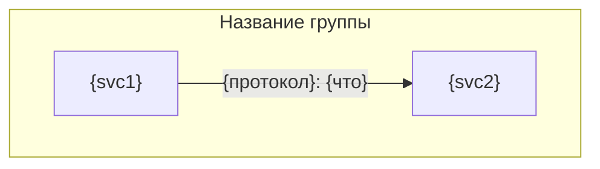
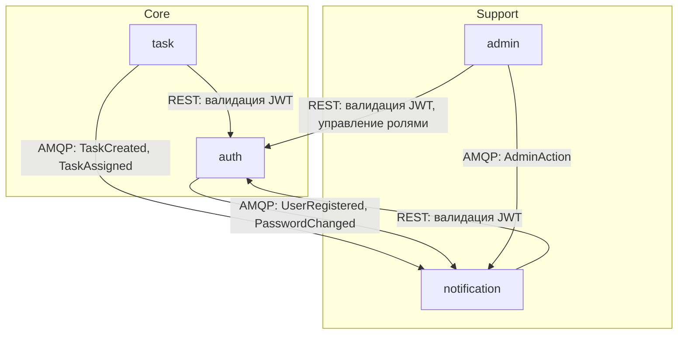

# docs/.system/overview.md — архитектура системы

Спецификация overview.md: секции, шаблон, пример. Один файл — вся системная архитектура: карта сервисов, связи, сквозные потоки, контекстная карта доменов, shared-код.

## Контекст

**Задача:** Определить формат docs/.system/overview.md — единого документа с архитектурой системы для LLM-разработчика.

**Источник:** `.claude/drafts/2026-02-19-sdd-chain-rethink.md` (строки 383-634)

**Связанные файлы:**
- `2026-02-19-sdd-structure.md` — общая структура и решения
- `2026-02-19-sdd-docs-conventions.md` — conventions.md (конвенции vs архитектура: разделение ответственности)
- `2026-02-19-sdd-docs-service.md` — {svc}.md содержит per-service детали (API, Data Model), overview.md — системный взгляд

---

## Содержание

Один файл, вся системная архитектура: что за система, из каких сервисов состоит, как они связаны, какие сквозные сценарии, как соотносятся домены.

### Секции docs/.system/overview.md

| # | Секция | Содержание | Зачем LLM-разработчику |
|---|--------|-----------|----------------------|
| 1 | **Назначение системы** | Что делает система, для кого, ключевые возможности. 3-5 предложений | Понять контекст — что за продукт |
| 2 | **Карта сервисов** | Таблица всех сервисов: имя, зона ответственности, владеет данными, ключевые API. Визуальная схема (mermaid) | Понять из чего состоит система, не читая каждый {svc}.md |
| 3 | **Связи между сервисами** | Таблица: кто → кого → через что (REST/AMQP/WS) → зачем. Паттерн интеграции | Знать кто от кого зависит, прежде чем менять контракт |
| 4 | **Сквозные потоки (Data Flows)** | End-to-end сценарии через несколько сервисов. Каждый поток: шаги, участники, протоколы | Понять как данные проходят через систему целиком |
| 5 | **Контекстная карта доменов** | Какие домены, какой сервис реализует какой домен, DDD-паттерны связей (Conformist, ACL, Shared Kernel, Published Language) | Знать границы ответственности и паттерны связи при добавлении нового взаимодействия |
| 6 | **Shared-код** | Что лежит в shared/, кто владелец, кто потребитель | Знать что переиспользовать, а не дублировать |

### Шаблон: docs/.system/overview.md

`````markdown
# Архитектура системы

## Назначение системы

{3-5 предложений: что делает система, для кого, ключевые возможности.}

## Карта сервисов

{1-3 предложения: общий принцип разделения на сервисы — почему именно так, какой сервис центральный, какие вспомогательные.}

| Сервис | Зона ответственности | Владеет данными | Ключевые API |
|--------|---------------------|----------------|-------------|
| {svc} | {что делает} | {таблицы/коллекции} | {основные endpoints} |



## Связи между сервисами

{Абзац: какие паттерны коммуникации используются в системе и почему. Какой сервис является центральной зависимостью. Как устроен поток событий — кто publisher, кто subscriber, через какой broker.}

| Источник | Приёмник | Протокол | Назначение | Паттерн |
|----------|---------|----------|-----------|---------|
| {svc1} | {svc2} | {REST/AMQP/WS} | {зачем вызывает} | {sync/async, pub-sub/request-reply} |

{Абзац: практические последствия для разработчика — если добавляешь новый сервис, он должен {что}. Если добавляешь новое событие — нужно {что}.}

## Сквозные потоки

{Абзац: что такое сквозные потоки в этой системе — типичные сценарии, в которых участвуют 2+ сервиса. Для каждого потока указаны конкретные шаги и ссылки на контракты в {svc}.md.}

### {Название сценария}

**Участники:** {svc1}, {svc2}, {svc3}

```
1. {Актор} → {svc1}: {действие} ({протокол})
2. {svc1} → {svc2}: {действие} ({протокол})
3. {svc2} → {svc3}: {действие} ({протокол})
4. {svc3} → {Актор}: {результат} ({протокол})
```

**Ключевые контракты:**
- Шаг 2: см. [{svc1}.md#endpoint]({svc1}.md#endpoint)
- Шаг 3: см. [{svc2}.md#endpoint]({svc2}.md#endpoint)

### {Следующий сценарий}

...

## Контекстная карта доменов

{Абзац: как домены соотносятся с сервисами. Один домен = один сервис или есть исключения? Как выбирается паттерн связи между доменами — когда Conformist, когда ACL.}

| Домен | Реализует сервис | Агрегаты | Связь с другими доменами |
|-------|-----------------|----------|------------------------|
| {domain} | {svc} | {агрегаты} | {паттерн}: {другой домен} ({описание связи}) |

**DDD-паттерны связей:**
- **Conformist:** {кто} конформен к {кому} — принимает модель без адаптации
- **ACL (Anti-Corruption Layer):** {кто} адаптирует модель {кого} через слой трансляции
- **Published Language:** {кто} публикует стандартные события, подписчики обрабатывают
- **Shared Kernel:** {что} разделяют {кто и кто} — общий код в shared/

{Абзац: практические последствия — что значит каждый паттерн для разработчика при добавлении нового взаимодействия между доменами.}

## Shared-код

{Абзац: что выносится в shared/ и почему. Принцип: shared-пакет создаётся когда {условие}. Владелец отвечает за {что}, потребитель {что}. Полные интерфейсы shared-пакетов — в [conventions.md](conventions.md#shared-пакеты).}

| Пакет | Назначение | Владелец | Потребители |
|-------|-----------|---------|-------------|
| shared/{package} | {что делает} | {svc-владелец} | {svc1}, {svc2} |
`````

### Пример: docs/.system/overview.md

`````markdown
# Архитектура системы

## Назначение системы

MyApp — платформа управления задачами для команд. Пользователи создают задачи,
назначают исполнителей, отслеживают прогресс. Система поддерживает real-time
уведомления через WebSocket, ролевой доступ (admin/manager/member) и
административную панель для управления пользователями и ролями.

## Карта сервисов

Система разделена на 4 сервиса по принципу бизнес-домена. auth — центральный сервис, от которого зависят все остальные (JWT-авторизация). task — основная бизнес-логика. notification — вспомогательный сервис, подписанный на события остальных. admin — надстройка над auth с дополнительной проверкой ролей.

| Сервис | Зона ответственности | Владеет данными | Ключевые API |
|--------|---------------------|----------------|-------------|
| auth | Регистрация, логин, JWT, роли, управление пользователями | users, roles, sessions | POST /auth/register, POST /auth/login, POST /auth/validate |
| task | Задачи, проекты, назначения, статусы | tasks, projects, assignments | CRUD /tasks, CRUD /projects |
| notification | Push-уведомления, WebSocket, история уведомлений | notifications, ws:connections | GET /notifications, WS /ws/notifications |
| admin | Админ-панель, управление ролями, аудит-лог | audit_log | GET /admin/users, PATCH /admin/users/{id}/role |



## Связи между сервисами

В системе два паттерна коммуникации. **Синхронный REST** используется для request-reply: все сервисы валидируют JWT через auth при каждом входящем запросе. **Асинхронный AMQP** используется для событий: auth, task и admin публикуют доменные события в единый exchange `system.events`, notification подписан на все события и создаёт уведомления. Прямых sync-вызовов между task и notification нет — только через события.

| Источник | Приёмник | Протокол | Назначение | Паттерн |
|----------|---------|----------|-----------|---------|
| task | auth | REST | Валидация JWT при каждом запросе | sync, request-reply |
| notification | auth | REST | Валидация JWT при WS-подключении и REST | sync, request-reply |
| admin | auth | REST | Валидация JWT + управление ролями | sync, request-reply |
| task | notification | AMQP | Публикация событий TaskCreated, TaskAssigned | async, pub-sub |
| auth | notification | AMQP | Публикация событий UserRegistered, PasswordChanged | async, pub-sub |
| admin | notification | AMQP | Публикация событий AdminAction | async, pub-sub |

При добавлении нового сервиса: он должен подключить shared/auth middleware для JWT-валидации и, если генерирует события, публиковать их в `system.events` (см. [conventions.md](conventions.md#sharedevents--схемы-событий-amqp)). Если сервис потребляет события — подписаться на `system.events` и обработать нужные типы.

## Сквозные потоки

### Регистрация пользователя и welcome-уведомление

**Участники:** frontend, auth, notification

```
1. frontend → auth: POST /auth/register (REST)
   Тело: { email, password, name }
2. auth: создаёт пользователя в users, генерирует JWT
3. auth → frontend: 201 Created { user, token } (REST)
4. auth → AMQP: публикует UserRegistered { user_id, email, name }
5. notification: получает UserRegistered из system.events
6. notification: создаёт welcome-уведомление в PostgreSQL
7. notification → frontend: push через WebSocket (если подключён)
```

**Ключевые контракты:**
- Шаг 1: см. [auth.md#post-apiv1authregister](../auth.md#post-apiv1authregister)
- Шаг 4: см. [notification.md#event-systemevents-subscriber](../notification.md#event-systemevents-subscriber)

### Создание задачи с уведомлением назначенному

**Участники:** frontend, auth, task, notification

```
1. frontend → task: POST /tasks (REST, Bearer JWT)
2. task → auth: POST /auth/validate (REST, внутренний вызов)
3. auth → task: 200 { valid: true, user_id, role }
4. task: создаёт задачу в tasks, назначение в assignments
5. task → frontend: 201 Created { task } (REST)
6. task → AMQP: публикует TaskCreated { task_id, creator_id }
7. task → AMQP: публикует TaskAssigned { task_id, assignee_id }
8. notification: получает TaskAssigned из system.events
9. notification: создаёт уведомление для assignee в PostgreSQL
10. notification → assignee frontend: push через WebSocket
```

**Ключевые контракты:**
- Шаг 1: см. [task.md#post-apiv1tasks](../task.md#post-apiv1tasks)
- Шаг 2: см. [auth.md#post-apiv1authvalidate](../auth.md#post-apiv1authvalidate)
- Шаг 7: см. [notification.md#event-systemevents-subscriber](../notification.md#event-systemevents-subscriber)

### Административное изменение роли

**Участники:** admin frontend, auth, admin, notification

```
1. admin frontend → admin: PATCH /admin/users/{id}/role (REST, Bearer JWT)
2. admin → auth: POST /auth/validate (REST)
3. auth → admin: 200 { valid: true, user_id, role: "admin" }
4. admin: проверяет role == "admin"
5. admin → auth: PATCH /auth/users/{id}/role (REST, внутренний)
6. auth: обновляет роль в users
7. admin: записывает audit_log
8. admin → AMQP: публикует AdminAction { action: "role_changed", target_user_id }
9. notification: создаёт admin-уведомление для target user
10. notification → target user frontend: push через WebSocket
```

**Ключевые контракты:**
- Шаг 1: см. [admin.md#patch-apiv1adminusersid-role](../admin.md#patch-apiv1adminusersid-role)
- Шаг 5: см. [auth.md#patch-apiv1authusersid-role](../auth.md#patch-apiv1authusersid-role)

## Контекстная карта доменов

Каждый домен реализуется ровно одним сервисом (1:1). Identity — корневой домен, от которого зависят все остальные. Паттерн связи выбирается так: если сервис просто принимает чужую модель (user_id, JWT claims) — Conformist. Если нужна адаптация чужой модели (добавить проверку роли) — ACL. Если сервис публикует события для подписчиков — Published Language.

| Домен | Реализует сервис | Агрегаты | Связь с другими доменами |
|-------|-----------------|----------|------------------------|
| Identity | auth | User, Role, Session | Published Language: публикует UserRegistered, PasswordChanged |
| Task Management | task | Task, Project, Assignment | Conformist: конформен к Identity (принимает user_id без адаптации) |
| Notifications | notification | Notification, WebSocketConnection | Conformist: конформен к Identity. Published Language: подписан на события всех доменов |
| Administration | admin | AuditLog | ACL: адаптирует Identity API (дополняет проверкой role == admin). Conformist: к Task Management для чтения статистики |

**DDD-паттерны связей:**
- **Conformist:** task, notification, admin конформны к auth — принимают user_id и JWT-модель без адаптации
- **ACL:** admin оборачивает auth API дополнительной проверкой role == admin перед вызовом
- **Published Language:** auth, task, admin публикуют стандартные события в system.events; notification подписывается
- **Shared Kernel:** shared/auth/ — JWT middleware, используется task, notification, admin (владелец: auth)

Практические последствия: если task начнёт использовать новое поле из JWT (например, `organization_id`) — это Conformist, task просто читает поле, ничего адаптировать не нужно. Но если admin добавит новую проверку прав (например, `can_manage_users`) — это ACL, нужно расширить слой адаптации в admin, а не менять auth.

## Shared-код

В shared/ выносится код, который используется 2+ сервисами и имеет одного владельца. Владелец отвечает за API пакета и обратную совместимость. Потребители используют пакет как есть, без модификаций. Полные интерфейсы (сигнатуры, параметры, примеры вызова) — в [conventions.md](conventions.md#shared-пакеты).

| Пакет | Назначение | Владелец | Потребители |
|-------|-----------|---------|-------------|
| shared/auth | JWT middleware — валидация токена, извлечение user_id и role из claims | auth | task, notification, admin |
| shared/events | Схемы событий AMQP — UserRegistered, TaskCreated и др. TypedDict-определения | auth (Identity-события), task (Task-события) | notification |

Когда создавать новый shared-пакет: если два сервиса дублируют одинаковую логику (middleware, схемы данных, утилиты). Не выносить в shared: бизнес-логику конкретного домена, конфигурацию специфичную для одного сервиса.
`````

---

## Аудит старых документов

| Старый документ | Что переиспользовать |
|-----------------|---------------------|
| `specs/.instructions/living-docs/architecture/standard-architecture.md` | Концепция фиксированных файлов, таблица потоков данных, Planned Changes/Changelog паттерн |
| `specs/.instructions/living-docs/architecture/validation-architecture.md` | Коды ошибок AC001-AC006, pre-commit паттерн |
| `specs/architecture/system/overview.md` | Текущий шаблон (для сравнения и объединения) |
| `specs/architecture/system/data-flows.md` | Формат потоков данных (объединяется в overview.md секция 4) |
| `specs/architecture/domains/context-map.md` | Формат контекстной карты (объединяется в overview.md секция 5) |
