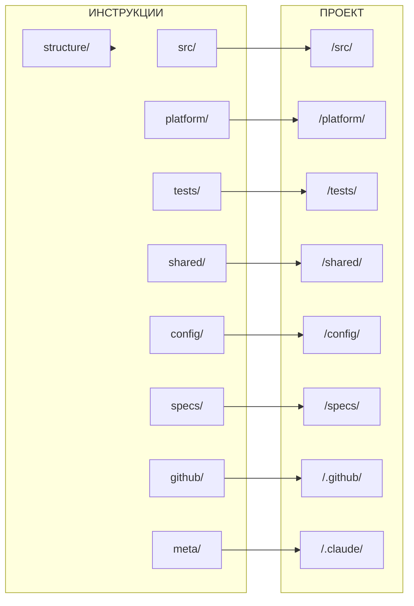

# Новая структура проекта

## Введение

**Цель:** Реорганизация `/.claude/instructions/` для чёткого разделения ответственности по scope.

**Проблема текущей структуры:**
- `services/`, `src/`, `platform/`, `tests/` существуют на одном уровне, хотя логически связаны
- Нет чёткого разделения "что относится к сервису" vs "что относится к системе"
- `git/` и `issues/` смешивают процессы и инструменты

**Решение:** Зеркальная структура — инструкции отражают папки проекта.

| Раздел | Папка проекта | Описание |
|--------|---------------|----------|
| `structure/` | — | Фундамент: структура проекта и инструкций |
| `src/` | `/src/` | Разработка сервисов |
| `platform/` | `/platform/` | Инфраструктура |
| `tests/` | `/tests/` | Системные тесты |
| `shared/` | `/shared/` | Общий код |
| `config/` | `/config/` | Конфигурации |
| `specs/` | `/specs/` | Спецификации |
| `github/` | `/.github/` | GitHub платформа |
| `meta/` | `/.claude/` | Claude-сущности + правила (git, links, skills...) |

**Принцип:** Папка `/X/` → инструкции `X/`. Правила → `meta/`.

**Связанные документы:**
- [migration_plan.md](./migration_plan.md) — план миграции и что меняется

---

## 1. Структура инструкций

**Принцип:** Строгое зеркалирование — каждая папка проекта = папка инструкций.

```
/.claude/instructions/
│
├── structure/                   # Фундамент: определяет всё остальное
│   └── *.md                     #   project, instructions, mapping
│
├── src/                         # → /src/{service}/
│   ├── *.md                     #   lifecycle, structure, dependencies
│   ├── api/                     # → backend/v*/
│   ├── data/                    # → backend/ (форматы данных)
│   ├── database/                # → database/
│   │   └── migrations/          # → database/migrations/
│   ├── dev/                     #   Локальная разработка
│   ├── health/                  # → backend/health/
│   ├── resilience/              # → backend/ (устойчивость)
│   ├── security/                # → backend/ (безопасность)
│   ├── testing/                 # → tests/
│   │   ├── unit/                # → tests/unit/
│   │   └── integration/         # → tests/integration/
│   ├── frontend/                # → frontend/
│   └── docs/                    # → docs/
│
├── platform/                    # → /platform/
│   ├── *.md                     #   deployment, operations, caching, security
│   ├── docker/                  # → docker/
│   ├── gateway/                 # → gateway/
│   ├── monitoring/              # → monitoring/
│   │   ├── prometheus/          # → monitoring/prometheus/
│   │   ├── grafana/             # → monitoring/grafana/
│   │   └── loki/                # → monitoring/loki/
│   ├── k8s/                     # → k8s/
│   ├── scripts/                 # → scripts/
│   ├── docs/                    # → docs/
│   └── runbooks/                # → runbooks/
│
├── tests/                       # → /tests/
│   ├── *.md                     #   formats, project-testing
│   ├── e2e/                     # → e2e/
│   ├── integration/             # → integration/
│   ├── load/                    # → load/
│   ├── smoke/                   # → smoke/
│   └── fixtures/                # → fixtures/
│
├── shared/                      # → /shared/
│   ├── *.md                     #   общие правила
│   ├── contracts/               # → contracts/
│   │   ├── openapi/             # → contracts/openapi/
│   │   └── protobuf/            # → contracts/protobuf/
│   ├── events/                  # → events/
│   ├── libs/                    # → libs/
│   ├── assets/                  # → assets/
│   ├── i18n/                    # → i18n/
│   └── docs/                    # → docs/
│
├── config/                      # → /config/
│   ├── *.md                     #   environments
│   └── feature-flags/           # → feature-flags/
│
├── specs/                       # → /specs/
│   ├── *.md                     #   glossary, workflow, statuses, rules
│   ├── discussions/             # → discussions/
│   ├── impact/                  # → impact/
│   └── services/                # → services/ (шаблон для сервисов)
│       ├── adr/                 # → {service}/adr/
│       └── plans/               # → {service}/plans/
│
├── github/                      # → /.github/
│   ├── *.md                     #   actions, templates, CODEOWNERS
│   ├── workflows/               # → workflows/
│   └── issues/                  # → ISSUE_TEMPLATE/
│
└── meta/                        # → /.claude/ + правила
    ├── git/                     #   Git правила: commits, branches, review
    ├── docs/                    #   Правила документации
    ├── instructions/            #   Правила инструкций
    ├── links/                   #   Правила ссылок
    ├── skills/                  #   Правила скиллов
    ├── agents/                  #   Правила агентов
    ├── scripts/                 #   Правила скриптов
    ├── state/                   #   Правила состояний
    ├── templates/               #   Правила шаблонов
    └── drafts/                  #   Правила черновиков
```

---

## 2. Структура проекта

### 2.1. Корневые файлы

```
/
├── README.md                    # Главный README проекта
├── CLAUDE.md                    # Точка входа для Claude Code
├── Makefile                     # Команды проекта (make help)
└── .gitignore                   # Git ignore
```

### 2.2. Дерево папок

```
/
├── src/                         # Исходный код сервисов (← service/)
│   └── {service}/
│       ├── *.md, *.yaml         #   Точка входа: README, Makefile, dependencies.yaml, .env.example
│       ├── backend/
│       │   ├── v*/              #   Версионированный API: handlers, routes, services
│       │   │   └── *.ts
│       │   ├── shared/
│       │   │   └── *.ts         #   Общий код между версиями: models, utils
│       │   └── health/
│       │       └── *.ts         #   Health endpoints: /health, /ready
│       ├── database/
│       │   ├── *.sql            #   Схема БД: schema.sql
│       │   └── migrations/
│       │       └── *.sql        #   Миграции: 001_init.sql, 002_add_users.sql
│       ├── frontend/
│       │   └── *.*              #   Клиентский код (опционально)
│       ├── tests/
│       │   ├── unit/
│       │   │   └── *.test.ts    #   Unit тесты сервиса
│       │   └── integration/
│       │       └── *.test.ts    #   Integration тесты сервиса
│       └── docs/
│           └── *.md             #   Документация сервиса: API, guides, runbooks
│
├── platform/                    # Общая инфраструктура (← system/platform/)
│   ├── docker/
│   │   └── *.yml                #   Docker конфигурации: docker-compose.yml, docker-compose.dev.yml
│   ├── gateway/
│   │   └── *.*                  #   API Gateway: Traefik/Nginx конфиги
│   ├── monitoring/
│   │   ├── prometheus/
│   │   │   └── *.yml            #   Сбор метрик: prometheus.yml, alerts.yml
│   │   ├── grafana/
│   │   │   └── *.json           #   Дашборды: dashboards/*.json
│   │   └── loki/
│   │       └── *.yml            #   Сбор логов: loki-config.yml
│   ├── k8s/
│   │   └── *.yaml               #   Kubernetes манифесты: deployments, services
│   ├── scripts/
│   │   └── *.sh                 #   Инфраструктурные скрипты: deploy.sh, backup.sh
│   ├── docs/
│   │   └── *.md                 #   Документация инфраструктуры
│   └── runbooks/
│       └── *.md                 #   Runbooks: deploy.md, rollback.md, database-full.md
│
├── tests/                       # Системные тесты (← system/tests/)
│   ├── e2e/
│   │   └── *.test.ts            #   End-to-end сценарии: user-flow.test.ts
│   ├── integration/
│   │   └── *.test.ts            #   Интеграция между сервисами: auth-users.test.ts
│   ├── load/
│   │   └── *.js                 #   Нагрузочные тесты (k6): load-test.js
│   ├── smoke/
│   │   └── *.test.ts            #   Smoke тесты: health-check.test.ts
│   └── fixtures/
│       └── *.json               #   Общие тестовые данные: users.json
│
├── shared/                      # Общий код между сервисами (← system/shared/)
│   ├── contracts/
│   │   ├── openapi/
│   │   │   └── *.yaml           #   REST контракты: auth.yaml, users.yaml
│   │   └── protobuf/
│   │       └── *.proto          #   gRPC контракты: auth.proto
│   ├── events/
│   │   └── *.json               #   Схемы событий: user.created.json
│   ├── libs/
│   │   └── *.*                  #   Общие библиотеки: errors, logging, validation
│   ├── assets/
│   │   └── *.*                  #   Статические ресурсы: иконки, шрифты
│   ├── i18n/
│   │   └── *.json               #   Локализация: en.json, ru.json
│   └── docs/
│       └── *.md                 #   Документация общего кода
│
├── config/                      # Конфигурации окружений (← system/config/)
│   ├── *.yaml                   #   Окружения: development.yaml, staging.yaml, production.yaml
│   └── feature-flags/
│       └── *.yaml               #   Feature flags: flags.yaml
│
├── specs/                       # Спецификации проекта (← workflow/specs/)
│   ├── discussions/
│   │   └── *.md                 #   Дискуссии: 001-new-feature.md
│   ├── impact/
│   │   └── *.md                 #   Импакт-анализ: 001-feature-impact.md
│   ├── services/
│   │   └── {service}/
│   │       ├── *.md             #   Описание сервиса: README.md, architecture.md
│   │       ├── adr/
│   │       │   └── *.md         #   Архитектурные решения: 001-initial.md
│   │       └── plans/
│   │           └── *.md         #   Планы реализации: feature-plan.md
│   └── glossary.md              #   Глоссарий терминов проекта
│
├── .github/                     # GitHub платформа (← workflow/github/) ⚠️ ТРЕБОВАНИЕ GITHUB
│   ├── workflows/               #   ⚠️ Путь фиксирован платформой
│   │   └── *.yml                #   CI/CD pipelines: ci.yml, deploy.yml
│   ├── ISSUE_TEMPLATE/          #   ⚠️ Путь фиксирован платформой
│   │   └── *.md                 #   Шаблоны Issues: bug.md, feature.md
│   ├── PULL_REQUEST_TEMPLATE.md #   Шаблон PR
│   └── CODEOWNERS               #   Владельцы кода
│
└── .claude/                     # Инструменты Claude (← meta/)
    ├── instructions/
    │   └── *.md                 #   Инструкции для LLM
    ├── skills/
    │   └── */SKILL.md           #   Скиллы: skill-create/, docs-update/
    ├── agents/
    │   └── *.md                 #   Агенты: researcher.md, coder.md
    ├── templates/               #   Шаблоны (структура отражает инструкции)
    │   ├── service/             #   Шаблоны для сервисов
    │   │   └── *.md
    │   ├── system/              #   Шаблоны для системы
    │   │   ├── platform/        #     Runbooks, deployment templates
    │   │   │   └── *.md
    │   │   └── tests/           #     Smoke tests, e2e templates
    │   │       └── *.md
    │   ├── workflow/            #   Шаблоны для процессов
    │   │   ├── docs/            #     Шаблоны документации: backend, frontend, database
    │   │   │   └── *.md
    │   │   ├── git/             #     Шаблоны git: commit-message, pr-template, codeowners
    │   │   │   └── *.md
    │   │   └── specs/           #     Шаблоны спецификаций: adr, discussion, impact, plan
    │   │       └── *.md
    │   └── meta/                #   Шаблоны для meta-сущностей
    │       ├── instructions/    #     Шаблоны инструкций
    │       │   └── *.md
    │       └── skills/          #     Шаблоны скиллов
    │           └── *.md
    ├── scripts/
    │   └── *.py                 #   Скрипты автоматизации: validate-deps.py
    ├── state/
    │   └── *.json               #   Состояния агентов (не в git)
    ├── drafts/
    │   └── *.md                 #   Черновики: планы, заметки, SSOT (в git)
    ├── settings.json            #   Настройки Claude (в git)
    └── settings.local.json      #   Локальные настройки (не в git)
```

### 2.3. Общие правила

1. **README.md обязателен** — каждая папка ДОЛЖНА иметь README.md как индекс
2. **SSOT в drafts/** — документы-первоисточники хранятся в `/.claude/drafts/`
3. **settings.local.json не в git** — локальные настройки игнорируются
4. **state/ не в git** — состояния агентов игнорируются

---

## 3. Маппинг: Инструкции → Папки проекта

**Принцип:** Инструкции зеркалируют структуру проекта.

| Инструкция | Папка проекта | Описание |
|------------|---------------|----------|
| `structure/` | — | Фундамент: структура проекта и инструкций |
| `src/` | `/src/{service}/` | Разработка сервисов |
| `src/api/` | `/src/{service}/backend/v*/` | Проектирование API |
| `src/data/` | `/src/{service}/backend/` | Форматы данных |
| `src/database/` | `/src/{service}/database/` | База данных |
| `src/dev/` | `/src/{service}/` | Локальная разработка |
| `src/health/` | `/src/{service}/backend/health/` | Health checks |
| `src/resilience/` | `/src/{service}/backend/` | Устойчивость |
| `src/security/` | `/src/{service}/backend/` | Безопасность |
| `src/testing/` | `/src/{service}/tests/` | Тестирование сервиса |
| `src/frontend/` | `/src/{service}/frontend/` | Клиентский код |
| `src/docs/` | `/src/{service}/docs/` | Документация сервиса |
| `platform/` | `/platform/` | Инфраструктура |
| `platform/observability/` | `/platform/monitoring/` | Наблюдаемость |
| `platform/docs/` | `/platform/docs/`, `/platform/runbooks/` | Документация, runbooks |
| `tests/` | `/tests/` | Системные тесты |
| `shared/` | `/shared/` | Общий код |
| `shared/docs/` | `/shared/docs/` | Документация общего кода |
| `config/` | `/config/` | Конфигурации |
| `specs/` | `/specs/` | Спецификации |
| `github/` | `/.github/` ⚠️ | GitHub платформа |
| `github/issues/` | `/.github/ISSUE_TEMPLATE/` | GitHub Issues |
| `meta/` | `/.claude/` | Claude-сущности |
| `meta/git/` | — | Git правила (commits, branches, review) |
| `meta/docs/` | — | Правила документации |
| `meta/instructions/` | `/.claude/instructions/` | Правила инструкций |
| `meta/links/` | — | Правила ссылок |
| `meta/skills/` | `/.claude/skills/` | Правила скиллов |
| `meta/agents/` | `/.claude/agents/` | Правила агентов |
| `meta/scripts/` | `/.claude/scripts/` | Правила скриптов |
| `meta/state/` | `/.claude/state/` | Правила состояний |
| `meta/templates/` | `/.claude/templates/` | Правила шаблонов |
| `meta/drafts/` | `/.claude/drafts/` | Правила черновиков |

> ⚠️ `/.github/` — путь фиксирован платформой GitHub

---

## 4. Диаграмма связей



**Принцип:** Инструкция `X/` → Папка `/X/`. Правила → `meta/`.

---

## 5. Жизненный цикл сервиса: покрытие инструкциями

| Этап | Что происходит | Инструкции |
|------|----------------|------------|
| **1. Идея** | Обсуждение, формулировка | `specs/` (discussions) |
| **2. Анализ** | Импакт, зависимости | `specs/` (impact) |
| **3. Проектирование** | Архитектура, ADR | `specs/` (adr, architecture) |
| **4. Планирование** | План, задачи | `specs/` (plans) + `github/issues/` |
| **5. Создание** | Scaffold сервиса | `src/` (lifecycle, structure) |
| **6. Разработка** | Код, API, БД | `src/` (api, data, database, dev, health, resilience, security) |
| **7. Тестирование** | Unit, integration, e2e | `src/testing/` + `tests/` |
| **8. Документация** | API docs, README | `src/docs/`, `shared/docs/`, `platform/docs/` |
| **9. Code Review** | PR, review | `meta/git/` (review) |
| **10. CI/CD** | Сборка, деплой | `github/` (actions) + `platform/` |
| **11. Мониторинг** | Логи, метрики, трейсы | `platform/observability/` |
| **12. Алертинг** | Уведомления | `platform/observability/` (alerting) |
| **13. Поддержка** | Runbooks, инциденты | `platform/docs/` (runbooks) + `platform/` (operations) |
| **14. Обновление** | Новые версии API | `src/api/` (versioning, deprecation) |
| **15. Удаление** | Вывод из эксплуатации | `src/` (lifecycle) |

---

## 6. Зоны ответственности инструкций

> Формат: **Scope** — что входит | что НЕ входит

### 6.0. structure/ — Фундамент

Scope: **корневая информация** о структуре проекта и инструкций.

| Файл | Зона ответственности | IN | OUT |
|------|---------------------|-----|-----|
| `project.md` | Структура папок | Дерево проекта, зоны папок | Содержимое файлов |
| `instructions.md` | Структура инструкций | Зеркальная структура, зоны инструкций | Содержимое инструкций |
| `mapping.md` | Маппинг | Связь инструкций с папками | Детали реализации |

### 6.1. src/ — Разработка сервисов

Scope: код и конфигурация сервисов в `/src/{service}/`.

| Папка | Зона ответственности | IN | OUT |
|-------|---------------------|-----|-----|
| `src/` | Управление сервисом | lifecycle, structure, dependencies | Общие библиотеки (→ shared/) |
| `src/api/` | Проектирование API | design, versioning, deprecation, realtime | Контракты (→ /shared/contracts) |
| `src/data/` | Форматы данных | errors, logging, validation, pagination | Схемы событий (→ shared/) |
| `src/database/` | База данных | schema, migrations, transactions, pooling | Общие миграции (→ platform/) |
| `src/dev/` | Локальная разработка | local setup, hot reload, performance | CI/CD (→ github/) |
| `src/health/` | Health checks | /health, /ready, graceful shutdown | Alerting (→ platform/observability/) |
| `src/resilience/` | Устойчивость | timeouts, retries, circuit breaker | Инфра-отказоустойчивость (→ platform/) |
| `src/security/` | Безопасность | auth, authorization, audit | Секреты, vault (→ platform/) |
| `src/testing/` | Тесты сервиса | unit, integration внутри сервиса | E2E, load (→ tests/) |
| `src/frontend/` | Клиентский код | UI, state, routing | Общие assets (→ shared/) |
| `src/docs/` | Документация сервиса | API docs, guides, runbooks | Архитектура (→ specs/) |

### 6.2. platform/ — Инфраструктура

Scope: общая инфраструктура в `/platform/`.

| Папка | Зона ответственности | IN | OUT |
|-------|---------------------|-----|-----|
| `platform/` | Инфраструктура | docker, deployment, operations | Код сервисов (→ src/) |
| `platform/observability/` | Наблюдаемость | logging, metrics, tracing, alerting | Логирование в коде (→ src/data/) |
| `platform/docs/` | Документация, runbooks | docs, runbooks операций | Документация сервисов (→ src/docs/) |

### 6.3. tests/ — Системные тесты

Scope: тесты всей системы в `/tests/`.

| Папка | Зона ответственности | IN | OUT |
|-------|---------------------|-----|-----|
| `tests/` | Системные тесты | e2e, load, smoke, integration между сервисами | Unit тесты (→ src/testing/) |

### 6.4. shared/ — Общий код

Scope: код между сервисами в `/shared/`.

| Папка | Зона ответственности | IN | OUT |
|-------|---------------------|-----|-----|
| `shared/` | Общий код | contracts, events, libs, assets, i18n | Код сервиса (→ src/) |
| `shared/docs/` | Документация | документация контрактов, событий, библиотек | Документация сервисов (→ src/docs/) |

### 6.5. config/ — Конфигурации

Scope: конфигурации окружений в `/config/`.

| Папка | Зона ответственности | IN | OUT |
|-------|---------------------|-----|-----|
| `config/` | Конфигурации | environments, feature-flags | .env сервиса (→ /src/{service}/) |

### 6.6. specs/ — Спецификации

Scope: спецификации проекта в `/specs/`.

| Папка | Зона ответственности | IN | OUT |
|-------|---------------------|-----|-----|
| `specs/` | Спецификации | discussions, impact, adr, plans, architecture | Документация кода (→ */docs/) |

### 6.7. github/ — GitHub платформа

Scope: GitHub конфигурации в `/.github/`.

| Папка | Зона ответственности | IN | OUT |
|-------|---------------------|-----|-----|
| `github/` | GitHub платформа | actions, workflows, templates, CODEOWNERS | Git правила (→ meta/git/) |
| `github/issues/` | GitHub Issues | format, labels, workflow, commands | Спецификации (→ specs/) |

### 6.8. meta/ — Правила и Claude-сущности

Scope: правила и Claude-артефакты в `/.claude/`.

| Папка | Зона ответственности | IN | OUT |
|-------|---------------------|-----|-----|
| `meta/git/` | Git правила | commits, branches, review, merge | GitHub Actions (→ github/) |
| `meta/docs/` | Правила документации | structure, templates, workflow, rules | Содержимое документации |
| `meta/instructions/` | Правила инструкций | types, validation, workflow, relations | Содержимое инструкций |
| `meta/links/` | Правила ссылок | format, patterns, validation | Конкретные ссылки в файлах |
| `meta/skills/` | Правила скиллов | rules, parameters, errors, state | Код скиллов (→ /.claude/skills/) |
| `meta/agents/` | Правила агентов | structure, prompts, tools | Код агентов (→ /.claude/agents/) |
| `meta/scripts/` | Правила скриптов | naming, structure, hooks | Код скриптов (→ /.claude/scripts/) |
| `meta/state/` | Правила состояний | format, lifecycle, cleanup | Файлы состояний |
| `meta/templates/` | Правила шаблонов | structure, usage, maintenance | Файлы шаблонов |
| `meta/drafts/` | Правила черновиков | naming, lifecycle, cleanup | Файлы черновиков |

---

## 7. Зоны ответственности папок проекта

> Формат: **Scope** — что хранится | что НЕ хранится

### 7.0. Корневые файлы

| Файл | Зона ответственности | IN | OUT |
|------|---------------------|-----|-----|
| `README.md` | Главный README | Описание проекта, quick start, ссылки | Детальная документация (→ */docs/) |
| `CLAUDE.md` | Точка входа Claude | Ссылки на инструкции, статус проекта, правила | Содержимое инструкций (→ /.claude/instructions/) |
| `Makefile` | Команды проекта | make help, dev, test, lint, build | Скрипты деплоя (→ /platform/scripts/) |
| `.gitignore` | Git ignore | Паттерны игнорирования | — |

### 7.1. /src/ — Исходный код сервисов

| Папка | Зона ответственности | IN | OUT |
|-------|---------------------|-----|-----|
| `/src/` | Корень сервисов | Папки сервисов | Общий код (→ /shared/) |
| `/src/{service}/` | Один сервис | README, Makefile, .env.example, dependencies | Спецификации (→ /specs/) |
| `/src/{service}/docs/` | Доки сервиса | API docs, guides, runbooks сервиса | Архитектура (→ /specs/) |
| `/src/{service}/backend/` | Бэкенд сервиса | handlers, routes, services, models | Миграции БД (→ database/) |
| `/src/{service}/backend/v*/` | Версия API | Версионированные handlers, routes | Общий код между версиями (→ shared/) |
| `/src/{service}/backend/shared/` | Общий код бэкенда | models, utils между версиями API | Общие библиотеки системы (→ /shared/libs/) |
| `/src/{service}/backend/health/` | Health endpoints | /health, /ready handlers | Бизнес-логика |
| `/src/{service}/database/` | БД сервиса | schema.sql, migrations/ | Общие схемы (→ /shared/contracts/) |
| `/src/{service}/frontend/` | Фронтенд сервиса | UI компоненты, pages, state | Общие assets (→ /shared/assets/) |
| `/src/{service}/tests/` | Тесты сервиса | unit/, integration/ | E2E тесты (→ /tests/) |

### 7.2. /platform/ — Общая инфраструктура

| Папка | Зона ответственности | IN | OUT |
|-------|---------------------|-----|-----|
| `/platform/` | Инфраструктура | docker, gateway, monitoring, k8s, scripts | Код сервисов (→ /src/) |
| `/platform/docker/` | Docker конфиги | docker-compose.yml, Dockerfile.* | Конфиги сервиса (→ /src/{service}/) |
| `/platform/gateway/` | API Gateway | Traefik/Nginx конфиги, routing rules | Бизнес-логика |
| `/platform/monitoring/` | Мониторинг | prometheus/, grafana/, loki/ | Код логирования (→ /src/) |
| `/platform/monitoring/prometheus/` | Метрики | prometheus.yml, alerts.yml, rules/ | Дашборды (→ grafana/) |
| `/platform/monitoring/grafana/` | Дашборды | dashboards/*.json, provisioning/ | Алерты (→ prometheus/) |
| `/platform/monitoring/loki/` | Логи | loki-config.yml, promtail.yml | Код логирования (→ /src/) |
| `/platform/k8s/` | Kubernetes | deployments, services, ingress, secrets | Docker compose (→ docker/) |
| `/platform/scripts/` | Инфра-скрипты | deploy.sh, backup.sh, restore.sh | Скрипты Claude (→ /.claude/scripts/) |
| `/platform/docs/` | Доки инфраструктуры | Документация /platform/ | Код (→ /platform/) |
| `/platform/runbooks/` | Runbooks | deploy.md, rollback.md, database-full.md | Доки сервисов (→ /src/{service}/docs/) |

### 7.3. /tests/ — Системные тесты

| Папка | Зона ответственности | IN | OUT |
|-------|---------------------|-----|-----|
| `/tests/` | Системные тесты | e2e, integration, load, smoke, fixtures | Unit тесты (→ /src/{service}/tests/) |
| `/tests/e2e/` | End-to-end | User flows, сценарии через UI/API | Unit тесты |
| `/tests/integration/` | Интеграционные | Тесты между сервисами | Тесты внутри сервиса (→ /src/) |
| `/tests/load/` | Нагрузочные | k6 скрипты, сценарии нагрузки | Функциональные тесты |
| `/tests/smoke/` | Smoke тесты | Health checks, базовая работоспособность | Детальные тесты |
| `/tests/fixtures/` | Тестовые данные | users.json, products.json | Моки сервиса (→ /src/{service}/tests/) |

### 7.4. /shared/ — Общий код между сервисами

| Папка | Зона ответственности | IN | OUT |
|-------|---------------------|-----|-----|
| `/shared/` | Общий код | contracts, events, libs, assets, i18n | Код сервисов (→ /src/) |
| `/shared/contracts/` | Контракты API | openapi/*.yaml, protobuf/*.proto | Код handlers (→ /src/) |
| `/shared/contracts/openapi/` | REST контракты | auth.yaml, users.yaml | gRPC (→ protobuf/) |
| `/shared/contracts/protobuf/` | gRPC контракты | auth.proto, users.proto | REST (→ openapi/) |
| `/shared/events/` | Схемы событий | user.created.json, order.placed.json | Код publishers (→ /src/) |
| `/shared/libs/` | Общие библиотеки | errors, logging, validation, http-client | Бизнес-логика (→ /src/) |
| `/shared/assets/` | Статика | icons, fonts, images | UI компоненты (→ /src/{service}/frontend/) |
| `/shared/i18n/` | Локализация | en.json, ru.json | Тексты в коде (→ /src/) |
| `/shared/docs/` | Доки общего кода | Документация /shared/ | Код (→ /shared/) |

### 7.5. /config/ — Конфигурации окружений

| Папка | Зона ответственности | IN | OUT |
|-------|---------------------|-----|-----|
| `/config/` | Конфигурации | environments, feature-flags | .env сервисов (→ /src/{service}/) |
| `/config/*.yaml` | Окружения | development.yaml, staging.yaml, production.yaml | Секреты (→ vault/env vars) |
| `/config/feature-flags/` | Feature flags | flags.yaml, rollout rules | Бизнес-логика |

### 7.6. /specs/ — Спецификации проекта

| Папка | Зона ответственности | IN | OUT |
|-------|---------------------|-----|-----|
| `/specs/` | Спецификации | discussions, impact, services, glossary | Документация кода (→ */docs/) |
| `/specs/discussions/` | Дискуссии | Обсуждения фич, идеи, proposals | Решения (→ adr/) |
| `/specs/impact/` | Импакт-анализ | Анализ влияния изменений | Планы реализации (→ plans/) |
| `/specs/services/` | Спеки сервисов | Папки по сервисам | Код (→ /src/) |
| `/specs/services/{service}/` | Спека сервиса | README, architecture.md | Код сервиса (→ /src/{service}/) |
| `/specs/services/{service}/adr/` | ADR сервиса | Архитектурные решения | Дискуссии (→ /specs/discussions/) |
| `/specs/services/{service}/plans/` | Планы сервиса | Roadmap, feature plans | Issues (→ GitHub) |
| `/specs/glossary.md` | Глоссарий | Термины проекта | Документация API (→ */docs/) |

### 7.7. /.github/ — GitHub платформа

| Папка | Зона ответственности | IN | OUT |
|-------|---------------------|-----|-----|
| `/.github/` | GitHub конфиги | workflows, templates, CODEOWNERS | Код (→ /src/) |
| `/.github/workflows/` | CI/CD pipelines | ci.yml, deploy.yml, release.yml | Скрипты деплоя (→ /platform/scripts/) |
| `/.github/ISSUE_TEMPLATE/` | Шаблоны Issues | bug.md, feature.md, task.md | Спецификации (→ /specs/) |
| `/.github/PULL_REQUEST_TEMPLATE.md` | Шаблон PR | Чек-лист для PR | Review правила (→ инструкции) |
| `/.github/CODEOWNERS` | Владельцы кода | Mapping путей → reviewers | Процессы (→ инструкции) |

### 7.8. /.claude/ — Инструменты Claude

| Папка | Зона ответственности | IN | OUT |
|-------|---------------------|-----|-----|
| `/.claude/` | Claude артефакты | instructions, skills, agents, templates, scripts, state, drafts, settings | Код проекта (→ /src/) |
| `/.claude/instructions/` | Инструкции | Правила для LLM (зеркальная структура) | Документация (→ */docs/) |
| `/.claude/skills/` | Скиллы | SKILL.md для каждого скилла | Инструкции (→ instructions/) |
| `/.claude/agents/` | Агенты | Определения агентов: prompts, tools | Скиллы (→ skills/) |
| `/.claude/templates/` | Шаблоны | Шаблоны для создания артефактов | Готовые файлы |
| `/.claude/scripts/` | Скрипты | Python скрипты автоматизации, hooks | Инфра-скрипты (→ /platform/scripts/) |
| `/.claude/state/` | Состояния | JSON файлы состояний агентов (не в git) | Конфигурации (→ /config/) |
| `/.claude/drafts/` | Черновики | Планы, заметки, SSOT-документы (в git) | Спецификации (→ /specs/) |
| `/.claude/settings.json` | Настройки Claude | Конфигурация Claude Code (в git) | Секреты (→ env vars) |
| `/.claude/settings.local.json` | Локальные настройки | Персональные настройки (не в git) | Общие настройки (→ settings.json) |

