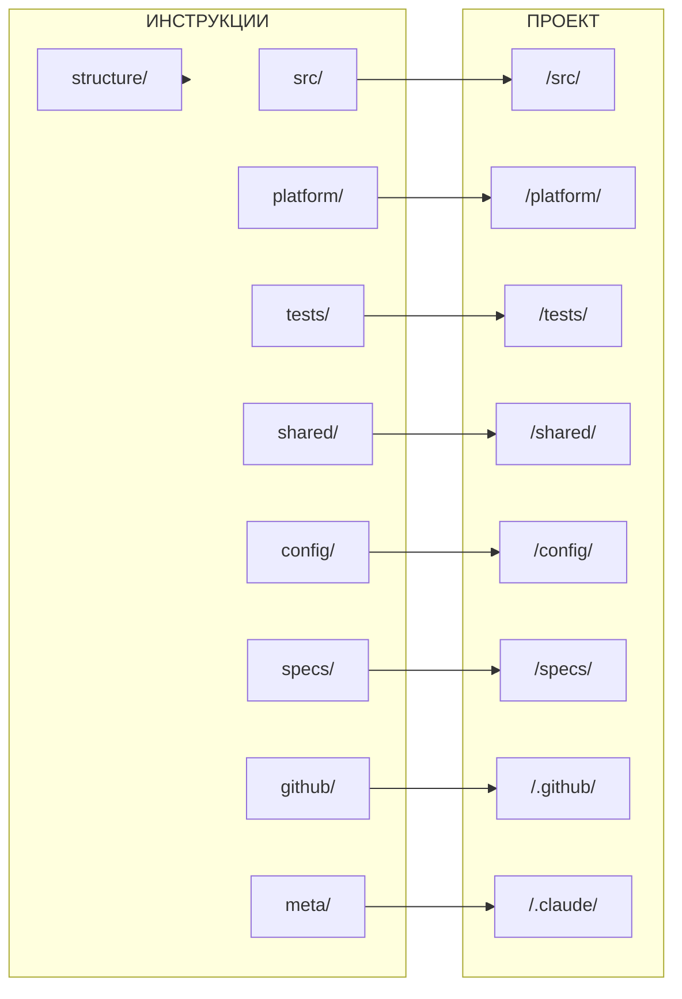

# Структура проекта

## Метаданные

| Поле | Значение |
|------|----------|
| Статус | Draft |
| Версия | 3.0 |
| Обновлено | 2026-01-23 |

---

## Для кого этот документ

| Аудитория | Использование |
|-----------|---------------|
| **Claude Code** | При работе с файлами проекта — куда создавать, где искать |
| **Разработчики** | При создании новых файлов и папок |
| **Архитекторы** | При планировании изменений структуры |

---

## Quick Reference

> **Принцип:** Папка `/X/` → инструкции `/.claude/instructions/X/`

| Папка проекта | Что хранится | Инструкции |
|---------------|--------------|------------|
| `/src/` | Код сервисов | `src/` |
| `/platform/` | Инфраструктура (docker, k8s, monitoring) | `platform/` |
| `/tests/` | Системные тесты (e2e, load, smoke) | `tests/` |
| `/shared/` | Общий код (contracts, events, libs) | `shared/` |
| `/config/` | Конфигурации окружений | `config/` |
| `/specs/` | Спецификации (ADR, plans, discussions) | `specs/` |
| `/.github/` | GitHub (workflows, templates) | `github/` |
| `/.claude/` | Claude (skills, agents, instructions) | `meta/` |

**Особые случаи:**
- `structure/` — фундамент, описывает саму структуру (нет папки проекта)
- `meta/` → `/.claude/` + правила (git, links, skills)

---

## Содержание

1. [Введение](#1-введение)
2. [Decision Tree](#2-decision-tree)
3. [Структура проекта](#3-структура-проекта)
4. [Структура инструкций](#4-структура-инструкций)
5. [Маппинг и диаграмма](#5-маппинг-и-диаграмма)
6. [Жизненный цикл сервиса](#6-жизненный-цикл-сервиса)
7. [Зоны ответственности](#7-зоны-ответственности)

---

## 1. Введение

### Проблема

- Папки `services/`, `src/`, `platform/`, `tests/` существовали на одном уровне без логической связи
- Нет чёткого разделения "сервис" vs "система"
- `git/` и `issues/` смешивали процессы и инструменты

### Решение

**Зеркальная структура** — инструкции отражают папки проекта.

```
Папка /X/  →  Инструкции /.claude/instructions/X/
Правила    →  Инструкции /.claude/instructions/meta/
```

### Общие правила

1. **README.md обязателен** — каждая папка ДОЛЖНА иметь README.md как индекс
2. **SSOT в drafts/** — документы-первоисточники хранятся в `/.claude/drafts/`
3. **settings.local.json не в git** — локальные настройки игнорируются
4. **state/ не в git** — состояния агентов игнорируются

---

## 2. Decision Tree

### Куда положить файл?

```
Файл относится к...
│
├─ Одному сервису?
│  └─ /src/{service}/
│     ├─ Код бэкенда → backend/
│     ├─ База данных → database/
│     ├─ Фронтенд → frontend/
│     ├─ Тесты сервиса → tests/
│     └─ Документация → docs/
│
├─ Нескольким сервисам?
│  └─ /shared/
│     ├─ API контракты → contracts/
│     ├─ Схемы событий → events/
│     └─ Общие библиотеки → libs/
│
├─ Инфраструктуре?
│  └─ /platform/
│     ├─ Docker → docker/
│     ├─ Kubernetes → k8s/
│     └─ Мониторинг → monitoring/
│
├─ Тестам всей системы?
│  └─ /tests/
│     ├─ E2E → e2e/
│     ├─ Нагрузочные → load/
│     └─ Smoke → smoke/
│
├─ Спецификациям/архитектуре?
│  └─ /specs/
│     ├─ Обсуждения → discussions/
│     ├─ ADR → services/{service}/adr/
│     └─ Планы → services/{service}/plans/
│
├─ GitHub CI/CD?
│  └─ /.github/
│
└─ Claude (инструкции, скиллы)?
   └─ /.claude/
```

### Где написать инструкцию?

```
Инструкция про...
│
├─ Разработку кода сервиса?
│  └─ src/
│     ├─ API дизайн → src/api/
│     ├─ Базу данных → src/database/
│     ├─ Безопасность → src/security/
│     └─ Тесты сервиса → src/testing/
│
├─ Инфраструктуру?
│  └─ platform/
│
├─ Системные тесты?
│  └─ tests/
│
├─ Общий код?
│  └─ shared/
│
├─ Спецификации?
│  └─ specs/
│
├─ GitHub?
│  └─ github/
│
└─ Правила/процессы Claude?
   └─ meta/
      ├─ Git правила → meta/git/
      ├─ Скиллы → meta/skills/
      └─ Инструкции → meta/instructions/
```

---

## 3. Структура проекта

### 3.1. Корневые файлы

```
/
├── README.md                    # Главный README проекта
├── CLAUDE.md                    # Точка входа для Claude Code
├── Makefile                     # Команды проекта (make help)
└── .gitignore                   # Git ignore
```

### 3.2. Дерево папок (полное)

```
/
├── src/                         # Исходный код сервисов
│   └── {service}/
│       ├── *.md, *.yaml         #   Точка входа: README, Makefile, dependencies.yaml, .env.example
│       ├── backend/
│       │   ├── v*/              #   Версионированный API: handlers, routes, services
│       │   │   └── *.ts
│       │   ├── shared/
│       │   │   └── *.ts         #   Общий код между версиями: models, utils
│       │   └── health/
│       │       └── *.ts         #   Health endpoints: /health, /ready
│       ├── database/
│       │   ├── *.sql            #   Схема БД: schema.sql
│       │   └── migrations/
│       │       └── *.sql        #   Миграции: 001_init.sql, 002_add_users.sql
│       ├── frontend/
│       │   └── *.*              #   Клиентский код (опционально)
│       ├── tests/
│       │   ├── unit/
│       │   │   └── *.test.ts    #   Unit тесты сервиса
│       │   └── integration/
│       │       └── *.test.ts    #   Integration тесты сервиса
│       └── docs/
│           └── *.md             #   Документация сервиса: API, guides, runbooks
│
├── platform/                    # Общая инфраструктура
│   ├── docker/
│   │   └── *.yml                #   Docker конфигурации: docker-compose.yml, docker-compose.dev.yml
│   ├── gateway/
│   │   └── *.*                  #   API Gateway: Traefik/Nginx конфиги
│   ├── monitoring/
│   │   ├── prometheus/
│   │   │   └── *.yml            #   Сбор метрик: prometheus.yml, alerts.yml
│   │   ├── grafana/
│   │   │   └── *.json           #   Дашборды: dashboards/*.json
│   │   └── loki/
│   │       └── *.yml            #   Сбор логов: loki-config.yml
│   ├── k8s/
│   │   └── *.yaml               #   Kubernetes манифесты: deployments, services
│   ├── scripts/
│   │   └── *.sh                 #   Инфраструктурные скрипты: deploy.sh, backup.sh
│   ├── docs/
│   │   └── *.md                 #   Документация инфраструктуры
│   └── runbooks/
│       └── *.md                 #   Runbooks: deploy.md, rollback.md, database-full.md
│
├── tests/                       # Системные тесты
│   ├── e2e/
│   │   └── *.test.ts            #   End-to-end сценарии: user-flow.test.ts
│   ├── integration/
│   │   └── *.test.ts            #   Интеграция между сервисами: auth-users.test.ts
│   ├── load/
│   │   └── *.js                 #   Нагрузочные тесты (k6): load-test.js
│   ├── smoke/
│   │   └── *.test.ts            #   Smoke тесты: health-check.test.ts
│   └── fixtures/
│       └── *.json               #   Общие тестовые данные: users.json
│
├── shared/                      # Общий код между сервисами
│   ├── contracts/
│   │   ├── openapi/
│   │   │   └── *.yaml           #   REST контракты: auth.yaml, users.yaml
│   │   └── protobuf/
│   │       └── *.proto          #   gRPC контракты: auth.proto
│   ├── events/
│   │   └── *.json               #   Схемы событий: user.created.json
│   ├── libs/
│   │   └── *.*                  #   Общие библиотеки: errors, logging, validation
│   ├── assets/
│   │   └── *.*                  #   Статические ресурсы: иконки, шрифты
│   ├── i18n/
│   │   └── *.json               #   Локализация: en.json, ru.json
│   └── docs/
│       └── *.md                 #   Документация общего кода
│
├── config/                      # Конфигурации окружений
│   ├── *.yaml                   #   Окружения: development.yaml, staging.yaml, production.yaml
│   └── feature-flags/
│       └── *.yaml               #   Feature flags: flags.yaml
│
├── specs/                       # Спецификации проекта
│   ├── discussions/
│   │   └── *.md                 #   Дискуссии: 001-new-feature.md
│   ├── impact/
│   │   └── *.md                 #   Импакт-анализ: 001-feature-impact.md
│   ├── services/
│   │   └── {service}/
│   │       ├── *.md             #   Описание сервиса: README.md, architecture.md
│   │       ├── adr/
│   │       │   └── *.md         #   Архитектурные решения: 001-initial.md
│   │       └── plans/
│   │           └── *.md         #   Планы реализации: feature-plan.md
│   └── glossary.md              #   Глоссарий терминов проекта
│
├── .github/                     # GitHub платформа ⚠️ ТРЕБОВАНИЕ GITHUB
│   ├── workflows/               #   ⚠️ Путь фиксирован платформой
│   │   └── *.yml                #   CI/CD pipelines: ci.yml, deploy.yml
│   ├── ISSUE_TEMPLATE/          #   ⚠️ Путь фиксирован платформой
│   │   └── *.md                 #   Шаблоны Issues: bug.md, feature.md
│   ├── PULL_REQUEST_TEMPLATE.md #   Шаблон PR
│   └── CODEOWNERS               #   Владельцы кода
│
└── .claude/                     # Инструменты Claude
    ├── instructions/
    │   └── *.md                 #   Инструкции для LLM (зеркальная структура)
    ├── skills/
    │   └── */SKILL.md           #   Скиллы: skill-create/, docs-update/
    ├── agents/
    │   └── *.md                 #   Агенты: researcher.md, coder.md
    ├── templates/               #   Шаблоны (по категориям)
    │   ├── specs/               #     Шаблоны спецификаций: adr, discussion, impact, plan
    │   ├── git/                 #     Шаблоны git: commit-message, pr-template
    │   ├── platform/            #     Шаблоны инфраструктуры: runbooks, deployment
    │   ├── doc/                 #     Шаблоны документации: backend, frontend, database
    │   └── tests/               #     Шаблоны тестов: smoke, e2e
    ├── scripts/
    │   └── *.py                 #   Скрипты автоматизации: validate-deps.py
    ├── state/
    │   └── *.json               #   Состояния агентов (не в git)
    ├── drafts/
    │   └── *.md                 #   Черновики: планы, заметки, SSOT (в git)
    ├── settings.json            #   Настройки Claude (в git)
    └── settings.local.json      #   Локальные настройки (не в git)
```

---

## 4. Структура инструкций

**Принцип:** Строгое зеркалирование — каждая папка проекта = папка инструкций.

```
/.claude/instructions/
│
├── structure/                   # Фундамент: определяет всё остальное
│   └── *.md                     #   project, instructions, mapping, lifecycle, responsibilities, examples
│
├── src/                         # → /src/{service}/
│   ├── *.md                     #   lifecycle, structure, dependencies
│   ├── api/                     # → backend/v*/
│   ├── data/                    # → backend/ (форматы данных)
│   ├── database/                # → database/
│   │   └── migrations/          # → database/migrations/
│   ├── dev/                     #   Локальная разработка
│   ├── health/                  # → backend/health/
│   ├── resilience/              # → backend/ (устойчивость)
│   ├── security/                # → backend/ (безопасность)
│   ├── testing/                 # → tests/
│   │   ├── unit/                # → tests/unit/
│   │   └── integration/         # → tests/integration/
│   ├── frontend/                # → frontend/
│   └── docs/                    # → docs/
│
├── platform/                    # → /platform/
│   ├── *.md                     #   deployment, operations, caching, security
│   ├── docker/                  # → docker/
│   ├── gateway/                 # → gateway/
│   ├── monitoring/              # → monitoring/
│   │   ├── prometheus/          # → monitoring/prometheus/
│   │   ├── grafana/             # → monitoring/grafana/
│   │   └── loki/                # → monitoring/loki/
│   ├── k8s/                     # → k8s/
│   ├── scripts/                 # → scripts/
│   ├── docs/                    # → docs/
│   └── runbooks/                # → runbooks/
│
├── tests/                       # → /tests/
│   ├── *.md                     #   formats, project-testing
│   ├── e2e/                     # → e2e/
│   ├── integration/             # → integration/
│   ├── load/                    # → load/
│   ├── smoke/                   # → smoke/
│   └── fixtures/                # → fixtures/
│
├── shared/                      # → /shared/
│   ├── *.md                     #   общие правила
│   ├── contracts/               # → contracts/
│   │   ├── openapi/             # → contracts/openapi/
│   │   └── protobuf/            # → contracts/protobuf/
│   ├── events/                  # → events/
│   ├── libs/                    # → libs/
│   ├── assets/                  # → assets/
│   ├── i18n/                    # → i18n/
│   └── docs/                    # → docs/
│
├── config/                      # → /config/
│   ├── *.md                     #   environments
│   └── feature-flags/           # → feature-flags/
│
├── specs/                       # → /specs/
│   ├── *.md                     #   glossary, workflow, statuses, rules
│   ├── discussions/             # → discussions/
│   ├── impact/                  # → impact/
│   └── services/                # → services/ (шаблон для сервисов)
│       ├── adr/                 # → {service}/adr/
│       └── plans/               # → {service}/plans/
│
├── github/                      # → /.github/
│   ├── *.md                     #   actions, templates, CODEOWNERS
│   ├── workflows/               # → workflows/
│   └── issues/                  # → ISSUE_TEMPLATE/
│
└── meta/                        # → /.claude/ + правила
    ├── git/                     #   Git правила: commits, branches, review
    ├── instructions/            #   Правила инструкций
    ├── links/                   #   Правила ссылок
    ├── skills/                  #   Правила скиллов
    ├── agents/                  #   Правила агентов
    ├── scripts/                 #   Правила скриптов
    ├── state/                   #   Правила состояний
    └── drafts/                  #   Правила черновиков
```

---

## 5. Маппинг и диаграмма

### 5.1. Таблица маппинга

| Инструкция | Папка проекта | Описание |
|------------|---------------|----------|
| `structure/` | — | Фундамент: структура проекта и инструкций |
| `src/` | `/src/{service}/` | Разработка сервисов |
| `src/api/` | `/src/{service}/backend/v*/` | Проектирование API |
| `src/database/` | `/src/{service}/database/` | База данных |
| `src/testing/` | `/src/{service}/tests/` | Тестирование сервиса |
| `platform/` | `/platform/` | Инфраструктура |
| `platform/observability/` | `/platform/monitoring/` | Наблюдаемость |
| `tests/` | `/tests/` | Системные тесты |
| `shared/` | `/shared/` | Общий код |
| `config/` | `/config/` | Конфигурации |
| `specs/` | `/specs/` | Спецификации |
| `github/` | `/.github/` ⚠️ | GitHub платформа |
| `meta/` | `/.claude/` | Claude-сущности |
| `meta/git/` | — | Git правила |
| `meta/skills/` | `/.claude/skills/` | Правила скиллов |

> ⚠️ `/.github/` — путь фиксирован платформой GitHub

### 5.2. Диаграмма связей



---

## 6. Жизненный цикл сервиса

| Этап | Что происходит | Инструкции |
|------|----------------|------------|
| **1. Идея** | Обсуждение, формулировка | `specs/` (discussions) |
| **2. Анализ** | Импакт, зависимости | `specs/` (impact) |
| **3. Проектирование** | Архитектура, ADR | `specs/` (adr) |
| **4. Планирование** | План, задачи | `specs/` (plans) + `github/` |
| **5. Создание** | Scaffold сервиса | `src/` |
| **6. Разработка** | Код, API, БД | `src/*` |
| **7. Тестирование** | Unit, integration, e2e | `src/testing/` + `tests/` |
| **8. Документация** | API docs, README | `*/docs/` |
| **9. Code Review** | PR, review | `meta/git/` |
| **10. CI/CD** | Сборка, деплой | `github/` + `platform/` |
| **11. Мониторинг** | Логи, метрики | `platform/observability/` |
| **12. Поддержка** | Runbooks, инциденты | `platform/` |
| **13. Обновление** | Новые версии API | `src/api/` |
| **14. Удаление** | Вывод из эксплуатации | `src/` |

---

## 7. Зоны ответственности

> Формат: **IN** — что входит | **OUT** — что НЕ входит (→ куда)

### Инструкции

| Раздел | IN | OUT |
|--------|-----|-----|
| `structure/` | Дерево проекта, дерево инструкций, маппинг | Содержимое файлов |
| `src/` | lifecycle, API, database, testing | Общие библиотеки → shared/ |
| `platform/` | docker, deployment, observability | Код сервисов → src/ |
| `tests/` | e2e, load, smoke | Unit тесты → src/testing/ |
| `shared/` | contracts, events, libs | Код сервиса → src/ |
| `specs/` | discussions, impact, adr, plans | Документация кода → */docs/ |
| `github/` | actions, workflows, templates | Git правила → meta/git/ |
| `meta/` | git, skills, instructions, links | Код → /.claude/ |

### Папки проекта

| Папка | IN | OUT |
|-------|-----|-----|
| `/src/` | Код сервисов | Общий код → /shared/ |
| `/platform/` | Инфраструктура | Код сервисов → /src/ |
| `/tests/` | Системные тесты | Unit тесты → /src/ |
| `/shared/` | Общий код | Код сервисов → /src/ |
| `/specs/` | Спецификации | Документация кода → */docs/ |
| `/.github/` | CI/CD, templates | Код → /src/ |
| `/.claude/` | Claude артефакты | Код проекта → /src/ |

---

## Changelog

| Версия | Дата | Изменения |
|--------|------|-----------|
| 3.0 | 2026-01-23 | Объединение v1+v2; удалены meta/docs/ и meta/templates/ |
| 2.0 | 2025-01-23 | Quick Reference, Decision Tree, TOC |
| 1.0 | — | Исходная версия |
