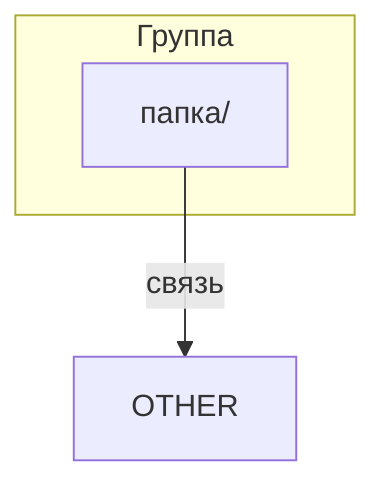

# Стандарт README

Формат и шаблон для двух типов README: папок проекта и папок инструкций.

**Полезные ссылки:**
- [Инструкции для .structure](./README.md)
- [SSOT структуры проекта](../README.md)

**Связанные документы:**

| Тип | Документ |
|-----|----------|
| Стандарт | Этот документ |
| Валидация | [validation-structure.md](./validation-structure.md) |
| Создание | [create-structure.md](./create-structure.md) |
| Модификация | [modify-structure.md](./modify-structure.md) | 

## Оглавление

- [1. Два типа README](#1-два-типа-readme)
- [2. README папок проекта](#2-readme-папок-проекта)
  - [Раздел "Frontmatter"](#раздел-frontmatter)
  - [Раздел "Заголовок"](#раздел-заголовок)
  - [Раздел "Оглавление"](#раздел-оглавление)
  - [Раздел "Содержание"](#раздел-содержание)
  - [Раздел "Дерево"](#раздел-дерево)
  - [Раздел "Диаграмма"](#раздел-диаграмма)
- [3. README папок инструкций](#3-readme-папок-инструкций)
  - [Раздел "Заголовок"](#раздел-заголовок-1)
  - [Раздел "Оглавление"](#раздел-оглавление-1)
  - [Раздел "Содержание"](#раздел-содержание-1)
  - [Раздел "Ресурсы"](#раздел-ресурсы)
- [4. Правила работы с контекстными ссылками](#4-правила-работы-с-контекстными-ссылками)
  - [Формат блока](#формат-блока)
  - [В README папок проекта](#в-readme-папок-проекта)
  - [В README папок инструкций](#в-readme-папок-инструкций)
  - [Правило формирования текста](#правило-формирования-текста)
- [5. Требования для обновления при изменении структуры](#5-требования-для-обновления-при-изменении-структуры)

---

## 1. Два типа README

Если путь к README содержит `.instructions/` — это README папки инструкций.
Всё остальное — README папки проекта.

---

## 2. README папок проекта

**README папки проекта** — описывает зону ответственности папки: что внутри, какие подпапки, за что отвечает.

**Структура каждого файла должна содержать разделы:**

1. Раздел "Frontmatter"
   - Секция "Frontmatter"
2. Раздел "Заголовок"
   - Секция "Заголовок"
   - Секция "Расширенное описание"
   - Секция "Полезные ссылки"
3. Раздел "Оглавление"
   - Секция "Оглавление"
4. Раздел "Содержание"
   - Секция "Папки"
     - Секция "Краткое описание"
     - Секция "Расширенное описание"
   - Секция "Файлы"
     - Секция "Краткое описание"
     - Секция "Расширенное описание"
5. Раздел "Дерево"
   - Секция "Дерево файлов"
   - Секция "Дерево папок"
6. Раздел "Диаграмма"
   - Секция "Диаграмма"

<!-- ======================================== -->
<!-- если есть раздел, то в нём обязательно должна быть секция          -->
<!-- ======================================== -->

---

#### Раздел "Frontmatter"

**Назначение:** Метаданные документа в YAML-формате.

**SSOT:** [standard-frontmatter.md](./standard-frontmatter.md)

#### Раздел "Заголовок"

**Назначение:** Название папки и её зона отвественности в проекте.

**Секция "Заголовок":**
- заполняется в соотвествие с форматом: `# /{папка}/ — {Назначение}`

**Секция "Расширенное описание":**
- Содержит контекст папки: что она содержит, какие файлы, какие папки
- Если папка содержит файлы, то описания функционала этих файлов объединяются, обрабатываются, и выдаются как контекст

**Секция "Полезные ссылки":**
- содержит блок ссылок, с которыми может ознакомиться пользователь или LLM
- правила работы: [4. Правила работы с контекстными ссылками](#4-правила-работы-с-контекстными-ссылками)

#### Раздел "Оглавление"

**Назначение:** Навигация по секциям документа.

**Секция "Оглавление":**
- содержит ссылки на секции раздела "Содержание"
- **структура двухуровневая:** секции верхнего уровня + вложенные элементы
- вложенные элементы — папки/файлы внутри секции (отступ 2 пробела)

```markdown
- [1. {Секция}](#1-секция)
  - [{элемент}](#элемент)
  - [{элемент}](#элемент)
- [2. {Секция}](#2-секция)
```

#### Раздел "Содержание"

**Назначение:** Описание содержимого папки: файлы, вложенные папки и их назначение. Только первый уровень вложенности.

**Секция "Папки":**
- заголовок: `## 1. {имя}/`
- ссылка: `### 🔗 [{имя}/]({путь}/README.md)`
- вложенные секции:
  - **Секция "Краткое описание":** одно предложение, формат: `**{Описание}.**`
  - **Секция "Расширенное описание":** 1-2 предложения связного текста, объединяющего контекст содержимого папки (первый уровень вложенности). Упоминать подпапки и файлы в формате `имя/` и `имя.ext`.

**Секция "Файлы":**
- заголовок: `## 2. {имя}`
- ссылка: `### 🔗 [{имя}]({путь})`
- вложенные секции:
  - **Секция "Краткое описание":** одно предложение, формат: `**{Описание}.**`
  - **Секция "Расширенное описание":** 1-2 предложения связного текста, описывающего функционал и назначение файла

#### Раздел "Дерево"

**Назначение:** Визуальное представление структуры папки.

**Правила:**
- Соблюдать алфавитный порядок
- Добавить комментарий с назначением
- Если есть подпапки — добавить их тоже
- Комментарии выровнены по столбцу
- Вложенные папки — отступ 2 пробела в комментарии
- TODO-папки: `# Стандарты (TODO)`

**Секция "Дерево файлов":**

```
/{папка}/
├── {файл1}            # Комментарий
└── {файл2}            # Комментарий
```

**Секция "Дерево папок":**

```
/{папка}/
├── {подпапка}/        # Комментарий
│   └── {вложенная}/   #   Комментарий (с отступом)
└── {подпапка2}/       # Комментарий
```

#### Раздел "Диаграмма"

**Назначение:** Визуальная схема связей между папками проекта.

**Секция "Диаграмма":**
- формат: mermaid `graph TD`
- группировка папок по subgraph (Инфраструктура, Конфигурация, Код, Документация)
- стрелки показывают зависимости и потоки данных



**Плейсхолдеры:** замени `Группа`, `папка/`, `связь`, `NAME`, `OTHER` на реальные значения.

---

<!-- ======================================== -->
<!-- README ПАПОК ИНСТРУКЦИЙ — НИЖЕ          -->
<!-- ======================================== -->

## 3. README папок инструкций

**README папки инструкций** — индекс инструкций для области: какие инструкции есть, оглавление каждой, связанные скиллы.

**Эталон:**
- [/.structure/.instructions/README.md](./README.md)

**Структура каждого файла должна содержать разделы:**

1. Раздел "Frontmatter"
   - Секция "Frontmatter"
2. Раздел "Заголовок"
   - Секция "Заголовок"
   - Секция "Полезные ссылки"
   - Секция "Содержание"
3. Раздел "Оглавление"
   - Секция "Таблица"
   - Секция "Дерево"
4. Раздел "Содержание"
   - Секция "Инструкция"
   - Секция "Подпапка"
5. Раздел "Ресурсы"
   - Секция "Обязательные обновления"
   - Секция "Шаблоны"
   - Секция "Скиллы"

---

#### Раздел "Frontmatter"

**Назначение:** Метаданные документа в YAML-формате.

**SSOT:** [standard-frontmatter.md](./standard-frontmatter.md)

---

#### Раздел "Заголовок"

**Назначение:** Название и краткое описание папки инструкций.

**Секция "Заголовок":**
- формат: `# Инструкции /{путь}/`
- под заголовком: одно предложение-описание

**Секция "Полезные ссылки":**
- цепочка до родительского README
- правила: [4. Правила работы с контекстными ссылками](#4-правила-работы-с-контекстными-ссылками) (раздел "В README папок инструкций")

**Секция "Содержание":**
- темы инструкций через запятую
- формат: `**Содержание:** {тема1}, {тема2}, {тема3}.`

#### Раздел "Оглавление"

**Назначение:** Навигация по инструкциям и ресурсам.

**Секция "Таблица":**
- формат: таблица `| Секция | Инструкция | Описание |`
- колонки: ссылка на секцию, ссылка на файл, краткое описание

**Секция "Дерево":**
- ASCII-дерево файлов папки инструкций
- комментарии к каждому файлу

#### Раздел "Содержание"

**Назначение:** Детальное описание каждой инструкции и подпапки.

**Секция "Инструкция":**
- заголовок: `# {N}. {Тема}`
- описание: одно предложение из description frontmatter
- **Оглавление:** ссылки на разделы файла
- **Инструкция:** ссылка на файл

```markdown
# 1. {Тема}

{Описание — одно предложение.}

**Оглавление:**
- [{Раздел}](./{file}.md#раздел)

**Инструкция:** [{file}.md](./{file}.md)
```

**Секция "Подпапка":**
- заголовок: `# {N}. {Подпапка}`
- описание: одно предложение
- **Индекс:** ссылка на README подпапки

```markdown
# 2. {Подпапка}

{Описание подпапки.}

**Индекс:** [{subfolder}/README.md](./{subfolder}/README.md)
```

#### Раздел "Ресурсы"

**Назначение:** Скиллы и скрипты для автоматизации.

**Секция "Скиллы":**
- таблица `| Скилл | Назначение | Инструкция |`
- если нет: `**Скиллы для этой области отсутствуют.**`

```markdown
# N. Скиллы

| Скилл | Назначение | Инструкция |
|-------|------------|------------|
| [/{skill}](/.claude/skills/{skill}/SKILL.md) | {описание} | [{инструкция}.md](./{инструкция}.md) |
```

**Секция "Скрипты":**
- таблица `| Скрипт | Назначение | Инструкция |`
- если нет: `**Скрипты для этой области отсутствуют.**`

```markdown
# N. Скрипты

| Скрипт | Назначение | Инструкция |
|--------|------------|------------|
| [{script}.py](./.scripts/{script}.py) | {описание} | [{инструкция}.md](./{инструкция}.md) |
```

---

## 4. Правила работы с контекстными ссылками

Блок "Полезные ссылки" в шапке документов для навигации по иерархии.

### Формат блока

```markdown
**Полезные ссылки:**
- [{текст}]({ссылка})
- [{текст}]({ссылка})
```

**Правило:** каждая ссылка на отдельной строке, маркированный список.

### В README папок проекта

Цепочка ссылок до структуры проекта.

| Уровень | Цепочка ссылок |
|---------|----------------|
| 1 (корневой) | → `/.structure/README.md` |
| 2 | → `../README.md` → `/.structure/README.md` |
| 3+ | → `../README.md` → `../../README.md` → ... → `/.structure/README.md` |

**Примеры:**

```markdown
<!-- Уровень 1: /config/ -->
**Полезные ссылки:**
- [Структура проекта](/.structure/README.md)

<!-- Уровень 2: /.claude/skills/ -->
**Полезные ссылки:**
- [Claude Code окружение](../README.md)
- [Структура проекта](/.structure/README.md)

<!-- Уровень 3: /.claude/skills/spec-create/ -->
**Полезные ссылки:**
- [Скиллы Claude](../README.md)
- [Claude Code окружение](../../README.md)
- [Структура проекта](/.structure/README.md)
```

### В README папок инструкций

Цепочка до README родительской папки (не до структуры проекта).

| Уровень | Тип файла | Ссылки |
|---------|-----------|--------|
| 1 | README инструкций | → `../README.md` |
| 2 | Файл инструкции | → `./README.md` → `../README.md` |
| 2 | README подпапки | → `../README.md` → `../../README.md` |
| 3 | Файл в подпапке | → `./README.md` → `../README.md` → `../../README.md` |

**Примеры:**

```markdown
<!-- README инструкций: /.structure/.instructions/README.md -->
**Полезные ссылки:**
- [Структура проекта](../README.md)

<!-- Файл инструкции: /.structure/.instructions/standard-readme.md -->
**Полезные ссылки:**
- [Инструкции для .structure](./README.md)
- [Структура проекта](../README.md)

<!-- Файл в подпапке: /.structure/.instructions/.scripts/validate-structure.py -->
**Полезные ссылки:**
- [Инструкции для .structure](../README.md)
- [Структура проекта](../../README.md)
```

### Правило формирования текста

Текст ссылки описывает контекст документа, на который она ведёт.

| Позиция | Принцип | Пример |
|---------|---------|--------|
| Первая | Контекст родителя | `Claude Code окружение`, `Скиллы Claude` |
| Промежуточные | Контекст предка | `Инфраструктура платформы` |
| Последняя | Фиксированный | `Структура проекта` |

**Принцип:** текст ссылки = краткое описание того, что найдёт читатель.

---

## 5. Требования для обновления при изменении структуры

При создании или изменении папок/файлов необходимо обновить связанные документы.

### 5.1. Обновление SSOT структуры

| Действие | Что обновить в `/.structure/README.md` |
|----------|----------------------------------------|
| Создание папки | Добавить секцию, оглавление, дерево |
| Удаление папки | Удалить секцию, оглавление, дерево |
| Переименование | Обновить секцию, оглавление, дерево |

### 5.2. Обновление README родительской папки

> **ПРАВИЛО:** При добавлении папки или файла — обновить README родительской папки.

| Действие | Что обновить в README родителя |
|----------|--------------------------------|
| Создание подпапки | Секция "Папки" — добавить описание, Дерево — добавить ветку |
| Создание файла | Секция "Файлы" — добавить описание, Дерево — добавить запись |
| Удаление подпапки | Секция "Папки" — удалить описание, Дерево — удалить ветку |
| Удаление файла | Секция "Файлы" — удалить описание, Дерево — удалить запись |
| Переименование | Обновить ссылки и названия в секциях и дереве |

### 5.3. Обновление ссылок

| Действие | Что обновить |
|----------|--------------|
| Переименование | Все ссылки на старое имя в markdown-файлах |
| Перемещение | Все ссылки на старый путь, цепочки "Полезные ссылки" |

**Связанные документы:**
- [create-structure.md](./create-structure.md) — воркфлоу создания
- [modify-structure.md](./modify-structure.md) — воркфлоу изменения
