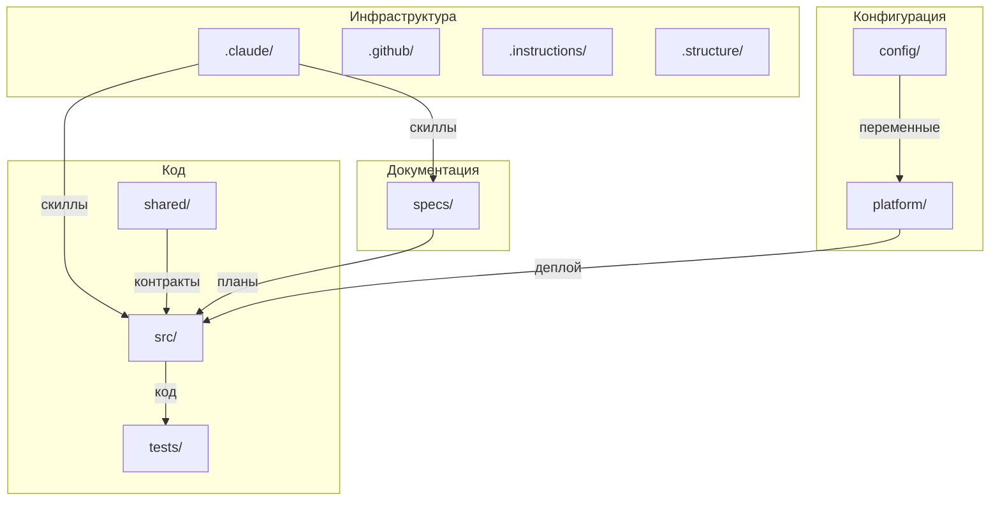

# /.structure/ — Структура проекта

> **SSOT** — единый источник правды о структуре папок проекта.

Корневые папки: инструменты Claude (`.claude/`), GitHub платформа (`.github/`), мета-инструкции (`.instructions/`), структура проекта (`.structure/`), конфигурации (`config/`), инфраструктура (`platform/`), общий код (`shared/`), спецификации (`specs/`), исходный код (`src/`), тесты (`tests/`). Корневые файлы: `.gitignore`, `CLAUDE.md`, `Makefile`, `README.md`.

**Полезные ссылки:**
- [Точка входа Claude](../CLAUDE.md)
- [Главный README](../README.md)

---

## Оглавление

- [1. Корневые папки](#1-корневые-папки)
  - [.claude/](#-claude)
  - [.github/](#-github)
  - [.instructions/](#-instructions)
  - [.structure/](#-structure)
  - [config/](#-config)
  - [platform/](#-platform)
  - [shared/](#-shared)
  - [specs/](#-specs)
  - [src/](#-src)
  - [tests/](#-tests)
- [2. Корневые файлы](#2-корневые-файлы)
  - [.gitignore](#-gitignore)
  - [CLAUDE.md](#-claudemd)
  - [Makefile](#-makefile)
  - [README.md](#-readmemd)
- [3. Дерево](#3-дерево)
- [4. Диаграмма](#4-диаграмма)

---

## 1. Корневые папки

### 🔗 [.claude/](../.claude/README.md)

**Инструменты Claude Code.**

Инструкции для написания скиллов (`.instructions/skills/`), автономные агенты (`agents/`), черновики и SSOT-документы (`drafts/`), скиллы автоматизации — 14 команд для управления инструкциями, скиллами, ссылками и спецификациями (`skills/`), настройки Claude (`settings.json`).

### 🔗 [.github/](../.github/README.md)

**GitHub платформа.**

Стандарты работы с GitHub (`.instructions/`), шаблоны для создания Issues (`ISSUE_TEMPLATE/`), CI/CD pipelines — автоматизация сборки, тестирования и деплоя (`workflows/`).

### 🔗 [.instructions/](../.instructions/README.md)

**Мета-инструкции.**

Стандарты написания инструкций: структура, типы, валидация, статусы, связи между инструкциями, шаблоны, воркфлоу создания/обновления/деактивации.

### 🔗 .structure/ (этот файл)

**SSOT структуры проекта.**

Инструкции по работе со структурой (`.instructions/`), единый источник истины о структуре папок проекта (этот файл).

### 🔗 [config/](../config/README.md)

**Конфигурации окружений.**

Стандарты конфигураций (`.instructions/`), YAML-файлы окружений — development, staging, production, feature flags для управления функциональностью (`feature-flags/`).

### 🔗 [platform/](../platform/README.md)

**Общая инфраструктура.**

Стандарты инфраструктуры (`.instructions/`), Docker-конфигурации (`docker/`), API Gateway — Traefik/Nginx (`gateway/`), Kubernetes манифесты (`k8s/`), мониторинг — Grafana дашборды, Loki логи, Prometheus метрики (`monitoring/`), операционные runbooks (`runbooks/`), инфраструктурные скрипты деплоя и бэкапа (`scripts/`).

### 🔗 [shared/](../shared/README.md)

**Общий код между сервисами.**

Стандарты общего кода (`.instructions/`), статические ресурсы — иконки, шрифты (`assets/`), API контракты — OpenAPI для REST, Protobuf для gRPC (`contracts/`), схемы событий для межсервисного взаимодействия (`events/`), локализация — переводы интерфейса (`i18n/`), общие библиотеки — errors, logging, validation (`libs/`).

### 🔗 [specs/](../specs/README.md)

**Спецификации проекта.**

Инструкции по написанию specs (`.instructions/`), дискуссии по архитектурным решениям (`discussions/`), глоссарий терминов проекта (`glossary.md`), импакт-анализ изменений (`impact/`), спецификации сервисов — ADR (архитектурные решения) и планы реализации (`services/{service}/adr/`, `services/{service}/plans/`).

### 🔗 [src/](../src/README.md)

**Исходный код сервисов.**

Стандарты разработки (`.instructions/`), сервисы проекта (`{service}/`) — каждый содержит: версионированный backend API с handlers, routes, services (`backend/v*/`), общий код между версиями (`backend/shared/`), health endpoints (`backend/health/`), схему БД и миграции (`database/`), документацию сервиса (`docs/`), клиентский код (`frontend/`), unit и integration тесты сервиса (`tests/`).

### 🔗 [tests/](../tests/README.md)

**Системные тесты.**

Стандарты тестирования (`.instructions/`), end-to-end сценарии — полные пользовательские флоу (`e2e/`), общие тестовые данные (`fixtures/`), интеграционные тесты между сервисами (`integration/`), нагрузочные тесты на k6 (`load/`), smoke тесты — быстрая проверка работоспособности (`smoke/`).

---

## 2. Корневые файлы

### 🔗 [.gitignore](../.gitignore)

**Git ignore.**

Файлы и папки, исключённые из системы контроля версий — временные файлы, зависимости, секреты, артефакты сборки.

### 🔗 [CLAUDE.md](../CLAUDE.md)

**Точка входа для Claude.**

Справочная информация о проекте для Claude Code — проверка скиллов, блокирующие пути, структура папок, доступные команды.

### 🔗 [Makefile](../Makefile)

**Команды проекта.**

Унифицированный интерфейс для разработки — `make help` (список команд), `make dev` (запуск), `make test` (тесты), `make lint` (линтинг).

### 🔗 [README.md](../README.md)

**Главный README.**

Описание проекта, быстрый старт для новых разработчиков, ссылки на документацию.

---

## 3. Дерево

```
/
├── .claude/                             # Инструменты Claude
│
│   ├── .instructions/
│   │   └── skills/                      #   Как писать скиллы
│   ├── agents/                          #   Агенты
│   ├── drafts/                          #   Черновики (в git)
│   ├── skills/                          #   Скиллы (14)
│   └── settings.json                    #   Настройки
├── .github/                             # GitHub платформа
│
│   ├── .instructions/                   #   Стандарты GitHub (TODO)
│   ├── ISSUE_TEMPLATE/                  #   Шаблоны Issues
│   └── workflows/                       #   CI/CD pipelines
├── .instructions/                       # Мета: как писать инструкции
│
├── .structure/                          # SSOT структуры проекта
│
│   ├── .instructions/                   #   Как работать со структурой
│   └── README.md                        #   Этот файл
├── config/                              # Конфигурации окружений
│
│   ├── .instructions/                   #   Стандарты конфигураций (TODO)
│   ├── *.yaml                           #   development, staging, production
│   └── feature-flags/                   #   Feature flags
├── platform/                            # Общая инфраструктура
│
│   ├── .instructions/                   #   Стандарты инфраструктуры (TODO)
│   ├── docker/                          #   Docker конфигурации
│   ├── gateway/                         #   API Gateway
│   ├── k8s/                             #   Kubernetes манифесты
│   ├── monitoring/                      #   Мониторинг
│   │   ├── grafana/
│   │   ├── loki/
│   │   └── prometheus/
│   ├── runbooks/                        #   Runbooks
│   └── scripts/                         #   Инфраструктурные скрипты
├── shared/                              # Общий код между сервисами
│
│   ├── .instructions/                   #   Стандарты общего кода (TODO)
│   ├── assets/                          #   Статические ресурсы
│   ├── contracts/                       #   API контракты
│   │   ├── openapi/                     #     REST контракты
│   │   └── protobuf/                    #     gRPC контракты
│   ├── events/                          #   Схемы событий
│   ├── i18n/                            #   Локализация
│   └── libs/                            #   Общие библиотеки
├── specs/                               # Спецификации проекта
│
│   ├── .instructions/                   #   Как писать specs
│   ├── discussions/                     #   Дискуссии: DISC-*.md
│   ├── glossary.md                      #   Глоссарий терминов
│   ├── impact/                          #   Импакт-анализ: IMPACT-*.md
│   └── services/                        #   Спецификации сервисов
├── src/                                 # Исходный код сервисов
│
│   ├── .instructions/                   #   Стандарты разработки (TODO)
│   └── {service}/                       #   Сервисы
├── tests/                               # Системные тесты
│
│   ├── .instructions/                   #   Стандарты тестирования (TODO)
│   ├── e2e/                             #   End-to-end сценарии
│   ├── fixtures/                        #   Общие тестовые данные
│   ├── integration/                     #   Интеграция между сервисами
│   ├── load/                            #   Нагрузочные тесты (k6)
│   └── smoke/                           #   Smoke тесты
├── .gitignore                           # Git ignore
├── CLAUDE.md                            # Точка входа для Claude
├── Makefile                             # Команды (make help)
└── README.md                            # Главный README
```

---

## 4. Диаграмма


