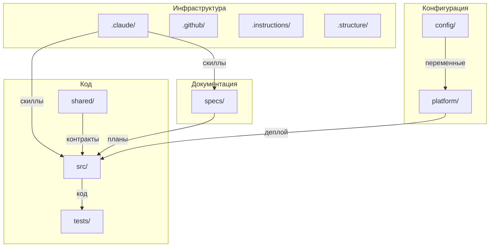

# /.structure/ — Структура проекта

> **SSOT** — единый источник правды о структуре папок проекта.

Корневые папки: инструменты Claude (`.claude/`), GitHub платформа (`.github/`), мета-инструкции (`.instructions/`), структура проекта (`.structure/`), конфигурации (`config/`), инфраструктура (`platform/`), общий код (`shared/`), спецификации (`specs/`), исходный код (`src/`), тесты (`tests/`). Корневые файлы: `.gitignore`, `.pre-commit-config.yaml`, `CHANGELOG.md`, `CLAUDE.md`, `Makefile`, `README.md`.

**Полезные ссылки:**
- [Точка входа Claude](../CLAUDE.md)
- [Главный README](../README.md)

---

## Оглавление

- [1. Корневые папки](#1-корневые-папки)
  - [.claude/](#-claude)
  - [.github/](#-github)
  - [.instructions/](#-instructions)
  - [.structure/](#-structure)
  - [config/](#-config)
  - [platform/](#-platform)
  - [shared/](#-shared)
  - [specs/](#-specs)
  - [src/](#-src)
  - [tests/](#-tests)
- [2. Корневые файлы](#2-корневые-файлы)
  - [.gitignore](#-gitignore)
  - [.pre-commit-config.yaml](#-pre-commit-configyaml)
  - [CHANGELOG.md](#-changelogmd)
  - [CLAUDE.md](#-claudemd)
  - [Makefile](#-makefile)
  - [README.md](#-readmemd)
- [3. Дерево](#3-дерево)
- [4. Диаграмма](#4-диаграмма)

---

## 1. Корневые папки

### 🔗 [.claude/](../.claude/README.md)

**Инструменты Claude Code.**

Инструкции для написания скиллов, rules и агентов (`.instructions/`), скиллы автоматизации — 35 команд для управления инструкциями, скриптами, скиллами, rules, агентами, ссылками, структурой, issues, milestones, labels, ветками, миграциями и ревью (`skills/`), контекстные правила для автозагрузки (`rules/`), автономные агенты (`agents/`), черновики и SSOT-документы (`drafts/`), настройки Claude (`settings.json`).

### 🔗 [.github/](../.github/README.md)

**GitHub платформа.**

Стандарты работы с GitHub (`.instructions/`) — оркестратор workflow, 13 тематических подпапок (issues, pull-requests, review, releases, branches, commits, sync, development, actions, labels, milestones, codeowners, projects), шаблоны Issues (`ISSUE_TEMPLATE/`), шаблон Pull Request (`PULL_REQUEST_TEMPLATE.md`), CI/CD pipelines (`workflows/`), конфигурация code ownership (`CODEOWNERS`), Dependabot (`dependabot.yml`), политика безопасности (`SECURITY.md`), справочник меток (`labels.yml`).

### 🔗 [.instructions/](../.instructions/README.md)

**Мета-инструкции.**

Стандарты написания инструкций: структура, типы, валидация, статусы, связи между инструкциями, шаблоны, воркфлоу создания/обновления/деактивации. Скрипты автоматизации (`.scripts/`), инструкции миграции стандартов (`migration/`).

### 🔗 .structure/ (этот файл)

**SSOT структуры проекта.**

Инструкции по работе со структурой (`.instructions/`), единый источник истины о структуре папок проекта (этот файл).

### 🔗 [config/](../config/README.md)

**Конфигурации окружений.**

Стандарты конфигураций (`.instructions/`), YAML-файлы окружений — development, staging, production, feature flags для управления функциональностью (`feature-flags/`).

### 🔗 [platform/](../platform/README.md)

**Общая инфраструктура.**

Стандарты инфраструктуры (`.instructions/`), Docker-конфигурации (`docker/`), API Gateway — Traefik/Nginx (`gateway/`), Kubernetes манифесты (`k8s/`), мониторинг — Grafana дашборды, Loki логи, Prometheus метрики (`monitoring/`), операционные runbooks (`runbooks/`), инфраструктурные скрипты деплоя и бэкапа (`scripts/`).

### 🔗 [shared/](../shared/README.md)

**Общий код между сервисами.**

Стандарты общего кода (`.instructions/`), статические ресурсы — иконки, шрифты (`assets/`), API контракты — OpenAPI для REST, Protobuf для gRPC (`contracts/`), схемы событий для межсервисного взаимодействия (`events/`), локализация — переводы интерфейса (`i18n/`), общие библиотеки — errors, logging, validation (`libs/`).

### 🔗 [specs/](../specs/README.md)

**Спецификации проекта.**

Инструкции по написанию specs (`.instructions/`), дискуссии по архитектурным решениям (`discussions/`), глоссарий терминов проекта (`glossary.md`), импакт-анализ изменений (`impact/`), спецификации сервисов — ADR (архитектурные решения) и планы реализации (`services/{service}/adr/`, `services/{service}/plans/`).

### 🔗 [src/](../src/README.md)

**Исходный код сервисов.**

Стандарты разработки (`.instructions/`), сервисы проекта (`{service}/`) — каждый содержит: версионированный backend API с handlers, routes, services (`backend/v*/`), общий код между версиями (`backend/shared/`), health endpoints (`backend/health/`), схему БД и миграции (`database/`), документацию сервиса (`docs/`), клиентский код (`frontend/`), unit и integration тесты сервиса (`tests/`).

### 🔗 [tests/](../tests/README.md)

**Системные тесты.**

Стандарты тестирования (`.instructions/`), end-to-end сценарии — полные пользовательские флоу (`e2e/`), общие тестовые данные (`fixtures/`), интеграционные тесты между сервисами (`integration/`), нагрузочные тесты на k6 (`load/`), smoke тесты — быстрая проверка работоспособности (`smoke/`).

---

## 2. Корневые файлы

### 🔗 [.gitignore](../.gitignore)

**Git ignore.**

Файлы и папки, исключённые из системы контроля версий — временные файлы, зависимости, секреты, артефакты сборки.

### 🔗 [.pre-commit-config.yaml](../.pre-commit-config.yaml)

**Pre-commit hooks.**

Конфигурация автоматических проверок перед коммитом — валидация README, rules, скриптов, скиллов, имени ветки.

### 🔗 [CHANGELOG.md](../CHANGELOG.md)

**История изменений.**

Документирование заметных изменений проекта в формате [Keep a Changelog](https://keepachangelog.com/en/1.1.0/).

### 🔗 [CLAUDE.md](../CLAUDE.md)

**Точка входа для Claude.**

Справочная информация о проекте для Claude Code — проверка скиллов, блокирующие пути, структура папок, доступные команды.

### 🔗 [Makefile](../Makefile)

**Команды проекта.**

Унифицированный интерфейс для разработки — `make help` (список команд), `make dev` (запуск), `make test` (тесты), `make lint` (линтинг).

### 🔗 [README.md](../README.md)

**Главный README.**

Описание проекта, быстрый старт для новых разработчиков, ссылки на документацию.

---

## 3. Дерево

```
/
├── .claude/                             # Инструменты Claude Code
│   ├── .instructions/
│   │   ├── agents/                      #   Как писать агентов
│   │   ├── drafts/                      #   Как работать с черновиками
│   │   ├── rules/                       #   Как писать rules
│   │   └── skills/                      #   Как писать скиллы
│   ├── agents/                          #   Конфигурации агентов
│   ├── drafts/                          #   Черновики (в git)
│   │   └── examples/                    #     Эталонные примеры черновиков
│   ├── rules/                           #   Rules для автозагрузки контекста
│   ├── skills/                          #   Скиллы (35)
│   ├── CHANGELOG.md                     #   История изменений .claude/
│   ├── onboarding.md                    #   Руководство для новых участников
│   ├── README.md                        #   Описание .claude/
│   └── settings.json                    #   Настройки
│
├── .github/                             # GitHub платформа
│   ├── .instructions/                   #   Инструкции для работы с GitHub
│   │   ├── actions/                     #     CI/CD и GitHub Actions
│   │   │   └── security/               #       Security (Dependabot, secrets)
│   │   ├── branches/                    #     Стандарт именования веток
│   │   ├── codeowners/                  #     Стандарт CODEOWNERS
│   │   ├── commits/                     #     Стандарт оформления коммитов
│   │   ├── development/                 #     Процесс локальной разработки
│   │   ├── issues/                      #     Стандарт создания Issues
│   │   │   └── issue-templates/         #       Стандарт шаблонов Issues
│   │   ├── labels/                      #     Стандарт системы меток
│   │   ├── milestones/                  #     Стандарт milestones
│   │   ├── projects/                    #     Стандарт GitHub Projects
│   │   ├── pull-requests/               #     Стандарт Pull Requests
│   │   │   └── pr-template/             #       Стандарт шаблона PR
│   │   ├── releases/                    #     Стандарт релизов
│   │   ├── review/                      #     Стандарт code review
│   │   ├── sync/                        #     Стандарт синхронизации веток
│   │   ├── README.md                    #     Индекс инструкций
│   │   └── standard-github-workflow.md  #     Оркестратор GitHub workflow
│   ├── ISSUE_TEMPLATE/                  #   Шаблоны Issues
│   ├── workflows/                       #   CI/CD pipelines
│   ├── CODEOWNERS                       #   Code ownership
│   ├── dependabot.yml                   #   Dependabot конфигурация
│   ├── labels.yml                       #   Справочник меток
│   ├── PULL_REQUEST_TEMPLATE.md         #   Шаблон Pull Request
│   ├── README.md                        #   Описание .github/
│   └── SECURITY.md                      #   Политика безопасности
│
├── .instructions/                       # Мета-инструкции
│   ├── .scripts/                        #   Скрипты автоматизации
│   ├── migration/                       #   Инструкции миграции стандартов
│   └── README.md                        #   Индекс инструкций
│
├── .structure/                          # SSOT структуры проекта
│   ├── .instructions/                   #   Как работать со структурой
│   ├── artifacts.md                     #   Типы артефактов системы
│   ├── initialization.md                #   Инициализация проекта
│   ├── pre-commit.md                    #   Pre-commit хуки
│   ├── quick-start.md                   #   Быстрый старт для LLM
│   ├── ssot.md                          #   Паттерн SSOT
│   └── README.md                        #   Этот файл (SSOT структуры)
│
├── config/                              # Конфигурации окружений
│   ├── .instructions/                   #   Стандарты конфигураций
│   ├── feature-flags/                   #   Feature flags
│   └── README.md                        #   Описание config/
│
├── platform/                            # Общая инфраструктура
│   ├── .instructions/                   #   Стандарты инфраструктуры
│   ├── docker/                          #   Docker конфигурации
│   ├── gateway/                         #   API Gateway
│   ├── k8s/                             #   Kubernetes манифесты
│   ├── monitoring/                      #   Мониторинг
│   │   ├── grafana/
│   │   ├── loki/
│   │   └── prometheus/
│   ├── scripts/                         #   Инфраструктурные скрипты
│   └── README.md                        #   Описание platform/
│
├── shared/                              # Общий код между сервисами
│   ├── .instructions/                   #   Стандарты общего кода
│   ├── assets/                          #   Статические ресурсы
│   ├── contracts/                       #   API контракты
│   │   ├── openapi/                     #     REST контракты
│   │   └── protobuf/                    #     gRPC контракты
│   ├── events/                          #   Схемы событий
│   ├── i18n/                            #   Локализация
│   ├── libs/                            #   Общие библиотеки
│   └── README.md                        #   Описание shared/
│
├── specs/                               # Спецификации проекта
│   ├── .instructions/                   #   Как писать specs
│   ├── discussions/                     #   Дискуссии: DISC-*.md
│   ├── impact/                          #   Импакт-анализ: IMPACT-*.md
│   ├── services/                        #   Спецификации сервисов
│   ├── glossary.md                      #   Глоссарий терминов
│   └── README.md                        #   Описание specs/
│
├── src/                                 # Исходный код сервисов
│   ├── .instructions/                   #   Стандарты разработки
│   └── README.md                        #   Описание src/
│
├── tests/                               # Системные тесты
│   ├── .instructions/                   #   Стандарты тестирования
│   ├── e2e/                             #   End-to-end сценарии
│   ├── fixtures/                        #   Общие тестовые данные
│   ├── integration/                     #   Интеграция между сервисами
│   ├── load/                            #   Нагрузочные тесты (k6)
│   ├── smoke/                           #   Smoke тесты
│   └── README.md                        #   Описание tests/
│
├── .gitignore                           # Git ignore
├── .pre-commit-config.yaml              # Pre-commit hooks
├── CHANGELOG.md                         # История изменений
├── CLAUDE.md                            # Точка входа для Claude
├── Makefile                             # Команды (make help)
└── README.md                            # Главный README
```

---

## 4. Диаграмма



---

## Концептуальные документы

- [Инициализация](./initialization.md) — установка зависимостей после клонирования
- [SSOT](./ssot.md) — паттерн единого источника истины
- [Артефакты системы](./artifacts.md) — типы артефактов и их стандарты
- [Quick Start](./quick-start.md) — быстрое введение для LLM
- [Pre-commit](./pre-commit.md) — автоматическая валидация перед коммитом
