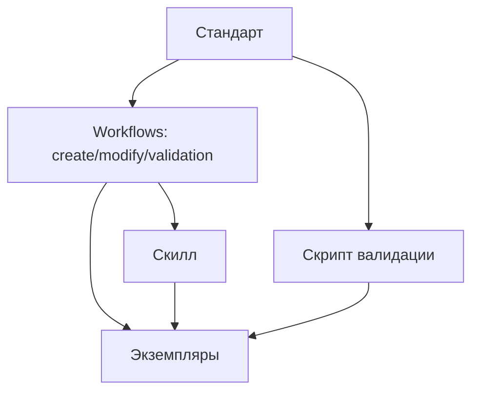

# Артефакты системы

Типы артефактов проекта, их стандарты и инструменты.

## Обзор

**Артефакт** — файл с определённой структурой, подчиняющийся стандарту.

Каждый артефакт имеет:
- **Стандарт** — SSOT-документ с правилами
- **Скиллы** — команды для работы с артефактом
- **Расположение** — где хранятся экземпляры

## Иерархия артефактов

```
┌─────────────────────────────────────────────────────────┐
│                    Структура                            │
│                    (README)                             │
├─────────────────────────────────────────────────────────┤
│     Автономность          │        Контекст            │
│     (Агенты)              │        (Rules)             │
├───────────────────────────┴────────────────────────────┤
│                   Автоматизация                         │
│                    (Скиллы)                             │
├─────────────────────────────────────────────────────────┤
│        Базовый слой: Инструкции + Скрипты              │
├─────────────────────────────────────────────────────────┤
│                   Временные                             │
│                  (Черновики)                            │
└─────────────────────────────────────────────────────────┘
```

## Таблица артефактов

| Артефакт | SSOT (стандарт) | Расположение экземпляров | Скиллы |
|----------|-----------------|--------------------------|--------|
| Инструкция | `/.instructions/standard-instruction.md` | `/.instructions/**/*.md` | `/instruction-*` |
| Скрипт | `/.instructions/standard-script.md` | `**/.scripts/*.py` | `/script-*` |
| Скилл | `/.claude/.instructions/skills/standard-skill.md` | `/.claude/skills/*/SKILL.md` | `/skill-*` |
| Rule | `/.claude/.instructions/rules/standard-rule.md` | `/.claude/rules/*.md` | `/rule-*` |
| Агент | `/.claude/.instructions/agents/standard-agent.md` | `/.claude/agents/*/config.json` | `/agent-*` |
| README | `/.structure/.instructions/standard-readme.md` | `**/README.md` | `/structure-*` |
| Черновик | `/.claude/.instructions/drafts/standard-draft.md` | `/.claude/drafts/*.md` | `/draft-*` |

## Детали артефактов

### 1. Инструкция

**Что это:** Документ, описывающий процесс или стандарт.

**Где хранится:** `/.instructions/` в корне или в папках (`/.instructions/backend/`, `/.instructions/frontend/`).

**Как создать:** `/instruction-create`

**Особенности:**
- Обязательный frontmatter с `standard-version`
- Структура: Оглавление → Шаги → Чек-лист → Примеры

---

### 2. Скрипт

**Что это:** Python-скрипт для автоматизации валидации или операций.

**Где хранится:** `**/.scripts/` рядом с инструкцией.

**Как создать:** `/script-create`

**Особенности:**
- Следует принципам из `standard-principles.md`
- Коды ошибок соответствуют секциям стандарта

---

### 3. Скилл

**Что это:** Команда для выполнения типовой операции.

**Где хранится:** `/.claude/skills/{skill-name}/SKILL.md`

**Как создать:** `/skill-create`

**Особенности:**
- Вызывается через `/skill-name`
- Содержит воркфлоу и ссылку на SSOT-инструкцию

---

### 4. Rule

**Что это:** Контекстное правило, автоматически загружаемое при работе с файлами.

**Где хранится:** `/.claude/rules/*.md`

**Как создать:** `/rule-create`

**Особенности:**
- Загружается автоматически по glob-паттерну
- Краткие императивные указания

---

### 5. Агент

**Что это:** Помощник для автономных задач через Task tool.

**Где хранится:** `/.claude/agents/{agent-name}/config.json`

**Как создать:** `/agent-create`

**Особенности:**
- Запускается через `Task` с `subagent_type`
- Имеет доступ к ограниченному набору инструментов

---

### 6. README (структура)

**Что это:** Документ, описывающий папку проекта.

**Где хранится:** В каждой значимой папке.

**Как создать:** `/structure-create` (создаёт папку с README)

**Особенности:**
- Обязательные секции: Назначение, Структура, Связи
- Синхронизирован с `/.structure/structure.json`

---

### 7. Черновик

**Что это:** Временный документ для исследований и планирования.

**Где хранится:** `/.claude/drafts/`

**Как валидировать:** `/draft-validate`

**Особенности:**
- Frontmatter опционален
- Именование: `YYYY-MM-DD-topic.md`
- Не требует формального процесса создания

## Связи между артефактами



## Связанные документы

- [SSOT](./ssot.md) — паттерн единого источника истины
- [Quick Start](./quick-start.md) — быстрое введение
