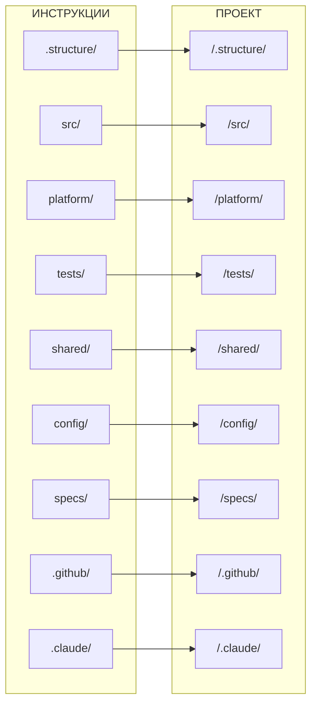

# Маппинг: Инструкции ↔ Папки проекта

---

## Таблица маппинга

| Инструкция | Папка проекта | Описание |
|------------|---------------|----------|
| `.structure/` | `/.structure/` | Правила организации структуры |
| `src/` | `/src/{service}/` | Разработка сервисов |
| `src/api/` | `/src/{service}/backend/v*/` | Проектирование API |
| `src/data/` | `/src/{service}/backend/` | Форматы данных |
| `src/database/` | `/src/{service}/database/` | База данных |
| `src/dev/` | `/src/{service}/` | Локальная разработка |
| `src/health/` | `/src/{service}/backend/health/` | Health checks |
| `src/resilience/` | `/src/{service}/backend/` | Устойчивость |
| `src/security/` | `/src/{service}/backend/` | Безопасность |
| `src/testing/` | `/src/{service}/tests/` | Тестирование сервиса |
| `src/frontend/` | `/src/{service}/frontend/` | Клиентский код |
| `src/docs/` | `/src/{service}/docs/` | Документация сервиса |
| `platform/` | `/platform/` | Инфраструктура |
| `platform/observability/` | `/platform/monitoring/` | Наблюдаемость |
| `platform/docs/` | `/platform/docs/`, `/platform/runbooks/` | Документация, runbooks |
| `tests/` | `/tests/` | Системные тесты |
| `shared/` | `/shared/` | Общий код |
| `shared/docs/` | `/shared/docs/` | Документация общего кода |
| `config/` | `/config/` | Конфигурации |
| `specs/` | `/specs/` | Спецификации |
| `.github/` | `/.github/` | GitHub платформа |
| `.github/issues/` | `/.github/ISSUE_TEMPLATE/` | GitHub Issues |
| `.claude/` | `/.claude/` | Claude-сущности |
| `.github/git/` | — | Git правила (commits, branches, review) |
| `.claude/.instructions/` | `/.claude/.instructions/` | Правила инструкций |
| `.structure/links/` | — | Правила ссылок |
| `.claude/skills/` | `/.claude/skills/` | Правила скиллов |
| `.claude/agents/` | `/.claude/agents/` | Правила агентов |
| `.claude/scripts/` | `/.claude/scripts/` | Правила скриптов |
| `.claude/state/` | `/.claude/state/` | Правила состояний |
| `.claude/drafts/` | `/.claude/drafts/` | Правила черновиков |

---

## Диаграмма связей

**Принцип:** Инструкция `X/` → Папка `/X/` (зеркальная структура).
