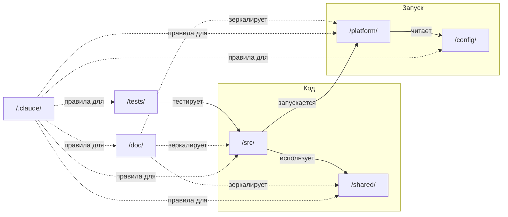

# Project Template

Шаблон fullstack проекта с микросервисной архитектурой.

## Оглавление

- [Документация](#документация)
- [Структура проекта](#структура-проекта)
- [Детальная структура папок](#детальная-структура-папок)
- [Быстрый старт](#быстрый-старт)
- [Статус](#статус)

---

## Документация

| Документ | Назначение |
|----------|------------|
| [CLAUDE.md](CLAUDE.md) | Точка входа для Claude Code |
| [CONTRIBUTING.md](CONTRIBUTING.md) | Руководство для контрибьюторов |
| [SECURITY.md](SECURITY.md) | Политика безопасности |

---

## Структура проекта

```
/
├── .claude/                    # Инструменты Claude Code
├── config/                     # Конфигурации окружений
├── doc/                        # Документация проекта
├── platform/                   # Инфраструктура (Docker, monitoring)
├── shared/                     # Общий код (контракты, библиотеки)
├── src/                        # Исходный код сервисов
├── tests/                      # Системные тесты
│
├── CLAUDE.md                   # Точка входа для Claude
├── CONTRIBUTING.md             # Как внести вклад
├── Makefile                    # Команды проекта
├── README.md                   # Описание проекта (этот файл)
└── SECURITY.md                 # Политика безопасности
```

### Связи между папками



### Принцип разделения

| Папка | Отвечает за | Критерий попадания |
|-------|-------------|-------------------|
| `/src/` | Исполняемый код | Запускается как процесс |
| `/doc/` | Документация | Читается человеком/LLM, не исполняется |
| `/shared/` | Переиспользуемое | Используется 2+ сервисами |
| `/config/` | Настройки окружений | Меняется между dev/staging/prod |
| `/platform/` | Инфраструктура | Не бизнес-логика, а "как запускать" |
| `/tests/` | Системные тесты | Тестирует взаимодействие сервисов |
| `/.claude/` | Инструменты LLM | Используется только Claude |
| `/.github/` | CI/CD | GitHub-специфичное |

| Папка | Назначение | Инструкции |
|-------|------------|------------|
| `/.claude/` | Инструменты Claude Code | [/.claude/instructions/tools/](/.claude/instructions/tools/) |
| `/config/` | Конфигурации окружений | [/.claude/instructions/config/](/.claude/instructions/config/) |
| `/doc/` | Документация | [/.claude/instructions/doc/](/.claude/instructions/doc/) |
| `/platform/` | Инфраструктура | [/.claude/instructions/platform/](/.claude/instructions/platform/) |
| `/shared/` | Общий код | [/.claude/instructions/shared/](/.claude/instructions/shared/) |
| `/src/` | Исходный код сервисов | [/.claude/instructions/src/](/.claude/instructions/src/) |
| `/tests/` | Системные тесты | [/.claude/instructions/tests/](/.claude/instructions/tests/) |

---

## Детальная структура папок

### /.claude/ — Инструменты Claude

```
/.claude/
├── agents/                     # Агенты (специализированные помощники)
│   └── {agent-name}.md
│
├── discussions/                # Дискуссии и заметки
│   └── YYYY-MM-DD-{topic}.md
│
├── instructions/               # Инструкции для LLM
│   ├── README.md               # Индекс инструкций
│   ├── config/                 # Правила конфигураций
│   ├── doc/                    # Правила документации
│   ├── git/                    # Правила Git
│   ├── platform/               # Правила инфраструктуры
│   ├── shared/                 # Правила общего кода
│   ├── src/                    # Правила разработки
│   ├── tests/                  # Правила тестирования
│   └── tools/                  # Правила инструментов
│
├── scripts/                    # Python скрипты для автоматизации
│
├── skills/                     # Скиллы (команды автоматизации)
│   └── {skill-name}/
│       ├── SKILL.md            # Описание скилла
│       └── tests.md            # Тесты скилла
│
├── state/                      # Состояние (локальное, не в git)
│
└── templates/                  # SSOT шаблоны
```

**Правила:**
- `agents/` — один агент = один файл
- `skills/` — один скилл = одна папка
- `state/` — не коммитится в git

---

### /src/ — Исходный код

```
/src/
└── {service-name}/             # Каждый сервис в отдельной папке
    ├── backend/                # Бэкенд код
    │   ├── handlers/           # HTTP/gRPC handlers
    │   ├── services/           # Бизнес-логика
    │   ├── repositories/       # Работа с данными
    │   └── models/             # Модели данных
    │
    ├── database/               # База данных
    │   ├── migrations/         # Миграции
    │   └── seeds/              # Тестовые данные
    │
    ├── tests/                  # Тесты сервиса
    │   ├── unit/
    │   └── integration/
    │
    ├── Dockerfile
    └── README.md
```

**Примеры сервисов:** `/src/auth/`, `/src/notify/`, `/src/payments/`, `/src/users/`

---

### /doc/ — Документация

```
/doc/
├── README.md                   # Как работать с документацией
├── glossary.md                 # Глоссарий терминов
├── runbooks/                   # Общие runbooks
│
├── src/                        # Зеркало /src/ (документация сервисов)
│   └── {service}/
│       ├── README.md
│       ├── specs/              # ADR, архитектура, планы
│       ├── backend/            # Документация кода
│       └── runbooks/           # Runbooks сервиса
│
├── shared/                     # Зеркало /shared/
└── platform/                   # Зеркало /platform/
```

**Правила:** Зеркалирует структуру `/src/`, `/shared/`, `/platform/`

---

### /platform/ — Инфраструктура

```
/platform/
├── docker/                     # Docker конфигурации
├── gateway/                    # API Gateway
├── monitoring/                 # Prometheus, Grafana, Loki
├── k8s/                        # Kubernetes (если используется)
└── scripts/                    # Инфраструктурные скрипты
```

---

### /shared/ — Общий код

```
/shared/
├── contracts/                  # API контракты (OpenAPI, Protobuf)
├── events/                     # Схемы событий
├── libs/                       # Общие библиотеки
├── assets/                     # Статические ресурсы
└── i18n/                       # Локализация
```

---

### /config/ — Конфигурации

```
/config/
├── development.yaml
├── staging.yaml
├── production.yaml
├── feature-flags/
└── secrets/                    # Только шаблоны (.env.example)
```

**Правила:** Секреты НИКОГДА не коммитятся

---

### /tests/ — Системные тесты

```
/tests/
├── e2e/                        # End-to-end тесты
├── integration/                # Интеграционные тесты (между сервисами)
├── load/                       # Нагрузочные тесты (k6)
├── smoke/                      # Smoke-тесты
└── fixtures/                   # Общие фикстуры
```

**Правила:** Unit-тесты внутри сервиса (`/src/{service}/tests/`)

---

## Быстрый старт

### Требования

- Docker и Docker Compose
- Make
- Git

### Запуск

```bash
# Клонировать репозиторий
git clone <repository-url>
cd project_template

# Инициализация проекта
make init

# Запуск всех сервисов
make dev

# Остановка
make stop
```

### Основные команды

```bash
make help          # Показать все команды
make dev           # Запустить для разработки
make stop          # Остановить сервисы
make test          # Запустить тесты
make build         # Собрать для production
```

---

## Ключевые решения

Сокращённая таблица архитектурных решений проекта:

| Область | Решение |
|---------|---------|
| **API** | REST URL-версионирование (`/api/v1/`), gRPC package versioning |
| **Архитектура** | Database per Service, Docker DNS для discovery |
| **Auth между сервисами** | JWT с service accounts |
| **Gateway** | Traefik (CORS, rate limiting централизованно) |
| **Контракты** | `/shared/contracts/` (REST, gRPC, Events) |
| **Очереди** | События `{service}.{entity}.{action}`, DLQ для failed |
| **Кэширование** | Redis, cache-aside, ключи `{service}:{entity}:{id}` |
| **Observability** | Logs (Loki), Metrics (Prometheus), Traces (Tempo) |
| **Корреляция** | `request_id` + `trace_id` во всех логах |
| **Тесты** | Unit/integration в `/src/{service}/tests/`, e2e/load в `/tests/` |
| **Деплой** | Rolling update по умолчанию, blue-green для критичных |

Полная таблица решений: [CLAUDE.md](CLAUDE.md#ключевые-решения)

---

## Статус

> **Инструкции созданы:** 53 из 53 (100%) ✅

| Папка | Инструкции | Статус |
|-------|------------|:------:|
| `/.claude/` | 6 файлов | ✅ |
| `/config/` | 2 файла | ✅ |
| `/doc/` | 1 файл | ✅ |
| `/platform/` | 10 файлов | ✅ |
| `/shared/` | 5 файлов | ✅ |
| `/src/` | 17 файлов | ✅ |
| `/tests/` | 7 файлов | ✅ |
| `/git/` | 5 файлов | ✅ |

**Архивные папки** (удалить после рефакторинга):
- `.claude_old/`
- `llm_instructions_old/`

Подробнее: [CLAUDE.md](CLAUDE.md)

---

## Лицензия

Проприетарный проект.
