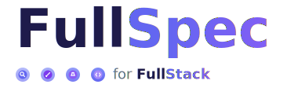

🌐 [English](README.md) | [Русский](README.ru.md)

<picture>
  <source media="(prefers-color-scheme: dark)" srcset="assets/logo-dark.svg">
  <source media="(prefers-color-scheme: light)" srcset="assets/logo.svg">
  
</picture>

<a href="LICENSE"></a>

**Spec-driven development framework for Claude Code.**
71 skills · 23 AI agents · 80+ validation scripts · full lifecycle from idea to release

---

Most AI coding workflows look like this: describe a feature in chat, get code, paste it in, hope it works. Context is lost between sessions. Architecture decisions live in someone's head. Tests come after the fact — or never. Documentation is outdated the moment it's written.

**FullSpec inverts this.** You define *what* you're building and *why* before writing a single line of code. Specifications become the source of truth. Code is written against specs, tested against specs, reviewed against specs. When reality conflicts with the plan, specs update automatically.

The result: every decision is traceable from requirement to deployed code. Documentation stays in sync. Nothing falls through the cracks.

> Internal project files (instructions, standards, specs) are written in Russian. Claude Code understands Russian natively — fork, add `Always respond in English` to `CLAUDE.md`, and everything works as-is.

---

## How It Works: The /chain Process

Two commands orchestrate the development lifecycle. `/chain` for behavior changes (15 tasks, 7 phases). `/hotfix` for bugs and incidents (7 tasks). Release is separate via `/release-create`.

```
/chain "Add user authentication with OAuth2"
```

### Phase 1 — Analysis Chain (4 documents, each validated before the next)

```
  Discussion      What are we building and why?
                  → Requirements (REQ-N), success criteria, scope, risks
                  → Output: specs/analysis/0001-auth-oauth2/discussion.md

  Design          How will the system change?
                  → Services (SVC-N) with API contracts, data models, security
                  → Inter-service integrations (INT-N), system tests (STS-N)
                  → Output: specs/analysis/0001-auth-oauth2/design.md

  Plan Tests      How do we verify it works?
                  → Acceptance scenarios (TC-N) written BEFORE code
                  → Test data, coverage matrix
                  → Output: specs/analysis/0001-auth-oauth2/plan-test.md

  Plan Dev        What tasks, in what order?
                  → Tasks (TASK-N) with dependencies, execution blocks (BLOCK-N)
                  → Subtasks, cross-service coordination
                  → Output: specs/analysis/0001-auth-oauth2/plan-dev.md
```

### Phase 2 — Docs Sync (parallel agents)

```
  service-agent × N      Per-service documentation generated (10 sections each)
  technology-agent × M   Per-tech coding standards created/updated
  system-agent           System overview, conventions, infrastructure docs refreshed
```

### Phase 3 — Launch

```
  GitHub Issues created from TASK-N (with labels, descriptions, links to specs)
  Milestone created for the release
  Feature branch created: 0001-auth-oauth2
  Entire chain status: RUNNING
```

### Phase 4 — Implementation

```
  dev-agent works through tasks block by block (BLOCK-N waves)
  Each task: code → tests → lint → commit (Conventional Commits)
  CONFLICT-CHECK after every commit — if code contradicts specs,
  the process pauses and specs update automatically (cascade)
```

### Phase 5 — Final Validation

```
  /docker-up    Start dev environment, healthcheck all services
  /test         Sync main → unit/integration/e2e tests → lint → build
  /test-ui      Playwright smoke tests with screenshots
  Result: READY or NOT READY report
```

### Phase 6 — Delivery to main

```
  /review       Local code review (code-reviewer agent, 7 criteria, P1/P2/P3)
  /pr-create    PR with auto-collected Issues, labels, description
  /merge        Squash merge, Issues closed, branch cleaned up
```

### Phase 7 — Completion

```
  /chain-done   REVIEW → DONE cascade
                Planned Changes become AS IS in documentation
                system-agent mode=done: cross-chain validation
```

### Phase 8 — Release

```
  /release-create   Tag, GitHub Release, CHANGELOG, release notes
  /post-release     Validation: release artifacts, deploy status
```

---

## What Happens When the Plan Doesn't Survive Contact with Reality

Most spec-driven tools treat specifications as static — write once, implement, done. But real development doesn't work that way.

**FullSpec has CONFLICT detection.** When the dev-agent discovers that the code can't match the spec — an API endpoint needs a different shape, a data model doesn't fit, a performance requirement is unreachable — the system:

1. **Detects** the conflict automatically (after each commit)
2. **Pauses** implementation
3. **Identifies** which spec level is affected (Plan Dev? Design? Discussion?)
4. **Cascades** updates top-down through the spec chain
5. **Resumes** implementation with updated specs

This is not a workaround or an edge case — it's a core part of the process. Specs evolve with the code, not against it.

---

## Quick Start

```bash
# 1. GitHub: "Use this template" → "Create a new repository"

# 2. Clone and setup
git clone https://github.com/{owner}/{repo}.git
cd {repo}
make setup

# 3. Configure Claude's language
#    Add to CLAUDE.md or tell Claude directly:
#    "Always respond in English"

# 4. Start building
/chain
```

> **Tip:** Internal instructions are in Russian, but Claude reads them and responds in any language. Add `Always respond in {your language}` to `CLAUDE.md` — Claude will communicate with you in your language while following Russian-written specs internally.

<details>
<summary><b>Requirements</b></summary>

| Tool | Purpose |
|------|---------|
| [Claude Code](https://claude.ai/code) | AI development assistant |
| Docker + Docker Compose | Service containerization |
| Python 3.8+ | Validation scripts, pre-commit hooks |
| Git + GitHub CLI (`gh`) | Version control, Issues, PRs |

Detailed setup: [initialization.md](.structure/initialization.md)

</details>

---

## What It Gives You

| Aspect | Without specs | With FullSpec |
|--------|--------------|---------------|
| Requirements | Scattered across chat history | Formal document with success criteria (REQ-N) |
| Architecture | Decided ad-hoc during coding | Design with API contracts, data models, security per service |
| Testing | Written after implementation (or never) | Test plan with acceptance scenarios defined before code (TC-N) |
| Task planning | Vague, unordered | Tasks with dependencies, execution blocks, parallel waves |
| Coding standards | Inconsistent across team | 8 per-tech standards auto-generated from Design |
| Documentation | Outdated the day it's written | Living docs synced from specs — 10 sections per service |
| Code review | "Looks good to me" | AI reviewer checks code against Design + Plan Dev (7 criteria) |
| Conflict handling | Realize the plan was wrong, manually fix everything | Automatic detection, cascade spec updates, controlled resume |
| Release | Manual, error-prone | Automated: validation → PR → merge → tag → release notes |

---

## What's Inside

### 71 Skills — a command for every step

Skills are slash commands that automate each part of the process:

| Category | Skills | Examples |
|----------|--------|----------|
| Analysis chain | 14 | `/discussion-create`, `/design-create`, `/plan-test-create`, `/plan-dev-create` |
| Process orchestration | 6 | `/chain`, `/docs-sync`, `/dev-create`, `/chain-done`, `/rollback-chain` |
| Development & testing | 5 | `/commit`, `/test`, `/test-ui`, `/docker-up`, `/principles-validate` |
| GitHub workflow | 14 | `/issue-create`, `/pr-create`, `/review`, `/merge`, `/release-create` |
| Documentation | 12 | `/service-create`, `/technology-create`, `/structure-create`, `/list-search` |
| Project infrastructure | 20 | `/skill-create`, `/agent-create`, `/instruction-create`, `/rule-create`, `/migration-create` |

### 23 AI Agents — parallel workers

Agents handle heavy lifting autonomously and in parallel:

| Agent | What it does |
|-------|-------------|
| `design-agent-first/second` | Generates Design with API contracts, data models, integrations |
| `plantest-agent` | Creates test plan with acceptance scenarios from Design |
| `plandev-agent` | Breaks Design into implementable tasks with dependencies |
| `dev-agent` | Implements 1–2 tasks per iteration: code, tests, commits, CONFLICT-check |
| `code-reviewer` | Reviews code against specs (7 criteria, P1/P2/P3 findings) |
| `service-agent` (× N) | Generates per-service documentation (10 sections) — runs in parallel |
| `technology-agent` (× M) | Creates per-tech coding standards — runs in parallel |
| `system-agent` | Updates system overview, conventions, infrastructure docs |
| `docker-agent` | Manages Docker configs (scaffold, update, validate) |
| `test-ui-agent` | Runs Playwright smoke tests with screenshots |
| `issue-agent` | Mass-creates GitHub Issues from TASK-N |
| `rollback-agent` | Rolls back an analysis chain (5-phase orchestration) |
| + 11 reviewers | Each creator has a reviewer that validates the output |

### 80+ Validation Scripts & 30 Pre-commit Hooks

Every commit is validated automatically:

- Structure consistency (README ↔ structure.json)
- Document format (frontmatter, sections, naming)
- Analysis chain integrity (status transitions, dependencies)
- Per-tech standard compliance
- Security (gitleaks: no secrets in commits)
- Commit message format (Conventional Commits)

### 16 Context Rules

Rules auto-load relevant standards when you edit specific file types:

| Files | Rule loads |
|-------|-----------|
| `*.ts`, `*.tsx` | TypeScript standard, React standard, Tailwind CSS standard |
| `*.py` | FastAPI standard, PostgreSQL standard |
| `*.proto` | Protobuf standard |
| `*.yaml` (OpenAPI) | OpenAPI standard |
| `specs/analysis/**` | Analysis status transitions, chain rules |
| Any file | Core rules (SSOT, skills-first, templates) |

### 8 Per-tech Coding Standards

Auto-generated from Design, enforced by rules and pre-commit hooks:

TypeScript &middot; React &middot; FastAPI &middot; PostgreSQL &middot; OpenAPI &middot; AsyncAPI &middot; Protobuf &middot; Tailwind CSS

---

## Drafts: Persistent Thinking

Claude Code conversations disappear when the session ends. Drafts don't.

Before implementing a complex task, Claude saves a plan to `.claude/drafts/` — a structured document with context, decisions, and a step-by-step Tasklist. This means:

- **Nothing is lost between sessions.** Reopen the project tomorrow — the plan is still there.
- **Any agent can pick up the work.** Each task in the Tasklist references the exact draft section it comes from.
- **Decisions are traceable.** Why was option A chosen over B? It's in the draft.

```
.claude/drafts/
├── 2026-03-16-auth-oauth2.md       # Plan with 8 tasks
├── 2026-03-10-api-performance.md   # Research: 3 alternatives compared
└── examples/                       # Reference templates
```

Drafts are committed to git. They're working files, not final documentation — once the work is done, keep them for history or delete.

---

## Project Structure

Every folder contains `.instructions/` — Claude reads them automatically and applies relevant standards.

```
src/           → Service source code (backend, database, tests)
shared/        → API contracts (OpenAPI, Protobuf, AsyncAPI), events, shared libs
platform/      → Docker, Gateway (Traefik/Nginx), Kubernetes, monitoring (Prometheus/Grafana)
config/        → Environment configs (dev / staging / prod), feature flags
tests/         → System tests (e2e, integration, load, smoke)
specs/         → Specifications: analysis chains + living documentation
  analysis/    →   Discussion → Design → Plan Tests → Plan Dev per feature
  docs/        →   Per-service docs, system overview, per-tech standards
.claude/       → 71 skills, 23 agents, 16 context rules, drafts
.github/       → CI/CD workflows, issue templates, PR template, labels
.instructions/ → Meta-standards: how to write instructions, scripts, skills
```

Full tree: [.structure/README.md](.structure/README.md)

---

## Commands

```bash
make setup      # Install pre-commit hooks (required after cloning)
make help       # List all available commands
make dev        # Start services (docker-compose)
make stop       # Stop services
make test       # Unit & integration tests
make test-e2e   # End-to-end tests
make lint       # Linting
make build      # Production build
make clean      # Full cleanup (docker down -v)
```

---

## Who Is This For

| Scenario | Fit |
|----------|-----|
| Building a new microservice project with Claude Code | Best fit — full infrastructure from day one |
| Team that needs traceable decisions and audit trail | Best fit — every decision linked from requirement to code |
| Solo developer who wants structure without bureaucracy | Good fit — `/chain` handles the process, you focus on code |
| Adding structure to an existing project | Partial — can adopt incrementally, but designed as a template |
| Quick prototype or hackathon (< 1 week) | Works — `/chain` adds structure even to short projects |
| Brownfield (adding to an existing project) | Planned — currently works only as a template for new projects |
| Using Cursor, Copilot, Windsurf | Not tested — built for Claude Code, porting is possible |

---

## How FullSpec Compares

| | FullSpec | [Spec Kit](https://github.com/github/spec-kit) (GitHub) | [Kiro](https://kiro.dev/) (AWS) | [OpenSpec](https://github.com/Fission-AI/OpenSpec) |
|---|---|---|---|---|
| Test planning before code | Yes (Plan Tests phase) | No | No | No |
| Conflict detection (code ↔ specs) | Automatic + cascade update | No | No | No |
| Parallel AI agents | 23 agents | 0 | 1 | 0 |
| Living documentation | Auto-synced from specs | No | No | No |
| GitHub automation (Issues, PR, Review, Release) | Full | No | No | No |
| Pre-commit validation | 30 hooks | 0 | 0 | 0 |
| AI-agnostic | Claude Code only | 20+ agents | Claude/Bedrock only | 20+ agents |
| Price | Free (MIT) | Free (MIT) | $0–200/mo | Free (MIT) |
| Maturity | New | 77k stars | GA (enterprise) | 31k stars |

FullSpec is the most comprehensive but also the most opinionated. If you need AI-agnostic light-touch specs, look at Spec Kit or OpenSpec. If you want a full IDE with AWS integration, look at Kiro. If you want the complete lifecycle automated end-to-end — that's FullSpec.

---

## Documentation

| Document | Contents |
|----------|----------|
| [Initialization](.structure/initialization.md) | Setup guide for Windows, macOS, Linux |
| [Project Structure](.structure/README.md) | Folder tree with descriptions |
| [Quick Start](.structure/quick-start.md) | Minimal context for Claude: SSOT, artifacts, process |
| [Delivery Process](specs/.instructions/standard-process.md) | 8 phases, statuses, skills, agents — the full standard |
| [CLAUDE.md](CLAUDE.md) | Entry point for Claude Code |
| [Glossary](specs/glossary.md) | Project terminology |

---

## Built with FullSpec

I'm collecting projects built with FullSpec from around the world. If you've shipped something using this framework — a side project, a startup MVP, an internal tool — send it to [n.s.evteev@ya.ru](mailto:n.s.evteev@ya.ru). I'll feature it here.

*Your project could be the first on the list.*

---

## Support the Project

FullSpec is free and open source (MIT). If it saves you time, consider supporting development:

<a href="https://boosty.to/nsevteev"></a>

### Consulting

Want to bring AI-driven development into your company? I help teams adopt spec-driven workflows with Claude Code:

- **Project development** — want to build a project with AI? Let's discuss commercial development terms
- **AI development integration** — structured AI-assisted development setup for your team
- **Custom skills & agents** — automation tailored to your codebase and processes
- **Architecture & onboarding** — spec-driven design sessions, team training, production rollout

For any questions, reach out: [n.s.evteev@ya.ru](mailto:n.s.evteev@ya.ru)

---

## License

[MIT](LICENSE)
