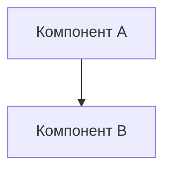

# [ID]_[название_компонента]

<!--
  ШАБЛОН АРХИТЕКТУРЫ
  Это рекомендуемая структура. Адаптируйте под конкретный компонент.
  Удалите этот комментарий после заполнения.
- ->

**Статус:** 🟡 draft | 🔵 in_progress | 🟠 feedback | 🟣 review | 🟢 approved | ⚪ final
**Область:** [UI/Frontend | Backend/API | Auth/Security | Database | Infrastructure | Architecture]
**Дата:** [YYYY-MM-DD]

## Оглавление

- [Цель и контекст](#цель-и-контекст)
- [Связанные документы](#связанные-документы)
- [Принципы и ограничения](#принципы-и-ограничения)
- [Диаграммы](#диаграммы)
- [Интерфейсы и контракты](#интерфейсы-и-контракты)
- [Данные](#данные)
- [Внешние зависимости](#внешние-зависимости)
- [Требования к качеству](#требования-к-качеству)
- [Риски и компромиссы](#риски-и-компромиссы)
- [История изменений](#история-изменений)

## Цель и контекст

[Назначение компонента, какую проблему решает]

## Связанные документы

- **Дискуссии:** [ссылки на 01_discuss/]
- **Ресурсы:** [ссылки на 05_resources/]
- **План реализации:** [ссылка на 06_imp_plans/]

## Принципы и ограничения

- [Принцип 1]
- [Ограничение 1]

## Диаграммы

<!-- Mermaid или ссылка на 03_diagrams/[ID]_[название]/ -->



## Интерфейсы и контракты

### API

| Endpoint | Метод | Описание |
|----------|-------|----------|
| /api/v1/... | GET | [Описание] |

### Форматы данных

```json
{
  "field": "type"
}
```

## Данные

- **Модели:** [описание]
- **Хранение:** [описание]
- **Миграции:** [стратегия]

## Внешние зависимости

| Зависимость | Версия | Назначение |
|-------------|--------|------------|
| [Библиотека] | [x.y.z] | [Для чего] |

## Требования к качеству

- **Доступность:** [требования]
- **Производительность:** [требования]
- **Безопасность:** [требования]

## Риски и компромиссы

| Риск | Вероятность | Влияние | Митигация |
|------|-------------|---------|-----------|
| [Риск 1] | Высокая/Средняя/Низкая | [Описание] | [Действия] |

## История изменений

| Версия | Дата | Автор | Описание | Связанный документ |
|--------|------|-------|----------|-------------------|
| 1.0 | [YYYY-MM-DD] | [Автор] | Первоначальное создание | 01_discuss/[ID]_* |
