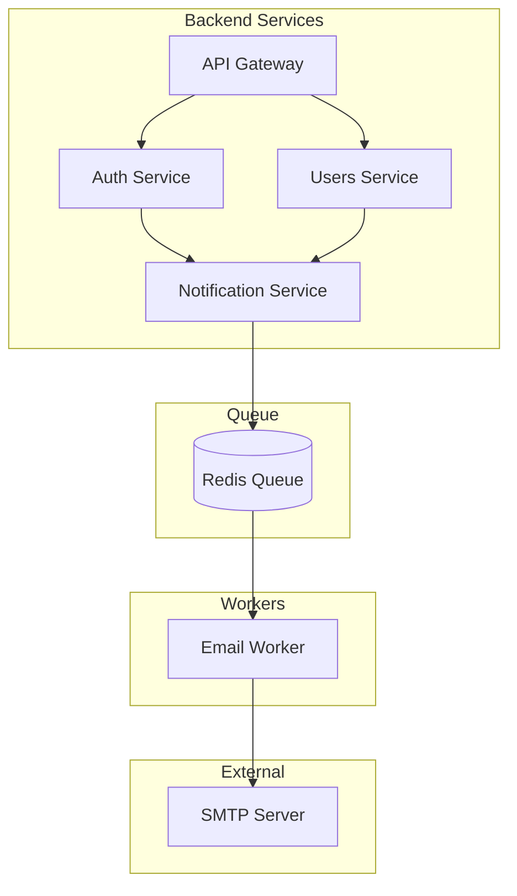
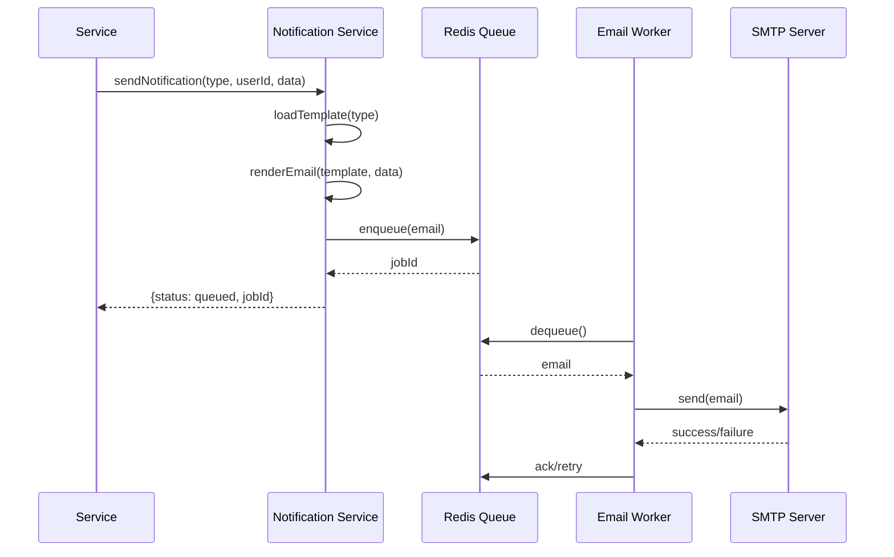

# Тест workflow документации

Тестовый сценарий для проверки полной цепочки создания документации: от дискуссии до задач реализации.

## Цель теста

Проверить работоспособность всех скиллов и процессов создания документации:
- Скиллы: `/discussion`, `/discussion-review`, `/summary-doc`, `/architect`, `/decision`, `/resource`, `/imp-plan`
- Автоматическое обновление индексов (000_*.md)
- Цепочку зависимостей между документами
- Создание задач из плана реализации

## Тестовая тема

**Система email-уведомлений**

Реалистичная задача, которая затрагивает:
- Backend (сервис отправки)
- Database (очередь, шаблоны, логи)
- Frontend (настройки пользователя)
- Infrastructure (SMTP, очереди)

---

## Шаг 1: Создание дискуссии

### Команда
```
/discussion
```

### Входные данные

**Тема:** Система email-уведомлений

**Контекст:**
Пользователи должны получать email-уведомления о важных событиях в системе:
- Регистрация и подтверждение email
- Сброс пароля
- Изменения в аккаунте
- Системные уведомления (от администратора)

**Варианты решения:**

1. **Синхронная отправка** — отправлять email напрямую при событии
   - Плюсы: простота реализации
   - Минусы: блокирует основной поток, ненадёжно при сбоях SMTP

2. **Асинхронная очередь (Redis/RabbitMQ)** — события в очередь, воркер отправляет
   - Плюсы: надёжность, повторные попытки, масштабируемость
   - Минусы: сложнее инфраструктура

3. **Внешний сервис (SendGrid/Mailgun)** — делегировать отправку SaaS
   - Плюсы: надёжность, аналитика, шаблоны
   - Минусы: зависимость от внешнего сервиса, стоимость

**Рекомендуемый вариант:** Вариант 2 (асинхронная очередь) с возможностью подключения внешнего сервиса в будущем.

### Ожидаемый результат

- Файл: `general_docs/01_discuss/001_email_notifications.md`
- Статус: `in_progress`
- Обновлён: `000_discuss.md`

### Зависимые данные
- Индекс дискуссий обновлён

---

## Шаг 2: Ревью и одобрение дискуссии

### Команда
```
/discussion-review
```

### Входные данные

Выбрать **Вариант 2** (асинхронная очередь).

Подтвердить решение.

### Ожидаемый результат

- Статус дискуссии: `review` → `approved`
- Вызван `/summary-doc` — обновлён `000_SUMMARY.md`
- Вызван `/architect` — создана архитектура

### Зависимые данные
- `000_SUMMARY.md` содержит запись о решении
- Архитектура создана автоматически

---

## Шаг 3: Архитектура (автоматически после Шага 2)

### Ожидаемый результат

- Файл: `general_docs/02_architecture/001_email_notifications.md`
- Статус: `draft`
- Содержит:
  - Обзор архитектуры
  - Компоненты системы
  - Диаграммы (ссылки-заглушки)
  - Связь с дискуссией

### Зависимые данные
- Индекс `000_architecture.md` обновлён
- Дискуссия переведена в `final`

---

## Шаг 4: Создание диаграмм (2 штуки)

### Команда
Вручную или через Amy Santiago.

### Диаграмма 1: Архитектура системы

**Файл:** `general_docs/03_diagrams/001_email_system_architecture.md`

**Содержание:**
```
# Диаграмма: Архитектура системы уведомлений

## Метаданные
- Тип: architecture
- Связь: 02_architecture/001_email_notifications.md

## Описание
Общая архитектура системы email-уведомлений.

## Диаграмма


```

### Диаграмма 2: Последовательность отправки

**Файл:** `general_docs/03_diagrams/002_email_send_sequence.md`

**Содержание:**
```
# Диаграмма: Последовательность отправки email

## Метаданные
- Тип: sequence
- Связь: 02_architecture/001_email_notifications.md

## Описание
Последовательность действий при отправке email-уведомления.

## Диаграмма


```

### Ожидаемый результат

- 2 файла в `03_diagrams/`
- Индекс `000_diagrams.md` обновлён
- Ссылки в архитектуре обновлены

### Зависимые данные
- Архитектура содержит ссылки на диаграммы

---

## Шаг 5: Создание ADR

### Команда
```
/decision
```

### Входные данные

Указать архитектуру `001_email_notifications.md`.

### Ожидаемый результат

- Файл: `general_docs/04_decisions/ADR-001_email_queue.md`
- Статус: `accepted`
- Содержит:
  - Контекст решения
  - Рассмотренные варианты
  - Принятое решение
  - Последствия

### Зависимые данные
- Индекс `000_decisions.md` обновлён
- Архитектура обновлена (ссылка на ADR)

---

## Шаг 6: Создание ресурсов

### Команда
```
/resource
```

### Входные данные

Создать ресурсы из ADR:

1. **Backend:** Notification Service
2. **Database:** Таблицы email_queue, email_templates, email_logs
3. **Infrastructure:** Redis конфигурация

### Ожидаемый результат

- Файлы в `05_resources/`:
  - `backend/notification_service.md`
  - `database/email_tables.md`
  - `infra/redis_queue.md`
- Индексы в каждой подпапке обновлены

### Зависимые данные
- ADR содержит ссылки на ресурсы
- Индексы ресурсов обновлены

---

## Шаг 7: Создание плана реализации

### Команда
```
/imp-plan
```

### Входные данные

Указать ADR `ADR-001_email_queue.md`.

### Ожидаемый результат

- Файл: `general_docs/06_plans/PLAN-001_email_notifications.md`
- Содержит:
  - Фазы реализации
  - Задачи с оценками
  - Критерии готовности
  - Зависимости между задачами

### Зависимые данные
- Индекс `000_plans.md` обновлён
- ADR содержит ссылку на план

---

## Шаг 8: Создание задач

### Команда
```bash
make task-new
```

### Входные данные

Создать задачи из плана:

1. **FEAT-XXXXX:** Создать Notification Service (backend)
2. **FEAT-XXXXX:** Создать таблицы email_* (database)
3. **FEAT-XXXXX:** Настроить Redis очередь (infra)
4. **FEAT-XXXXX:** Создать Email Worker (backend)
5. **FEAT-XXXXX:** Добавить настройки уведомлений в UI (frontend)

### Ожидаемый результат

- 5 задач в `llm_tasks/current/`
- Индекс `0_task_index.md` обновлён
- Каждая задача содержит ссылку на план

### Зависимые данные
- План содержит ссылки на задачи
- Счётчик задач обновлён

---

## Проверочный чеклист

После выполнения всех шагов проверить:

### Документы созданы

- [ ] `01_discuss/001_email_notifications.md` (статус: final)
- [ ] `02_architecture/001_email_notifications.md` (статус: approved)
- [ ] `03_diagrams/001_email_system_architecture.md`
- [ ] `03_diagrams/002_email_send_sequence.md`
- [ ] `04_decisions/ADR-001_email_queue.md` (статус: accepted)
- [ ] `05_resources/backend/notification_service.md`
- [ ] `05_resources/database/email_tables.md`
- [ ] `05_resources/infra/redis_queue.md`
- [ ] `06_plans/PLAN-001_email_notifications.md`

### Индексы обновлены

- [ ] `000_discuss.md` — содержит дискуссию
- [ ] `000_SUMMARY.md` — содержит решение
- [ ] `000_architecture.md` — содержит архитектуру
- [ ] `000_diagrams.md` — содержит 2 диаграммы
- [ ] `000_decisions.md` — содержит ADR
- [ ] `000_plans.md` — содержит план

### Цепочка зависимостей

- [ ] Дискуссия → ссылка на архитектуру
- [ ] Архитектура → ссылки на диаграммы
- [ ] Архитектура → ссылка на ADR
- [ ] ADR → ссылки на ресурсы
- [ ] ADR → ссылка на план
- [ ] План → ссылки на задачи

### Задачи созданы

- [ ] 5 задач в `llm_tasks/current/`
- [ ] Все задачи имеют ссылку на план
- [ ] Индекс задач обновлён

---

## Очистка после теста

После проверки удалить тестовые данные:

```bash
# Удалить тестовые документы
rm general_docs/01_discuss/001_email_notifications.md
rm general_docs/02_architecture/001_email_notifications.md
rm general_docs/03_diagrams/001_email_system_architecture.md
rm general_docs/03_diagrams/002_email_send_sequence.md
rm general_docs/04_decisions/ADR-001_email_queue.md
rm -rf general_docs/05_resources/backend/notification_service.md
rm -rf general_docs/05_resources/database/email_tables.md
rm -rf general_docs/05_resources/infra/redis_queue.md
rm general_docs/06_plans/PLAN-001_email_notifications.md

# Удалить тестовые задачи
rm llm_tasks/current/FEAT-*.md  # Осторожно! Удалит все FEAT задачи

# Пересоздать индексы
python scripts/discuss_new.py --rebuild-index
# ... аналогично для других индексов
```

**Или** запустить скрипт очистки (если будет создан):
```bash
python scripts/test_cleanup.py --workflow-test
```

---

## Примечания

1. **Порядок выполнения важен** — каждый шаг зависит от предыдущего
2. **Скиллы вызывают друг друга** — `/discussion-review` автоматически вызывает `/summary-doc` и `/architect`
3. **Индексы обновляются автоматически** — не нужно редактировать вручную
4. **Тест можно прервать** — но тогда останутся частичные данные

## Время выполнения

Ориентировочно: 15-30 минут на полный цикл (зависит от детализации).
