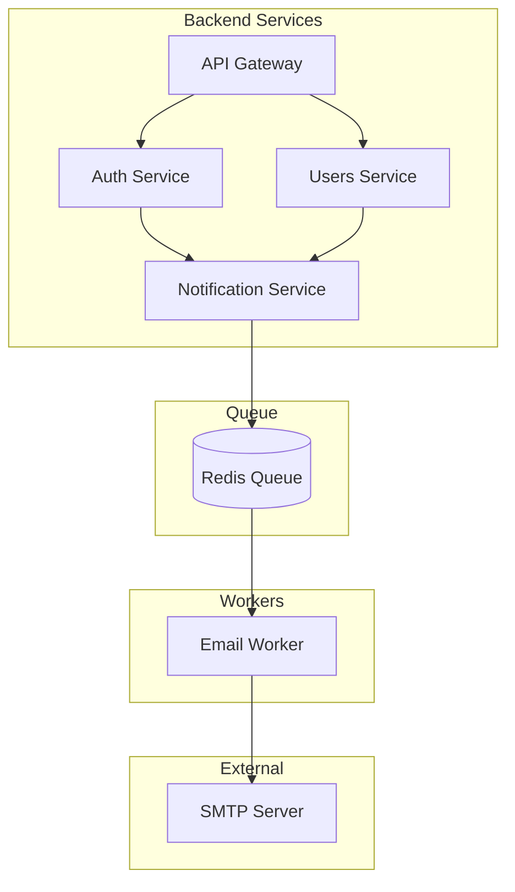
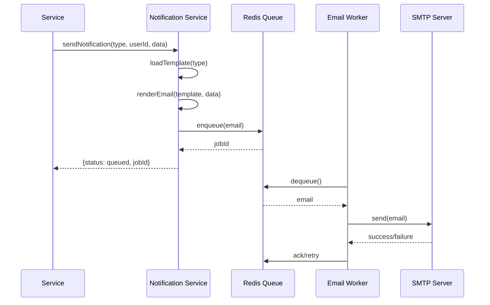

# Тест workflow документации

Тестовый сценарий для проверки полной цепочки создания документации: от дискуссии до задач реализации.

> **ВАЖНО для LLM:** При выполнении теста используй ТОЛЬКО раздел "Входные данные" каждого шага. НЕ ПОДГЛЯДЫВАЙ в разделы "Ожидаемый результат" и "Зависимые данные" — они предназначены для проверки ПОСЛЕ выполнения шага. Формируй решение с нуля, как при реальной задаче. Разделы с ожидаемыми результатами нужны только для финальной верификации.

## Цель теста

Проверить работоспособность всех скиллов и процессов создания документации:
- Скиллы: `/discussion`, `/discussion-review`, `/summary-doc`, `/architect`, `/decision`, `/resource`, `/imp-plan`
- Автоматическое обновление индексов (000_*.md)
- Цепочку зависимостей между документами
- Создание задач из плана реализации

## Тестовая тема

**Система email-уведомлений**

Реалистичная задача, которая затрагивает:
- Backend (сервис отправки)
- Database (очередь, шаблоны, логи)
- Frontend (настройки пользователя)
- Infrastructure (SMTP, очереди)

---

## Шаг 1: Создание дискуссии

### Команда
```
/discussion
```

### Входные данные

**Тема:** Система email-уведомлений

**Контекст:**
Пользователи должны получать email-уведомления о важных событиях в системе:
- Регистрация и подтверждение email
- Сброс пароля
- Изменения в аккаунте
- Системные уведомления (от администратора)

**Требования по компонентам:**

**Backend (Notification Service):**
- API для отправки уведомлений из других сервисов
- Выбор и рендеринг шаблонов
- Интеграция с очередью
- Retry-логика при неудачной отправке
- Логирование всех операций

**Database:**
- `email_queue` — очередь писем (recipient, subject, body, status, attempts, scheduled_at)
- `email_templates` — шаблоны (name, subject_template, body_template, variables)
- `email_logs` — логи отправки (email_id, status, smtp_response, sent_at)
- `user_notification_preferences` — настройки пользователя (user_id, notification_type, enabled, frequency)

**Frontend (настройки пользователя):**
- Страница настроек уведомлений в профиле
- Переключатели для каждого типа уведомлений
- Выбор частоты (мгновенно / дайджест / отключено)
- Превью шаблонов уведомлений

**Infrastructure:**
- Redis для очереди задач (Bull/BullMQ)
- Email Worker — отдельный процесс/контейнер
- SMTP-сервер (Mailhog для dev, внешний для prod)
- Мониторинг очереди (Bull Board)

**Варианты решения:**

1. **Синхронная отправка** — отправлять email напрямую при событии
   - Плюсы: простота, нет дополнительной инфраструктуры
   - Минусы: блокирует основной поток, ненадёжно при сбоях SMTP, нет retry

2. **Асинхронная очередь (Redis + Bull)** — события в очередь, воркер отправляет
   - Плюсы: надёжность, повторные попытки, масштабируемость, отложенная отправка
   - Минусы: сложнее инфраструктура, нужен Redis
   - Компоненты: Notification Service → Redis Queue → Email Worker → SMTP

3. **Внешний сервис (SendGrid/Mailgun)** — делегировать отправку SaaS
   - Плюсы: надёжность, аналитика, готовые шаблоны, webhooks
   - Минусы: зависимость от внешнего сервиса, стоимость, privacy concerns

**Рекомендуемый вариант:** Вариант 2 (асинхронная очередь с Redis + Bull) с возможностью подключения внешнего сервиса в будущем через абстракцию транспорта.

### Ожидаемый результат

- Файл: `general_docs/01_discuss/001_email_notifications.md`
- Статус: `in_progress`
- Обновлён: `000_discuss.md`

### Зависимые данные
- Индекс дискуссий обновлён

---

## Шаг 2: Ревью и одобрение дискуссии

### Команда
```
/discussion-review
```

### Входные данные

Выбрать **Вариант 2** (асинхронная очередь).

Подтвердить решение.

### Ожидаемый результат

- Статус дискуссии: `review` → `approved`
- Вызван `/summary-doc` — обновлён `000_SUMMARY.md`
- Вызван `/architect` — создана архитектура

### Зависимые данные
- `000_SUMMARY.md` содержит запись о решении
- Архитектура создана автоматически

---

## Шаг 3: Архитектура (автоматически после Шага 2)

### Ожидаемый результат

- Файл: `general_docs/02_architecture/001_email_notifications.md`
- Статус: `draft`
- Содержит:
  - Обзор архитектуры
  - Компоненты системы
  - Диаграммы (ссылки-заглушки)
  - Связь с дискуссией

### Зависимые данные
- Индекс `000_architecture.md` обновлён
- Дискуссия переведена в `final`

---

## Шаг 4: Создание диаграмм (2 штуки)

### Команда
Вручную или через Amy Santiago.

### Диаграмма 1: Архитектура системы

**Файл:** `general_docs/03_diagrams/001_email_system_architecture.md`

**Содержание:**
```
# Диаграмма: Архитектура системы уведомлений

## Метаданные
- Тип: architecture
- Связь: 02_architecture/001_email_notifications.md

## Описание
Общая архитектура системы email-уведомлений.

## Диаграмма


```

### Диаграмма 2: Последовательность отправки

**Файл:** `general_docs/03_diagrams/002_email_send_sequence.md`

**Содержание:**
```
# Диаграмма: Последовательность отправки email

## Метаданные
- Тип: sequence
- Связь: 02_architecture/001_email_notifications.md

## Описание
Последовательность действий при отправке email-уведомления.

## Диаграмма


```

### Ожидаемый результат

- 2 файла в `03_diagrams/`
- Индекс `000_diagrams.md` обновлён
- Ссылки в архитектуре обновлены

### Зависимые данные
- Архитектура содержит ссылки на диаграммы

---

## Шаг 5: Создание ADR

### Команда
```
/decision
```

### Входные данные

Указать архитектуру `001_email_notifications.md`.

### Ожидаемый результат

- Файл: `general_docs/04_decisions/ADR-001_email_queue.md`
- Статус: `accepted`
- Содержит:
  - Контекст решения
  - Рассмотренные варианты
  - Принятое решение
  - Последствия

### Зависимые данные
- Индекс `000_decisions.md` обновлён
- Архитектура обновлена (ссылка на ADR)

---

## Шаг 6: Создание ресурсов

### Команда
```
/resource
```

### Входные данные

Создать ресурсы из ADR:

1. **Backend:** Notification Service + Email Worker
2. **Database:** Таблицы email_queue, email_templates, email_logs, user_notification_preferences
3. **Frontend:** Страница настроек уведомлений
4. **Infrastructure:** Redis Queue + Mailhog (dev) + Bull Board

### Ожидаемый результат

- Файлы в `05_resources/`:
  - `backend/notification_service.md`
  - `database/email_tables.md`
  - `frontend/notification_settings.md`
  - `infra/redis_queue.md`
- Индексы в каждой подпапке обновлены

### Зависимые данные
- ADR содержит ссылки на ресурсы
- Индексы ресурсов обновлены

---

## Шаг 7: Создание плана реализации

### Команда
```
/imp-plan
```

### Входные данные

Указать ADR `ADR-001_email_queue.md`.

### Ожидаемый результат

- Файл: `general_docs/06_imp_plans/PLAN-001_email_notifications.md`
- Содержит:
  - Фазы реализации
  - Задачи с оценками
  - Критерии готовности
  - Зависимости между задачами

### Зависимые данные
- Индекс `000_imp_plans.md` обновлён
- ADR содержит ссылку на план

---

## Шаг 8: Создание задач

### Команда
```bash
make task-new
```

### Входные данные

Создать задачи из плана:

1. **FEAT-XXXXX:** Создать Notification Service API (backend)
2. **FEAT-XXXXX:** Создать Email Worker (backend)
3. **FEAT-XXXXX:** Создать таблицы email_queue, email_templates, email_logs (database)
4. **FEAT-XXXXX:** Создать таблицу user_notification_preferences (database)
5. **FEAT-XXXXX:** Настроить Redis + Bull Queue (infra)
6. **FEAT-XXXXX:** Добавить Mailhog для dev-окружения (infra)
7. **FEAT-XXXXX:** Создать страницу настроек уведомлений (frontend)
8. **FEAT-XXXXX:** Интегрировать Auth Service с Notification Service (backend)

### Ожидаемый результат

- 8 задач в `llm_tasks/current/`
- Индекс `0_task_index.md` обновлён
- Каждая задача содержит ссылку на план

### Зависимые данные
- План содержит ссылки на задачи
- Счётчик задач обновлён

---

## Проверочный чеклист

После выполнения всех шагов проверить:

### Документы созданы

- [ ] `01_discuss/001_email_notifications.md` (статус: final)
- [ ] `02_architecture/001_email_notifications.md` (статус: approved)
- [ ] `03_diagrams/001_email_system_architecture.md`
- [ ] `03_diagrams/002_email_send_sequence.md`
- [ ] `04_decisions/ADR-001_email_queue.md` (статус: accepted)
- [ ] `05_resources/backend/notification_service.md`
- [ ] `05_resources/database/email_tables.md`
- [ ] `05_resources/frontend/notification_settings.md`
- [ ] `05_resources/infra/redis_queue.md`
- [ ] `06_imp_plans/PLAN-001_email_notifications.md`

### Индексы обновлены

- [ ] `000_discuss.md` — содержит дискуссию
- [ ] `000_SUMMARY.md` — содержит решение
- [ ] `000_architecture.md` — содержит архитектуру
- [ ] `000_diagrams.md` — содержит 2 диаграммы
- [ ] `000_decisions.md` — содержит ADR
- [ ] `000_imp_plans.md` — содержит план

### Цепочка зависимостей

- [ ] Дискуссия → ссылка на архитектуру
- [ ] Архитектура → ссылки на диаграммы
- [ ] Архитектура → ссылка на ADR
- [ ] ADR → ссылки на ресурсы
- [ ] ADR → ссылка на план
- [ ] План → ссылки на задачи

### Задачи созданы

- [ ] 8 задач в `llm_tasks/current/`
- [ ] Все задачи имеют ссылку на план
- [ ] Индекс задач обновлён

---

## Очистка после теста

После проверки удалить тестовые данные и откатить изменения:

### 1. Удалить тестовые документы

```bash
# Дискуссии
rm general_docs/01_discuss/001_email_notifications.md

# Архитектура
rm general_docs/02_architecture/001_email_notifications.md

# Диаграммы
rm general_docs/03_diagrams/001_email_system_architecture.md
rm general_docs/03_diagrams/002_email_send_sequence.md

# ADR
rm general_docs/04_decisions/ADR-001_email_queue.md

# Ресурсы
rm general_docs/05_resources/backend/notification_service.md
rm general_docs/05_resources/database/email_tables.md
rm general_docs/05_resources/frontend/notification_settings.md
rm general_docs/05_resources/infra/redis_queue.md

# Планы
rm general_docs/06_imp_plans/PLAN-001_email_notifications.md

# Тестовые задачи (осторожно! удалит все FEAT задачи)
rm llm_tasks/current/FEAT-*.md
```

### 2. Очистить индексы от тестовых записей

Удалить записи о тестовых документах из следующих файлов:

```bash
# Индексы папок
general_docs/01_discuss/000_discuss.md
general_docs/02_architecture/000_architecture.md
general_docs/03_diagrams/000_diagrams.md
general_docs/04_decisions/000_decisions.md
general_docs/05_resources/backend/000_backend.md
general_docs/05_resources/database/000_database.md
general_docs/05_resources/frontend/000_frontend.md
general_docs/05_resources/infra/000_infra.md
general_docs/06_imp_plans/000_imp_plans.md

# SUMMARY файлы
general_docs/01_discuss/000_SUMMARY.md
general_docs/02_architecture/000_SUMMARY.md
```

### 3. Откатить счётчики

Вернуть счётчики к состоянию до теста:

```bash
# Файлы со счётчиками (проверить и откатить):
general_docs/01_discuss/.counter        # Счётчик дискуссий
general_docs/02_architecture/.counter   # Счётчик архитектур
general_docs/03_diagrams/.counter       # Счётчик диаграмм
general_docs/04_decisions/.counter      # Счётчик ADR
general_docs/06_imp_plans/.counter      # Счётчик планов
llm_tasks/.counter                      # Счётчик задач
```

**Пример отката счётчика:**
```bash
# Если до теста было 0, вернуть 0
echo "0" > general_docs/01_discuss/.counter
```

### 4. Проверить очистку

После очистки запустить проверку здоровья документации:

```bash
make docs-health
```

### Автоматическая очистка (если скрипт создан)

```bash
python scripts/test_cleanup.py --workflow-test
```

Скрипт должен:
1. Удалить все тестовые документы
2. Очистить индексы от записей тестовых документов
3. Откатить счётчики
4. Запустить проверку здоровья

---

## Примечания

1. **Порядок выполнения важен** — каждый шаг зависит от предыдущего
2. **Скиллы вызывают друг друга** — `/discussion-review` автоматически вызывает `/summary-doc` и `/architect`
3. **Индексы обновляются автоматически** — не нужно редактировать вручную
4. **Тест можно прервать** — но тогда останутся частичные данные
5. **Не подглядывать в результаты** — LLM должен использовать только "Входные данные", формируя решение самостоятельно. Разделы "Ожидаемый результат" и чеклисты — только для верификации после выполнения

## Время выполнения

Ориентировочно: 15-30 минут на полный цикл (зависит от детализации).
