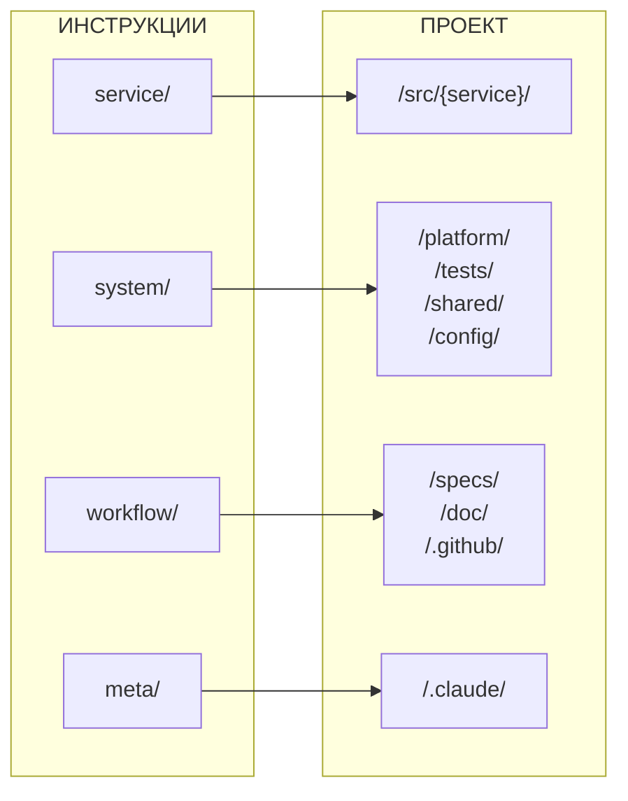

# Новая структура проекта

## Введение

**Цель:** Реорганизация `/.claude/instructions/` для чёткого разделения ответственности по scope.

**Проблема текущей структуры:**
- `services/`, `src/`, `platform/`, `tests/` существуют на одном уровне, хотя логически связаны
- Нет чёткого разделения "что относится к сервису" vs "что относится к системе"
- `git/` и `issues/` смешивают процессы и инструменты

**Решение:** 4 раздела по scope:

| Раздел | Scope | Описание |
|--------|-------|----------|
| `service/` | Один сервис | Разработка внутри `/src/{service}/` |
| `system/` | Вся система | Общая инфраструктура, тесты, конфиги |
| `workflow/` | Процессы | Git, GitHub, спецификации, документация |
| `meta/` | Claude | Правила для инструкций, скиллов, агентов |

**Связанные документы:**
- [migration_plan.md](./migration_plan.md) — план миграции и что меняется

---

## 1. Структура инструкций

```
/.claude/instructions/
│
├── service/                     # Разработка внутри сервиса (scope = service)
│   ├── *.md                     #   Управление сервисом: lifecycle, structure, dependencies
│   ├── api/
│   │   └── *.md                 #   Проектирование API: design, versioning, deprecation, realtime
│   ├── data/
│   │   └── *.md                 #   Форматы данных: errors, logging, validation, pagination
│   ├── database/
│   │   └── *.md                 #   База данных: schema, migrations, transactions, pooling
│   ├── dev/
│   │   └── *.md                 #   Локальная разработка: local, performance, hot reload
│   ├── health/
│   │   └── *.md                 #   Health checks: /health, /ready, graceful shutdown
│   ├── resilience/
│   │   └── *.md                 #   Устойчивость: timeouts, retries, circuit breaker
│   ├── security/
│   │   └── *.md                 #   Безопасность: auth, audit
│   ├── testing/
│   │   └── *.md                 #   Тестирование сервиса: unit, integration
│   └── frontend/
│       └── *.md                 #   Клиентский код (опционально)
│
├── system/                      # Общее для всей системы (scope = system)
│   ├── platform/
│   │   ├── *.md                 #   Инфраструктура: docker, deployment, operations
│   │   └── observability/
│   │       └── *.md             #   Наблюдаемость: logging, metrics, tracing, alerting
│   ├── tests/
│   │   └── *.md                 #   Системные тесты: e2e, load, smoke
│   ├── shared/
│   │   └── *.md                 #   Общий код: contracts, events, libs, assets, i18n
│   └── config/
│       └── *.md                 #   Конфигурации: environments, feature-flags
│
├── workflow/                    # Процессы и документация
│   ├── git/                     #   ← ПРОЦЕССЫ (система контроля версий)
│   │   └── *.md                 #   Git процессы: commits, branches, review, merge
│   ├── github/                  #   ← ИНСТРУМЕНТ (платформа) → /.github/
│   │   ├── *.md                 #   GitHub платформа: actions, templates, CODEOWNERS
│   │   └── issues/
│   │       └── *.md             #   GitHub Issues: format, labels, workflow
│   ├── specs/
│   │   └── *.md                 #   Спецификации: discussions, impact, adr, plans
│   └── docs/
│       └── *.md                 #   Документация: structure, templates, rules
│
└── meta/                        # Мета-инструкции (правила для Claude-сущностей)
    ├── instructions/
    │   └── *.md                 #   Правила инструкций: types, validation, workflow
    ├── links/
    │   └── *.md                 #   Правила ссылок: format, patterns, validation
    ├── skills/
    │   └── *.md                 #   Правила скиллов: rules, parameters, errors
    ├── agents/
    │   └── *.md                 #   Правила агентов: structure, prompts, tools
    ├── scripts/
    │   └── *.md                 #   Правила скриптов: naming, structure, hooks
    ├── state/
    │   └── *.md                 #   Правила состояний: format, lifecycle, cleanup
    └── templates/
        └── *.md                 #   Правила шаблонов: structure, usage, maintenance
```

---

## 2. Структура папок проекта

```
/
├── src/                         # Исходный код сервисов (← service/)
│   └── {service}/
│       ├── *.md, *.yaml         #   Точка входа: README, Makefile, dependencies.yaml, .env.example
│       ├── backend/
│       │   ├── v*/              #   Версионированный API: handlers, routes, services
│       │   │   └── *.ts
│       │   ├── shared/
│       │   │   └── *.ts         #   Общий код между версиями: models, utils
│       │   └── health/
│       │       └── *.ts         #   Health endpoints: /health, /ready
│       ├── database/
│       │   ├── *.sql            #   Схема БД: schema.sql
│       │   └── migrations/
│       │       └── *.sql        #   Миграции: 001_init.sql, 002_add_users.sql
│       ├── frontend/
│       │   └── *.*              #   Клиентский код (опционально)
│       └── tests/
│           ├── unit/
│           │   └── *.test.ts    #   Unit тесты сервиса
│           └── integration/
│               └── *.test.ts    #   Integration тесты сервиса
│
├── platform/                    # Общая инфраструктура (← system/platform/)
│   ├── docker/
│   │   └── *.yml                #   Docker конфигурации: docker-compose.yml, docker-compose.dev.yml
│   ├── gateway/
│   │   └── *.*                  #   API Gateway: Traefik/Nginx конфиги
│   ├── monitoring/
│   │   ├── prometheus/
│   │   │   └── *.yml            #   Сбор метрик: prometheus.yml, alerts.yml
│   │   ├── grafana/
│   │   │   └── *.json           #   Дашборды: dashboards/*.json
│   │   └── loki/
│   │       └── *.yml            #   Сбор логов: loki-config.yml
│   ├── k8s/
│   │   └── *.yaml               #   Kubernetes манифесты: deployments, services
│   └── scripts/
│       └── *.sh                 #   Инфраструктурные скрипты: deploy.sh, backup.sh
│
├── tests/                       # Системные тесты (← system/tests/)
│   ├── e2e/
│   │   └── *.test.ts            #   End-to-end сценарии: user-flow.test.ts
│   ├── integration/
│   │   └── *.test.ts            #   Интеграция между сервисами: auth-users.test.ts
│   ├── load/
│   │   └── *.js                 #   Нагрузочные тесты (k6): load-test.js
│   ├── smoke/
│   │   └── *.test.ts            #   Smoke тесты: health-check.test.ts
│   └── fixtures/
│       └── *.json               #   Общие тестовые данные: users.json
│
├── shared/                      # Общий код между сервисами (← system/shared/)
│   ├── contracts/
│   │   ├── openapi/
│   │   │   └── *.yaml           #   REST контракты: auth.yaml, users.yaml
│   │   └── protobuf/
│   │       └── *.proto          #   gRPC контракты: auth.proto
│   ├── events/
│   │   └── *.json               #   Схемы событий: user.created.json
│   ├── libs/
│   │   └── *.*                  #   Общие библиотеки: errors, logging, validation
│   ├── assets/
│   │   └── *.*                  #   Статические ресурсы: иконки, шрифты
│   └── i18n/
│       └── *.json               #   Локализация: en.json, ru.json
│
├── config/                      # Конфигурации окружений (← system/config/)
│   ├── *.yaml                   #   Окружения: development.yaml, staging.yaml, production.yaml
│   └── feature-flags/
│       └── *.yaml               #   Feature flags: flags.yaml
│
├── specs/                       # Спецификации проекта (← workflow/specs/)
│   ├── discussions/
│   │   └── *.md                 #   Дискуссии: 001-new-feature.md
│   ├── impact/
│   │   └── *.md                 #   Импакт-анализ: 001-feature-impact.md
│   ├── services/
│   │   └── {service}/
│   │       ├── *.md             #   Описание сервиса: README.md, architecture.md
│   │       ├── adr/
│   │       │   └── *.md         #   Архитектурные решения: 001-initial.md
│   │       └── plans/
│   │           └── *.md         #   Планы реализации: feature-plan.md
│   └── glossary.md              #   Глоссарий терминов проекта
│
├── doc/                         # Документация проекта (← workflow/docs/)
│   ├── *.md                     #   Общая документация: README.md, glossary.md
│   ├── runbooks/
│   │   └── *.md                 #   Общие runbooks (system): database-full.md, high-load.md
│   ├── src/
│   │   └── {service}/
│   │       ├── *.md             #   Документация кода сервиса
│   │       └── runbooks/
│   │           └── *.md         #   Runbooks сервиса (service): token-issues.md
│   ├── shared/
│   │   └── *.md                 #   Документация общего кода
│   └── platform/
│       ├── *.md                 #   Документация инфраструктуры
│       └── runbooks/
│           └── *.md             #   Runbooks инфраструктуры (system): deploy.md, rollback.md
│
├── .github/                     # GitHub платформа (← workflow/github/) ⚠️ ТРЕБОВАНИЕ GITHUB
│   ├── workflows/               #   ⚠️ Путь фиксирован платформой
│   │   └── *.yml                #   CI/CD pipelines: ci.yml, deploy.yml
│   ├── ISSUE_TEMPLATE/          #   ⚠️ Путь фиксирован платформой
│   │   └── *.md                 #   Шаблоны Issues: bug.md, feature.md
│   ├── PULL_REQUEST_TEMPLATE.md #   Шаблон PR
│   └── CODEOWNERS               #   Владельцы кода
│
└── .claude/                     # Инструменты Claude (← meta/)
    ├── instructions/
    │   └── *.md                 #   Инструкции для LLM
    ├── skills/
    │   └── */SKILL.md           #   Скиллы: skill-create/, docs-update/
    ├── agents/
    │   └── *.md                 #   Агенты: researcher.md, coder.md
    ├── templates/               #   Шаблоны (структура отражает инструкции)
    │   ├── service/             #   Шаблоны для сервисов
    │   │   └── *.md
    │   ├── system/              #   Шаблоны для системы
    │   │   ├── platform/        #     Runbooks, deployment templates
    │   │   │   └── *.md
    │   │   └── tests/           #     Smoke tests, e2e templates
    │   │       └── *.md
    │   ├── workflow/            #   Шаблоны для процессов
    │   │   ├── docs/            #     Шаблоны документации: backend, frontend, database
    │   │   │   └── *.md
    │   │   ├── git/             #     Шаблоны git: commit-message, pr-template, codeowners
    │   │   │   └── *.md
    │   │   └── specs/           #     Шаблоны спецификаций: adr, discussion, impact, plan
    │   │       └── *.md
    │   └── meta/                #   Шаблоны для meta-сущностей
    │       ├── instructions/    #     Шаблоны инструкций
    │       │   └── *.md
    │       └── skills/          #     Шаблоны скиллов
    │           └── *.md
    ├── scripts/
    │   └── *.py                 #   Скрипты автоматизации: protect-specs.py, validate-deps.py
    └── state/
        └── *.json               #   Состояния агентов: agent-progress.json (не в git)
```

---

## 3. Маппинг: Инструкции → Папки проекта

| Инструкция | Папка проекта | Описание |
|------------|---------------|----------|
| **service/** | `/src/{service}/` | Разработка внутри сервиса |
| `service/api/` | `/src/{service}/backend/v*/` | Проектирование API (+ realtime) |
| `service/data/` | `/src/{service}/backend/` | Форматы данных |
| `service/database/` | `/src/{service}/database/` | База данных |
| `service/dev/` | `/src/{service}/` | Локальная разработка, производительность |
| `service/health/` | `/src/{service}/backend/health/` | Health checks |
| `service/resilience/` | `/src/{service}/backend/` | Устойчивость |
| `service/security/` | `/src/{service}/backend/` | Безопасность сервиса |
| `service/testing/` | `/src/{service}/tests/` | Unit/integration тесты |
| `service/frontend/` | `/src/{service}/frontend/` | Клиентский код (опционально) |
| **system/** | — | Общее для всей системы |
| `system/platform/` | `/platform/` | Инфраструктура |
| `system/platform/observability/` | `/platform/monitoring/` | Наблюдаемость |
| `system/tests/` | `/tests/` | Системные тесты (e2e, load) |
| `system/shared/` | `/shared/` | Общий код |
| `system/config/` | `/config/` | Конфигурации окружений |
| **workflow/** | — | Процессы и документация |
| `workflow/git/` | — | Git процессы: commits, branches, review |
| `workflow/github/` | `/.github/` ⚠️ | GitHub платформа (путь фиксирован) |
| `workflow/github/issues/` | `/.github/ISSUE_TEMPLATE/` | GitHub Issues |
| `workflow/specs/` | `/specs/` | Спецификации (ADR, plans) |
| `workflow/docs/` | `/doc/` | Документация проекта |
| **meta/** | `/.claude/` | Правила для Claude-сущностей |
| `meta/instructions/` | `/.claude/instructions/` | Правила инструкций |
| `meta/skills/` | `/.claude/skills/` | Правила скиллов |
| `meta/agents/` | `/.claude/agents/` | Правила агентов |
| `meta/scripts/` | `/.claude/scripts/` | Правила скриптов |
| `meta/state/` | `/.claude/state/` | Правила состояний |
| `meta/templates/` | `/.claude/templates/` | Правила шаблонов |
| `meta/links/` | — | Правила ссылок |

---

## 4. Диаграмма связей



| Инструкция | → | Папка проекта |
|------------|---|---------------|
| `service/` | → | `/src/{service}/` |
| `system/` | → | `/platform/`, `/tests/`, `/shared/`, `/config/` |
| `workflow/` | → | `/specs/`, `/doc/`, `/.github/` ⚠️ |
| `meta/` | → | `/.claude/` |

> ⚠️ `/.github/` — путь фиксирован платформой GitHub

---

## 5. Жизненный цикл сервиса: покрытие инструкциями

| Этап | Что происходит | Инструкции |
|------|----------------|------------|
| **1. Идея** | Обсуждение, формулировка | `workflow/specs/` (discussions) |
| **2. Анализ** | Импакт, зависимости | `workflow/specs/` (impact) |
| **3. Проектирование** | Архитектура, ADR | `workflow/specs/` (adr, architecture) |
| **4. Планирование** | План, задачи | `workflow/specs/` (plans) + `workflow/github/issues/` |
| **5. Создание** | Scaffold сервиса | `service/` (lifecycle, structure) |
| **6. Разработка** | Код, API, БД | `service/` (api, data, database, dev, health, resilience, security) |
| **7. Тестирование** | Unit, integration, e2e | `service/testing/` + `system/tests/` |
| **8. Документация** | API docs, README | `workflow/docs/` |
| **9. Code Review** | PR, review | `workflow/git/` (review) |
| **10. CI/CD** | Сборка, деплой | `workflow/github/` (actions) + `system/platform/` |
| **11. Мониторинг** | Логи, метрики, трейсы | `system/platform/observability/` |
| **12. Алертинг** | Уведомления | `system/platform/observability/` (alerting) |
| **13. Поддержка** | Runbooks, инциденты | `workflow/docs/` (runbooks) + `system/platform/` (operations) |
| **14. Обновление** | Новые версии API | `service/api/` (versioning, deprecation) |
| **15. Удаление** | Вывод из эксплуатации | `service/` (lifecycle) |

---

## 6. Зоны ответственности инструкций

> Формат: **Scope** — что входит | что НЕ входит

### 6.1. service/ — Разработка внутри сервиса

Scope: код и конфигурация **одного** сервиса в `/src/{service}/`.

| Папка | Зона ответственности | IN | OUT |
|-------|---------------------|-----|-----|
| `service/` | Управление сервисом | lifecycle, structure, dependencies, README | Общие библиотеки (→ system/shared) |
| `service/api/` | Проектирование API | REST design, versioning, deprecation, realtime (WS/SSE) | Контракты OpenAPI (→ /shared/contracts) |
| `service/data/` | Форматы данных | errors, logging, validation, pagination | Схемы событий (→ system/shared) |
| `service/database/` | База данных сервиса | schema, migrations, transactions, pooling | Общие миграции (→ /platform/) |
| `service/dev/` | Локальная разработка | local setup, hot reload, IDE, performance profiling | CI/CD (→ workflow/github) |
| `service/health/` | Health checks | /health, /ready, graceful shutdown | Alerting (→ system/platform/observability) |
| `service/resilience/` | Устойчивость | timeouts, retries, circuit breaker, fallbacks | Инфраструктурная отказоустойчивость (→ system/platform) |
| `service/security/` | Безопасность сервиса | auth, authorization, audit, input sanitization | Секреты, vault (→ system/platform/security) |
| `service/testing/` | Тесты сервиса | unit tests, integration tests внутри сервиса | E2E, load tests (→ system/tests) |
| `service/frontend/` | Клиентский код | UI компоненты, state management, routing | Общие assets (→ /shared/assets) |

### 6.2. system/ — Общее для всей системы

Scope: инфраструктура, общий код, конфигурации — всё, что **не принадлежит одному сервису**.

| Папка | Зона ответственности | IN | OUT |
|-------|---------------------|-----|-----|
| `system/platform/` | Инфраструктура | docker, deployment, operations, security vault | Код сервисов (→ service/) |
| `system/platform/observability/` | Наблюдаемость | logging, metrics, tracing, alerting | Логирование в коде (→ service/data/logging) |
| `system/tests/` | Системные тесты | e2e, load, smoke, integration между сервисами | Unit тесты (→ service/testing) |
| `system/shared/` | Общий код | contracts, events, libs, assets, i18n | Код конкретного сервиса (→ service/) |
| `system/config/` | Конфигурации | environments, feature-flags | .env сервиса (→ /src/{service}/) |

### 6.3. workflow/ — Процессы и документация

Scope: **как работаем** — git, GitHub, спецификации, документация.

| Папка | Зона ответственности | IN | OUT |
|-------|---------------------|-----|-----|
| `workflow/git/` | Git процессы | commits, branches, review, merge conventions | GitHub Actions (→ workflow/github) |
| `workflow/github/` | GitHub платформа | actions, workflows, templates, CODEOWNERS | Git процессы (→ workflow/git) |
| `workflow/github/issues/` | GitHub Issues | format, labels, workflow, commands | Спецификации (→ workflow/specs) |
| `workflow/specs/` | Спецификации | discussions, impact, adr, plans, architecture | Документация кода (→ workflow/docs) |
| `workflow/docs/` | Документация | structure, templates, rules, runbooks | ADR (→ workflow/specs) |

### 6.4. meta/ — Правила для Claude-сущностей

Scope: **как создавать и поддерживать** инструкции, скиллы, агенты и другие Claude-артефакты.

| Папка | Зона ответственности | IN | OUT |
|-------|---------------------|-----|-----|
| `meta/instructions/` | Правила инструкций | types, validation, workflow, structure, relations | Содержимое инструкций (→ service/, system/, workflow/) |
| `meta/links/` | Правила ссылок | format, patterns, validation, edge-cases | Конкретные ссылки в файлах |
| `meta/skills/` | Правила скиллов | rules, parameters, errors, state, integration | Код скиллов (→ /.claude/skills/) |
| `meta/agents/` | Правила агентов | structure, prompts, tools, lifecycle | Код агентов (→ /.claude/agents/) |
| `meta/scripts/` | Правила скриптов | naming, structure, hooks, validation | Код скриптов (→ /.claude/scripts/) |
| `meta/state/` | Правила состояний | format, lifecycle, cleanup, persistence | Файлы состояний (→ /.claude/state/) |
| `meta/templates/` | Правила шаблонов | structure, usage, maintenance, versioning | Файлы шаблонов (→ /.claude/templates/) |

---

## 7. Зоны ответственности папок проекта

> Формат: **Scope** — что хранится | что НЕ хранится

### 7.1. /src/ — Исходный код сервисов

| Папка | Зона ответственности | IN | OUT |
|-------|---------------------|-----|-----|
| `/src/` | Корень сервисов | Папки сервисов | Общий код (→ /shared/) |
| `/src/{service}/` | Один сервис | README, Makefile, .env.example, dependencies | Документация (→ /doc/src/{service}/) |
| `/src/{service}/backend/` | Бэкенд сервиса | handlers, routes, services, models | Миграции БД (→ database/) |
| `/src/{service}/backend/v*/` | Версия API | Версионированные handlers, routes | Общий код между версиями (→ shared/) |
| `/src/{service}/backend/shared/` | Общий код бэкенда | models, utils между версиями API | Общие библиотеки системы (→ /shared/libs/) |
| `/src/{service}/backend/health/` | Health endpoints | /health, /ready handlers | Бизнес-логика |
| `/src/{service}/database/` | БД сервиса | schema.sql, migrations/ | Общие схемы (→ /shared/contracts/) |
| `/src/{service}/frontend/` | Фронтенд сервиса | UI компоненты, pages, state | Общие assets (→ /shared/assets/) |
| `/src/{service}/tests/` | Тесты сервиса | unit/, integration/ | E2E тесты (→ /tests/) |

### 7.2. /platform/ — Общая инфраструктура

| Папка | Зона ответственности | IN | OUT |
|-------|---------------------|-----|-----|
| `/platform/` | Инфраструктура | docker, gateway, monitoring, k8s, scripts | Код сервисов (→ /src/) |
| `/platform/docker/` | Docker конфиги | docker-compose.yml, Dockerfile.* | Конфиги сервиса (→ /src/{service}/) |
| `/platform/gateway/` | API Gateway | Traefik/Nginx конфиги, routing rules | Бизнес-логика |
| `/platform/monitoring/` | Мониторинг | prometheus/, grafana/, loki/ | Код логирования (→ /src/) |
| `/platform/monitoring/prometheus/` | Метрики | prometheus.yml, alerts.yml, rules/ | Дашборды (→ grafana/) |
| `/platform/monitoring/grafana/` | Дашборды | dashboards/*.json, provisioning/ | Алерты (→ prometheus/) |
| `/platform/monitoring/loki/` | Логи | loki-config.yml, promtail.yml | Код логирования (→ /src/) |
| `/platform/k8s/` | Kubernetes | deployments, services, ingress, secrets | Docker compose (→ docker/) |
| `/platform/scripts/` | Инфра-скрипты | deploy.sh, backup.sh, restore.sh | Скрипты Claude (→ /.claude/scripts/) |

### 7.3. /tests/ — Системные тесты

| Папка | Зона ответственности | IN | OUT |
|-------|---------------------|-----|-----|
| `/tests/` | Системные тесты | e2e, integration, load, smoke, fixtures | Unit тесты (→ /src/{service}/tests/) |
| `/tests/e2e/` | End-to-end | User flows, сценарии через UI/API | Unit тесты |
| `/tests/integration/` | Интеграционные | Тесты между сервисами | Тесты внутри сервиса (→ /src/) |
| `/tests/load/` | Нагрузочные | k6 скрипты, сценарии нагрузки | Функциональные тесты |
| `/tests/smoke/` | Smoke тесты | Health checks, базовая работоспособность | Детальные тесты |
| `/tests/fixtures/` | Тестовые данные | users.json, products.json | Моки сервиса (→ /src/{service}/tests/) |

### 7.4. /shared/ — Общий код между сервисами

| Папка | Зона ответственности | IN | OUT |
|-------|---------------------|-----|-----|
| `/shared/` | Общий код | contracts, events, libs, assets, i18n | Код сервисов (→ /src/) |
| `/shared/contracts/` | Контракты API | openapi/*.yaml, protobuf/*.proto | Код handlers (→ /src/) |
| `/shared/contracts/openapi/` | REST контракты | auth.yaml, users.yaml | gRPC (→ protobuf/) |
| `/shared/contracts/protobuf/` | gRPC контракты | auth.proto, users.proto | REST (→ openapi/) |
| `/shared/events/` | Схемы событий | user.created.json, order.placed.json | Код publishers (→ /src/) |
| `/shared/libs/` | Общие библиотеки | errors, logging, validation, http-client | Бизнес-логика (→ /src/) |
| `/shared/assets/` | Статика | icons, fonts, images | UI компоненты (→ /src/{service}/frontend/) |
| `/shared/i18n/` | Локализация | en.json, ru.json | Тексты в коде (→ /src/) |

### 7.5. /config/ — Конфигурации окружений

| Папка | Зона ответственности | IN | OUT |
|-------|---------------------|-----|-----|
| `/config/` | Конфигурации | environments, feature-flags | .env сервисов (→ /src/{service}/) |
| `/config/*.yaml` | Окружения | development.yaml, staging.yaml, production.yaml | Секреты (→ vault/env vars) |
| `/config/feature-flags/` | Feature flags | flags.yaml, rollout rules | Бизнес-логика |

### 7.6. /specs/ — Спецификации проекта

| Папка | Зона ответственности | IN | OUT |
|-------|---------------------|-----|-----|
| `/specs/` | Спецификации | discussions, impact, services, glossary | Документация кода (→ /doc/) |
| `/specs/discussions/` | Дискуссии | Обсуждения фич, идеи, proposals | Решения (→ adr/) |
| `/specs/impact/` | Импакт-анализ | Анализ влияния изменений | Планы реализации (→ plans/) |
| `/specs/services/` | Спеки сервисов | Папки по сервисам | Код (→ /src/) |
| `/specs/services/{service}/` | Спека сервиса | README, architecture.md | Код сервиса (→ /src/{service}/) |
| `/specs/services/{service}/adr/` | ADR сервиса | Архитектурные решения | Дискуссии (→ /specs/discussions/) |
| `/specs/services/{service}/plans/` | Планы сервиса | Roadmap, feature plans | Issues (→ GitHub) |
| `/specs/glossary.md` | Глоссарий | Термины проекта | Документация API (→ /doc/) |

### 7.7. /doc/ — Документация проекта

| Папка | Зона ответственности | IN | OUT |
|-------|---------------------|-----|-----|
| `/doc/` | Документация | README, guides, runbooks | Спецификации (→ /specs/) |
| `/doc/runbooks/` | Общие runbooks | database-full.md, high-load.md | Runbooks сервиса (→ /doc/src/{service}/runbooks/) |
| `/doc/src/` | Документация сервисов | Папки по сервисам | Код (→ /src/) |
| `/doc/src/{service}/` | Доки сервиса | API docs, setup guides | Архитектура (→ /specs/) |
| `/doc/src/{service}/runbooks/` | Runbooks сервиса | token-issues.md, debugging.md | Общие runbooks (→ /doc/runbooks/) |
| `/doc/shared/` | Доки общего кода | Документация /shared/ | Код (→ /shared/) |
| `/doc/platform/` | Доки инфраструктуры | Документация /platform/ | Код (→ /platform/) |
| `/doc/platform/runbooks/` | Runbooks инфры | deploy.md, rollback.md, scaling.md | Runbooks сервисов |

### 7.8. /.github/ — GitHub платформа

| Папка | Зона ответственности | IN | OUT |
|-------|---------------------|-----|-----|
| `/.github/` | GitHub конфиги | workflows, templates, CODEOWNERS | Код (→ /src/) |
| `/.github/workflows/` | CI/CD pipelines | ci.yml, deploy.yml, release.yml | Скрипты деплоя (→ /platform/scripts/) |
| `/.github/ISSUE_TEMPLATE/` | Шаблоны Issues | bug.md, feature.md, task.md | Спецификации (→ /specs/) |
| `/.github/PULL_REQUEST_TEMPLATE.md` | Шаблон PR | Чек-лист для PR | Review правила (→ инструкции) |
| `/.github/CODEOWNERS` | Владельцы кода | Mapping путей → reviewers | Процессы (→ инструкции) |

### 7.9. /.claude/ — Инструменты Claude

| Папка | Зона ответственности | IN | OUT |
|-------|---------------------|-----|-----|
| `/.claude/` | Claude артефакты | instructions, skills, agents, templates, scripts, state | Код проекта (→ /src/) |
| `/.claude/instructions/` | Инструкции | Правила для LLM (4 scope: service, system, workflow, meta) | Документация (→ /doc/) |
| `/.claude/skills/` | Скиллы | SKILL.md, tests.md для каждого скилла | Инструкции (→ instructions/) |
| `/.claude/agents/` | Агенты | Определения агентов: prompts, tools | Скиллы (→ skills/) |
| `/.claude/templates/` | Шаблоны | Шаблоны для создания артефактов (4 scope) | Готовые файлы |
| `/.claude/scripts/` | Скрипты | Python скрипты автоматизации, hooks | Инфра-скрипты (→ /platform/scripts/) |
| `/.claude/state/` | Состояния | JSON файлы состояний агентов (не в git) | Конфигурации (→ /config/) |
| `/.claude/discussions/` | Дискуссии Claude | Заметки, временные обсуждения | Спецификации (→ /specs/) |

