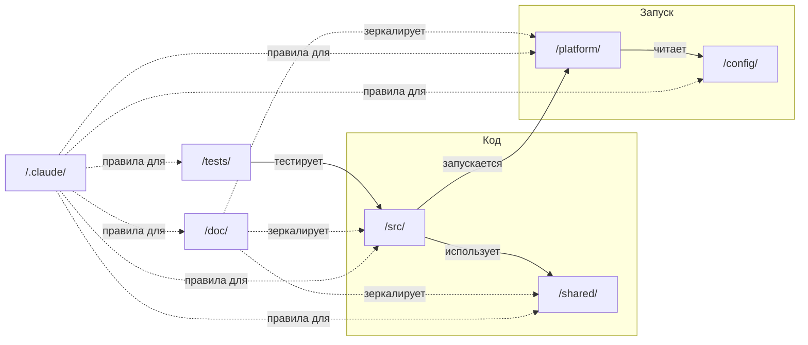

# Рефакторинг структуры проекта

## Назначение документа

Определить целевую структуру проекта:
1. Структура папок
2. Перечень инструкций (`/.claude/instructions/`) для каждой области
3. Требования к каждой области (правила)

Структура, описанная в данном документе, **является памятью для LLM**.

**Требования к будущим инструкциям:**
- Каждая инструкция содержит детали реализации для своей зоны ответственности
- Инструкции связаны перелинковкой между собой

**Текущий статус:** 🔄 Проработка разделов

**TODO:** Пройтись по каждому разделу документа:
1. Определить его зоны ответственности
2. Доописать в формате "что за документ и что в нём должно быть описано"
3. Проверить, не дублирует ли раздел зоны ответственности других разделов и/или файлов — если да, устранить дублирование
4. Поискать информацию о нём во всех других разделах — если найдено соответствие, исправить и текущий раздел, и раздел с соответствием

**Инструкция:** После обсуждения раздела — отметить его как ✅ в таблице ниже.

### Таблица проработки разделов

| # | Раздел | Статус | Примечания |
|---|--------|--------|------------|
| **ЧАСТЬ 1: СТРУКТУРА** ||||
| 1.1 | Общая структура | ✅ | Добавлены: принцип разделения, диаграмма связей, чеклисты для папок и файлов |
| 1.2 | Дерево Claude (`/.claude/`) | ⬜ | |
| 1.3 | CLAUDE.md | ⬜ | |
| 1.4 | Паттерн инструкций | ⬜ | |
| 1.5 | Задачи — GitHub Issues | ⬜ | |
| 1.6 | Дерево сервисов (`/src/`) | ⬜ | |
| 1.7 | Дерево документации (`/doc/`) | ⬜ | |
| 1.8 | Дерево общего кода (`/shared/`) | ⬜ | |
| 1.9 | Дерево конфигураций (`/config/`) | ⬜ | |
| 1.10 | Дерево инфраструктуры (`/platform/`) | ⬜ | |
| 1.11 | Дерево тестов (`/tests/`) | ⬜ | |
| 1.12 | Git workflow | ⬜ | |
| 1.13 | Code style | ⬜ | |
| 1.14 | Security | ⬜ | |
| 1.15 | Observability | ⬜ | |
| 1.16 | Event-driven | ⬜ | |
| 1.17 | Real-time communication | ⬜ | |
| 1.18 | Caching | ⬜ | |
| 1.19 | Makefile | ⬜ | |
| 1.20 | Secrets | ⬜ | |
| 1.21 | Service creation workflow | ⬜ | |
| **ЧАСТЬ 2: РЕШЕНИЯ** ||||
| 2.1 | Таблица решений | ⬜ | Сверка с разделами |
| **ЧАСТЬ 3: ДЕТАЛИ ИНСТРУКЦИЙ** ||||
| 3.1 | Форматы данных | ⬜ | |
| 3.2 | Health checks / Graceful shutdown | ⬜ | |
| 3.3 | API design | ⬜ | |
| 3.4 | Local development | ⬜ | |
| 3.5 | Deployment strategies | ⬜ | |
| 3.6 | Database patterns | ⬜ | |
| 3.7 | API deprecation | ⬜ | |
| 3.8 | Performance | ⬜ | |
| 3.9 | Compliance/Audit | ⬜ | |

### MemoryBank

**MemoryBank** — структурированная память проекта для LLM. Набор концептов, описывающих что есть в проекте, как тут принято делать, почему так решили и над чем сейчас работаем.

**Patterns (Паттерны)** — `/.claude/instructions/` (весь раздел "Дерево Claude")

**Entities (Сущности)** —
- Сами сущности: `/src/`, `/shared/`, `/platform/`
- Описания сущностей: `/doc/src/`, `/doc/shared/`, `/doc/platform/`

**Tech Context (Технический контекст)** — `/doc/src/{service}/specs/architecture/`

**ADR (Архитектурные решения)** — `/doc/src/{service}/specs/adr/`

**Progress (Прогресс)** — `/doc/src/{service}/specs/plans/`

**Active Context (Активный контекст)** — GitHub Issues

**Glossary (Глоссарий)** — `/doc/glossary.md`

**Discussions (Дискуссии)** — `/.claude/discussions/`

---

# ЧАСТЬ 1: СТРУКТУРА (ЧТО)

---

## Общая структура

> **Назначение раздела:** Обзор верхнего уровня — какие папки и файлы есть в корне проекта. Детали каждой папки — в соответствующих разделах ниже.

### Корневые папки

```
/.claude/                   ← инструменты Claude (инструкции, агенты, скиллы, шаблоны)
/src/                       ← код сервисов
/doc/                       ← документация (зеркало src, shared, platform)
/shared/                    ← общий код (контракты, библиотеки, assets)
/config/                    ← конфигурации окружений
/platform/                  ← инфраструктура (Docker, Terraform, мониторинг)
/tests/                     ← системные тесты (e2e, нагрузочные)
/.github/                   ← CI/CD workflows
```

### Файлы в корне

```
/CLAUDE.md                  ← точка входа для LLM
/docker-compose.yml         ← конфигурация запуска сервисов
/docker-compose.dev.yml     ← конфигурация для разработки
/docker-compose.test.yml    ← конфигурация для тестов
/Makefile                   ← интерфейс команд проекта
/README.md                  ← руководство по началу работы
/CHANGELOG.md               ← история изменений
/LICENSE                    ← лицензия (проприетарная)
/.gitignore                 ← исключения git
/.dockerignore              ← исключения Docker
/.editorconfig              ← базовые правила редактора
/.prettierrc                ← конфигурация Prettier (JS/TS)
/.eslintrc.js               ← конфигурация ESLint (JS/TS)
/.pre-commit-config.yaml    ← конфигурация git hooks
```

### Какие файлы должны быть в корне

**Правило:** В корне только файлы, которые:
- Нужны инструментам, ожидающим их в корне (git, Docker, IDE)
- Являются точками входа для людей или LLM

| Категория | Файлы | Почему в корне |
|-----------|-------|----------------|
| Точки входа | README.md, CLAUDE.md | Первое, что видит человек/LLM |
| Запуск проекта | docker-compose.*, Makefile | Docker и make ищут в корне |
| Git | .gitignore, .pre-commit-config.yaml | Git ожидает в корне |
| Docker | .dockerignore | Docker ожидает в корне |
| IDE/редакторы | .editorconfig, .prettierrc, .eslintrc.js | IDE ищут конфиги в корне |
| Метаданные | LICENSE, CHANGELOG.md | Стандартное расположение |

**Чеклист перед добавлением файла в корень:**
1. ❓ Инструмент требует файл именно в корне?
2. ❓ Это точка входа (README, CLAUDE.md)?
3. ❓ Файл относится ко всему проекту, а не к конкретной папке?

**Если нет — файл должен быть в соответствующей папке:**
- Конфиги окружений → `/config/`
- Скрипты → `/platform/scripts/` или `/.claude/scripts/`
- Документация → `/doc/`

### Принцип разделения

**Ключевое:** Структура позволяет писать сервисы на разных языках и использовать разные БД для каждого сервиса.

| Папка | Отвечает за | Критерий попадания |
|-------|-------------|-------------------|
| `/src/` | Исполняемый код | Запускается как процесс |
| `/doc/` | Документация | Читается человеком/LLM, не исполняется |
| `/shared/` | Переиспользуемое | Используется 2+ сервисами |
| `/config/` | Настройки окружений | Меняется между dev/staging/prod |
| `/platform/` | Инфраструктура | Не бизнес-логика, а "как запускать" |
| `/tests/` | Системные тесты | Тестирует взаимодействие сервисов |
| `/.claude/` | Инструменты LLM | Используется только Claude |
| `/.github/` | CI/CD | GitHub-специфичное |

### Связи между папками



### Связь папок и инструкций

**Правило:** Каждая корневая папка `/X/` имеет инструкцию `/.claude/instructions/X/README.md`.

```
/src/      → /.claude/instructions/src/README.md
/doc/      → /.claude/instructions/doc/README.md
/shared/   → /.claude/instructions/shared/README.md
/config/   → /.claude/instructions/config/README.md
/platform/ → /.claude/instructions/platform/README.md
/tests/    → /.claude/instructions/tests/README.md
```

**Исключения:**
- `/.github/` — самодокументируемый (YAML с комментариями)
- `/.claude/` — сам является инструкцией

### Добавление новой папки в корень

**Правило:** Новая корневая папка — исключение, не норма.

**Чеклист перед созданием:**
1. ❓ Можно ли поместить в существующую папку?
2. ❓ Будет ли использоваться регулярно (не одноразово)?
3. ❓ Есть ли чёткая зона ответственности, не пересекающаяся с другими?

**Если ответ "да" на все три:**
1. Добавить папку в этот раздел (Общая структура)
2. Создать раздел "Дерево {название}" в документе
3. Создать `/.claude/instructions/{название}/README.md`
4. Обновить MemoryBank (если папка содержит сущности или паттерны)

---

## Дерево Claude (`/.claude/`)

Всё для Claude Code в одном месте.

**Статус реализации:**
- ✅ `/instructions/tools/` — agents.md, skills.md
- ✅ `/scripts/` — find_references.py
- ✅ `/skills/` — 4 скилла (skill-create, links-create, links-update, context-update)
- ⬜ `/instructions/src/`, `/doc/`, `/shared/`, `/config/`, `/platform/`, `/tests/`, `/git/`
- ⬜ `/agents/`, `/templates/`, `/discussions/`

```
/.claude/
  settings.local.json               ← настройки (в .gitignore)

  /instructions/                    ← инструкции для LLM

    /src/                           ← инструкции для /src/ (сервисы)
      README.md                     ← точка входа
      linking-to-doc.md             ← как из src ссылаться на doc
      health-checks.md              ← стандарт health endpoints
      auth.md                       ← JWT между сервисами
      error-handling.md             ← формат ошибок
      logging.md                    ← формат логов
      validation.md                 ← валидация входных данных
      pagination.md                 ← формат пагинации
      versioning.md                 ← версионирование сервисов
      api-docs.md                   ← Swagger UI документация
      api-design.md                 ← REST API design guidelines
      local-dev.md                  ← запуск, hot reload, отладка, IDE
      database.md                   ← pooling, migrations, transactions
      api-deprecation.md            ← политика вывода API
      performance.md                ← профилирование, бенчмарки, лимиты
      audit.md                      ← аудит-логи, хранение данных, GDPR
      realtime.md                   ← polling, SSE, WebSocket
      testing.md                    ← unit/integration тесты (→ ссылка на /tests/)
      resilience.md                 ← timeouts, retries, circuit breaker

    /tests/                         ← инструкции для /tests/ (системные тесты)
      README.md                     ← точка входа
      e2e.md                        ← e2e тесты (→ ссылка на /src/)
      load.md                       ← нагрузочные тесты k6 (→ ссылка на /src/)
      fixtures.md                   ← организация тестовых данных

    /doc/                           ← инструкции для /doc/ (документация)
      README.md                     ← точка входа
      linking-to-src.md             ← как из doc ссылаться на src
      structure.md                  ← структура документации

    /shared/                        ← инструкции для /shared/
      README.md                     ← точка входа
      contracts.md                  ← работа с контрактами (REST, gRPC)
      events.md                     ← события: naming, idempotency, DLQ
      libs.md                       ← общие библиотеки
      assets.md                     ← статика, иконки, шрифты
      i18n.md                       ← локализация

    /config/                        ← инструкции для /config/
      README.md                     ← точка входа
      environments.md               ← работа с окружениями (dev/staging/prod)
      feature-flags.md              ← feature flags (когда понадобятся)

    /platform/                      ← инструкции для /platform/
      README.md                     ← точка входа
      docker.md                     ← работа с Docker
      observability.md              ← общий обзор (logs, metrics, traces)
      metrics.md                    ← Prometheus метрики
      tracing.md                    ← распределённые трейсы
      logging.md                    ← агрегация логов (Loki)
      alerting.md                   ← правила алертинга
      caching.md                    ← Redis, паттерны кэширования
      deployment.md                 ← стратегии деплоя, rollback
      security.md                   ← безопасность

    /git/                           ← git и workflow
      README.md                     ← точка входа
      workflow.md                   ← GitHub Flow
      commits.md                    ← conventional commits
      issues.md                     ← работа с GitHub Issues (префиксы, labels)

    /tools/                         ← инструменты Claude
      README.md                     ← точка входа
      skills.md                     ← как работать со скиллами
      agents.md                     ← как работать с агентами

    # Общие инструкции (верхний уровень)
    feature-flags.md                ← когда и как использовать

  /agents/                          ← агенты (пока не созданы)

  /skills/                          ← скиллы (каждый в своей папке)
    /{skill-name}/
      SKILL.md                      ← описание скилла

    # Созданные скиллы:
    /skill-create/                  ← создание нового скилла
    /links-create/                  ← создание ссылок в документе
    /links-update/                  ← обновление ссылок в связанных документах
    /context-update/                ← распространение контекста по графу

    # Планируемые скиллы:
    /service-create/                ← создание сервиса из шаблона

  /scripts/                         ← скрипты, вызываемые LLM
    find_references.py              ← поиск ссылок на файл/папку (создан)
    create-service.py               ← скрипт создания сервиса (планируется)
  /templates/                       ← шаблоны для создания
    /service/                       ← шаблон нового сервиса
      README.md.template
      Makefile.template
      /backend/
      /database/
    /adr/
      adr.md.template
    /contract/
      rest.yaml.template
      event.json.template
  /discussions/                     ← дискуссии (рабочий инструмент LLM)
```

### CLAUDE.md

`CLAUDE.md` остаётся в корне как entry point:
- Краткий справочник
- Ссылки на `/.claude/instructions/`
- Claude Code автоматически находит его

### Паттерн инструкций

**Правило:** Инструкции для папки `/X/` находятся в `/.claude/instructions/X/`.

```
/src/      → /.claude/instructions/src/
/doc/      → /.claude/instructions/doc/
/shared/   → /.claude/instructions/shared/
/config/   → /.claude/instructions/config/
/platform/ → /.claude/instructions/platform/
/tests/    → /.claude/instructions/tests/
```

**Внутренние инструкции** (не зеркалируют корневые папки):
```
/.claude/instructions/git/    ← git workflow, commits, issues
/.claude/instructions/tools/  ← работа с агентами и скиллами
```

Это упрощает навигацию — если нужны правила для работы с `/shared/`, смотри `/.claude/instructions/shared/`.

**README.md в каждой папке инструкций** — обязательная точка входа при работе с ресурсом.

**Назначение:** Гарантирует, что при работе с `/X/` будут учтены ВСЕ инструкции из `/.claude/instructions/X/`.

**Пример `/.claude/instructions/src/README.md`:**
```markdown
# Инструкции для /src/

## Обязательные правила

- [Health checks](health-checks.md) — /health и /ready
- [Аутентификация](auth.md) — JWT между сервисами
- [Обработка ошибок](error-handling.md) — единый формат
- [Логирование](logging.md) — structured JSON
- [Валидация](validation.md) — входные данные
- [Resilience](resilience.md) — timeouts, retries
- [Документация](linking-to-doc.md) — ссылка на /doc/src/{service}/
- [Тесты](testing.md) — unit/integration
- [API docs](api-docs.md) — Swagger

## Справочные

- [Пагинация](pagination.md)
- [Версионирование](versioning.md)
```

### Ссылки в agents/ и skills/

**Правило:** Каждый файл агента или скилла начинается со ссылки на инструкцию.

**Пример `/.claude/agents/documentation.md`:**
```markdown
<!-- Инструкция: /.claude/instructions/tools/agents.md -->

# Documentation Agent
...
```

**Пример `/.claude/skills/new-service.md`:**
```markdown
<!-- Инструкция: /.claude/instructions/tools/skills.md -->

# Скилл: Создание сервиса
...
```

Это позволяет LLM быстро найти правила работы с агентами/скиллами при их использовании.

### Задачи — GitHub Issues

Локальные задачи не используем. Работаем через GitHub Issues с префиксами.

**Инструкция:** `/.claude/instructions/git/issues.md` — содержит:
- Таблицу соответствия сервисов и префиксов
- Правила именования задач
- Примеры команд gh

**Формат префикса:** `[PREFIX]` в начале заголовка issue.

| Сервис | Префикс | Label | Пример |
|--------|---------|-------|--------|
| auth | AUTH | service:auth | [AUTH] Добавить OAuth |
| notification | NOTIFY | service:notify | [NOTIFY] Email templates |
| payment | PAY | service:payment | [PAY] Stripe интеграция |
| users | USERS | service:users | [USERS] Профили |
| gateway | GW | service:gateway | [GW] Rate limiting |
| общие/инфра | INFRA | infra | [INFRA] CI pipeline |
| документация | DOCS | docs | [DOCS] README |

**Правило:** При создании нового сервиса — добавить префикс в `/.claude/instructions/git/issues.md`.

```bash
# Создание issue
gh issue create \
  --label "service:auth" \
  --title "[AUTH] Исправить JWT валидацию"

# Просмотр по сервису
gh issue list --label "service:auth"

# Просмотр всех открытых
gh issue list --state open
```

---

## Дерево сервисов (`/src/`)

Сервис-ориентированный подход. Каждый сервис автономен.

### Архитектурный принцип: Database per Service

Каждый сервис владеет своей БД. Другие сервисы получают данные через API, не через SQL.

**Плюсы:**
- Независимость (деплой auth не ломает notification)
- Можно разные БД (auth → PostgreSQL, notification → MongoDB)
- Чёткие границы ответственности

### Обнаружение сервисов (Service discovery)

Docker DNS — имя сервиса из docker-compose равно хосту.
URL сервисов через переменные окружения для гибкости (`AUTH_SERVICE_URL=http://auth:8080`).

### Аутентификация между сервисами

JWT между сервисами:
1. Каждый сервис имеет свой service account
2. При запросе к другому сервису — подписывает JWT
3. Принимающий сервис проверяет подпись

### Структура сервиса

```
/src/
  /auth/
    README.md             ← ссылка на /doc/src/auth/
    Makefile              ← команды для этого сервиса (специфика языка)
    dependencies.yaml     ← зависимости сервиса
    .env.example          ← шаблон переменных окружения
    /backend/
      /v1/                ← версия API
      /v2/
      /shared/            ← общая логика между версиями
      /health/            ← health check endpoints
    /frontend/
    /database/
      schema.sql          ← текущая схема
      /migrations/
        0001_initial.sql
        0002_add_roles.sql
      /seeds/             ← тестовые данные для этого сервиса
    /tests/               ← unit/integration тесты

  /notification/
    README.md
    Makefile
    /backend/
    /frontend/
    /database/
    /tests/
```

### Swagger UI

Каждый сервис хостит документацию API:
```
GET /api/v1/auth/docs     ← Swagger UI для auth
GET /api/v1/users/docs    ← Swagger UI для users
```

### Версионирование сервисов

Git tags как источник правды:
```bash
git tag v1.2.3
git push --tags
```

Версия доступна в health check ответе.

### Связь src ↔ doc

**Правило:** При создании файла в `/src/{service}/{path}` — создать `/doc/src/{service}/{path}.md` и добавить ссылку в начало файла.

**Пример `/src/auth/README.md`:**
```markdown
# Auth Service

Документация: [/doc/src/auth/](/doc/src/auth/)
```

**Пример `/src/auth/backend/handlers.py`:**
```python
"""
Auth handlers.

Документация: /doc/src/auth/backend/handlers.md
"""
```

### Версионирование API

**REST:** URL-версионирование:
```
/api/v1/users
/api/v2/users
```

**gRPC:** Package-версионирование:
```protobuf
package auth.v1;
package auth.v2;
```

---

## Дерево документации (`/doc/`)

Зеркалит структуру `/src/`, `/shared/`, `/platform/` (colocation principle).

### Почему именно эти папки?

| Папка | Зеркалируется | Причина |
|-------|---------------|---------|
| `/src/` | ✅ | Сервисы требуют документации: API, архитектура, ADR, runbooks |
| `/shared/` | ✅ | Библиотеки и контракты нужно документировать для потребителей |
| `/platform/` | ✅ | Инфраструктура требует runbooks, инструкций по деплою |
| `/config/` | ❌ | Конфиги самодокументируемы (комментарии внутри YAML) |
| `/tests/` | ❌ | Тесты сами являются документацией (код = спецификация) |
| `/.github/` | ❌ | Workflows самодокументируемы (YAML с комментариями) |

### Структура

```
/doc/
  README.md                 ← как работать с документацией
  glossary.md               ← глоссарий терминов проекта
  /runbooks/                ← общие runbooks (инфра, БД)
    database-full.md
    high-load.md
    backup-restore.md       ← стратегия бэкапов, восстановление

  # Зеркало /src/ — документация сервисов
  /src/
    /auth/
      README.md             ← обзор сервиса
      /specs/               ← спецификации
        /architecture/      ← архитектурные решения
        /adr/               ← ADR этого сервиса
          0001-jwt-tokens.md
        /plans/             ← планы реализации
      /backend/
        handlers.md
        api.md
      /database/
        schema.md
      /runbooks/            ← runbooks этого сервиса
        token-issues.md

    /notification/
      README.md
      /specs/
      /backend/
      /database/
      /runbooks/

  # Зеркало /shared/ — документация библиотек и контрактов
  /shared/
    README.md               ← обзор shared-кода
    /contracts/
      README.md             ← как работать с контрактами
    /libs/
      errors.md             ← документация формата ошибок
      logging.md            ← документация формата логов
    /i18n/
      README.md             ← правила локализации

  # Зеркало /platform/ — документация инфраструктуры
  /platform/
    README.md               ← обзор инфраструктуры
    /gateway/
      README.md             ← настройка Traefik
    /docker/
      README.md             ← работа с Docker
    /monitoring/
      README.md             ← настройка мониторинга
    /runbooks/              ← инфраструктурные runbooks
      deploy.md
      rollback.md
      incident-response.md
```

### Процесс ведения документации (Workflow)

```
Дискуссия (/.claude/discussions/)
    ↓ (решение принято)
/doc/src/{service}/specs/adr/       ← ADR
    ↓
/doc/src/{service}/specs/plans/     ← план реализации
    ↓
/src/{service}/                     ← код
    ↓
/doc/src/{service}/backend/         ← документация кода
```

---

## Дерево общего кода (`/shared/`)

Переиспользуемый код и контракты между сервисами:

```
/shared/
  /contracts/               ← API контракты (ключевое!)
    /rest/                  ← OpenAPI спецификации
      auth.yaml
      users.yaml
    /grpc/                  ← Protocol Buffers
      auth.proto
    /events/                ← схемы событий для очередей
      user-created.json
      order-completed.json
    /realtime/              ← схемы real-time сообщений
      notifications.json
      chat-messages.json
    /pacts/                 ← contract testing (генерируются)

  /libs/                    ← общие библиотеки
    /errors/                ← единый формат ошибок
    /logging/               ← единый формат логов
    /validation/            ← общие валидаторы
    /http-client/           ← HTTP клиент с timeouts, retries, circuit breaker
    /features/              ← проверка feature flags

  /packages/                ← npm/pip пакеты
  /types/                   ← общие типы/схемы

  /assets/                  ← статика
    /icons/
    /fonts/
    /brand/

  /i18n/                    ← локализация
    /ru/                    ← пока только русский
      common.json
      errors.json

  /seeds/                   ← общие справочники
    countries.sql
    currencies.sql
```

### Межсервисное взаимодействие

Три типа коммуникации — три папки контрактов:

| Тип | Папка | Формат |
|-----|-------|--------|
| REST | `/shared/contracts/rest/` | OpenAPI (YAML) |
| gRPC | `/shared/contracts/grpc/` | Protobuf (.proto) |
| Очереди | `/shared/contracts/events/` | JSON Schema |

---

## Дерево конфигураций (`/config/`)

Конфигурации окружений:

```
/config/
  /environments/
    development.yaml
    staging.yaml
    production.yaml
  /features/               ← feature flags (когда понадобится)
    features.yaml
```

**Пример `development.yaml`:**
```yaml
database:
  host: localhost
  pool_size: 5
redis:
  host: localhost
logging:
  level: debug
```

### Feature flags

Пока не реализованы. При необходимости:
- Простой вариант: `/config/features/features.yaml`
- Продвинутый: сервис Unleash в `/src/feature-flags/`

---

## Дерево инфраструктуры (`/platform/`)

Инфраструктура и деплой:

```
/platform/
  /gateway/                 ← Traefik конфигурация
    traefik.yml
    /dynamic/               ← динамические middlewares
      cors.yml              ← CORS настройки
      rate-limit.yml        ← rate limiting
  /docker/                  ← Dockerfile'ы
  /terraform/               ← IaC
  /monitoring/              ← Prometheus, Grafana, алерты
    prometheus.yml
    /dashboards/
    /alerts/
  /queues/                  ← очереди сообщений (RabbitMQ, Kafka)
    rabbitmq.conf
    docker-compose.queues.yml
  /cache/                   ← кэширование (Redis)
    redis.conf
  /security/                ← security scanning конфиги
    semgrep.yml
    .gitleaks.toml
  /secrets/                 ← документация по секретам
    README.md
  /scripts/                 ← деплой-скрипты (не LLM!)
```

### API Gateway — Traefik

Выбран Traefik:
- Бесплатный (open source)
- Автоматически обнаруживает сервисы в Docker
- Конфигурация через labels в docker-compose

**Load balancing (Балансировка нагрузки):** Traefik автоматически балансирует при нескольких репликах (round-robin).

**CORS (Кросс-доменные запросы):** Настраивается централизованно в Traefik (не в сервисах).

```yaml
# /platform/gateway/dynamic/cors.yml
http:
  middlewares:
    cors:
      headers:
        accessControlAllowOriginList:
          - "https://app.example.com"
        accessControlAllowMethods:
          - GET
          - POST
          - PUT
          - DELETE
        accessControlAllowHeaders:
          - Authorization
          - Content-Type
```

**Rate limiting (Ограничение частоты):** Централизованно в Traefik.

```yaml
# /platform/gateway/dynamic/rate-limit.yml
http:
  middlewares:
    rate-limit:
      rateLimit:
        average: 100    # запросов в секунду
        burst: 50       # пиковый burst
```

---

## Дерево тестов (`/tests/`)

Тесты системного уровня:

```
/tests/
  /e2e/                     ← функциональные сценарии
    auth-flow.spec.ts
    checkout.spec.ts
  /load/                    ← нагрузочные тесты (k6)
    /services/              ← изолированные тесты сервисов
      auth.k6.js
    /scenarios/             ← сценарные тесты
      full-flow.k6.js
    /system/                ← системные тесты
      peak-load.k6.js
  /fixtures/                ← общие тестовые данные
```

**Unit/integration тесты** — внутри сервисов (`/src/auth/tests/`).

---

## Git workflow (Git-процессы)

### Branching (Ветвление) — GitHub Flow

```
main                        ← всегда стабильный, деплоится
  └── feature/auth-sso      ← короткая ветка, PR в main
  └── fix/login-bug
```

- `main` — защищённая ветка, только через PR
- Feature-ветки — короткоживущие

### Commits (Коммиты) — Conventional Commits

```
feat: добавить авторизацию через OAuth
fix: исправить утечку памяти в auth
breaking: изменить формат ответа API
```

Автогенерация `CHANGELOG.md` при релизе.

### Git hooks (Git-хуки) — pre-commit

```yaml
# .pre-commit-config.yaml
repos:
  - repo: local
    hooks:
      - id: lint
      - id: format
      - id: secrets-check
```

---

## Code style (Стиль кода)

Конфиги в корне, сервис может переопределить:

```
/.editorconfig            ← базовые правила (отступы, encoding)
/.prettierrc              ← JS/TS форматирование
/.eslintrc.js             ← JS/TS линтинг
/ruff.toml                ← Python линтинг (если нужен)
/pyproject.toml           ← Python конфигурация (если нужен)

/src/auth/
  .eslintrc.js            ← переопределение для сервиса (опционально)
```

---

## Security (Безопасность)

### В CI (/.github/workflows/security.yml):
- **Dependabot** — уязвимые зависимости
- **GitLeaks** — секреты в коде
- **Semgrep** — SAST (опционально)

### Конфиги:
```
/platform/security/
  semgrep.yml
  .gitleaks.toml
```

---

## Observability (Наблюдаемость)

Три столпа наблюдаемости для микросервисов:

```
         ┌─────────────────────────────────────────┐
         │            Observability                │
         ├─────────────┬─────────────┬─────────────┤
         │    Logs     │   Metrics   │   Traces    │
         │   (Loki)    │(Prometheus) │  (Tempo)    │
         └──────┬──────┴──────┬──────┴──────┬──────┘
                │             │             │
                └─────────────┼─────────────┘
                              │
                      ┌───────┴───────┐
                      │  request_id   │  ← корреляция
                      │  trace_id     │
                      └───────────────┘
```

### Структура в `/platform/`

```
/platform/
  /monitoring/
    prometheus.yml            ← сбор метрик
    /dashboards/              ← Grafana dashboards
    /alerts/                  ← правила алертинга

  /tracing/
    tempo.yml                 ← конфиг Tempo

  /logging/
    loki.yml                  ← конфиг Loki
    promtail.yml              ← сборщик логов
```

### Корреляция: request_id и trace_id

Каждый запрос получает идентификаторы для связи логов, метрик и traces:

```
┌─────────────┐     ┌─────────────┐     ┌─────────────┐
│   Gateway   │────▶│    Auth     │────▶│    Users    │
│             │     │             │     │             │
│ request_id  │     │ request_id  │     │ request_id  │
│ trace_id    │     │ trace_id    │     │ trace_id    │
│ span_id: A  │     │ span_id: B  │     │ span_id: C  │
└─────────────┘     └─────────────┘     └─────────────┘
      │                   │                   │
      ▼                   ▼                   ▼
   [Logs]              [Logs]              [Logs]
   [Metrics]           [Metrics]           [Metrics]
   [Traces]            [Traces]            [Traces]
```

**Правила:**
- `request_id` — генерируется на Gateway, передаётся в заголовке `X-Request-ID`
- `trace_id` — генерируется OpenTelemetry, propagation через `traceparent` (W3C)
- Все логи содержат оба ID
- Метрики содержат label `service`

### Инструкции в `/.claude/instructions/`

```
/.claude/instructions/
  /platform/
    observability.md    ← общий обзор, ссылки на детали
    metrics.md          ← требования к метрикам
    tracing.md          ← требования к трейсам
    logging.md          ← требования к логам
    alerting.md         ← требования к алертам
```

---

## Event-driven (Событийная архитектура)

Асинхронное взаимодействие между сервисами через очереди.

### Структура

```
/shared/contracts/events/     ← JSON Schema для каждого события
  user-created.json
  order-completed.json

/platform/queues/             ← конфиги очередей
  rabbitmq.conf
  /dlq/                       ← dead letter queues
```

### Инструкции

```
/.claude/instructions/
  /shared/
    events.md                 ← naming, idempotency, retry, dead letter
```

### Правила

- **Naming (Именование):** `{service}.{entity}.{action}` (например `users.user.created`)
- **Idempotency (Идемпотентность):** обязателен `event_id` в каждом событии
- **Dead letter (Недоставленные):** необработанные события → `/platform/queues/dlq/`

---

## Real-time communication (Real-time коммуникация)

Варианты push-коммуникации от сервера к клиенту.

### Структура

```
/shared/contracts/realtime/     ← схемы сообщений
  notifications.json
  chat-messages.json
```

### Инструкции

```
/.claude/instructions/
  /src/
    realtime.md                 ← polling, SSE, WebSocket
```

### Правила

| Технология | Когда использовать |
|------------|-------------------|
| **Polling** | Редкие обновления, простота важнее |
| **SSE** | Односторонний push (нотификации, ленты) |
| **WebSocket** | Двусторонний (чат, collaborative editing) |

- **Выбор:** определяется в ADR сервиса
- **Схемы сообщений:** `/shared/contracts/realtime/`
- **Heartbeat (Пульс):** обязателен для WebSocket (keep-alive)

---

## Caching (Кэширование)

Кэширование для ускорения и снижения нагрузки на БД.

### Структура

```
/platform/cache/
  redis.conf
```

### Инструкции

```
/.claude/instructions/
  /platform/
    caching.md                ← паттерны, TTL, invalidation
```

### Правила

- **Паттерн:** cache-aside (приложение управляет кэшем)
- **Key naming (Именование ключей):** `{service}:{entity}:{id}` (например `users:user:123`)
- **TTL (Время жизни):** обязателен для всех ключей
- **Invalidation (Инвалидация):** при изменении данных — удалять ключ

---

## Makefile

Корневой Makefile — единый интерфейс, абстрагирует языки:

```makefile
# Запуск
dev:           docker-compose -f docker-compose.dev.yml up
stop:          docker-compose down

# Сборка
build:         docker-compose build

# Тесты
test:          запуск unit/integration тестов всех сервисов
test-e2e:      запуск e2e тестов
test-load:     запуск нагрузочных тестов
test-auth:     cd src/auth && make test

# База данных
db-migrate:    миграции всех сервисов

# Утилиты
lint:          линтеры
clean:         очистка

# Создание
new-service:   создание нового сервиса из шаблона
```

Каждый сервис имеет свой Makefile со спецификой языка.

---

## Secrets (Секреты и конфигурация)

```
/.env.example               ← шаблон для корня
/src/auth/.env.example      ← шаблон для сервиса

/platform/secrets/
  README.md                 ← как работать с секретами
  rotation.md               ← runbook ротации секретов
```

**Правило:** `.env` в `.gitignore`, `.env.example` в репо.

### Ротация секретов (Secrets rotation)

- **Runbook (Инструкция):** `/platform/secrets/rotation.md`
- **Паттерн dual keys:** для JWT — два signing key активны одновременно
- **Vault (Хранилище секретов):** при необходимости автоматической ротации

---

## Service creation workflow (Процесс создания сервиса)

```
Дискуссия (/.claude/discussions/)
    ↓ (решение принято)
Скилл /new-service
    ↓
Скрипт create-service.py + шаблоны из /.claude/templates/
    ↓
/src/payment/                   ← код сервиса
/doc/src/payment/               ← документация сервиса
/shared/contracts/rest/payment.yaml  ← контракт
```

---

# ЧАСТЬ 2: РЕШЕНИЯ

---

## Решения

| Вопрос | Решение |
|--------|---------|
| Тесты unit/integration | Внутри сервиса (`/src/auth/tests/`) |
| Тесты e2e | `/tests/e2e/` |
| Тесты нагрузочные | `/tests/load/` |
| Инфраструктура | `/platform/` |
| Миграции | Внутри сервиса (`/src/auth/database/migrations/`) |
| Seed данные | Сервис-специфичные в сервисе, общие в `/shared/seeds/` |
| CI/CD | `/.github/` |
| Зависимости | `dependencies.yaml` в корне сервиса |
| Версионирование API (REST) | URL (`/api/v1/`, `/api/v2/`) |
| Версионирование API (gRPC) | Package (`package auth.v1;`) |
| Версионирование сервисов | Git tags |
| Владение БД | Database per Service |
| Service discovery | Docker DNS (имя сервиса = хост) |
| Auth между сервисами | JWT |
| API Gateway | Traefik (`/platform/gateway/`) |
| Load balancing | Traefik (round-robin при нескольких репликах) |
| CORS | Централизованно в Traefik (`/platform/gateway/dynamic/cors.yml`) |
| Rate limiting | Централизованно в Traefik (`/platform/gateway/dynamic/rate-limit.yml`) |
| Контракты API | По типу: `/shared/contracts/{rest,grpc,events}/` |
| Contract testing | `/shared/contracts/pacts/` |
| Мониторинг | Правила в `/.claude/instructions/platform/`, конфиги в `/platform/monitoring/` |
| Logs (агрегация) | Loki (`/platform/logging/`) |
| Metrics | Prometheus (`/platform/monitoring/`) |
| Traces | Tempo (`/platform/tracing/`) |
| Корреляция | request_id + trace_id (передаются через заголовки) |
| Очереди | `/platform/queues/` |
| Events naming | `{service}.{entity}.{action}` |
| Events idempotency | `event_id` в каждом событии |
| Dead letter queues | `/platform/queues/dlq/` |
| Real-time | Polling/SSE/WebSocket — выбор в ADR сервиса |
| Real-time схемы | `/shared/contracts/realtime/` |
| Кэширование | `/platform/cache/`, паттерн cache-aside |
| Cache key naming | `{service}:{entity}:{id}` |
| Cache TTL | Обязателен для всех ключей |
| API URLs | kebab-case, множественное число |
| Partial update | PATCH + JSON Merge Patch |
| Bulk operations | POST `/{entity}/bulk` |
| Local dev | `make dev`, hot reload, debug порты |
| Deployment | Rolling update по умолчанию, blue-green/canary для критичных |
| Rollback | Автоматический при падении health checks |
| Connection pooling | Обязателен |
| DB migrations | Только forward, no rollback в prod |
| Cross-service transactions | Saga pattern |
| DB naming | snake_case |
| API deprecation | Sunset + Deprecation headers, минимум 3 месяца |
| Лимиты производительности | p99 < 200ms, память < 512MB |
| Аудит-логи | Отдельно от обычных логов, кто/что/когда |
| PII | Не логировать, маскировать |
| Окружения | `/config/environments/` |
| Feature flags | Инструкция, сервис Unleash при необходимости |
| docker-compose | В корне проекта |
| Makefile | В корне + в каждом сервисе |
| Статика/Assets | `/shared/assets/` |
| Локализация | `/shared/i18n/ru/`, другие языки позже |
| Связь src ↔ doc | Ссылки в файлах, зеркальная структура |
| Зеркалирование /doc/ | src, shared, platform (не config, tests, .github) |
| ADR | `/doc/src/{service}/specs/adr/` |
| Runbooks | `/doc/runbooks/` + `/doc/src/{service}/runbooks/` + `/doc/platform/runbooks/` |
| Backup/restore | Runbook `/doc/runbooks/backup-restore.md` |
| Шаблоны | `/.claude/templates/` + скрипт + скилл |
| CLAUDE.md | Entry point в корне, ссылки на `/.claude/` |
| Code style | В корне, сервис может переопределить |
| Git hooks | `.pre-commit-config.yaml` в корне |
| Branching | GitHub Flow |
| Changelog | `CHANGELOG.md` в корне + conventional commits |
| Error handling | Единый формат, `/shared/libs/errors/` |
| Validation | Единый формат, `/shared/libs/validation/` |
| Pagination | Единый формат offset-based |
| Logging | JSON structured, `/shared/libs/logging/` |
| Security scanning | Dependabot + GitLeaks в CI |
| Secrets rotation | Dual keys + runbook, Vault при необходимости |
| Health checks | `/health`, `/ready` в каждом сервисе |
| Graceful shutdown | В health-checks.md (связан с /ready) |
| Swagger UI | `/docs` в каждом сервисе |
| Глоссарий | `/doc/glossary.md` |
| Лицензия | Проприетарная |
| Задачи | GitHub Issues с префиксами [AUTH], [NOTIFY] |
| .gitignore | В корне |
| .dockerignore | В корне |
| Инструкции Claude | По зонам: `/.claude/instructions/{src,doc,shared,config,platform,tests,git,tools}/` |
| Инструкции тестов | src/testing.md (unit) ↔ tests/*.md (e2e, load) — перелинковка |
| README.md в инструкциях | Каждая папка имеет README.md — точка входа со ссылками |
| Resilience | Инструкция + `/shared/libs/http-client/` (timeouts, retries, circuit breaker) |
| Ссылки в agents/skills | Каждый файл начинается со ссылки на инструкцию |

---

# ЧАСТЬ 3: ДЕТАЛИ ИНСТРУКЦИЙ (КАК)

Заготовки для будущих файлов в `/.claude/instructions/`. После рефакторинга — вынести в соответствующие инструкции.

---

## Форматы данных

> **Инструкция:** `/.claude/instructions/src/error-handling.md`, `logging.md`, `pagination.md`

### Единый формат ошибок

```json
{
  "error": {
    "code": "AUTH_TOKEN_EXPIRED",
    "message": "Token has expired",
    "details": {
      "expired_at": "2024-01-15T10:00:00Z"
    },
    "request_id": "abc-123"
  }
}
```

### Ошибки валидации

```json
{
  "error": {
    "code": "VALIDATION_ERROR",
    "message": "Validation failed",
    "details": {
      "fields": {
        "email": "Invalid email format",
        "age": "Must be at least 18"
      }
    }
  }
}
```

### Единый формат логов

Structured logging в JSON:
```json
{
  "timestamp": "2024-01-15T10:30:00Z",
  "level": "error",
  "service": "auth",
  "request_id": "abc-123",
  "message": "Failed to validate token",
  "context": {
    "user_id": "user-456"
  }
}
```

### Единый формат пагинации

```json
{
  "data": [...],
  "pagination": {
    "page": 2,
    "limit": 20,
    "total": 156,
    "total_pages": 8
  }
}
```

---

## Health checks / Graceful shutdown (Проверки работоспособности)

> **Инструкция:** `/.claude/instructions/src/health-checks.md`

Каждый сервис реализует:
```
GET /health      ← liveness (жив ли сервис)
GET /ready       ← readiness (готов ли принимать трафик)
```

Формат ответа:
```json
{
  "status": "healthy",
  "checks": {
    "database": "ok",
    "redis": "ok"
  },
  "version": "1.2.3"
}
```

**Graceful shutdown (Мягкое завершение):**
1. Сервис получает SIGTERM
2. `/ready` → false (перестаёт получать новый трафик)
3. Дожидается завершения текущих запросов (timeout: 30 сек)
4. Закрывает соединения (БД, Redis, очереди)
5. Завершается

---

## API design (Проектирование API)

> **Инструкция:** `/.claude/instructions/src/api-design.md`

- **URLs:** kebab-case, множественное число (`/users`, `/order-items`)
- **Методы:** GET=читать, POST=создать, PUT=заменить, PATCH=частично, DELETE=удалить
- **Статусы:** 200/201/204 успех, 400 валидация, 401 auth, 403 forbidden, 404 not found, 500 server
- **Partial update (Частичное обновление):** PATCH + JSON Merge Patch (RFC 7396)
- **Bulk operations (Массовые операции):** POST `/{entity}/bulk` с массивом

---

## Local development (Локальная разработка)

> **Инструкция:** `/.claude/instructions/src/local-dev.md`

- **Запуск:** `make dev` поднимает всё через docker-compose
- **Hot reload (Горячая перезагрузка):** код монтируется в контейнер, изменения применяются автоматически
- **Отладка:** debug порты открыты (9229 для Node.js, 5678 для Python)
- **IDE:** рекомендации по VS Code / JetBrains в инструкции

---

## Deployment strategies (Стратегии развёртывания)

> **Инструкция:** `/.claude/instructions/platform/deployment.md`

- **Rolling update (Постепенное обновление):** по умолчанию (постепенная замена подов)
- **Blue-green (Сине-зелёный деплой):** для критичных изменений (две среды, переключение)
- **Canary (Канареечный деплой):** для рискованных (1% → 10% → 100% трафика)
- **Rollback (Откат):** автоматический при падении health checks

---

## Database patterns (Паттерны работы с БД)

> **Инструкция:** `/.claude/instructions/src/database.md`

- **Connection pooling (Пул соединений):** обязателен
- **Migrations (Миграции):** только forward (no rollback в prod)
- **Transactions (Транзакции):** в пределах сервиса; между сервисами — saga
- **Naming (Именование):** snake_case для таблиц и колонок

---

## API deprecation (Вывод API из эксплуатации)

> **Инструкция:** `/.claude/instructions/src/api-deprecation.md`

- **Sunset header (Заголовок окончания):** дата отключения (`Sunset: Sat, 01 Jun 2025 00:00:00 GMT`)
- **Deprecation header (Заголовок устаревания):** `Deprecation: true`
- **Срок:** минимум 3 месяца между deprecation и удалением
- **Документация:** changelog с датами и migration guide

---

## Performance (Производительность)

> **Инструкция:** `/.claude/instructions/src/performance.md`

- **Profiling (Профилирование):** встроено в dev-режим (CPU, память)
- **Benchmarks (Бенчмарки):** `/tests/load/` — k6 сценарии
- **Performance budgets (Лимиты):** p99 latency < 200ms, память < 512MB на сервис
- **Bottleneck detection (Поиск узких мест):** через трейсы + метрики

---

## Compliance/Audit (Соответствие и аудит)

> **Инструкция:** `/.claude/instructions/src/audit.md`

- **Audit logs (Аудит-логи):** кто, что, когда (отдельно от обычных логов)
- **Data retention (Хранение):** срок хранения данных (например 1 год)
- **Right to be forgotten (Удаление данных):** API для удаления по запросу
- **PII (Персональные данные):** не логировать, маскировать
