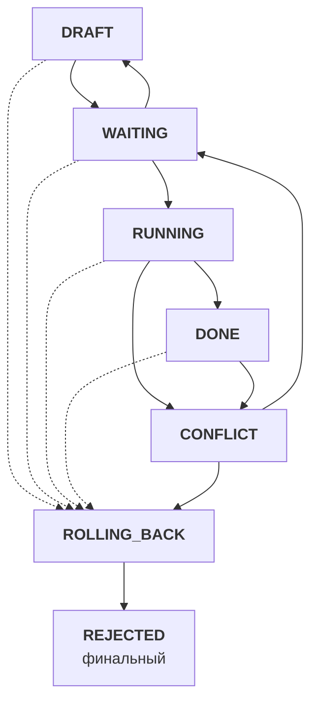
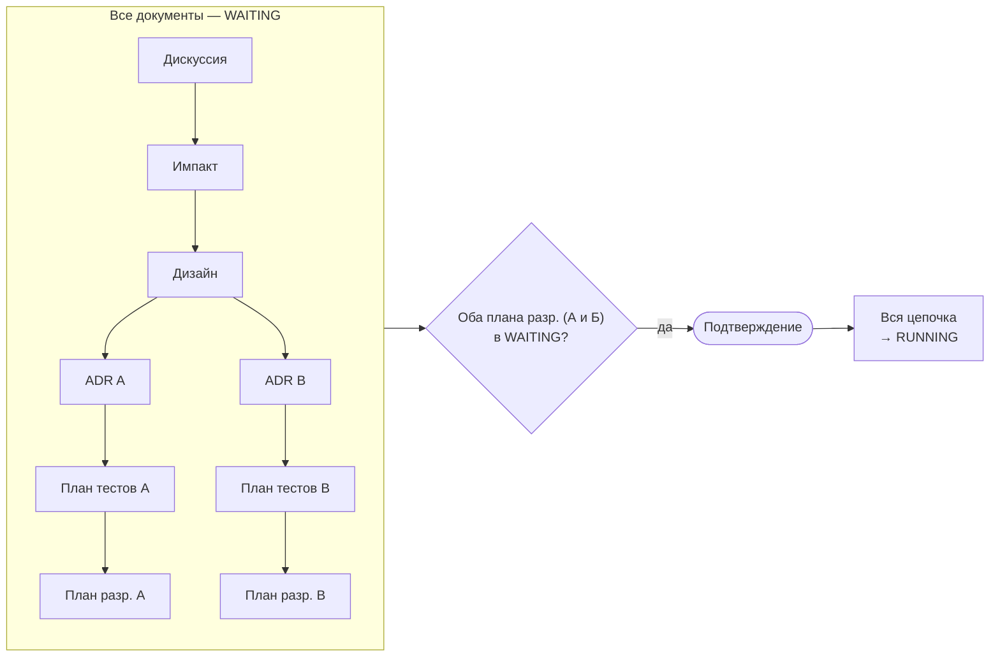
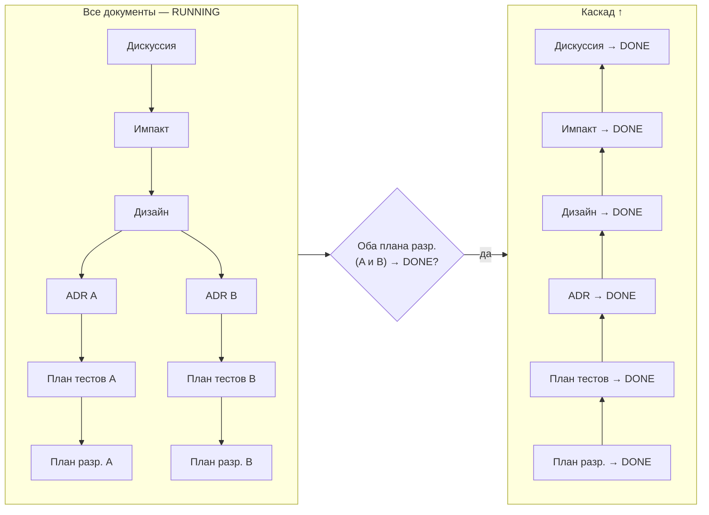
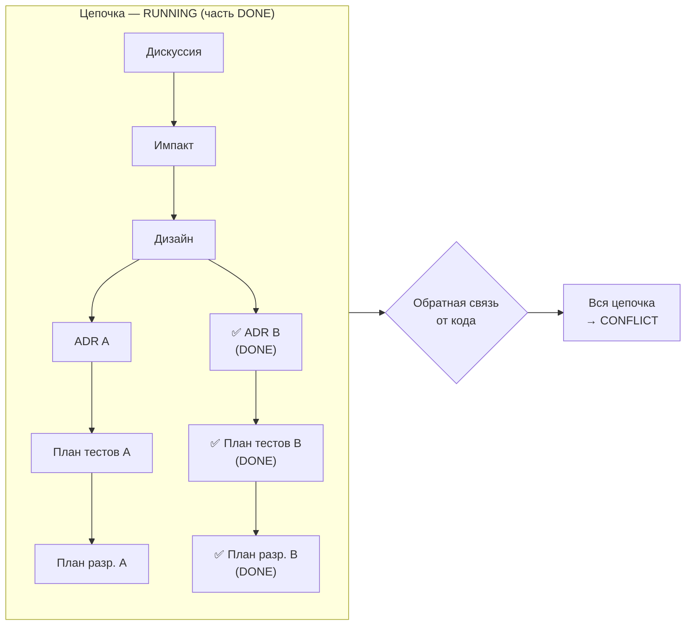
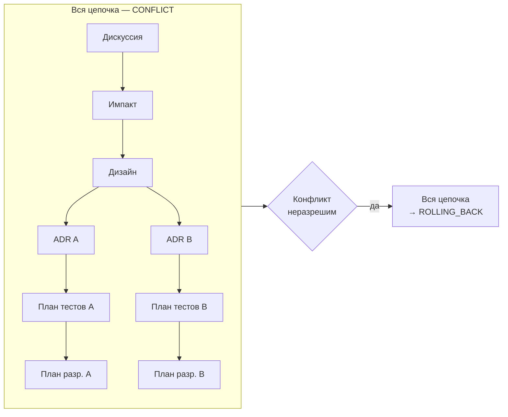

# Справочник SDD

Версия стандарта: 1.0

Общие механики Specification-Driven Development: статусы, каскады, связи, обратная связь Code→Specs, Clarify-паттерн, именование, запреты. Все объектные стандарты ссылаются на этот документ как SSOT механик.

**Полезные ссылки:**
- [Навигатор SDD](./standard-specs-workflow.md) — воркфлоу от намерения до разработки, стадии, SSOT-ссылки
- [Инструкции specs/](./README.md)
- [Архитектура specs/ (черновик)](/.claude/drafts/examples/2026-02-08-specs-architecture.md)

**Связанные документы:**

| Тип | Документ |
|-----|----------|
| Навигатор | [standard-specs-workflow.md](./standard-specs-workflow.md) |
| Валидация | — |
| Создание | — |
| Модификация | — |

## Оглавление

- [1. Связи и frontmatter](#1-связи-и-frontmatter)
- [2. Статусы](#2-статусы)
- [3. Каскады](#3-каскады)
  - [Каскад RUNNING](#каскад-running)
  - [Каскадное завершение (DONE)](#каскадное-завершение-done)
  - [Каскад CONFLICT](#каскад-conflict)
  - [Каскад ROLLING_BACK](#каскад-rolling_back)
  - [Каскад REJECTED](#каскад-rejected)
- [4. Обратная связь Code-Specs](#4-обратная-связь-code-specs)
  - [Уровни обратной связи](#уровни-обратной-связи)
  - [Фаза 1. Обнаружение](#фаза-1-обнаружение)
  - [Фаза 2. Разрешение](#фаза-2-разрешение)
  - [Примеры обратной связи](#примеры-обратной-связи)
  - [Кросс-цепочечная обратная связь](#кросс-цепочечная-обратная-связь)
- [5. Живые документы](#5-живые-документы)
- [6. Clarify и блокирующие правила](#6-clarify-и-блокирующие-правила)
  - [Clarify на каждом уровне](#clarify-на-каждом-уровне)
  - [Маркер ТРЕБУЕТ УТОЧНЕНИЯ](#маркер-требует-уточнения)
  - [Dependency Barrier](#dependency-barrier)
- [7. Именование и формат README-таблиц](#7-именование-и-формат-readme-таблиц)
- [8. Запреты](#8-запреты)
- [9. Решения](#9-решения)

---

## 1. Связи и frontmatter

**SSOT frontmatter:** [standard-frontmatter.md](/.structure/.instructions/standard-frontmatter.md) ([§ 1 — базовые поля](/.structure/.instructions/standard-frontmatter.md#1-обязательные-поля) + [§ 4 — поля specs](/.structure/.instructions/standard-frontmatter.md#4-дополнительные-поля-для-спецификаций-specs))

Документы specs/ используют стандарт frontmatter проекта — все обязательные поля и дополнительные поля:

| Поле | Тип | Обязательность | Описание |
|------|-----|----------------|----------|
| `parent` | строка (путь) | Обязательно (кроме Discussion) | Путь к родительскому документу |
| `children` | список путей | Обязательно (кроме plan-dev) | Пути к дочерним документам |
| `status` | строка | Обязательно | Текущий статус ([§ 2](#2-статусы)) |
| `milestone` | строка | Обязательно | Целевой Milestone (наследуется дочерними) |

```yaml
---
description: ADR auth-сервиса — переход на OAuth2 с JWT RS256, ротация ключей, refresh-токены.
standard: specs/.instructions/adr/standard-adr.md
standard-version: v1.0
index: specs/services/auth/adr/README.md
parent: design/design-0001-oauth2-service-design.md
children:
  - services/auth/plan-test/plan-test-0001-oauth2-tests.md
status: WAITING
milestone: v1.2.0
---
```

**Правила связей:**

| Объект | parent | children |
|--------|--------|----------|
| **Дискуссия** | нет | Импакт (1:1) |
| **Импакт** | Дискуссия | Дизайн (1:1) |
| **Дизайн** | Импакт | ADR(ы) |
| **ADR** | Дизайн | План(ы) тестов |
| **План тестов** | ADR | План разработки (1:1) |
| **План разработки** | План тестов | нет (терминальный) |

**Milestone:** Определяется при Clarify на уровне Discussion и сохраняется в его frontmatter. Все дочерние документы наследуют milestone от Discussion. Один Milestone может содержать несколько Discussions.

---

## 2. Статусы

7 статусов жизненного цикла. Статус хранится в frontmatter каждого документа, но большинство переходов — **tree-level** (все документы цепочки переходят одновременно):



| Статус | Скоуп | Значение |
|--------|-------|----------|
| **DRAFT** | per-document | Документ создаётся, итерируется, ревьюится пользователем |
| **WAITING** | per-document | Пользователь согласовал. Ожидает готовности всей цепочки |
| **RUNNING** | tree-level | Все уровни согласованы. Идёт реализация (код) |
| **DONE** | per-document | Реализация конкретного документа завершена, артефакты обновлены. Каскад снизу вверх (§ 3) |
| **CONFLICT** | tree-level | Обратная связь от кода — вся цепочка останавливается (включая DONE). Выход: top-down разрешение → WAITING → RUNNING |
| **ROLLING_BACK** | tree-level | Откат артефактов. Из любого статуса по команде пользователя, или из CONFLICT (неразрешим) |
| **REJECTED** | tree-level | Отклонён (финальный). Единственный путь: из ROLLING_BACK |

**Допустимые переходы:**

| Из | В | Условие |
|----|---|---------|
| DRAFT | WAITING | Пользователь одобрил |
| DRAFT | ROLLING_BACK | Tree-level — пользователь отменяет |
| WAITING | DRAFT | Пользователь вернул на доработку |
| WAITING | RUNNING | Tree-level — все планы в WAITING, пользователь подтвердил |
| WAITING | ROLLING_BACK | Tree-level — пользователь отменяет |
| RUNNING | DONE | Реализация завершена (per-document, bottom-up) |
| RUNNING | CONFLICT | Tree-level — обратная связь от кода (§ 4) |
| RUNNING | ROLLING_BACK | Tree-level — пользователь отменяет |
| DONE | CONFLICT | Tree-level — каскад CONFLICT |
| DONE | ROLLING_BACK | Tree-level — каскад ROLLING_BACK |
| CONFLICT | WAITING | Per-document (top-down) — LLM исправляет документ, пользователь одобряет. Когда все в WAITING → RUNNING (§ 3) |
| CONFLICT | ROLLING_BACK | Tree-level — конфликт неразрешим / пользователь отклоняет |
| ROLLING_BACK | REJECTED | Откат завершён, артефакты откачены |

---

## 3. Каскады

Все каскады кроме DONE работают на уровне **всего дерева** — все документы цепочки переходят одновременно.

### Каскад RUNNING

**Триггер:** LLM проверяет после каждого Plan → WAITING. Когда все Plans в WAITING — LLM предлагает переход через AskUserQuestion: "Все спецификации готовы. Перейти в RUNNING?" Пользователь может подтвердить (→ RUNNING) или отложить (цепочка остаётся в WAITING).

**Переход:** При подтверждении **все** документы в цепочке (от Discussion до всех Plans) одновременно переходят в RUNNING. Спецификации согласованы и переходят в режим реализации: изменения возможны только через CONFLICT (§ 4).



### Каскадное завершение (DONE)

**Единственный per-document каскад.** Снизу вверх: родитель → DONE когда **все дети DONE**.



| Триггер | Результат | Побочные эффекты |
|---------|-----------|-----------------|
| План разработки → DONE | все задачи выполнены | — |
| План тестов → DONE | все планы разработки DONE | обновление `tests/services/{svc}/` |
| ADR → DONE | все планы тестов DONE | обновление `architecture/services/{svc}.md`, применение Planned Changes (запланированное → актуальное) |
| Design → DONE | все ADR DONE | обновление `architecture/system/`, `domains/`, `tests/system/` |
| Impact → DONE | все дизайны DONE | — |
| Discussion → DONE | все импакты DONE | — |

**Глоссарий** не участвует в каскадном завершении. Обновляется непрерывно на каждом уровне при появлении новых терминов.

### Каскад CONFLICT

**Триггер:** обратная связь от кода выявляет несовместимость со спецификациями (подробнее в § 4).

**Переход:** Tree-level — **все** документы цепочки → CONFLICT (включая DONE). Вся работа останавливается. LLM идентифицирует самый высокий затронутый документ и разрешает конфликт сверху вниз (§ 4). Разрешённые документы переходят в WAITING; когда все в WAITING — каскад RUNNING.



| Исход | Переход | Описание |
|-------|---------|----------|
| Конфликт разрешён | Per-document → WAITING, затем каскад RUNNING | LLM и пользователь верифицируют **все** документы (top-down). Когда все в WAITING → RUNNING |
| Конфликт неразрешим | → каскад ROLLING_BACK | Пользователь подтверждает откат через AskUserQuestion |
| Пользователь отклоняет разрешение | → каскад ROLLING_BACK | Предложенные изменения не устраивают |

### Каскад ROLLING_BACK

**Триггер:** пользователь даёт команду на откат (из любого статуса цепочки), конфликт неразрешим, или пользователь отклоняет разрешение конфликта.

**Переход:** Tree-level — **все** документы цепочки → ROLLING_BACK (включая Discussion). LLM откатывает артефакты per-document.



**Откат артефактов по уровням:**

| Уровень | Что откатывается |
|---------|-----------------|
| **Discussion** | Нет артефактов (no-op) |
| **Impact** | Нет артефактов (no-op) |
| **Design** | Откат изменений в `architecture/system/`, `architecture/domains/`, `tests/system/`. Удаление Planned Changes из `architecture/` |
| **ADR** | Откат изменений в `architecture/services/{svc}.md` (по дельта-блокам: ADDED удаляются, MODIFIED возвращаются к предыдущему состоянию, REMOVED восстанавливаются). Удаление Planned Changes. Откат технологических стандартов если были созданы для новой технологии |
| **План тестов** | Откат изменений в `specs/tests/services/{svc}/` |
| **План разработки** | Все Issues закрываются `--reason "not planned"` с комментарием "rolled back" ([standard-issue.md § 6](/.github/.instructions/issues/standard-issue.md#6-закрытие-issue)). Feature-ветка удаляется. Код в main отсутствует — revert не нужен ([standard-github-workflow.md](/.github/.instructions/standard-github-workflow.md): merge только после завершения всех задач дискуссии) |

**Перезапуск:** если бизнес-потребность остаётся актуальной, пользователь создаёт новую Discussion со ссылкой на отклонённую.

### Каскад REJECTED

**REJECTED** — финальный статус. Единственный путь: ROLLING_BACK → REJECTED.

**Условие перехода:** LLM проверяет, что все документы цепочки в ROLLING_BACK и артефакты каждого уровня откачены → вся цепочка → REJECTED.

---

## 4. Обратная связь Code-Specs

При разработке (статус RUNNING) код может выявить несовместимость со спецификациями. "Код" включает результаты тестов — упавший тест является такой же обратной связью, как и обнаружение проблемы при написании кода. Проверку выполняет агент-разработчик непрерывно в процессе выполнения задач из Plan — при написании кода, запуске тестов, создании PR.

### Уровни обратной связи

**Критерий масштаба — границы автономии из Code Map** (`architecture/services/{svc}.md` → секция "Границы автономии LLM"):

| Граница в Code Map | Уровень | Действие |
|---|---|---|
| **Свободно** (реализация внутри пакета) | Спецификации не затронуты | Нет обратной связи |
| **Флаг** (контракты между пакетами) | План разработки / План тестов | Рабочие правки — LLM автономно обновляет документы, продолжает работу и выводит в чат краткое резюме. Статус не меняется |
| **CONFLICT** (API сервиса, data model, пакеты) | ADR или выше | → Каскад CONFLICT (§ 3): вся цепочка → CONFLICT |

### Фаза 1. Обнаружение

При обнаружении проблемы CONFLICT-уровня, **вся цепочка останавливается** (каскад CONFLICT, § 3). Далее LLM определяет **самый высокий затронутый документ** — снизу вверх, от Plan до Discussion: "Содержание этого документа стало неверным?"

**Документ затронут**, если хотя бы одно его утверждение стало фактически неверным из-за изменений в коде (контракт API изменился, компонент удалён/добавлен, алгоритм заменён). **Документ НЕ затронут**, если его утверждения остаются верными (рефакторинг внутри пакета, оптимизация, изменение реализации без изменения контракта).

LLM проверяет вверх до первого незатронутого уровня → **СТОП**. Самый высокий затронутый документ — точка начала разрешения.

**Исключение:** незатронутый План тестов не означает, что ADR не затронут — проверять ADR всегда.

### Фаза 2. Разрешение

Сверху вниз: начиная с самого высокого затронутого документа, каждый уровень последовательно обновляется. LLM **читает весь документ целиком** и вносит точечные правки в затронутые секции, сохраняя остальной контент:

1. LLM исправляет самый высокий затронутый документ
2. На основе обновлённого — исправляет дочерние
3. Продолжить вниз до Plans
4. **Для DONE-документов:** LLM обновляет документ **и** артефакты (живые документы, Issues). Артефакты уже применены — обновляются на месте, без отката
5. **Незатронутые документы:** LLM и пользователь верифицируют без изменений
6. Пользователь ревьюит каждый документ → документ → **WAITING**
7. Когда все документы цепочки в WAITING → каскад RUNNING (§ 3)
8. Ранее DONE-документы проходят повторную верификацию через каскад DONE

Если пользователь отклоняет изменения → каскад ROLLING_BACK (§ 3).

### Примеры обратной связи

**Контекст для всех сценариев:**

```
Discussion: "Добавить OAuth2 авторизацию"
Impact: "Затронуты 3 сервиса: auth, gateway, users"
Design: "auth отвечает за токены, gateway — за rate limiting, users — за профили"
  ADR auth: "JWT с RS256, ротация ключей каждые 24ч, refresh-токены"
  ADR gateway: "Rate limiting через Redis, sliding window"
  ADR users: "Профили в PostgreSQL, кэш в Redis"
  (+ План тестов и План разработки для каждого)
```

**Сценарий 1 — затронут только ADR:**

При реализации auth LLM обнаружил, что RS256 слишком медленный на целевом железе. Нужен ES256. Это деталь реализации внутри auth — алгоритм подписи не влияет на Design ("auth отвечает за токены" не изменилось).

```
→ Вся цепочка → CONFLICT (§ 3)

Фаза 1 — Обнаружение (↑):
  План разработки auth затронут? → Да (другая библиотека)
  План тестов auth затронут? → Да (другие тестовые данные для ключей)
  ADR auth затронут? → Да (RS256 → ES256) → точка начала разрешения
  Design затронут? → Нет ("auth отвечает за токены" не изменилось) → СТОП

Фаза 2 — Разрешение (↓):
  1. ADR auth обновляется (RS256 → ES256) → пользователь ревьюит → WAITING
  2. План тестов auth пересматривается → WAITING
  3. План разработки auth пересматривается → WAITING
  4. Незатронутые документы верифицируются → WAITING
  5. Все в WAITING → каскад RUNNING
  6. Ранее DONE-документы (если есть) проходят повторную верификацию
```

Все документы были на паузе (CONFLICT) во время разрешения. После верификации — все переходят в WAITING, затем каскад RUNNING.

**Сценарий 2 — затронут Design:**

При реализации auth LLM обнаружил, что токены нужно валидировать не только в gateway, но и в каждом сервисе напрямую (zero-trust). Это меняет **блоки взаимодействия** в Design.

```
→ Вся цепочка → CONFLICT (§ 3)

Фаза 1 — Обнаружение (↑):
  План разработки auth затронут? → Да
  План тестов auth затронут? → Да
  ADR auth затронут? → Да (новая архитектура валидации)
  Design затронут? → Да (блоки взаимодействия изменились) → точка начала разрешения
  Impact затронут? → Нет ("3 сервиса затронуты" — всё ещё верно) → СТОП

Фаза 2 — Разрешение (↓):
  1. Design обновляется → пользователь ревьюит → WAITING
  2. ADR auth, gateway, users пересматриваются → WAITING
  3. План тестов для каждого пересматриваются → WAITING
  4. План разработки для каждого пересматриваются → WAITING
  5. Незатронутые документы верифицируются → WAITING
  6. Все в WAITING → каскад RUNNING
```

**Сценарий 3 — затронут Impact:**

При реализации zero-trust из сценария 2 LLM обнаружил, что валидация токенов нужна **во всех сервисах проекта** — включая notifications, billing, analytics. Impact изначально указывал "3 сервиса", а затронуты все.

```
→ Вся цепочка → CONFLICT (§ 3)

Фаза 1 — Обнаружение (↑):
  План разработки auth затронут? → Да
  План тестов auth затронут? → Да
  ADR auth затронут? → Да
  Design затронут? → Да (новые секции сервисов + блоки взаимодействия)
  Impact затронут? → Да ("3 сервиса" → "все сервисы проекта") → точка начала разрешения
  Discussion затронут? → Нет ("OAuth2 авторизация" не изменилось) → СТОП

Фаза 2 — Разрешение (↓):
  1. Impact обновляется ("все сервисы" + новые риски) → WAITING
  2. Design обновляется (новые секции для notifications, billing, analytics) → WAITING
  3. ADR для каждого сервиса пересматриваются (добавляются новые ADR) → WAITING
  4. План тестов для каждого пересматриваются → WAITING
  5. План разработки для каждого пересматриваются → WAITING
  6. Незатронутые документы верифицируются → WAITING
  7. Все в WAITING → каскад RUNNING
```

### Кросс-цепочечная обратная связь

Когда `architecture/` обновляется (через каскад DONE или разрешение CONFLICT), проверить **все другие цепочки**, ссылающиеся на изменённые файлы. Реакция зависит от текущего статуса цепочки:

| Статус цепочки | Реакция |
|---|---|
| **DRAFT** | Затронутые документы перегенерируются с учётом нового architecture/ |
| **WAITING** | → **DRAFT** (контекст изменился, нужна доработка) |
| **RUNNING** | → **CONFLICT** (tree-level, вся цепочка останавливается) |
| **DONE** | LLM предлагает пользователю (AskUserQuestion) создать **новую Discussion** для приведения к общему знаменателю. Новая Discussion — самостоятельная (не дочерняя), со ссылкой на затронутые цепочки в контексте. DONE-документы исходных цепочек остаются DONE |
| **REJECTED** | Не обрабатывается |

**Определение "кого проверять":** Planned Changes в `architecture/` показывают, какие цепочки затрагивают какие файлы. При обновлении файла — проверить все цепочки из Planned Changes + все DONE-цепочки, обновлявшие этот файл ранее.

---

## 5. Живые документы

Текущее состояние системы. Не имеют статусов — обновляются при каскаде DONE.

| Объект | Расположение | Назначение | Когда обновляется |
|--------|-------------|------------|-------------------|
| **Архитектура (системная)** | `specs/architecture/system/` | overview, data-flows, infrastructure | Design → DONE |
| **Архитектура (сервисная)** | `specs/architecture/services/{svc}.md` | компоненты, tech stack, API, data model, Code Map (навигация по коду + границы автономии LLM) | ADR → DONE (+ Planned Changes при Design → WAITING) |
| **Архитектура (доменная)** | `specs/architecture/domains/` | bounded contexts, агрегаты, события, context map | Design → DONE |
| **Тесты (системные)** | `specs/tests/system/` | межсервисные e2e, integration, load. Зеркало `/tests/` | Design → DONE |
| **Тесты (сервисные)** | `specs/tests/services/{svc}/` | e2e, integration, unit внутри сервиса. Зеркало `/src/{svc}/tests/` | План тестов → DONE |
| **Глоссарий** | `specs/glossary/` | терминология по доменам | На каждом уровне |

**Создание vs обновление:** При первом обращении файл **создаётся** (первый Design → DONE создаёт `architecture/system/`, `architecture/domains/`, `tests/system/`; первый ADR → DONE создаёт `architecture/services/{svc}.md`; первый План тестов → DONE создаёт `tests/services/{svc}/`). При последующих — **обновляется** (AS IS → TO BE).

---

## 6. Clarify и блокирующие правила

### Clarify на каждом уровне

Clarify — **паттерн, повторяющийся на каждом уровне**:

| Уровень | Что уточняется |
|---------|---------------|
| **Дискуссия** | Проблема, scope, требования, критерии успеха |
| **Импакт** | Какие сервисы затронуты, компоненты, скрытые зависимости |
| **Дизайн** | Распределение ответственностей, контракты API, порядок взаимодействия |
| **ADR** | Технический выбор, trade-offs, совместимость с архитектурой |
| **План тестов** | Типы тестов, покрытие, тестовые данные, граничные кейсы |
| **План разработки** | Приоритеты задач, порядок реализации, ресурсы |

**Механизм:** LLM использует AskUserQuestion. LLM проходит по секциям шаблона из `standard-*.md` и для каждой определяет, достаточно ли контекста. Если после Clarify что-то осталось неясным → маркер `[ТРЕБУЕТ УТОЧНЕНИЯ]`.

**Пропуск Clarify:** Пользователь может явно указать `--auto-clarify` в сообщении чата (например: "Создай дискуссию про OAuth2, --auto-clarify") — LLM пропускает Clarify и генерирует документ на основе своего понимания, ставя маркеры `[ТРЕБУЕТ УТОЧНЕНИЯ]` где необходимо. Шаг REVIEW (одобрение пользователем) остаётся **обязательным всегда**.

**Взаимодействие с Dependency Barrier:** Clarify происходит **до** генерации и снижает количество маркеров. Dependency Barrier срабатывает **во время** генерации, когда оставшиеся маркеры создают зависимости.

### Маркер ТРЕБУЕТ УТОЧНЕНИЯ

**БЛОКИРУЮЩЕЕ. НЕПРИКАСАЕМОЕ.**

При создании или обновлении ЛЮБОГО объекта в specs/, если LLM не имеет достаточной информации:

1. **ОБЯЗАН** поставить маркер:
   ```
   [ТРЕБУЕТ УТОЧНЕНИЯ: конкретный вопрос]
   ```
2. **ЗАПРЕЩЕНО** угадывать, домысливать, делать допущения
3. **ЗАПРЕЩЕНО** продолжать генерацию зависимых объектов
4. Документ **НЕ МОЖЕТ** покинуть статус DRAFT с неразрешёнными маркерами

**Разрешение:** LLM показывает маркеры пользователю → пользователь отвечает → LLM заменяет маркер на ответ.

### Dependency Barrier

**БЛОКИРУЮЩЕЕ.**

При генерации документа LLM может ставить **независимые** маркеры `[ТРЕБУЕТ УТОЧНЕНИЯ]` и продолжать генерацию. Но если для генерации следующей секции **нужен ответ** на ранее поставленный маркер — срабатывает Dependency Barrier.

**Режим 1 — Полная генерация** (маркеры независимы друг от друга):

```markdown
## Секция А
Описание... [ТРЕБУЕТ УТОЧНЕНИЯ: какой протокол авторизации?]        ← x1

## Секция Б
Описание... [ТРЕБУЕТ УТОЧНЕНИЯ: какой SLA требуется?]               ← x2 (независим от x1)

## Секция В
Описание... [ТРЕБУЕТ УТОЧНЕНИЯ: какой формат логов?]                ← x3 (независим)
```

**Режим 2 — Барьер** (обнаружена зависимость от неразрешённого маркера):

```markdown
## Секция А
Описание... [ТРЕБУЕТ УТОЧНЕНИЯ: какой протокол авторизации?]        ← x1

## Секция Б
Описание... [ТРЕБУЕТ УТОЧНЕНИЯ: какой SLA требуется?]               ← x2

## Секция В
Описание...

---

### ⛔ DEPENDENCY BARRIER

Дальнейшая генерация остановлена: секция Г зависит от x1 (протокол авторизации).

**Требует дальнейшего описания:**

| Секция | Зависит от | Что будет описано |
|--------|-----------|-------------------|
| Секция Г: Механизм обмена токенами | x1 | Протокол обмена, формат токенов, TTL |
| Секция Д: Схема ротации секретов | x1 | Алгоритм ротации, хранение, backup |
| Секция Е: Rate limiting для API | x2 | Лимиты по тарифам, throttling |
| Секция Ж: Формат audit-лога | x3 | Поля, ротация, retention |
```

**Правило:** LLM **прекращает генерацию контента** и переключается на **перечисление** оставшихся секций с зависимостями. Экономит токены, предотвращает переписывание.

**Разрешение:** Пользователь отвечает на маркеры → LLM продолжает генерацию с точки барьера.

---

## 7. Именование и формат README-таблиц

**Именование файлов спецификаций:**

| Объект | Тип | Формат | Пример |
|--------|-----|--------|--------|
| Дискуссия | `disc` | `disc-NNNN-topic.md` | `disc-0001-oauth2-authorization.md` |
| Импакт | `impact` | `impact-NNNN-topic.md` | `impact-0001-oauth2-authorization.md` |
| Дизайн | `design` | `design-NNNN-topic.md` | `design-0001-oauth2-service-design.md` |
| ADR | `adr` | `adr-NNNN-topic.md` | `adr-0001-jwt-to-oauth2.md` |
| План тестов | `plan-test` | `plan-test-NNNN-topic.md` | `plan-test-0001-oauth2-tests.md` |
| План разработки | `plan-dev` | `plan-dev-NNNN-topic.md` | `plan-dev-0001-jwt-migration.md` |

**Regex:** `^(disc|impact|design|adr|plan-test|plan-dev)-(\d{4})-(.+)\.md$`

`NNNN` — четырёхзначный автоинкремент (0001, 0002, ...). Нумерация **независимая** в каждой папке.

**Формат README-таблицы** (в каждой папке `discussion/`, `impact/`, `design/`, `services/{svc}/adr/`, и т.д.):

| # | Документ | Статус | Описание |
|---|----------|--------|----------|
| 0001 | disc-0001-oauth2-authorization.md | RUNNING | OAuth2 авторизация |

**Стандарты объектов** определяют конкретные колонки для своих README-таблиц. Общие колонки: `#`, `Документ`, `Статус`.

---

## 8. Запреты

**Запрет миграции:** Объекты specs/ не мигрируют между уровнями. Discussion не становится ADR. Если нужен другой уровень — создаётся новый документ с ссылкой.

**Запрет архивирования:** Нет архива. DONE-ADR никогда не удаляется — это история принятых решений.

**Очистка REJECTED:** По команде пользователя LLM собирает список REJECTED-документов (включая REJECTED-ADR) и предлагает для удаления. REJECTED-документы — отклонённые решения, не часть истории. Пользователь решает, какие удалить, какие оставить.

**Запрет версионирования файлов:** Документы не имеют файловых версий. Версионирование — через цепочку ADR: новый ADR видит AS IS из `architecture/` и определяет TO BE.

---

## 9. Решения

Архитектурные решения, относящиеся к механикам SDD (статусы, каскады, обратная связь, Clarify, живые документы, именование, запреты). Решения по навигации и воркфлоу — в [Навигаторе SDD](./standard-specs-workflow.md#8-решения).

| # | Вопрос | Решение |
|---|--------|---------|
| 5 | Дельта-спеки | **Нет**. Версионирование через цепочку ADR (AS IS / TO BE) |
| 7 | Живое состояние архитектуры | **`specs/architecture/`** — отдельная папка: system/, services/{svc}, domains/ |
| 8 | [ТРЕБУЕТ УТОЧНЕНИЯ] | **Блокирующее правило**. Документ не покидает DRAFT |
| 9 | Clarify | На **каждом** уровне через AskUserQuestion |
| 16 | Доменная архитектура | **Включена** сразу: `specs/architecture/domains/` |
| 17 | Замена документов | **SUPERSEDED убран.** DONE → остаётся DONE. Незавершённые → REJECTED |
| 22 | Обратная связь Code → Specs | **Последовательная проверка снизу вверх.** План разработки/План тестов — рабочие правки. ADR и выше — CONFLICT |
| 23 | Версионирование Discussion | DRAFT — правится на месте. RUNNING — через CONFLICT или REJECTED |
| 25 | Системная архитектура | **Папка** `architecture/system/` (overview.md, data-flows.md, infrastructure.md) |
| 26 | Обновление глоссария | **На каждом уровне** при появлении новых терминов. Не привязан к каскаду |
| 31 | Dependency Barrier | При зависимости маркера от неразрешённого → LLM прекращает генерацию |
| 33 | Модель статусов | **7 статусов:** DRAFT, WAITING, RUNNING, DONE, CONFLICT, ROLLING_BACK, REJECTED |
| 34 | Каскад ROLLING_BACK/REJECTED | **Tree-level.** Все документы (включая Discussion) → ROLLING_BACK → REJECTED. Единственный путь отклонения |
| 38 | Каскад CONFLICT | **Tree-level.** Все документы цепочки → CONFLICT (включая DONE) |
| 39 | Рабочие правки План разработки/План тестов | **Автономно.** LLM обновляет, продолжает работу, информирует |
| 40 | Кросс-цепочечная обратная связь | При обновлении architecture/ проверить все другие цепочки |
| 41 | Очистка REJECTED | По команде пользователя LLM предлагает список |
| 43 | Пропуск Clarify | Только по флагу `--auto-clarify`. REVIEW обязателен |
| 44 | Milestone и Discussion | Milestone определяется при создании Discussion. Один Milestone — несколько Discussions |
| 49 | Статус ROLLING_BACK | **Tree-level из любого статуса.** Все документы → ROLLING_BACK → REJECTED. Откат артефактов по уровням |
| 51 | DONE → CONFLICT | **Добавлен переход.** Артефакты обновляются на месте при разрешении |
