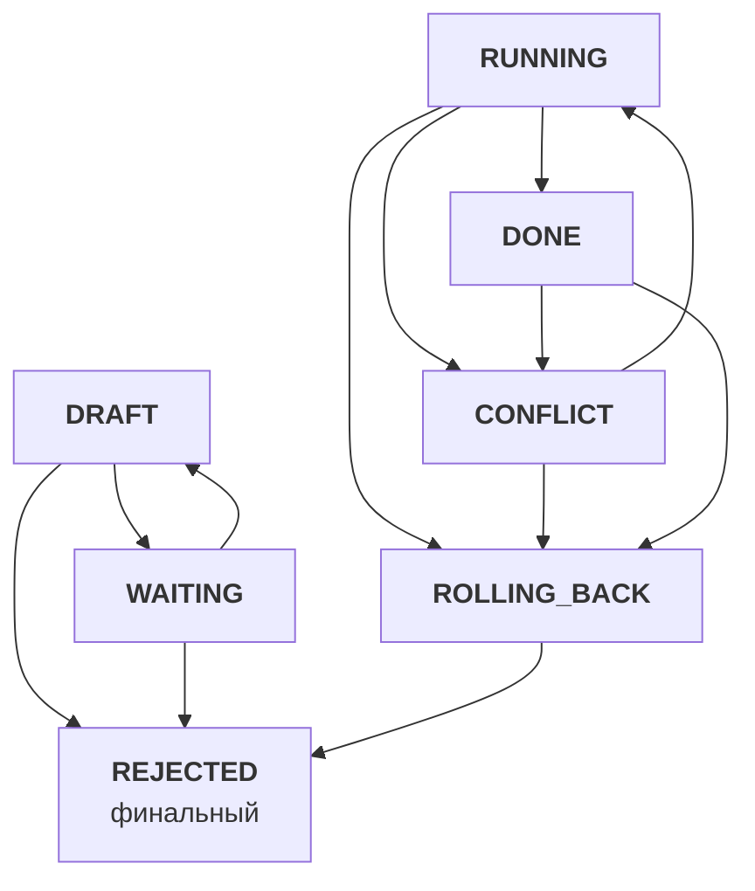
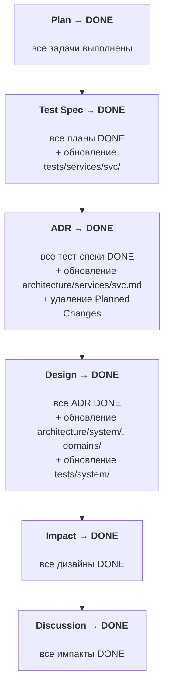

# Справочник SDD

Версия стандарта: 1.0

Общие механики Specification-Driven Development: статусы, каскады, связи, обратная связь Code→Specs, Clarify-паттерн, именование, запреты. Все объектные стандарты ссылаются на этот документ как SSOT механик.

**Полезные ссылки:**
- [Навигатор SDD](./standard-specs-workflow.md) — воркфлоу от намерения до разработки, стадии, SSOT-ссылки
- [Инструкции specs/](./README.md)
- [Архитектура specs/ (черновик)](/.claude/drafts/examples/2026-02-08-specs-architecture.md)

**Связанные документы:**

| Тип | Документ |
|-----|----------|
| Навигатор | [standard-specs-workflow.md](./standard-specs-workflow.md) |
| Валидация | — |
| Создание | — |
| Модификация | — |

## Оглавление

- [1. Связи и frontmatter](#1-связи-и-frontmatter)
- [2. Статусы](#2-статусы)
- [3. Каскады](#3-каскады)
  - [Каскад RUNNING](#каскад-running)
  - [Каскадное завершение (DONE)](#каскадное-завершение-done)
  - [Каскад REJECTED и ROLLING_BACK](#каскад-rejected-и-rolling_back)
  - [Откат артефактов](#откат-артефактов)
- [4. Обратная связь Code-Specs](#4-обратная-связь-code-specs)
  - [Фаза 1. Обнаружение](#фаза-1-обнаружение)
  - [Фаза 2. Разрешение](#фаза-2-разрешение)
  - [Примеры обратной связи](#примеры-обратной-связи)
  - [Кросс-цепочечная обратная связь](#кросс-цепочечная-обратная-связь)
- [5. Живые документы](#5-живые-документы)
- [6. Clarify и блокирующие правила](#6-clarify-и-блокирующие-правила)
  - [Clarify на каждом уровне](#clarify-на-каждом-уровне)
  - [Маркер ТРЕБУЕТ УТОЧНЕНИЯ](#маркер-требует-уточнения)
  - [Dependency Barrier](#dependency-barrier)
- [7. Именование и формат README-таблиц](#7-именование-и-формат-readme-таблиц)
- [8. Запреты](#8-запреты)
- [9. Решения](#9-решения)

---

## 1. Связи и frontmatter

Каждый объект SDD содержит frontmatter со связями:

```yaml
---
parent: impact/001-oauth2-authorization.md
children:
  - services/auth/adr/001-jwt-to-oauth2.md
  - services/gateway/adr/001-oauth2-proxy.md
status: WAITING
milestone: v1.2.0   # только в Discussion, остальные уровни наследуют
---
```

**Правила связей:**

| Объект | parent | children |
|--------|--------|----------|
| **Дискуссия** | нет | Импакт (1:1) |
| **Импакт** | Дискуссия | Дизайн (1:1) |
| **Дизайн** | Импакт | ADR(ы) |
| **ADR** | Дизайн | Тест-спек(и) |
| **Тест-спек** | ADR | План (1:1) |
| **План** | Тест-спек | нет (терминальный) |

**Milestone:** Определяется при Clarify на уровне Discussion и сохраняется в его frontmatter. Все дочерние документы наследуют milestone от Discussion. Один Milestone может содержать несколько Discussions.

---

## 2. Статусы

7 статусов жизненного цикла объекта:



| Статус | Значение |
|--------|----------|
| **DRAFT** | Документ создаётся, итерируется, ревьюится пользователем |
| **WAITING** | Пользователь согласовал. Ожидает готовности всей цепочки |
| **RUNNING** | Все уровни согласованы. Идёт реализация (код) |
| **DONE** | Реализация завершена, живые документы обновлены |
| **CONFLICT** | Обратная связь от кода требует пересмотра. Из RUNNING (прямое обнаружение) или DONE (каскад от родителя в CONFLICT) |
| **ROLLING_BACK** | Откат артефактов. Из RUNNING (пользователь отменяет / каскад), DONE (каскад от сиблинга), CONFLICT (отклонение при разрешении) |
| **REJECTED** | Отклонён (финальный). Из DRAFT/WAITING (работа не начиналась) или из ROLLING_BACK (откат завершён) |

**Допустимые переходы:**

| Из | В | Условие |
|----|---|---------|
| DRAFT | WAITING | Пользователь одобрил |
| DRAFT | REJECTED | Пользователь отклонил (работа не начиналась) |
| WAITING | DRAFT | Пользователь вернул на доработку |
| WAITING | REJECTED | Пользователь отклонил (работа не начиналась) |
| WAITING | RUNNING | Каскад — все планы в WAITING |
| RUNNING | DONE | Реализация завершена |
| RUNNING | CONFLICT | Обратная связь от кода |
| RUNNING | ROLLING_BACK | Откат (пользователь отменяет / каскад) |
| DONE | ROLLING_BACK | Каскад от сиблинга |
| DONE | CONFLICT | Каскад от родителя в CONFLICT |
| CONFLICT | RUNNING | Разрешение конфликта подтверждено |
| CONFLICT | ROLLING_BACK | Отклонение при разрешении |
| ROLLING_BACK | REJECTED | Откат завершён |

---

## 3. Каскады

### Каскад RUNNING

**Триггер:** LLM проверяет после каждого Plan → WAITING. Когда все Plans в WAITING — LLM предлагает переход через AskUserQuestion: "Все спецификации готовы. Перейти в RUNNING?" Пользователь может подтвердить (→ RUNNING) или отложить (цепочка остаётся в WAITING).

**Переход:** При подтверждении **все** документы в цепочке (от Discussion до всех Plans) одновременно переходят в RUNNING. Спецификации согласованы и переходят в режим реализации: изменения возможны только через CONFLICT-каскад (§ 4).

### Каскадное завершение (DONE)

Снизу вверх. Родитель → DONE когда **все дети DONE**.



| Триггер | Результат | Побочные эффекты |
|---------|-----------|-----------------|
| Plan → DONE | все задачи выполнены | — |
| Test Spec → DONE | все планы DONE | обновление `tests/services/{svc}/` |
| ADR → DONE | все тест-спеки DONE | обновление `architecture/services/{svc}.md`, удаление Planned Changes |
| Design → DONE | все ADR DONE | обновление `architecture/system/`, `domains/`, `tests/system/` |
| Impact → DONE | все дизайны DONE | — |
| Discussion → DONE | все импакты DONE | — |

Микс DONE/REJECTED невозможен — каскад через ROLLING_BACK гарантирует, что при отклонении одного ребёнка все сиблинги тоже откатываются, а родитель возвращается в DRAFT для пересмотра.

**Глоссарий** не участвует в каскадном завершении. Обновляется непрерывно на каждом уровне при появлении новых терминов.

### Каскад REJECTED и ROLLING_BACK

Когда документ отклоняется:

1. **Каскад вниз:** все дочерние документы — если в RUNNING/DONE → ROLLING_BACK → REJECTED, если в DRAFT/WAITING → REJECTED напрямую (рекурсивно)
2. **Каскад по сиблингам:** все братья (дети того же родителя) — аналогично: RUNNING/DONE → ROLLING_BACK → REJECTED, DRAFT/WAITING → REJECTED (+ их дети рекурсивно)
3. **Родитель → DRAFT:** общий контекст изменился — нужен пересмотр. Пользователь дорабатывает родителя → WAITING → новые дети генерируются заново

**Пример 1:** Design → 3 ADR (auth, gateway, users). ADR auth отклонён:

```
Design (RUNNING) → ADR auth (RUNNING), ADR gateway (DONE), ADR users (WAITING)
ADR auth отклоняется:
  ADR auth → ROLLING_BACK → REJECTED (откат architecture/services/auth.md)
  ├── вниз: Test Spec auth (RUNNING) → ROLLING_BACK → REJECTED
  │         Plan auth (RUNNING) → ROLLING_BACK → REJECTED (закрытие Issues)
  ├── сиблинги:
  │   ADR gateway (DONE) → ROLLING_BACK → REJECTED (откат architecture/services/gateway.md)
  │     └── Test Spec gateway (DONE) → ROLLING_BACK → REJECTED
  │         Plan gateway (DONE) → ROLLING_BACK → REJECTED (закрытие Issues)
  │   ADR users (WAITING) → REJECTED (артефактов нет)
  │     └── Test Spec users (DRAFT) → REJECTED
  └── вверх: Design → DRAFT
       Пользователь дорабатывает Design → WAITING → новые ADR генерируются
```

**Пример 2 — полный откат** (единственный ребёнок на каждом уровне):

```
ADR (RUNNING) → ROLLING_BACK → REJECTED
  ├── вниз: Test Spec (RUNNING) → ROLLING_BACK → REJECTED
  │         Plan (RUNNING) → ROLLING_BACK → REJECTED
  └── вверх: Design → DRAFT
       Если пользователь отклоняет Design (RUNNING) → ROLLING_BACK → REJECTED
       └── вверх: Impact → DRAFT
            Если пользователь отклоняет Impact (RUNNING) → ROLLING_BACK → REJECTED
            └── вверх: Discussion → DRAFT
```

На каждом уровне пользователь решает: доработать документ (→ WAITING) или отклонить (→ ROLLING_BACK если есть артефакты, → REJECTED если нет → каскад продолжается вверх).

### Откат артефактов

Когда документ переходит в ROLLING_BACK, LLM откатывает артефакты, созданные на соответствующем уровне:

| Уровень | Что откатывается |
|---------|-----------------|
| **Discussion** | Нет артефактов (no-op) |
| **Impact** | Нет артефактов (no-op) |
| **Design** | Откат изменений в `architecture/system/`, `architecture/domains/`, `tests/system/`. Удаление Planned Changes из `architecture/` |
| **ADR** | Откат изменений в `architecture/services/{svc}.md` (по дельта-блокам: ADDED удаляются, MODIFIED возвращаются к предыдущему состоянию, REMOVED восстанавливаются). Удаление Planned Changes. Откат технологических стандартов если были созданы для новой технологии |
| **Test Spec** | Откат изменений в `specs/tests/services/{svc}/` |
| **Plan** | Все Issues закрываются `--reason "not planned"` с комментарием "rolled back" ([standard-issue.md § 6](/.github/.instructions/issues/standard-issue.md#6-закрытие-issue)). Feature-ветка удаляется. Код в main отсутствует — revert не нужен ([standard-github-workflow.md](/.github/.instructions/standard-github-workflow.md): merge только после завершения всех задач дискуссии) |

После завершения отката → **REJECTED** (финальный).

**Каскад ROLLING_BACK:** При переходе документа в ROLLING_BACK все его дочерние, находящиеся в RUNNING или DONE, тоже → ROLLING_BACK. Дочерние в DRAFT/WAITING → REJECTED напрямую (артефактов нет).

---

## 4. Обратная связь Code-Specs

При разработке (статус RUNNING) код может выявить несовместимость со спецификациями. "Код" включает и результаты тестов — упавший тест является такой же обратной связью, как и обнаружение проблемы при написании кода. Проверку выполняет агент-разработчик непрерывно в процессе выполнения задач из Plan — при написании кода, запуске тестов, создании PR. Это не отдельный шаг, а часть процесса разработки. Процесс состоит из двух фаз: обнаружение масштаба (снизу вверх) и разрешение (сверху вниз).

### Фаза 1. Обнаружение

Снизу вверх: LLM проверяет каждый уровень от Plan до Discussion — "Содержание этого документа стало неверным?"

**Документ затронут**, если хотя бы одно его утверждение стало фактически неверным из-за изменений в коде (контракт API изменился, компонент удалён/добавлен, алгоритм заменён). **Документ НЕ затронут**, если его утверждения остаются верными (рефакторинг внутри пакета, оптимизация, изменение реализации без изменения контракта).

**Критерий масштаба — границы автономии из Code Map** (`architecture/services/{svc}.md` → секция "Границы автономии LLM"):

| Граница в Code Map | Уровень обратной связи | Действие |
|---|---|---|
| **Свободно** (реализация внутри пакета) | Спецификации не затронуты | Нет обратной связи |
| **Флаг** (контракты между пакетами) | Plan / Test Spec | Рабочие правки — LLM автономно обновляет документы, продолжает работу и выводит в чат краткое резюме изменений (не дожидаясь ответа). Статус не меняется. Фаза 2 не нужна |
| **CONFLICT** (API сервиса, data model, пакеты) | ADR или выше | Все затронутые документы + их дочерние → **CONFLICT**. Работы останавливаются. Проверка продолжается вверх до первого незатронутого → **СТОП**. **Исключение:** незатронутый Test Spec не означает, что ADR не затронут — проверять ADR всегда |

**Каскад CONFLICT на детей (по статусу ребёнка):**

| Статус ребёнка | Реакция |
|---|---|
| **DRAFT** | Перегенерация с учётом обновлённого родителя (остаётся DRAFT) |
| **WAITING** | → **DRAFT** (контекст изменился, нужен повторный ревью) |
| **RUNNING** | → **CONFLICT** |
| **DONE** | → **CONFLICT** (артефакты уже применены — обновляются при разрешении в Фазе 2) |
| **CONFLICT** | Учесть новые изменения в текущем разрешении |
| **REJECTED** | Не затрагивается |

**CONFLICT и сиблинги:** CONFLICT каскадирует **только вниз** (на детей), **НЕ на сиблингов**. Сиблинги затрагиваются, только если их общий родитель тоже переходит в CONFLICT (через фазу обнаружения). Это отличает CONFLICT от REJECTED: REJECTED = "решение отклонено, весь контекст невалиден" (сиблинги тоже). CONFLICT = "нужен пересмотр конкретного документа" (сиблинги могут продолжать работу).

### Фаза 2. Разрешение

Сверху вниз: начиная с самого высокого документа в CONFLICT, каждый уровень последовательно обновляется. LLM **читает весь документ целиком** и вносит точечные правки в затронутые секции, сохраняя остальной контент:

1. Переписать самый высокий затронутый документ
2. На основе обновлённого — переписать дочерние (включая бывшие DONE)
3. Продолжить вниз до Plans
4. **Для DONE-документов в CONFLICT:** LLM обновляет документ **и** артефакты (живые документы, Issues). Артефакты уже применены — обновляются на месте, без отката. Код в feature-ветке адаптируется при необходимости
5. Пользователь ревьюит все изменения → подтверждает
6. Вся цепочка CONFLICT → **RUNNING**

Если пользователь отклоняет изменения → **ROLLING_BACK** → **REJECTED** (каскад ROLLING_BACK/REJECTED).

### Примеры обратной связи

**Контекст для всех сценариев:**

```
Discussion: "Добавить OAuth2 авторизацию"
Impact: "Затронуты 3 сервиса: auth, gateway, users"
Design: "auth отвечает за токены, gateway — за rate limiting, users — за профили"
  ADR auth: "JWT с RS256, ротация ключей каждые 24ч, refresh-токены"
  ADR gateway: "Rate limiting через Redis, sliding window"
  ADR users: "Профили в PostgreSQL, кэш в Redis"
  (+ Test Spec и Plan для каждого)
```

**Сценарий 1 — затронут только ADR (сиблинги НЕ затронуты):**

При реализации auth LLM обнаружил, что RS256 слишком медленный на целевом железе. Нужен ES256. Это деталь реализации внутри auth — алгоритм подписи не влияет на Design ("auth отвечает за токены" не изменилось).

```
Фаза 1 — Обнаружение (↑):
  Plan auth затронут? → Да (другая библиотека)
  Test Spec auth затронут? → Да (другие тестовые данные для ключей)
  ADR auth затронут? → Да (RS256 → ES256) → ADR auth + дети → CONFLICT
  Design затронут? → Нет ("auth отвечает за токены" не изменилось) → СТОП

Результат:
  ADR auth, Test Spec auth, Plan auth → CONFLICT
  ADR gateway → RUNNING (rate limiting не зависит от алгоритма подписи)
  ADR users → RUNNING (профили не зависят от алгоритма подписи)

Фаза 2 — Разрешение (↓):
  1. ADR auth обновляется (RS256 → ES256)
  2. Test Spec auth пересматривается
  3. Plan auth пересматривается
  4. Пользователь подтверждает → CONFLICT → RUNNING
```

Gateway и users **продолжают реализацию**, пока auth разбирается с алгоритмом.

**Сценарий 2 — затронут Design (сиблинги затронуты через родителя):**

При реализации auth LLM обнаружил, что токены нужно валидировать не только в gateway, но и в каждом сервисе напрямую (zero-trust). Это меняет **блоки взаимодействия** в Design.

```
Фаза 1 — Обнаружение (↑):
  Plan auth затронут? → Да
  Test Spec auth затронут? → Да
  ADR auth затронут? → Да (новая архитектура валидации)
  Design затронут? → Да (блоки взаимодействия изменились —
    теперь каждый сервис напрямую валидирует токены)
    → Design → CONFLICT → ВСЕ дети:
      ADR auth, gateway, users → CONFLICT
      → ВСЕ их дети (Test Spec, Plan) → CONFLICT
  Impact затронут? → Нет ("3 сервиса затронуты" — всё ещё верно) → СТОП

Фаза 2 — Разрешение (↓):
  1. Design обновляется (новые блоки взаимодействия для валидации)
  2. ADR auth, gateway, users пересматриваются
  3. Test Spec для каждого пересматриваются
  4. Plan для каждого пересматриваются
  5. Пользователь подтверждает → всё → RUNNING
```

Все ADR получили CONFLICT **не как сиблинги**, а как **дети затронутого Design**.

**Сценарий 3 — затронут Impact (масштаб проблемы расширяется):**

При реализации zero-trust из сценария 2 LLM обнаружил, что валидация токенов нужна **во всех сервисах проекта** — включая notifications, billing, analytics. Impact изначально указывал "3 сервиса", а затронуты все.

```
Фаза 1 — Обнаружение (↑):
  Plan auth затронут? → Да
  Test Spec auth затронут? → Да
  ADR auth затронут? → Да
  Design затронут? → Да (новые секции сервисов + блоки взаимодействия)
  Impact затронут? → Да ("3 сервиса" → "все сервисы проекта")
    → Impact → CONFLICT → Design → CONFLICT
      → ВСЕ ADR, Test Spec, Plan → CONFLICT
  Discussion затронут? → Нет ("OAuth2 авторизация" не изменилось) → СТОП

Фаза 2 — Разрешение (↓):
  1. Impact обновляется ("все сервисы" + новые риски, зависимости)
  2. Design обновляется (новые секции для notifications, billing, analytics
     + обновлённые блоки взаимодействия)
  3. ADR для каждого сервиса пересматриваются (добавляются новые ADR для
     notifications, billing, analytics)
  4. Test Spec для каждого пересматриваются
  5. Plan для каждого пересматриваются
  6. Пользователь подтверждает → всё → RUNNING
```

### Кросс-цепочечная обратная связь

Когда `architecture/` обновляется (через каскад DONE или разрешение CONFLICT), проверить **все другие цепочки**, ссылающиеся на изменённые файлы. Для каждой — фаза 1 (обнаружение): стали ли утверждения документов неверными?

Реакция затронутого документа зависит от его текущего статуса:

| Статус документа | Реакция |
|---|---|
| **DRAFT** | Перегенерация с учётом нового architecture/ |
| **WAITING** | → **DRAFT** (контекст изменился, повторный ревью) |
| **RUNNING** | → **CONFLICT** (работы останавливаются) |
| **CONFLICT** | Учесть новые изменения в текущем разрешении |
| **DONE** | LLM предлагает пользователю (AskUserQuestion) создать **новую Discussion** для приведения к общему знаменателю. Новая Discussion — самостоятельная (не дочерняя), со ссылкой на затронутые цепочки в контексте. DONE-документы исходных цепочек остаются DONE. Новая Discussion проходит полный 6-уровневый цикл |
| **REJECTED** | Не обрабатывается |

Каскад на детей: если документ затронут, каждый его дочерний реагирует **по своему текущему статусу** согласно таблице выше (DRAFT-ребёнок → перегенерация, WAITING-ребёнок → DRAFT, RUNNING-ребёнок → CONFLICT и т.д.).

**Определение "кого проверять":** Planned Changes в `architecture/` показывают, какие цепочки затрагивают какие файлы. При обновлении файла — проверить все цепочки из Planned Changes + все DONE-цепочки, обновлявшие этот файл ранее.

---

## 5. Живые документы

Текущее состояние системы. Не имеют статусов — обновляются при каскаде DONE.

| Объект | Расположение | Назначение | Когда обновляется |
|--------|-------------|------------|-------------------|
| **Архитектура (системная)** | `specs/architecture/system/` | overview, data-flows, infrastructure | Design → DONE |
| **Архитектура (сервисная)** | `specs/architecture/services/{svc}.md` | компоненты, tech stack, API, data model, Code Map (навигация по коду + границы автономии LLM) | ADR → DONE (+ Planned Changes при Design → WAITING) |
| **Архитектура (доменная)** | `specs/architecture/domains/` | bounded contexts, агрегаты, события, context map | Design → DONE |
| **Тесты (системные)** | `specs/tests/system/` | межсервисные e2e, integration, load. Зеркало `/tests/` | Design → DONE |
| **Тесты (сервисные)** | `specs/tests/services/{svc}/` | e2e, integration, unit внутри сервиса. Зеркало `/src/{svc}/tests/` | Test Spec → DONE |
| **Глоссарий** | `specs/glossary/` | терминология по доменам | На каждом уровне |

**Создание vs обновление:** При первом обращении файл **создаётся** (первый Design → DONE создаёт `architecture/system/`, `architecture/domains/`, `tests/system/`; первый ADR → DONE создаёт `architecture/services/{svc}.md`; первый Test Spec → DONE создаёт `tests/services/{svc}/`). При последующих — **обновляется** (AS IS → TO BE).

---

## 6. Clarify и блокирующие правила

### Clarify на каждом уровне

Clarify — **паттерн, повторяющийся на каждом уровне**:

| Уровень | Что уточняется |
|---------|---------------|
| **Дискуссия** | Проблема, scope, требования, критерии успеха |
| **Импакт** | Какие сервисы затронуты, компоненты, скрытые зависимости |
| **Дизайн** | Распределение ответственностей, контракты API, порядок взаимодействия |
| **ADR** | Технический выбор, trade-offs, совместимость с архитектурой |
| **Тест-спек** | Типы тестов, покрытие, тестовые данные, граничные кейсы |
| **План** | Приоритеты задач, порядок реализации, ресурсы |

**Механизм:** LLM использует AskUserQuestion. LLM проходит по секциям шаблона из `standard-*.md` и для каждой определяет, достаточно ли контекста. Если после Clarify что-то осталось неясным → маркер `[ТРЕБУЕТ УТОЧНЕНИЯ]`.

**Пропуск Clarify:** Пользователь может явно указать `--auto-clarify` в сообщении чата (например: "Создай дискуссию про OAuth2, --auto-clarify") — LLM пропускает Clarify и генерирует документ на основе своего понимания, ставя маркеры `[ТРЕБУЕТ УТОЧНЕНИЯ]` где необходимо. Шаг REVIEW (одобрение пользователем) остаётся **обязательным всегда**.

**Взаимодействие с Dependency Barrier:** Clarify происходит **до** генерации и снижает количество маркеров. Dependency Barrier срабатывает **во время** генерации, когда оставшиеся маркеры создают зависимости.

### Маркер ТРЕБУЕТ УТОЧНЕНИЯ

**БЛОКИРУЮЩЕЕ. НЕПРИКАСАЕМОЕ.**

При создании или обновлении ЛЮБОГО объекта в specs/, если LLM не имеет достаточной информации:

1. **ОБЯЗАН** поставить маркер:
   ```
   [ТРЕБУЕТ УТОЧНЕНИЯ: конкретный вопрос]
   ```
2. **ЗАПРЕЩЕНО** угадывать, домысливать, делать допущения
3. **ЗАПРЕЩЕНО** продолжать генерацию зависимых объектов
4. Документ **НЕ МОЖЕТ** покинуть статус DRAFT с неразрешёнными маркерами

**Разрешение:** LLM показывает маркеры пользователю → пользователь отвечает → LLM заменяет маркер на ответ.

### Dependency Barrier

**БЛОКИРУЮЩЕЕ.**

При генерации документа LLM может ставить **независимые** маркеры `[ТРЕБУЕТ УТОЧНЕНИЯ]` и продолжать генерацию. Но если для генерации следующей секции **нужен ответ** на ранее поставленный маркер — срабатывает Dependency Barrier.

**Режим 1 — Полная генерация** (маркеры независимы друг от друга):

```markdown
## Секция А
Описание... [ТРЕБУЕТ УТОЧНЕНИЯ: какой протокол авторизации?]        ← x1

## Секция Б
Описание... [ТРЕБУЕТ УТОЧНЕНИЯ: какой SLA требуется?]               ← x2 (независим от x1)

## Секция В
Описание... [ТРЕБУЕТ УТОЧНЕНИЯ: какой формат логов?]                ← x3 (независим)
```

**Режим 2 — Барьер** (обнаружена зависимость от неразрешённого маркера):

```markdown
## Секция А
Описание... [ТРЕБУЕТ УТОЧНЕНИЯ: какой протокол авторизации?]        ← x1

## Секция Б
Описание... [ТРЕБУЕТ УТОЧНЕНИЯ: какой SLA требуется?]               ← x2

## Секция В
Описание...

---

### ⛔ DEPENDENCY BARRIER

Дальнейшая генерация остановлена: секция Г зависит от x1 (протокол авторизации).

**Требует дальнейшего описания:**

| Секция | Зависит от | Что будет описано |
|--------|-----------|-------------------|
| Секция Г: Механизм обмена токенами | x1 | Протокол обмена, формат токенов, TTL |
| Секция Д: Схема ротации секретов | x1 | Алгоритм ротации, хранение, backup |
| Секция Е: Rate limiting для API | x2 | Лимиты по тарифам, throttling |
| Секция Ж: Формат audit-лога | x3 | Поля, ротация, retention |
```

**Правило:** LLM **прекращает генерацию контента** и переключается на **перечисление** оставшихся секций с зависимостями. Экономит токены, предотвращает переписывание.

**Разрешение:** Пользователь отвечает на маркеры → LLM продолжает генерацию с точки барьера.

---

## 7. Именование и формат README-таблиц

**Именование файлов спецификаций:**

| Объект | Формат | Пример |
|--------|--------|--------|
| Дискуссия | `NNN-topic.md` | `001-oauth2-authorization.md` |
| Импакт | `NNN-topic.md` | `001-oauth2-authorization.md` |
| Дизайн | `NNN-topic.md` | `001-oauth2-service-design.md` |
| ADR | `NNN-topic.md` | `001-jwt-to-oauth2.md` |
| Тест-спек | `NNN-topic.md` | `001-oauth2-tests.md` |
| План | `topic-plan.md` | `jwt-migration-plan.md` |

`NNN` — трёхзначный автоинкремент (001, 002, ...). Нумерация **независимая** в каждой папке.

> **Исключение:** Планы используют формат `topic-plan.md` без числового префикса.

**Формат README-таблицы** (в каждой папке `discussion/`, `impact/`, `design/`, `services/{svc}/adr/`, и т.д.):

| # | Документ | Статус | Описание |
|---|----------|--------|----------|
| 001 | 001-oauth2-authorization.md | RUNNING | OAuth2 авторизация |

**Стандарты объектов** определяют конкретные колонки для своих README-таблиц. Общие колонки: `#`, `Документ`, `Статус`.

---

## 8. Запреты

**Запрет миграции:** Объекты specs/ не мигрируют между уровнями. Discussion не становится ADR. Если нужен другой уровень — создаётся новый документ с ссылкой.

**Запрет архивирования:** Нет архива. DONE-ADR никогда не удаляется — это история принятых решений.

**Очистка REJECTED:** По команде пользователя LLM собирает список REJECTED-документов (включая REJECTED-ADR) и предлагает для удаления. REJECTED-документы — отклонённые решения, не часть истории. Пользователь решает, какие удалить, какие оставить.

**Запрет версионирования файлов:** Документы не имеют файловых версий. Версионирование — через цепочку ADR: новый ADR видит AS IS из `architecture/` и определяет TO BE.

---

## 9. Решения

Архитектурные решения, относящиеся к механикам SDD (статусы, каскады, обратная связь, Clarify, живые документы, именование, запреты). Решения по навигации и воркфлоу — в [Навигаторе SDD](./standard-specs-workflow.md#8-решения).

| # | Вопрос | Решение |
|---|--------|---------|
| 5 | Дельта-спеки | **Нет**. Версионирование через цепочку ADR (AS IS / TO BE) |
| 7 | Живое состояние архитектуры | **`specs/architecture/`** — отдельная папка: system/, services/{svc}, domains/ |
| 8 | [ТРЕБУЕТ УТОЧНЕНИЯ] | **Блокирующее правило**. Документ не покидает DRAFT |
| 9 | Clarify | На **каждом** уровне через AskUserQuestion |
| 16 | Доменная архитектура | **Включена** сразу: `specs/architecture/domains/` |
| 17 | Замена документов | **SUPERSEDED убран.** DONE → остаётся DONE. Незавершённые → REJECTED |
| 22 | Обратная связь Code → Specs | **Последовательная проверка снизу вверх.** Plan/Test Spec — рабочие правки. ADR и выше — CONFLICT |
| 23 | Версионирование Discussion | DRAFT — правится на месте. RUNNING — через CONFLICT или REJECTED |
| 25 | Системная архитектура | **Папка** `architecture/system/` (overview.md, data-flows.md, infrastructure.md) |
| 26 | Обновление глоссария | **На каждом уровне** при появлении новых терминов. Не привязан к каскаду |
| 31 | Dependency Barrier | При зависимости маркера от неразрешённого → LLM прекращает генерацию |
| 33 | Модель статусов | **7 статусов:** DRAFT, WAITING, RUNNING, DONE, CONFLICT, ROLLING_BACK, REJECTED |
| 34 | Каскад REJECTED | **Вниз** (дети) + **сиблинги**. **Родитель** → DRAFT |
| 38 | Каскад CONFLICT на сиблингов | **Только вниз (дети), НЕ на сиблингов** |
| 39 | Рабочие правки Plan/Test Spec | **Автономно.** LLM обновляет, продолжает работу, информирует |
| 40 | Кросс-цепочечная обратная связь | При обновлении architecture/ проверить все другие цепочки |
| 41 | Очистка REJECTED | По команде пользователя LLM предлагает список |
| 43 | Пропуск Clarify | Только по флагу `--auto-clarify`. REVIEW обязателен |
| 44 | Milestone и Discussion | Milestone определяется при создании Discussion. Один Milestone — несколько Discussions |
| 49 | Статус ROLLING_BACK | **Добавлен.** RUNNING/DONE → ROLLING_BACK → REJECTED. Откат артефактов по уровням |
| 51 | DONE → CONFLICT | **Добавлен переход.** Артефакты обновляются на месте при разрешении |
