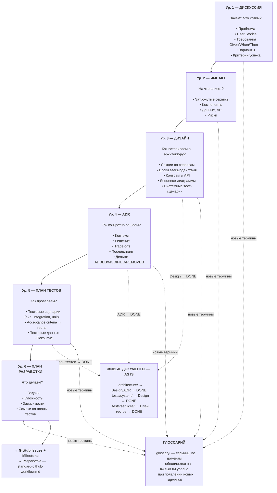
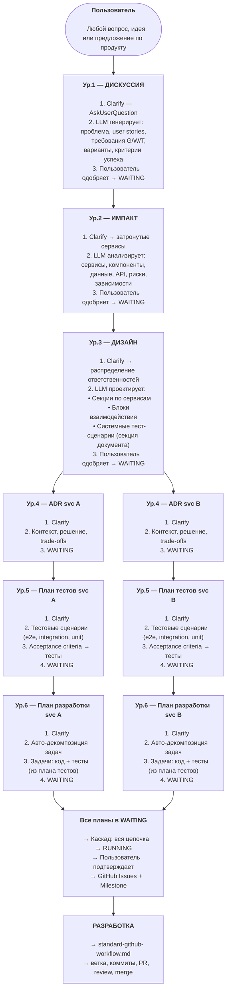
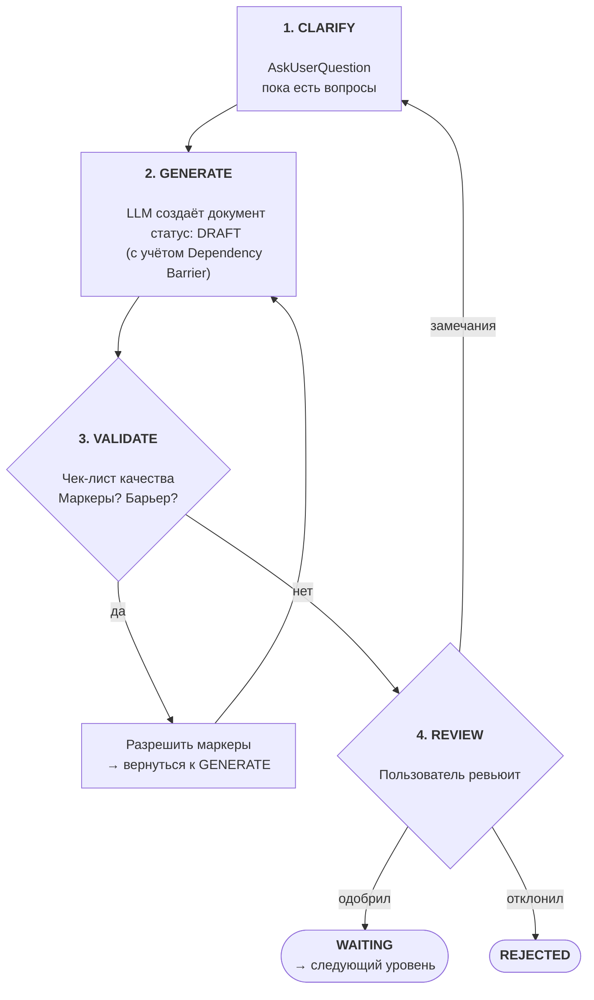

# Навигатор SDD

Версия стандарта: 1.0

Навигатор Specification-Driven Development — полный воркфлоу от намерения пользователя до разработки. Каждая стадия содержит SSOT-ссылку на стандарт объекта. Механики (статусы, каскады, frontmatter) — в [Справочнике SDD](./standard-specs-reference.md).

**Полезные ссылки:**
- [Справочник SDD](./standard-specs-reference.md) — статусы, каскады, связи, обратная связь, Clarify
- [Инструкции specs/](./README.md)
- [Архитектура specs/ (черновик)](/.claude/drafts/examples/2026-02-08-specs-architecture.md)

**Связанные документы:**

| Тип | Документ |
|-----|----------|
| Справочник | [standard-specs-reference.md](./standard-specs-reference.md) |
| Валидация | — |
| Создание | — |
| Модификация | — |

## Оглавление

- [1. Философия](#1-философия)
- [2. Шесть уровней](#2-шесть-уровней)
  - [Таблица объектов](#таблица-объектов)
  - [Дискуссия — гибкий контейнер с разделами](#дискуссия--гибкий-контейнер-с-разделами)
  - [Расширяемость](#расширяемость)
- [3. Зоны ответственности](#3-зоны-ответственности)
- [4. Воркфлоу: от намерения до разработки](#4-воркфлоу-от-намерения-до-разработки)
  - [Полная диаграмма воркфлоу](#полная-диаграмма-воркфлоу)
  - [Прямой поток](#прямой-поток)
  - [Общий паттерн объекта](#общий-паттерн-объекта)
- [5. Связи между уровнями](#5-связи-между-уровнями)
  - [Фильтрация Design → ADR](#фильтрация-design--adr)
  - [Фильтрация ADR → План тестов](#фильтрация-adr--план-тестов)
  - [Shared код (/shared/)](#shared-код-shared)
  - [Upward feedback](#upward-feedback)
- [6. Параллельные дискуссии](#6-параллельные-дискуссии)
- [7. Стандарты объектов](#7-стандарты-объектов)
- [8. Решения](#8-решения)

---

## 1. Философия

**Спецификация первична, код вторичен.** Спецификации — SSOT проекта. Код — выражение спецификаций на конкретном языке. Обслуживание проекта = эволюция спецификаций. Пользователь описывает намерение, LLM собирает остальное.

**LLM не угадывает — уточняет.** На каждом уровне иерархии LLM задаёт уточняющие вопросы (Clarify) через AskUserQuestion, пока все неясности не закрыты. Если что-то осталось неясным — ставится блокирующий маркер `[ТРЕБУЕТ УТОЧНЕНИЯ]`.

**Тесты первичны, реализация вторична (ATDD).** Тестовые сценарии определяются **до** формирования плана реализации. Разработчик (или LLM) знает, что именно нужно покрыть тестами, ещё до написания первой строки кода. Acceptance Test-Driven Development на уровне спецификаций.

**Инструкции распределены по объектам.** Нет единого файла "конституции". Принципы и правила живут в `.instructions/` каждого объекта — загружаются только при работе с ним. Шаблоны встроены в `standard-*.md` (как в остальных инструкциях проекта).

---

## 2. Шесть уровней



| Уровень | Объект | Зона | Вопрос |
|---------|--------|------|--------|
| 1 | **Дискуссия** | ЗАЧЕМ и ЧТО | Что нужно? Какие требования? |
| 2 | **Импакт** | НА ЧТО ВЛИЯЕТ | Какие сервисы затронуты? Какие риски? |
| 3 | **Дизайн** | КАК ВСТРАИВАЕМ | Как распределяем ответственности? Какие контракты? |
| 4 | **ADR** | КАК КОНКРЕТНО | Какое техническое решение для сервиса? Что меняется (ADDED/MODIFIED/REMOVED)? |
| 5 | **План тестов** | КАК ПРОВЕРЯЕМ | Как проверяем решение? Какие тестовые сценарии? |
| 6 | **План разработки** | ЧТО ДЕЛАЕМ | Какие задачи? В каком порядке? |

Поток: Дискуссия → Импакт → Дизайн → ADR(ы) → План(ы) тестов → План(ы) разработки → GitHub Issues → Разработка.

### Таблица объектов

| Объект | Зона | Расположение | Отвечает на | Родитель → Дети |
|--------|------|-------------|-------------|-----------------|
| **Дискуссия** | ЗАЧЕМ и ЧТО | `specs/discussion/` | Что нужно? Какие требования? | — → Импакт |
| **Импакт** | НА ЧТО ВЛИЯЕТ | `specs/impact/` | Какие сервисы затронуты? Какие риски? | Дискуссия → Дизайн |
| **Дизайн** | КАК ВСТРАИВАЕМ | `specs/design/` | Как распределяем ответственности? Какие контракты? | Импакт → ADR(ы) |
| **ADR** | КАК КОНКРЕТНО | `specs/services/{svc}/adr/` | Какое техническое решение для сервиса? Что меняется (ADDED/MODIFIED/REMOVED)? | Дизайн → План(ы) тестов |
| **План тестов** | КАК ПРОВЕРЯЕМ | `specs/services/{svc}/plan-test/` | Как проверяем решение? Какие тестовые сценарии? | ADR → План разработки (1:1) |
| **План разработки** | ЧТО ДЕЛАЕМ | `specs/services/{svc}/plan-dev/` | Какие задачи? В каком порядке? | План тестов → (терминальный) |

### Дискуссия — гибкий контейнер с разделами

Дискуссия — точка входа в воркфлоу. Один документ содержит **разделы**, каждый из которых покрывает свой аспект:

| Раздел | Что содержит | Пример |
|--------|-------------|--------|
| **Проблема/Контекст** | Зачем это нужно, что не работает | "Текущая авторизация не масштабируется на 10k RPS" |
| **Фичи** | Конкретная функциональность | "OAuth2 авторизация для API, управление ролями" |
| **User Stories** | Кто и что хочет сделать | "Как администратор, я хочу управлять ролями..." |
| **Требования** | Given/When/Then формат | "GIVEN авторизованный пользователь, WHEN запрос к /api/users, THEN 200 OK" |
| **Предложения** | Варианты решений, изменения к фичам и user stories | "Предлагаю заменить JWT на OAuth2" |
| **Критерии успеха** | Как понять, что задача выполнена | "Время авторизации < 100ms, поддержка 10k RPS" |
| **Milestone** | В каком Milestone хотим сделать | "v1.2.0 — релиз авторизации" |

Предложения могут **менять** фичи и user stories внутри той же дискуссии — итеративное уточнение до консенсуса. Все разделы опциональны, кроме **Milestone** — он определяется при Clarify и сохраняется во frontmatter Discussion.

### Расширяемость

Текущая иерархия — 6 уровней. Добавление нового типа объекта = новая папка + новый `standard-*.md` в `.instructions/`. Существующие связи parent→children не меняются.

---

## 3. Зоны ответственности

| Зона | Папка | Вопрос | Содержит | НЕ содержит |
|------|-------|--------|----------|-------------|
| **ЗАЧЕМ и ЧТО** | `discussion/` | Зачем это нужно? | Проблему, требования, user stories, варианты, критерии | Технические детали |
| **НА ЧТО ВЛИЯЕТ** | `impact/` | Какие сервисы затронуты? | Список сервисов, риски, зависимости | Распределение ответственностей |
| **КАК ВСТРАИВАЕМ** | `design/` | Как распределяем ответственности? | Секции `## Сервис {name}` в документе Design, блоки взаимодействия, контракты API, системные тест-сценарии | Детали реализации конкретного сервиса |
| **КАК КОНКРЕТНО** | `services/{svc}/adr/` | Какое решение для сервиса? Что меняется (ADDED/MODIFIED/REMOVED)? | Контекст, решение, trade-offs, последствия | Тестовые сценарии, задачи |
| **КАК ПРОВЕРЯЕМ** | `services/{svc}/plan-test/` | Как проверяем решение? | Тестовые сценарии (e2e, integration, unit), acceptance criteria → тесты, тестовые данные | Реализацию тестов |
| **ЧТО ДЕЛАЕМ** | `services/{svc}/plan-dev/` | Какие задачи? | Задачи, сложность, зависимости, ссылки на планы тестов | Бизнес-обоснование |
| **АРХИТЕКТУРА** | `architecture/` | Как устроена система сейчас? | Живое AS IS: system/, services/ (включая Code Map), domains/. Planned Changes | Исторические решения (в ADR) |
| **ТЕСТЫ** | `tests/` | Какие тесты существуют? | Живое AS IS: system/, services/{svc}/. Зеркало кодовой базы | Сами тесты (в /tests/ и /src/) |
| **ТЕРМИНЫ** | `glossary/` | Что означает этот термин? | Определения по доменам | Решения и требования |
| **ПРАВИЛА** | `.instructions/` | Как создавать объекты? | Стандарты, чек-листы, шаблоны | Контент спецификаций |

**Границы между specs/ и остальным проектом:**

```
specs/                        │  Остальной проект
                              │
ЗАЧЕМ, ЧТО, КАК, ПРОВЕРКА    │  РЕАЛИЗАЦИЯ
                              │
Discussion (требования)       │  src/ (код)
Impact (анализ влияния)       │  tests/ (тесты)
Design (проектирование)       │  .github/ (Issues, PR, CI/CD)
ADR (архитектурные решения)   │  config/ (конфигурации)
План тестов (тестовые сценарии) │  platform/ (инфраструктура)
План разработки (задачи)       │
                              │
architecture/ (живое AS IS)   │
tests/ (тестовые спеки)       │
glossary/ (терминология)      │
                              │
────────── граница ────────────│──────────────────────────
                              │
Спецификация говорит ЧТО      │  Код говорит КАК (технически)
```

---

## 4. Воркфлоу: от намерения до разработки

### Полная диаграмма воркфлоу



### Прямой поток

Каждый документ проходит путь DRAFT → WAITING на своём уровне, затем вся цепочка переходит в RUNNING одновременно.

1. Discussion: DRAFT → [итерации с пользователем] → WAITING
2. Impact: создаётся в DRAFT → [итерации] → WAITING
3. Design: DRAFT → [итерации] → WAITING → Planned Changes добавляются в `architecture/`
4. ADR (по каждому сервису): DRAFT → [итерации] → WAITING
5. План тестов (по каждому сервису): DRAFT → [итерации] → WAITING
6. План разработки (по каждому сервису): DRAFT → [итерации] → WAITING

7. **Когда ВСЕ планы в WAITING:**
   - ВСЕ документы в цепочке переходят в RUNNING ([каскад RUNNING](./standard-specs-reference.md#каскад-running))
   - Пользователь **отдельной командой** запускает создание GitHub Issues + Milestone
   - Начинается разработка

### Общий паттерн объекта

Каждый объект проходит одинаковый цикл:



**VALIDATE** — проверка по чек-листу из `standard-*.md` текущего объекта:
- Все обязательные секции шаблона заполнены
- Нет неразрешённых маркеров `[ТРЕБУЕТ УТОЧНЕНИЯ]`
- Dependency Barrier не нарушен (нет зависимых секций после барьера)
- Контент соответствует зоне ответственности объекта (не содержит чужого)

Весь цикл CLARIFY → GENERATE → VALIDATE → REVIEW происходит в статусе **DRAFT**. Итераций может быть сколько угодно — пользователь возвращает документ на доработку через "замечания" до тех пор, пока не одобрит (→ WAITING) или не отклонит (→ REJECTED).

---

## 5. Связи между уровнями

### Фильтрация Design → ADR

Design содержит **два типа секций**:

**Секции по сервисам** — что каждый сервис отвечает за:

| Поле | Описание |
|------|----------|
| Ответственность | Что конкретно делает этот сервис в рамках фичи |
| Компоненты | Высокоуровневый список затронутых компонентов |
| Зависимости | От каких сервисов зависит (ссылки на блоки взаимодействия) |

**Блоки взаимодействия** — как сервисы общаются:

| Поле | Описание |
|------|----------|
| Участники | Какие сервисы участвуют (provider ↔ consumer) |
| Контракт | Endpoint, формат данных, протокол |
| Паттерн | sync/async, REST/gRPC/events |
| Sequence | Диаграмма последовательности |

**Системные тест-сценарии** — секция внутри Design-документа. Описывает межсервисные тестовые сценарии (e2e, integration, load), вытекающие из блоков взаимодействия. При Design → DONE переносятся в живой `specs/tests/system/`.

**Правило чтения для ADR:** ADR для сервиса X читает:
1. **Секцию сервиса X** из Design (ответственность, компоненты)
2. **Все блоки взаимодействия**, где участвует сервис X
3. **Текущий** `architecture/services/X.md` (AS IS, включая Planned Changes)

ADR **не читает** секции других сервисов, если они не связаны с X через блок взаимодействия.

**Greenfield:** Если `architecture/services/X.md` не существует (первый ADR для сервиса), ADR создаёт начальную архитектуру — вся дельта = ADDED. Code Map создаётся при первом ADR → DONE.

**Дельта-блоки в ADR:** Каждый ADR содержит формальную секцию изменений относительно текущего `architecture/services/X.md`:

```markdown
## Дельта

### ADDED
- Пакет `auth.tokens` — управление JWT-токенами
- Endpoint `POST /api/v1/tokens/refresh`
- Таблица `refresh_tokens` в PostgreSQL

### MODIFIED
- Middleware `auth.middleware` — добавлена JWT-валидация (ранее: API-key)
- Endpoint `POST /api/v1/login` — возвращает access + refresh token (ранее: только session)

### REMOVED
- Endpoint `POST /api/v1/session` — заменён на token-based auth
- Middleware `session_middleware` — больше не используется
```

**Зачем:** Явная разметка изменений делает ADR машиночитаемым. При ADR → DONE дельта-блоки напрямую указывают, что обновить в `architecture/services/X.md`. LLM не нужно "угадывать" — список изменений формализован.

**Связь с architecture/:** Блоки ADDED добавляются, MODIFIED обновляются, REMOVED удаляются из живого документа при каскаде DONE.

### Фильтрация ADR → План тестов

План тестов для сервиса X читает:
1. **ADR сервиса X** — техническое решение, которое нужно верифицировать
2. **Требования G/W/T из Дискуссии** — acceptance criteria для маппинга в тесты
3. **Блоки взаимодействия из Дизайна**, где участвует сервис X — для интеграционных тестов
4. **Текущий** `specs/tests/services/X/` (AS IS) — существующий ландшафт тестов

План тестов определяет **что тестировать** (сценарии, данные, ожидаемые результаты). **Как** реализовать тесты — задача Плана разработки.

### Shared код (/shared/)

**Контекст:** Папка `/shared/` в кодовой базе содержит межсервисный код — контракты API (protobuf, OpenAPI), схемы событий, общие библиотеки. Этот код используется несколькими сервисами одновременно и не принадлежит ни одному конкретному сервису.

**Принцип:** `shared/` — **не сервис**. Папка `specs/services/shared/` **не создаётся**. Контент shared/ полностью описывается через существующие механизмы SDD: блоки взаимодействия в Design определяют контракты, ADR сервисов описывают создание и использование.

**Что хранится в shared/ и где описано:**

| Содержимое shared/ | Где описано в SDD | Кто владеет |
|---|---|---|
| **Контракты API** (protobuf-схемы, OpenAPI) | Design → блоки взаимодействия (контракт, формат, протокол) | Сервис-провайдер (кто предоставляет API) |
| **Схемы событий** (UserCreatedEvent и т.д.) | Design → блоки взаимодействия (паттерн: async/events) | Сервис-издатель (кто публикует событие) |
| **Общие библиотеки** (валидация, логирование) | ADR сервиса, который вводит библиотеку | Сервис-инициатор |

**Поток данных (пример — событие UserCreatedEvent):**

```
Design: блок взаимодействия "auth → notifications, billing"
  Участники: auth (publisher) ↔ notifications, billing (consumers)
  Контракт: UserCreatedEvent {user_id, email, created_at}
  Паттерн: async/events (RabbitMQ)
      ↓
ADR auth: "публикует UserCreatedEvent"
  Дельта: ADDED shared/events/user_created.py (схема события)
  Дельта: ADDED auth/events/publishers.py (публикация)

ADR notifications: "потребляет UserCreatedEvent"
  Дельта: ADDED notifications/events/handlers.py (обработка)
  Внешние зависимости: shared/events/user_created.py

ADR billing: "потребляет UserCreatedEvent"
  Дельта: ADDED billing/events/handlers.py (обработка)
  Внешние зависимости: shared/events/user_created.py
      ↓
Plan auth: задача "Создать схему UserCreatedEvent в shared/events/"
Plan notifications: задача "Реализовать обработчик UserCreatedEvent"
Plan billing: задача "Реализовать обработчик UserCreatedEvent"
      ↓
Код: shared/events/user_created.py создаётся при выполнении задачи из Plan auth
     notifications и billing зависят от этой задачи (блокирующая зависимость)
```

**Правила:**

1. **Владение изменением:** ADR сервиса-провайдера (кто создаёт/модифицирует контракт) включает дельту `ADDED`/`MODIFIED` для файлов в shared/. ADR сервисов-потребителей указывают **внешнюю зависимость** от shared/, но не включают дельту для shared/ файлов — они не владеют этими файлами

2. **Code Map:** Каждый сервис указывает зависимости от shared/ в секции "Внешние зависимости" своего `architecture/services/{svc}.md`:
   ```markdown
   ### Внешние зависимости
   - `shared/events/` — UserCreatedEvent, OrderPlacedEvent
   - `shared/contracts/` — protobuf-схемы API gateway
   ```

3. **Зависимости задач:** Задача "создать схему в shared/" (из Plan провайдера) блокирует задачи "реализовать обработчик" (из Plan потребителей). Зависимость через `**Зависит от:** #N` в GitHub Issues

4. **Обратная связь Code → Specs:** Изменение контракта в shared/ — это изменение блока взаимодействия → проверяется на уровне Design. Если контракт изменился (поля, формат, протокол) — CONFLICT уровня Design, каскад на все ADR сервисов-участников

5. **Что НЕ попадает в shared/:** Код, используемый только одним сервисом. Даже если "может пригодиться другим" — пока используется одним, живёт внутри сервиса. Выносится в shared/ только при появлении второго потребителя (через новый блок взаимодействия в Design)

### Upward feedback

При работе на уровне N может обнаружиться информация, затрагивающая уровень N-1 или выше. Обновление **обязательно**:

| Где обнаружили | Что обнаружили | Что обновить |
|----------------|----------------|--------------|
| **Импакт** | Новые требования пользователя | → Дискуссия |
| **Дизайн** | Новые технические подробности | → Импакт. Если затрагивает требования → также Дискуссия |
| **ADR** | Новые архитектурные ограничения | → Дизайн. Каскад выше при необходимости |
| **План тестов** | Непокрытые кейсы, влияющие на решение | → ADR. Каскад выше при необходимости |
| **План разработки** | Новые зависимости или риски | → План тестов / ADR. Каскад выше при необходимости |

**Правило остановки:** Каскад вверх останавливается, когда новая информация не затрагивает следующий вышестоящий уровень.

**Механика:** Если уровень N (DRAFT) обнаруживает, что уровень N-1 (WAITING) нуждается в обновлении:

1. N-1 переводится WAITING → **DRAFT**
2. Работа с N **приостанавливается**
3. LLM обновляет N-1, пользователь ревьюит → N-1 → **WAITING**
4. Работа с N **возобновляется** (с учётом обновлённого N-1)

Если каскад затрагивает N-2 и выше — аналогично: N-2 → DRAFT, работа на N-1 приостанавливается, и так до точки остановки.

Upward feedback происходит **во время проектирования** — это нормальная часть workflow. Обратный каскад Code → Specs ([§ 4 Справочника](./standard-specs-reference.md#4-обратная-связь-code-specs)) запускается **после начала разработки**.

---

## 6. Параллельные дискуссии

**Проблема:** Дискуссия А в работе, дискуссия Б стартует. Б не видит планируемых изменений от А — живые документы (`architecture/`) ещё не обновлены.

**Механизм — Planned Changes в архитектуре:**

Когда Design переходит в WAITING, в затронутых файлах `architecture/` добавляется секция:

```markdown
## Planned Changes

- **[Discussion 001: OAuth2 авторизация](../discussion/disc-0001-oauth2-authorization.md)**
  Статус: RUNNING | Затрагивает: API endpoints, data model
  Design: [design-0001-oauth2-service-design.md](../design/design-0001-oauth2-service-design.md)
```

LLM при чтении AS IS **обязан** учитывать Planned Changes. При необходимости LLM переходит по ссылке на Design и читает дочерние ADR (через frontmatter `children`) для получения конкретных дельт. Planned Changes — навигационный указатель на цепочку спецификаций, не дублирование их контента. Обогащение Planned Changes дельтами из ADR не производится: дельты могут измениться при CONFLICT, а дублирование нарушает SSOT.

Секция удаляется при обновлении живого документа (ADR → DONE) или при любом переходе связанного документа в REJECTED — включая сам Design.

Отдельных маркеров конфликта не требуется — LLM учитывает Planned Changes естественным образом при генерации Impact/Design для новых дискуссий.

---

## 7. Стандарты объектов

| Уровень | Стандарт | Путь |
|---------|----------|------|
| 1. Дискуссия | `standard-discussion.md` *(будет создан)* | [discussion/](./discussion/) |
| 2. Импакт | `standard-impact.md` *(будет создан)* | [impact/](./impact/) |
| 3. Дизайн | `standard-design.md` *(будет создан)* | [design/](./design/) |
| 4. ADR | `standard-adr.md` *(будет создан)* | [adr/](./adr/) |
| 5. План тестов | `standard-test-spec.md` *(будет создан)* | [plan-test/](./plan-test/) |
| 6. План разработки | [standard-plan.md](./plan-dev/standard-plan.md) | [plan-dev/](./plan-dev/) |
| Архитектура | [standard-architecture.md](./living-docs/architecture/standard-architecture.md) | [living-docs/architecture/](./living-docs/architecture/) |
| Тесты | `standard-tests.md` *(будет создан)* | [living-docs/tests/](./living-docs/tests/) |
| Глоссарий | `standard-glossary.md` *(будет создан)* | [living-docs/glossary/](./living-docs/glossary/) |

---

## 8. Решения

Архитектурные решения, относящиеся к навигации, уровням, воркфлоу и связям SDD. Решения по механикам (статусы, каскады, Clarify) — в [Справочнике SDD](./standard-specs-reference.md#9-решения).

| # | Вопрос | Решение |
|---|--------|---------|
| 1 | Naming входного объекта | **Дискуссия** — гибкий контейнер для фич, user stories, предложений, требований |
| 2 | Уровни иерархии | **6 уровней** (Discussion → Impact → Design → ADR → План тестов → План разработки), расширяемо |
| 3 | Уровень между Impact и ADR | **Design** (Проектирование) — распределение ответственностей, контракты, взаимодействие |
| 4 | Принципы | **Распределены** по `.instructions/` объектов |
| 6 | GitHub Issues | **Отдельная команда** после подтверждения плана *(→ standard-plan.md)* |
| 10 | Формат задач | **Структурированные блоки** (не чек-лист) *(→ standard-plan.md)* |
| 11 | Скиллы | **Создаются** при работе над каждым объектом |
| 12 | Шаблоны | **Встроены** в `standard-*.md` |
| 13 | Оркестратор | Диаграммы + описания шагов + ссылки на SSOT стандартов |
| 14 | Существующие инструкции specs/ | **Анализируем** отдельно. Применимое — применяем, остальное устарело |
| 15 | Тестовые спецификации | **Два типа.** Системные — секция в Design, при DONE → `specs/tests/system/`. Сервисные — уровень 5 |
| 18 | Fast Track | **Нет**. Всегда 6 уровней. Единообразие важнее скорости |
| 19 | Связь с разработкой | Plan → Issues → Development (standard-github-workflow.md). Точка выхода из specs/ |
| 20 | Глоссарий | **Папка** `specs/glossary/` (по доменам) |
| 21 | Cross-cutting concerns (NFR) | **Через Discussion**. Обычный 6-уровневый поток |
| 24 | Именование: src/ vs services/ | **Оставляем как есть**. `src/` для кода, `services/` в specs — семантика |
| 27 | Фильтрация Design → ADR | ADR читает свою секцию + блоки взаимодействия своего сервиса. Не читает чужие |
| 28 | Upward feedback | Обязательное обновление вышестоящих. Каскад вверх до точки остановки |
| 29 | Уровень План тестов (ATDD) | **Уровень 5** между ADR и План разработки. Тесты определяются ДО плана разработки |
| 30 | Параллельные дискуссии | **Planned Changes в architecture/**. Маркеры конфликта не нужны |
| 32 | Системные тест-сценарии | **Секция в Design**. При DONE → `specs/tests/system/` |
| 35 | Документирование кода в src/ | **Code Map** — секция в `architecture/services/{svc}.md` *(→ standard-architecture.md)* |
| 36 | Технологические стандарты | **`.instructions/technologies/`** — пара standard + validation *(→ Этап 3)* |
| 37 | Порядок разделов | **Перегруппировка** по логическим блокам |
| 42 | Точка входа в SDD | Rule в `.claude/rules/` — при вводе функциональности начинать с Discussion |
| 45 | Специализированные агенты | **Запланированы** — агенты по уровням (импакт, дизайнер, ADR, тестировщик, планировщик, разработчик) |
| 46 | Группировка мелких изменений | Мелкие баг-фиксы **группируются** в одну Discussion. 6 уровней сохраняются |
| 47 | Дельта-блоки в ADR | Формальная секция ADDED/MODIFIED/REMOVED относительно `architecture/services/X.md` |
| 48 | Task management в План разработки | **Структурированные блоки** с полями: сложность, приоритет, зависимости, план тестов, дельта *(→ standard-plan.md)* |
| 50 | Shared код (/shared/) | **Не сервис.** Контракты в Design (блоки взаимодействия), создание — ADR провайдера |
