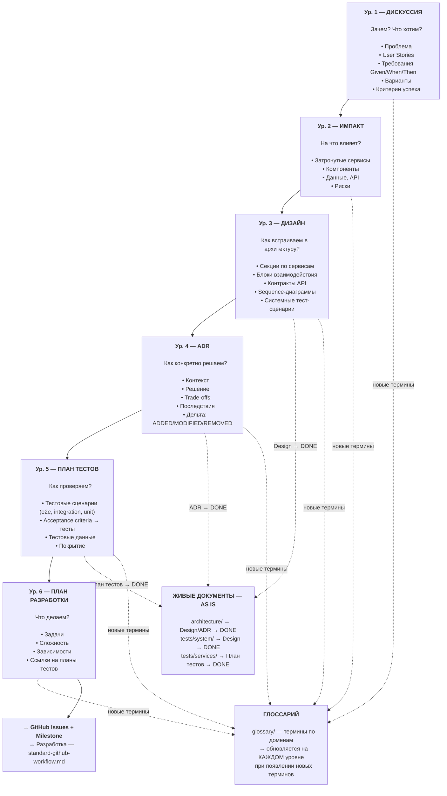
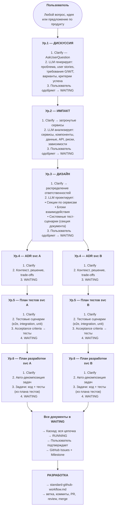
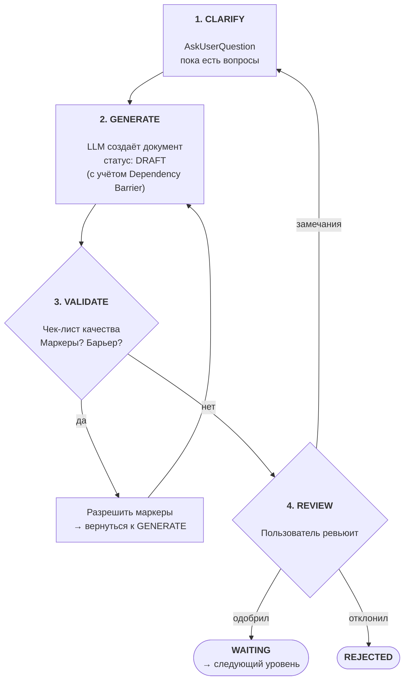
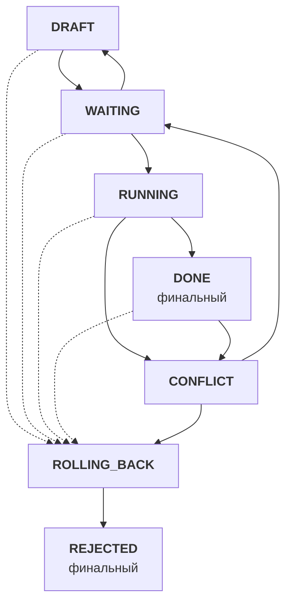
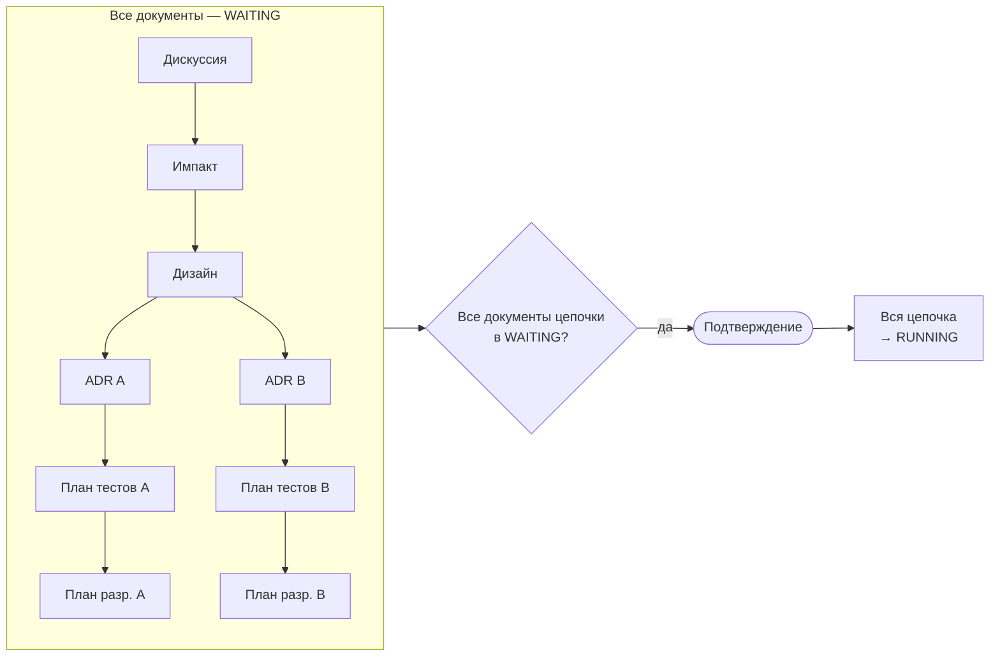
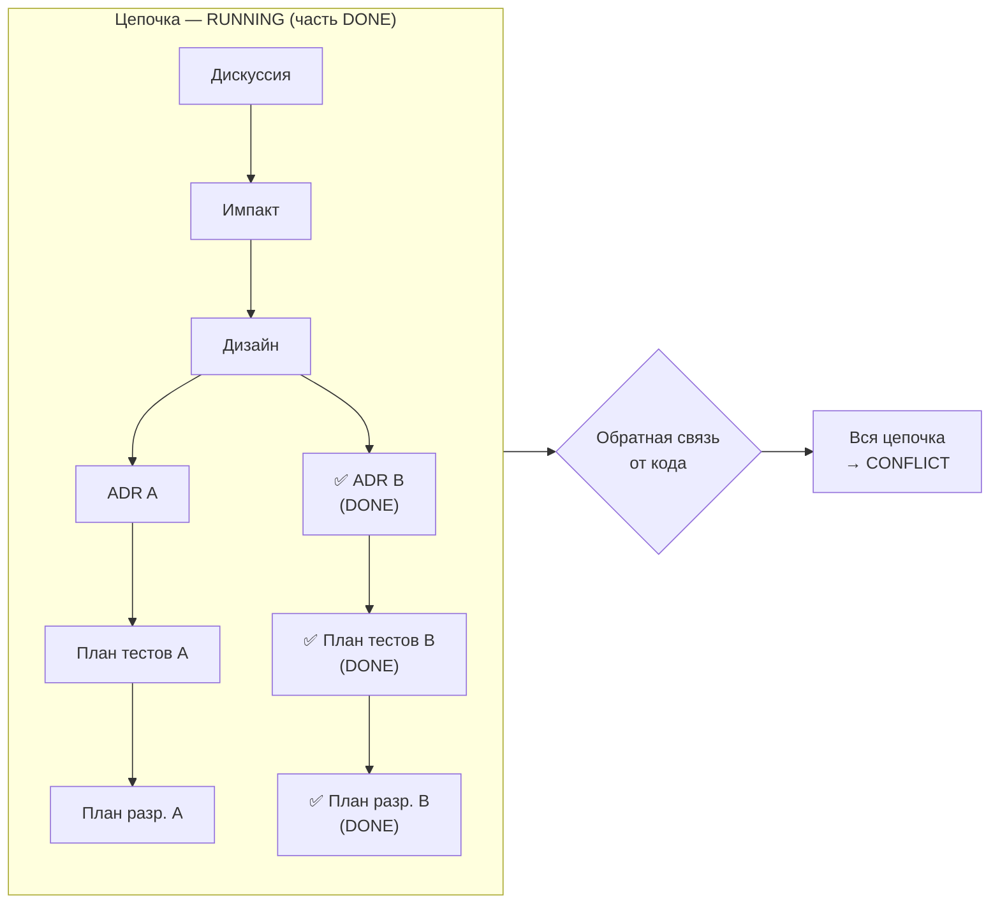
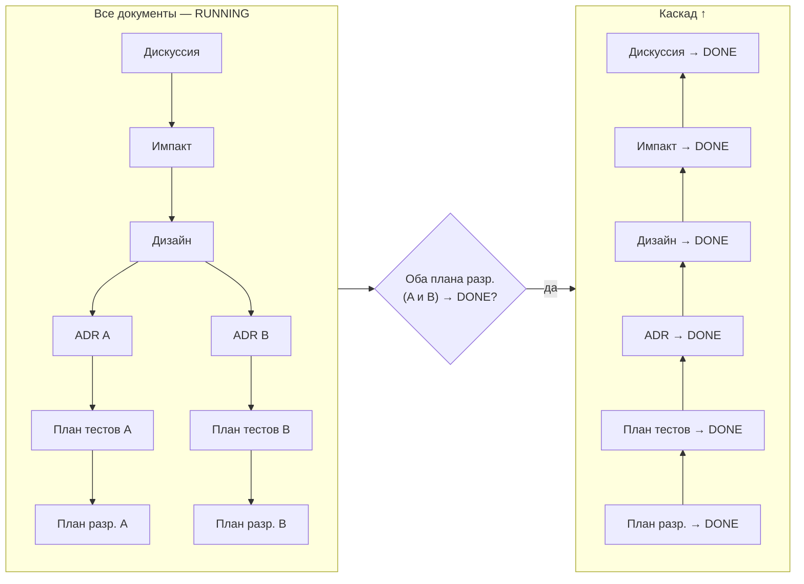
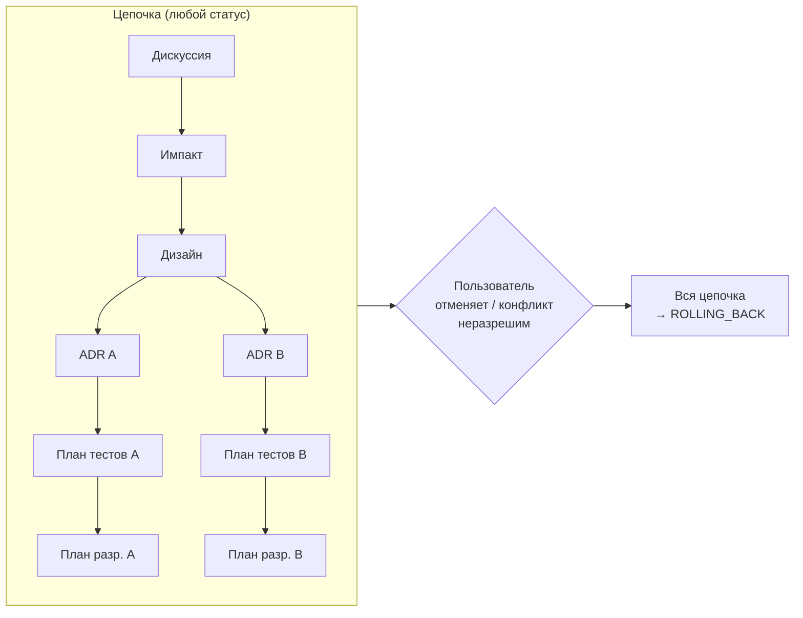

# Стандарт SDD

Версия стандарта: 1.0

Полное описание Specification-Driven Development: философия, уровни, зоны ответственности, воркфлоу, статусы, каскады, связи parent→children, обратная связь Code→Specs, Clarify-паттерн, живые документы, именование, запреты. Все объектные стандарты ссылаются на этот документ как SSOT.

**Полезные ссылки:**
- [Инструкции specs/](./README.md)
- [Архитектура specs/ (черновик)](/.claude/drafts/examples/2026-02-08-specs-architecture.md)

**Связанные документы:**

| Тип | Документ |
|-----|----------|
| Валидация | — |
| Создание | — |
| Модификация | — |

## Оглавление

- [1. Философия](#1-философия)
- [2. Шесть уровней](#2-шесть-уровней)
  - [Таблица объектов](#таблица-объектов)
  - [Дискуссия — гибкий контейнер с разделами](#дискуссия--гибкий-контейнер-с-разделами)
  - [Расширяемость](#расширяемость)
- [3. Зоны ответственности](#3-зоны-ответственности)
- [4. Связи и frontmatter](#4-связи-и-frontmatter)
- [5. Воркфлоу: от намерения до разработки](#5-воркфлоу-от-намерения-до-разработки)
  - [Полная диаграмма воркфлоу](#полная-диаграмма-воркфлоу)
  - [Прямой поток](#прямой-поток)
  - [Общий паттерн объекта](#общий-паттерн-объекта)
- [6. Связи между уровнями](#6-связи-между-уровнями)
  - [Фильтрация Design to ADR](#фильтрация-design-to-adr)
  - [Фильтрация ADR to План тестов](#фильтрация-adr-to-план-тестов)
  - [Shared код (/shared/)](#shared-код-shared)
  - [Upward feedback](#upward-feedback)
- [7. Статусы](#7-статусы)
- [8. Последовательность статусов](#8-последовательность-статусов)
  - [8.1 DRAFT to WAITING](#81-draft-to-waiting)
  - [8.2 WAITING to RUNNING](#82-waiting-to-running)
  - [8.3 RUNNING to CONFLICT](#83-running-to-conflict)
  - [8.4 CONFLICT to WAITING](#84-conflict-to-waiting)
  - [8.5 RUNNING to DONE](#85-running-to-done)
  - [8.6 to ROLLING_BACK](#86-to-rolling_back)
  - [8.7 ROLLING_BACK to REJECTED](#87-rolling_back-to-rejected)
- [9. Живые документы](#9-живые-документы)
  - [9.1 Обновление при планировании (to WAITING)](#91-обновление-при-планировании-to-waiting)
  - [9.2 Конфликт исполнения (CONFLICT)](#92-конфликт-исполнения-conflict)
  - [9.3 Обновление при реализации (to DONE)](#93-обновление-при-реализации-to-done)
  - [9.4 Параллельные дискуссии](#94-параллельные-дискуссии)
- [10. Clarify и блокирующие правила](#10-clarify-и-блокирующие-правила)
  - [Clarify на каждом уровне](#clarify-на-каждом-уровне)
  - [Маркер ТРЕБУЕТ УТОЧНЕНИЯ](#маркер-требует-уточнения)
  - [Dependency Barrier](#dependency-barrier)
- [11. Именование и формат README-таблиц](#11-именование-и-формат-readme-таблиц)
- [12. Запреты](#12-запреты)
- [13. Стандарты объектов](#13-стандарты-объектов)
- [14. Решения](#14-решения)

---

## 1. Философия

**Спецификация первична, код вторичен.** Спецификации — SSOT проекта. Код — выражение спецификаций на конкретном языке. Обслуживание проекта = эволюция спецификаций. Пользователь описывает намерение, LLM собирает остальное.

**LLM не угадывает — уточняет.** На каждом уровне иерархии LLM задаёт уточняющие вопросы (Clarify) через AskUserQuestion, пока все неясности не закрыты. Если что-то осталось неясным — ставится блокирующий маркер `[ТРЕБУЕТ УТОЧНЕНИЯ]`.

**Тесты первичны, реализация вторична (ATDD).** Тестовые сценарии определяются **до** формирования плана реализации. Разработчик (или LLM) знает, что именно нужно покрыть тестами, ещё до написания первой строки кода. Acceptance Test-Driven Development на уровне спецификаций.

**Инструкции распределены по объектам.** Нет единого файла "конституции". Принципы и правила живут в `.instructions/` каждого объекта — загружаются только при работе с ним. Шаблоны встроены в `standard-*.md` (как в остальных инструкциях проекта).

---

## 2. Шесть уровней



| Уровень | Объект | Зона | Вопрос |
|---------|--------|------|--------|
| 1 | **Дискуссия** | ЗАЧЕМ и ЧТО | Что нужно? Какие требования? |
| 2 | **Импакт** | НА ЧТО ВЛИЯЕТ | Какие сервисы **предположительно** затронуты? Какие риски? (ПРЕДЛАГАЕТ, не РЕШАЕТ) |
| 3 | **Дизайн** | КАК ВСТРАИВАЕМ | Как распределяем ответственности? Какие контракты? |
| 4 | **ADR** | КАК КОНКРЕТНО | Какое техническое решение для сервиса? Что меняется (ADDED/MODIFIED/REMOVED)? |
| 5 | **План тестов** | КАК ПРОВЕРЯЕМ | Как проверяем решение? Какие тестовые сценарии? |
| 6 | **План разработки** | ЧТО ДЕЛАЕМ | Какие задачи? В каком порядке? |

Поток: Дискуссия → Импакт → Дизайн → ADR(ы) → План(ы) тестов → План(ы) разработки → GitHub Issues → Разработка.

### Таблица объектов

| Объект | Зона | Расположение | Отвечает на | Родитель → Дети |
|--------|------|-------------|-------------|-----------------|
| **Дискуссия** | ЗАЧЕМ и ЧТО | `specs/discussion/` | Что нужно? Какие требования? | — → Импакт |
| **Импакт** | НА ЧТО ВЛИЯЕТ | `specs/impact/` | Какие сервисы предположительно затронуты? Какие риски? Читает `architecture/` | Дискуссия → Дизайн |
| **Дизайн** | КАК ВСТРАИВАЕМ | `specs/design/` | Как распределяем ответственности? Какие контракты? | Импакт → ADR(ы) |
| **ADR** | КАК КОНКРЕТНО | `specs/services/{svc}/adr/` | Какое техническое решение для сервиса? Что меняется (ADDED/MODIFIED/REMOVED)? | Дизайн → План(ы) тестов |
| **План тестов** | КАК ПРОВЕРЯЕМ | `specs/services/{svc}/plan-test/` | Как проверяем решение? Какие тестовые сценарии? | ADR → План разработки (1:1) |
| **План разработки** | ЧТО ДЕЛАЕМ | `specs/services/{svc}/plan-dev/` | Какие задачи? В каком порядке? | План тестов → (терминальный) |

### Дискуссия — гибкий контейнер с разделами

Дискуссия — точка входа в воркфлоу. Один документ содержит **разделы**, каждый из которых покрывает свой аспект:

| Раздел | Что содержит | Пример |
|--------|-------------|--------|
| **Проблема/Контекст** | Зачем это нужно, что не работает | "Текущая авторизация не масштабируется на 10k RPS" |
| **Фичи** | Конкретная функциональность | "OAuth2 авторизация для API, управление ролями" |
| **User Stories** | Кто и что хочет сделать | "Как администратор, я хочу управлять ролями..." |
| **Требования** | Given/When/Then формат | "GIVEN авторизованный пользователь, WHEN запрос к /api/users, THEN 200 OK" |
| **Предложения** | Варианты решений, изменения к фичам и user stories | "Предлагаю заменить JWT на OAuth2" |
| **Критерии успеха** | Как понять, что задача выполнена | "Время авторизации < 100ms, поддержка 10k RPS" |
| **Milestone** | В каком Milestone хотим сделать | "v1.2.0 — релиз авторизации" |

Предложения могут **менять** фичи и user stories внутри той же дискуссии — итеративное уточнение до консенсуса. Все разделы опциональны, кроме **Milestone** — он определяется при Clarify и сохраняется во frontmatter Discussion.

### Расширяемость

Текущая иерархия — 6 уровней. Добавление нового типа объекта = новая папка + новый `standard-*.md` в `.instructions/`. Существующие связи parent→children не меняются.

---

## 3. Зоны ответственности

| Зона | Папка | Вопрос | Содержит | НЕ содержит |
|------|-------|--------|----------|-------------|
| **ЗАЧЕМ и ЧТО** | `discussion/` | Зачем это нужно? | Проблему, требования, user stories, варианты, критерии | Технические детали |
| **НА ЧТО ВЛИЯЕТ** | `impact/` | Какие сервисы предположительно затронуты? | Варианты затронутых сервисов, shared-компоненты, планы создания новых сервисов, риски, зависимости. Источник: `architecture/` | Окончательное распределение ответственностей (→ Design РЕШАЕТ) |
| **КАК ВСТРАИВАЕМ** | `design/` | Как распределяем ответственности? (РЕШАЕТ) | Принимает предложения Impact и РЕШАЕТ распределение. Секции `## Сервис {name}`, блоки взаимодействия, контракты API, системные тест-сценарии. Создаёт новые сервисы при необходимости | Детали реализации конкретного сервиса |
| **КАК КОНКРЕТНО** | `services/{svc}/adr/` | Какое решение для сервиса? Что меняется (ADDED/MODIFIED/REMOVED)? | Контекст, решение, trade-offs, последствия | Тестовые сценарии, задачи |
| **КАК ПРОВЕРЯЕМ** | `services/{svc}/plan-test/` | Как проверяем решение? | Тестовые сценарии (e2e, integration, unit), acceptance criteria → тесты, тестовые данные | Реализацию тестов |
| **ЧТО ДЕЛАЕМ** | `services/{svc}/plan-dev/` | Какие задачи? | Задачи, сложность, зависимости, ссылки на планы тестов | Бизнес-обоснование |
| **АРХИТЕКТУРА** | `architecture/` | Как устроена система сейчас? | Живое AS IS: system/, services/ (включая Code Map), domains/. Planned Changes | Исторические решения (в ADR) |
| **ТЕСТЫ** | `tests/` | Какие тесты существуют? | Живое AS IS: system/, services/{svc}/. Зеркало кодовой базы | Сами тесты (в /tests/ и /src/) |
| **ТЕРМИНЫ** | `glossary/` | Что означает этот термин? | Определения по доменам | Решения и требования |
| **ПРАВИЛА** | `.instructions/` | Как создавать объекты? | Стандарты, чек-листы, шаблоны | Контент спецификаций |

**Impact → Design (ПРЕДЛАГАТЕЛЬ → РЕШАТЕЛЬ):**

Impact быстро сканирует `architecture/` и **предлагает** варианты затронутых сервисов (1-3 варианта). Impact не принимает окончательных решений — он выявляет зоны влияния и сомнения. Если компонент может использоваться несколькими сервисами — маркирует как "shared". Если нужного сервиса не существует — предлагает "план создания сервиса".

Design **принимает** все предложения и сомнения Impact и **РЕШАЕТ**: думает на масштабирование, окончательно распределяет ответственности, создаёт новые сервисы с архитектурными инкрементами, обрабатывает нераспределённую функциональность.

**Границы между specs/ и остальным проектом:**

```
specs/                        │  Остальной проект
                              │
ЗАЧЕМ, ЧТО, КАК, ПРОВЕРКА    │  РЕАЛИЗАЦИЯ
                              │
Discussion (требования)       │  src/ (код)
Impact (анализ влияния)       │  tests/ (тесты)
Design (проектирование)       │  .github/ (Issues, PR, CI/CD)
ADR (архитектурные решения)   │  config/ (конфигурации)
План тестов (тестовые сценарии) │  platform/ (инфраструктура)
План разработки (задачи)       │
                              │
architecture/ (живое AS IS)   │
tests/ (тестовые спеки)       │
glossary/ (терминология)      │
                              │
────────── граница ────────────│──────────────────────────
                              │
Спецификация говорит ЧТО      │  Код говорит КАК (технически)
```

---

## 4. Связи и frontmatter

**SSOT frontmatter:** [standard-frontmatter.md](/.structure/.instructions/standard-frontmatter.md) ([§ 1 — базовые поля](/.structure/.instructions/standard-frontmatter.md#1-обязательные-поля) + [§ 4 — поля specs](/.structure/.instructions/standard-frontmatter.md#4-дополнительные-поля-для-спецификаций-specs))

Документы specs/ используют стандарт frontmatter проекта — все обязательные поля и дополнительные поля:

| Поле | Тип | Обязательность | Описание |
|------|-----|----------------|----------|
| `parent` | строка (путь) | Обязательно (кроме Discussion) | Путь к родительскому документу |
| `children` | список путей | Обязательно (кроме plan-dev) | Пути к дочерним документам |
| `status` | строка | Обязательно | Текущий статус ([§ 7](#7-статусы)) |
| `milestone` | строка | Обязательно | Целевой Milestone (наследуется дочерними) |

```yaml
---
description: ADR auth-сервиса — переход на OAuth2 с JWT RS256, ротация ключей, refresh-токены.
standard: specs/.instructions/adr/standard-adr.md
standard-version: v1.0
index: specs/services/auth/adr/README.md
parent: design/design-0001-oauth2-service-design.md
children:
  - services/auth/plan-test/plan-test-0001-oauth2-tests.md
status: WAITING
milestone: v1.2.0
---
```

**Правила связей:**

| Объект | parent | children |
|--------|--------|----------|
| **Дискуссия** | нет | Импакт (1:1) |
| **Импакт** | Дискуссия | Дизайн (1:1) |
| **Дизайн** | Импакт | ADR(ы) |
| **ADR** | Дизайн | План(ы) тестов |
| **План тестов** | ADR | План разработки (1:1) |
| **План разработки** | План тестов | нет (терминальный) |

**Milestone:** Определяется при Clarify на уровне Discussion и сохраняется в его frontmatter. Все дочерние документы наследуют milestone от Discussion. Один Milestone может содержать несколько Discussions.

---

## 5. Воркфлоу: от намерения до разработки

### Полная диаграмма воркфлоу



### Прямой поток

Каждый документ проходит путь DRAFT → WAITING на своём уровне, затем вся цепочка переходит в RUNNING одновременно.

1. Discussion: DRAFT → [итерации с пользователем] → WAITING
2. Impact: создаётся в DRAFT → [итерации] → WAITING
3. Design: DRAFT → [итерации] → WAITING → Planned Changes добавляются в `architecture/`
4. ADR (по каждому сервису): DRAFT → [итерации] → WAITING
5. План тестов (по каждому сервису): DRAFT → [итерации] → WAITING
6. План разработки (по каждому сервису): DRAFT → [итерации] → WAITING

7. **Когда ВСЕ документы цепочки в WAITING:**
   - ВСЕ документы в цепочке переходят в RUNNING ([§ 8.2](#82-waiting-to-running))
   - Пользователь **отдельной командой** запускает создание GitHub Issues + Milestone
   - Начинается разработка

### Общий паттерн объекта

Каждый объект проходит одинаковый цикл:



**VALIDATE** — проверка по чек-листу из `standard-*.md` текущего объекта:
- Все обязательные секции шаблона заполнены
- Нет неразрешённых маркеров `[ТРЕБУЕТ УТОЧНЕНИЯ]`
- Dependency Barrier не нарушен (нет зависимых секций после барьера)
- Контент соответствует зоне ответственности объекта (не содержит чужого)

Весь цикл CLARIFY → GENERATE → VALIDATE → REVIEW происходит в статусе **DRAFT**. Итераций может быть сколько угодно — пользователь возвращает документ на доработку через "замечания" до тех пор, пока не одобрит (→ WAITING) или не отклонит (→ REJECTED).

---

## 6. Связи между уровнями

### Фильтрация Design to ADR

Design содержит **два типа секций**:

**Секции по сервисам** — что каждый сервис отвечает за:

| Поле | Описание |
|------|----------|
| Ответственность | Что конкретно делает этот сервис в рамках фичи |
| Компоненты | Высокоуровневый список затронутых компонентов |
| Зависимости | От каких сервисов зависит (ссылки на блоки взаимодействия) |

**Блоки взаимодействия** — как сервисы общаются:

| Поле | Описание |
|------|----------|
| Участники | Какие сервисы участвуют (provider ↔ consumer) |
| Контракт | Endpoint, формат данных, протокол |
| Паттерн | sync/async, REST/gRPC/events |
| Sequence | Диаграмма последовательности |

**Системные тест-сценарии** — секция внутри Design-документа. Описывает межсервисные тестовые сценарии (e2e, integration, load), вытекающие из блоков взаимодействия. При Design → DONE переносятся в живой `specs/tests/system/`.

**Правило чтения для ADR:** ADR для сервиса X читает:
1. **Секцию сервиса X** из Design (ответственность, компоненты)
2. **Все блоки взаимодействия**, где участвует сервис X
3. **Текущий** `architecture/services/X.md` (AS IS, включая Planned Changes)

ADR **не читает** секции других сервисов, если они не связаны с X через блок взаимодействия.

**Greenfield:** Если `architecture/services/X.md` не существует (первый ADR для сервиса), ADR создаёт начальную архитектуру — вся дельта = ADDED. Code Map создаётся при первом ADR → DONE.

**Дельта-блоки в ADR:** Каждый ADR содержит формальную секцию изменений относительно текущего `architecture/services/X.md`:

```markdown
## Дельта

### ADDED
- Пакет `auth.tokens` — управление JWT-токенами
- Endpoint `POST /api/v1/tokens/refresh`
- Таблица `refresh_tokens` в PostgreSQL

### MODIFIED
- Middleware `auth.middleware` — добавлена JWT-валидация (ранее: API-key)
- Endpoint `POST /api/v1/login` — возвращает access + refresh token (ранее: только session)

### REMOVED
- Endpoint `POST /api/v1/session` — заменён на token-based auth
- Middleware `session_middleware` — больше не используется
```

**Зачем:** Явная разметка изменений делает ADR машиночитаемым. При ADR → DONE дельта-блоки напрямую указывают, что обновить в `architecture/services/X.md`. LLM не нужно "угадывать" — список изменений формализован.

**Связь с architecture/:** Блоки ADDED добавляются, MODIFIED обновляются, REMOVED удаляются из живого документа при каскаде DONE.

### Фильтрация ADR to План тестов

План тестов для сервиса X читает:
1. **ADR сервиса X** — техническое решение, которое нужно верифицировать
2. **Требования G/W/T из Дискуссии** — acceptance criteria для маппинга в тесты
3. **Блоки взаимодействия из Дизайна**, где участвует сервис X — для интеграционных тестов
4. **Текущий** `specs/tests/services/X/` (AS IS) — существующий ландшафт тестов

План тестов определяет **что тестировать** (сценарии, данные, ожидаемые результаты). **Как** реализовать тесты — задача Плана разработки.

### Shared код (/shared/)

**Контекст:** Папка `/shared/` в кодовой базе содержит межсервисный код — контракты API (protobuf, OpenAPI), схемы событий, общие библиотеки. Этот код используется несколькими сервисами одновременно и не принадлежит ни одному конкретному сервису.

**Принцип:** `shared/` — **не сервис**. Папка `specs/services/shared/` **не создаётся**. Контент shared/ полностью описывается через существующие механизмы SDD: блоки взаимодействия в Design определяют контракты, ADR сервисов описывают создание и использование.

**Что хранится в shared/ и где описано:**

| Содержимое shared/ | Где описано в SDD | Кто владеет |
|---|---|---|
| **Контракты API** (protobuf-схемы, OpenAPI) | Design → блоки взаимодействия (контракт, формат, протокол) | Сервис-провайдер (кто предоставляет API) |
| **Схемы событий** (UserCreatedEvent и т.д.) | Design → блоки взаимодействия (паттерн: async/events) | Сервис-издатель (кто публикует событие) |
| **Общие библиотеки** (валидация, логирование) | ADR сервиса, который вводит библиотеку | Сервис-инициатор |

**Поток данных (пример — событие UserCreatedEvent):**

```
Design: блок взаимодействия "auth → notifications, billing"
  Участники: auth (publisher) ↔ notifications, billing (consumers)
  Контракт: UserCreatedEvent {user_id, email, created_at}
  Паттерн: async/events (RabbitMQ)
      ↓
ADR auth: "публикует UserCreatedEvent"
  Дельта: ADDED shared/events/user_created.py (схема события)
  Дельта: ADDED auth/events/publishers.py (публикация)

ADR notifications: "потребляет UserCreatedEvent"
  Дельта: ADDED notifications/events/handlers.py (обработка)
  Внешние зависимости: shared/events/user_created.py

ADR billing: "потребляет UserCreatedEvent"
  Дельта: ADDED billing/events/handlers.py (обработка)
  Внешние зависимости: shared/events/user_created.py
      ↓
Plan auth: задача "Создать схему UserCreatedEvent в shared/events/"
Plan notifications: задача "Реализовать обработчик UserCreatedEvent"
Plan billing: задача "Реализовать обработчик UserCreatedEvent"
      ↓
Код: shared/events/user_created.py создаётся при выполнении задачи из Plan auth
     notifications и billing зависят от этой задачи (блокирующая зависимость)
```

**Правила:**

1. **Владение изменением:** ADR сервиса-провайдера (кто создаёт/модифицирует контракт) включает дельту `ADDED`/`MODIFIED` для файлов в shared/. ADR сервисов-потребителей указывают **внешнюю зависимость** от shared/, но не включают дельту для shared/ файлов — они не владеют этими файлами

2. **Code Map:** Каждый сервис указывает зависимости от shared/ в секции "Внешние зависимости" своего `architecture/services/{svc}.md`:
   ```markdown
   ### Внешние зависимости
   - `shared/events/` — UserCreatedEvent, OrderPlacedEvent
   - `shared/contracts/` — protobuf-схемы API gateway
   ```

3. **Зависимости задач:** Задача "создать схему в shared/" (из Plan провайдера) блокирует задачи "реализовать обработчик" (из Plan потребителей). Зависимость через `**Зависит от:** #N` в GitHub Issues

4. **Обратная связь Code → Specs:** Изменение контракта в shared/ — это изменение блока взаимодействия → проверяется на уровне Design. Если контракт изменился (поля, формат, протокол) — CONFLICT уровня Design, каскад на все ADR сервисов-участников

5. **Что НЕ попадает в shared/:** Код, используемый только одним сервисом. Даже если "может пригодиться другим" — пока используется одним, живёт внутри сервиса. Выносится в shared/ только при появлении второго потребителя (через новый блок взаимодействия в Design)

### Upward feedback

При работе на уровне N может обнаружиться информация, затрагивающая уровень N-1 или выше. Обновление **обязательно**:

| Где обнаружили | Что обнаружили | Что обновить |
|----------------|----------------|--------------|
| **Импакт** | Новые требования пользователя | → Дискуссия |
| **Дизайн** | Новые технические подробности | → Импакт. Если затрагивает требования → также Дискуссия |
| **ADR** | Новые архитектурные ограничения | → Дизайн. Каскад выше при необходимости |
| **План тестов** | Непокрытые кейсы, влияющие на решение | → ADR. Каскад выше при необходимости |
| **План разработки** | Новые зависимости или риски | → План тестов / ADR. Каскад выше при необходимости |

**Правило остановки:** Каскад вверх останавливается, когда новая информация не затрагивает следующий вышестоящий уровень.

**Механика:** Если уровень N (DRAFT) обнаруживает, что уровень N-1 (WAITING) нуждается в обновлении:

1. N-1 переводится WAITING → **DRAFT**
2. Работа с N **приостанавливается**
3. LLM обновляет N-1, пользователь ревьюит → N-1 → **WAITING**
4. Работа с N **возобновляется** (с учётом обновлённого N-1)

Если каскад затрагивает N-2 и выше — аналогично: N-2 → DRAFT, работа на N-1 приостанавливается, и так до точки остановки.

Upward feedback происходит **во время проектирования** — это нормальная часть workflow. Обратный каскад Code → Specs ([§ 8.3](#83-running-to-conflict)) запускается **после начала разработки**.

---

## 7. Статусы

7 статусов жизненного цикла. Статус хранится в frontmatter каждого документа, но большинство переходов — **tree-level** (все документы цепочки переходят одновременно):



| Статус | Скоуп | Значение |
|--------|-------|----------|
| **DRAFT** | per-document | Документ создаётся, итерируется, ревьюится пользователем |
| **WAITING** | per-document | Пользователь согласовал. Ожидает готовности всей цепочки |
| **RUNNING** | tree-level | Все уровни согласованы. Идёт реализация (код) |
| **DONE** | per-document | Реализация конкретного документа завершена, артефакты обновлены. Каскад снизу вверх (§ 8.5). **Финальный**, когда все документы цепочки — DONE |
| **CONFLICT** | tree-level | Обратная связь от кода — вся цепочка останавливается (включая DONE). Выход: top-down разрешение → WAITING → RUNNING |
| **ROLLING_BACK** | tree-level | Откат артефактов. Из любого статуса по команде пользователя, или из CONFLICT (неразрешим) |
| **REJECTED** | tree-level | Отклонён (финальный). Единственный путь: из ROLLING_BACK |

**Допустимые переходы:**

| Из | В | Условие |
|----|---|---------|
| DRAFT | WAITING | Пользователь одобрил |
| DRAFT | ROLLING_BACK | Tree-level — пользователь отменяет |
| WAITING | DRAFT | Пользователь вернул на доработку. Каскад: все WAITING-дочерние → DRAFT |
| WAITING | RUNNING | Tree-level — все документы цепочки в WAITING, пользователь подтвердил |
| WAITING | ROLLING_BACK | Tree-level — пользователь отменяет |
| RUNNING | DONE | Реализация завершена (per-document, bottom-up) |
| RUNNING | CONFLICT | Tree-level — обратная связь от кода (§ 8.3) |
| RUNNING | ROLLING_BACK | Tree-level — пользователь отменяет |
| DONE | CONFLICT | Tree-level — каскад CONFLICT |
| DONE | ROLLING_BACK | Tree-level — каскад ROLLING_BACK |
| CONFLICT | WAITING | Per-document (top-down) — LLM исправляет документ, пользователь одобряет. Когда все в WAITING → RUNNING (§ 8.2) |
| CONFLICT | ROLLING_BACK | Tree-level — конфликт неразрешим / пользователь отклоняет |
| ROLLING_BACK | REJECTED | Откат завершён, артефакты откачены |

---

## 8. Последовательность статусов

Жизненный цикл цепочки документов от создания до завершения. Разделы 8.1–8.5 — нормальный поток (включая разрешение конфликтов). Разделы 8.6–8.7 — откат и отклонение.

### 8.1 DRAFT to WAITING

Документы создаются **сверху вниз**: Discussion → Impact → Design → ADR → План тестов → План разработки. Каждый документ проходит цикл CLARIFY → GENERATE → VALIDATE → REVIEW в статусе DRAFT ([общий паттерн объекта](#общий-паттерн-объекта)). Пользователь одобряет документ → **WAITING**.

Переход DRAFT → WAITING — **per-document**. Каждый документ переходит в WAITING независимо после одобрения пользователем.

**Каскад DRAFT:** При возврате документа WAITING → DRAFT все его WAITING-дочерние тоже → DRAFT (контекст родителя изменился).

### 8.2 WAITING to RUNNING

**Триггер:** LLM проверяет после каждого документа → WAITING. Когда все документы цепочки в WAITING — LLM предлагает переход через AskUserQuestion: "Все спецификации готовы. Перейти в RUNNING?" Пользователь может подтвердить (→ RUNNING) или отложить (цепочка остаётся в WAITING).

**Переход:** Tree-level — при подтверждении **все** документы в цепочке (от Discussion до всех Plans) одновременно переходят в RUNNING. Спецификации согласованы и переходят в режим реализации: изменения возможны только через CONFLICT (§ 8.3).



### 8.3 RUNNING to CONFLICT

При разработке (статус RUNNING) код может выявить несовместимость со спецификациями. "Код" включает результаты тестов — упавший тест является такой же обратной связью, как и обнаружение проблемы при написании кода. Проверку выполняет агент-разработчик непрерывно в процессе выполнения задач из Plan — при написании кода, запуске тестов, создании PR.

**Уровни обратной связи**

Критерий масштаба — границы автономии из Code Map (`architecture/services/{svc}.md` → секция "Границы автономии LLM"):

| Граница в Code Map | Уровень | Действие |
|---|---|---|
| **Свободно** (реализация внутри пакета) | Спецификации не затронуты | Нет обратной связи |
| **Флаг** (контракты между пакетами) | План разработки / План тестов | Рабочие правки — LLM автономно обновляет документы, продолжает работу и выводит в чат краткое резюме. Статус не меняется |
| **CONFLICT** (API сервиса, data model, пакеты) | ADR или выше | → Вся цепочка → CONFLICT |

**Каскад CONFLICT**

При обнаружении проблемы CONFLICT-уровня **вся цепочка останавливается** — tree-level: **все** документы цепочки → CONFLICT (включая DONE).



**Обнаружение затронутого уровня**

LLM определяет **самый высокий затронутый документ** — снизу вверх, от Plan до Discussion: "Содержание этого документа стало неверным?"

**Документ затронут**, если хотя бы одно его утверждение стало фактически неверным из-за изменений в коде (контракт API изменился, компонент удалён/добавлен, алгоритм заменён). **Документ НЕ затронут**, если его утверждения остаются верными (рефакторинг внутри пакета, оптимизация, изменение реализации без изменения контракта).

LLM проверяет вверх до первого незатронутого уровня → **СТОП**. Самый высокий затронутый документ — точка начала разрешения (§ 8.4).

**Исключение:** незатронутый План тестов не означает, что ADR не затронут — проверять ADR всегда.

### 8.4 CONFLICT to WAITING

Разрешение — сверху вниз: начиная с самого высокого затронутого документа (определённого в § 8.3), каждый уровень последовательно обновляется. LLM **читает весь документ целиком** и вносит точечные правки в затронутые секции, сохраняя остальной контент:

1. LLM исправляет самый высокий затронутый документ
2. На основе обновлённого — исправляет дочерние
3. Продолжить вниз до Plans
4. **Для DONE-документов:** LLM обновляет документ **и** артефакты (живые документы, Issues)
5. **Незатронутые документы:** LLM и пользователь верифицируют без изменений
6. Пользователь ревьюит каждый документ → документ → **WAITING**
7. Когда все документы цепочки в WAITING → каскад RUNNING (§ 8.2)

Если пользователь отклоняет изменения → ROLLING_BACK (§ 8.6).

| Исход | Переход | Описание |
|-------|---------|----------|
| Конфликт разрешён | Per-document → WAITING, затем каскад RUNNING | LLM и пользователь верифицируют **все** документы (top-down). Когда все в WAITING → RUNNING |
| Конфликт неразрешим | → ROLLING_BACK (§ 8.6) | Пользователь подтверждает откат через AskUserQuestion |
| Пользователь отклоняет разрешение | → ROLLING_BACK (§ 8.6) | Предложенные изменения не устраивают |

**Примеры**

**Контекст для всех сценариев:**

```
Discussion: "Добавить OAuth2 авторизацию"
Impact: "Затронуты 3 сервиса: auth, gateway, users"
Design: "auth отвечает за токены, gateway — за rate limiting, users — за профили"
  ADR auth: "JWT с RS256, ротация ключей каждые 24ч, refresh-токены"
  ADR gateway: "Rate limiting через Redis, sliding window"
  ADR users: "Профили в PostgreSQL, кэш в Redis"
  (+ План тестов и План разработки для каждого)
```

**Сценарий 1 — затронут только ADR:**

При реализации auth LLM обнаружил, что RS256 слишком медленный на целевом железе. Нужен ES256. Это деталь реализации внутри auth — алгоритм подписи не влияет на Design ("auth отвечает за токены" не изменилось).

```
→ Вся цепочка → CONFLICT (§ 8.3)

Обнаружение (↑):
  План разработки auth затронут? → Да (другая библиотека)
  План тестов auth затронут? → Да (другие тестовые данные для ключей)
  ADR auth затронут? → Да (RS256 → ES256) → точка начала разрешения
  Design затронут? → Нет ("auth отвечает за токены" не изменилось) → СТОП

Разрешение (↓):
  1. ADR auth обновляется (RS256 → ES256) → пользователь ревьюит → WAITING
  2. План тестов auth пересматривается → WAITING
  3. План разработки auth пересматривается → WAITING
  4. Незатронутые документы верифицируются → WAITING
  5. Все в WAITING → каскад RUNNING
```

Все документы были на паузе (CONFLICT) во время разрешения. После верификации — все переходят в WAITING, затем каскад RUNNING.

**Сценарий 2 — затронут Design:**

При реализации auth LLM обнаружил, что токены нужно валидировать не только в gateway, но и в каждом сервисе напрямую (zero-trust). Это меняет **блоки взаимодействия** в Design.

```
→ Вся цепочка → CONFLICT (§ 8.3)

Обнаружение (↑):
  План разработки auth затронут? → Да
  План тестов auth затронут? → Да
  ADR auth затронут? → Да (новая архитектура валидации)
  Design затронут? → Да (блоки взаимодействия изменились) → точка начала разрешения
  Impact затронут? → Нет ("3 сервиса затронуты" — всё ещё верно) → СТОП

Разрешение (↓):
  1. Design обновляется → пользователь ревьюит → WAITING
  2. ADR auth, gateway, users пересматриваются → WAITING
  3. План тестов для каждого пересматриваются → WAITING
  4. План разработки для каждого пересматриваются → WAITING
  5. Незатронутые документы верифицируются → WAITING
  6. Все в WAITING → каскад RUNNING
```

**Сценарий 3 — затронут Impact:**

При реализации zero-trust из сценария 2 LLM обнаружил, что валидация токенов нужна **во всех сервисах проекта** — включая notifications, billing, analytics. Impact изначально указывал "3 сервиса", а затронуты все.

```
→ Вся цепочка → CONFLICT (§ 8.3)

Обнаружение (↑):
  План разработки auth затронут? → Да
  План тестов auth затронут? → Да
  ADR auth затронут? → Да
  Design затронут? → Да (новые секции сервисов + блоки взаимодействия)
  Impact затронут? → Да ("3 сервиса" → "все сервисы проекта") → точка начала разрешения
  Discussion затронут? → Нет ("OAuth2 авторизация" не изменилось) → СТОП

Разрешение (↓):
  1. Impact обновляется ("все сервисы" + новые риски) → WAITING
  2. Design обновляется (новые секции для notifications, billing, analytics) → WAITING
  3. ADR для каждого сервиса пересматриваются (добавляются новые ADR) → WAITING
  4. План тестов для каждого пересматриваются → WAITING
  5. План разработки для каждого пересматриваются → WAITING
  6. Незатронутые документы верифицируются → WAITING
  7. Все в WAITING → каскад RUNNING
```

### 8.5 RUNNING to DONE

**Единственный per-document каскад.** Снизу вверх: родитель → DONE когда **все дети DONE**.



| Триггер | Результат | Побочные эффекты |
|---------|-----------|-----------------|
| План разработки → DONE | все задачи выполнены | — |
| План тестов → DONE | все планы разработки DONE | обновление `tests/services/{svc}/` |
| ADR → DONE | все планы тестов DONE | обновление `architecture/services/{svc}.md`, применение Planned Changes (запланированное → актуальное) |
| Design → DONE | все ADR DONE | обновление `architecture/system/`, `domains/`, `tests/system/` |
| Impact → DONE | все дизайны DONE | — |
| Discussion → DONE | все импакты DONE | — |

**Глоссарий** не участвует в каскадном завершении. Обновляется непрерывно на каждом уровне при появлении новых терминов.

**Кросс-цепочечная обратная связь:** при обновлении `architecture/` (через каскад DONE или разрешение CONFLICT) проверяются все другие цепочки — механизм и таблица реакций в [§ 9.2](#92-конфликт-исполнения-conflict).

### 8.6 to ROLLING_BACK

**Триггер:** пользователь даёт команду на откат (из любого статуса цепочки), конфликт неразрешим (§ 8.4), или пользователь отклоняет разрешение конфликта.

**Переход:** Tree-level — **все** документы цепочки → ROLLING_BACK (включая Discussion). LLM откатывает артефакты per-document.



**Откат артефактов по уровням:**

| Уровень | Что откатывается |
|---------|-----------------|
| **Discussion** | Нет артефактов (no-op) |
| **Impact** | Нет артефактов (no-op) |
| **Design** | Откат изменений в `architecture/system/`, `architecture/domains/`, `tests/system/`. Удаление Planned Changes из `architecture/` |
| **ADR** | Откат изменений в `architecture/services/{svc}.md` (по дельта-блокам: ADDED удаляются, MODIFIED возвращаются к предыдущему состоянию, REMOVED восстанавливаются). Удаление Planned Changes. Откат технологических стандартов если были созданы для новой технологии |
| **План тестов** | Откат изменений в `specs/tests/services/{svc}/` |
| **План разработки** | Все Issues закрываются `--reason "not planned"` с комментарием "rolled back" ([standard-issue.md § 6](/.github/.instructions/issues/standard-issue.md#6-закрытие-issue)). Feature-ветка удаляется. Код в main отсутствует — revert не нужен ([standard-github-workflow.md](/.github/.instructions/standard-github-workflow.md): merge только после завершения всех задач дискуссии) |

**Перезапуск:** если бизнес-потребность остаётся актуальной, пользователь создаёт новую Discussion со ссылкой на отклонённую.

### 8.7 ROLLING_BACK to REJECTED

**REJECTED** — финальный статус. Единственный путь: ROLLING_BACK → REJECTED.

**Условие перехода:** LLM проверяет, что все документы цепочки в ROLLING_BACK и артефакты каждого уровня откачены → вся цепочка → REJECTED.

---

## 9. Живые документы

Текущее состояние системы. Не имеют статусов — обновляются при планировании (§ 9.1) и реализации (§ 9.3).

| Объект | Расположение | Назначение |
|--------|-------------|------------|
| **Архитектура (системная)** | `specs/architecture/system/` | overview, data-flows, infrastructure |
| **Архитектура (сервисная)** | `specs/architecture/services/{svc}.md` | компоненты, tech stack, API, data model, Code Map (навигация по коду + границы автономии LLM) |
| **Архитектура (доменная)** | `specs/architecture/domains/` | bounded contexts, агрегаты, события, context map |
| **Тесты (системные)** | `specs/tests/system/` | межсервисные e2e, integration, load. Зеркало `/tests/` |
| **Тесты (сервисные)** | `specs/tests/services/{svc}/` | e2e, integration, unit внутри сервиса. Зеркало `/src/{svc}/tests/` |
| **Глоссарий** | `specs/glossary/` | терминология по доменам |

### 9.1 Обновление при планировании (to WAITING)

При переходе Design и ADR в WAITING в живых документах `architecture/` создаётся секция **Planned Changes** — навигационный указатель на цепочку спецификаций с планируемыми изменениями. Planned Changes не дублирует контент: дельты из ADR не копируются (SSOT). LLM при чтении AS IS **обязан** учитывать Planned Changes.

Полная таблица триггеров, формат Planned Changes и правила — [standard-service.md § 4, § 5.7](living-docs/service/standard-service.md#4-триггеры-создания-и-обновления).

**Удаление:** секция удаляется при обновлении живого документа (каскад DONE, § 9.3) или при переходе связанной цепочки в REJECTED.

### 9.2 Конфликт исполнения (CONFLICT)

При разрешении CONFLICT (§ 8.4) DONE-документы обновляются вместе с артефактами — `architecture/` изменяется на месте. Это затрагивает **другие цепочки**, ссылающиеся на изменённые файлы.

Реакция зависит от текущего статуса другой цепочки:

| Статус цепочки | Реакция |
|---|---|
| **DRAFT** | Затронутые документы перегенерируются с учётом нового architecture/ |
| **WAITING** | → **DRAFT** (контекст изменился, нужна доработка) |
| **RUNNING** | → **CONFLICT** (tree-level, вся цепочка останавливается) |
| **DONE** | LLM предлагает пользователю (AskUserQuestion) создать **новую Discussion** для приведения к общему знаменателю. Новая Discussion — самостоятельная (не дочерняя), со ссылкой на затронутые цепочки. DONE-документы исходных цепочек остаются DONE |
| **REJECTED** | Не обрабатывается |

**Определение "кого проверять":** Planned Changes (§ 9.1) показывают, какие цепочки затрагивают какие файлы. При обновлении файла — проверить все цепочки из Planned Changes + все DONE-цепочки, обновлявшие этот файл ранее.

### 9.3 Обновление при реализации (to DONE)

| Объект | Когда обновляется |
|--------|-------------------|
| **Архитектура (системная)** | Design → DONE |
| **Архитектура (сервисная)** | ADR → DONE (применяются дельта-блоки ADDED/MODIFIED/REMOVED) |
| **Архитектура (доменная)** | Design → DONE |
| **Тесты (системные)** | Design → DONE |
| **Тесты (сервисные)** | План тестов → DONE |
| **Глоссарий** | На каждом уровне |

Полная таблица триггеров для архитектуры — [standard-service.md § 4](living-docs/service/standard-service.md#4-триггеры-создания-и-обновления).

### 9.4 Параллельные дискуссии

**Проблема:** Дискуссия А в работе, дискуссия Б стартует. Б не видит планируемых изменений от А — живые документы (`architecture/`) ещё не обновлены.

**Механизм:** Planned Changes в `architecture/` (§ 9.1). LLM при чтении AS IS **обязан** учитывать Planned Changes. При необходимости LLM переходит по ссылке на Design и читает дочерние ADR (через frontmatter `children`) для получения конкретных дельт.

Отдельных маркеров конфликта не требуется — LLM учитывает Planned Changes естественным образом при генерации Impact/Design для новых дискуссий.

---

## 10. Clarify и блокирующие правила

### Clarify на каждом уровне

Clarify — **паттерн, повторяющийся на каждом уровне**:

| Уровень | Что уточняется |
|---------|---------------|
| **Дискуссия** | Проблема, scope, требования, критерии успеха |
| **Импакт** | Какие сервисы затронуты, компоненты, скрытые зависимости |
| **Дизайн** | Распределение ответственностей, контракты API, порядок взаимодействия |
| **ADR** | Технический выбор, trade-offs, совместимость с архитектурой |
| **План тестов** | Типы тестов, покрытие, тестовые данные, граничные кейсы |
| **План разработки** | Приоритеты задач, порядок реализации, ресурсы |

**Механизм:** LLM использует AskUserQuestion. LLM проходит по секциям шаблона из `standard-*.md` и для каждой определяет, достаточно ли контекста. Если после Clarify что-то осталось неясным → маркер `[ТРЕБУЕТ УТОЧНЕНИЯ]`.

**Пропуск Clarify:** Пользователь может явно указать `--auto-clarify` в сообщении чата (например: "Создай дискуссию про OAuth2, --auto-clarify") — LLM пропускает Clarify и генерирует документ на основе своего понимания, ставя маркеры `[ТРЕБУЕТ УТОЧНЕНИЯ]` где необходимо. Шаг REVIEW (одобрение пользователем) остаётся **обязательным всегда**.

**Взаимодействие с Dependency Barrier:** Clarify происходит **до** генерации и снижает количество маркеров. Dependency Barrier срабатывает **во время** генерации, когда оставшиеся маркеры создают зависимости.

### Маркер ТРЕБУЕТ УТОЧНЕНИЯ

**БЛОКИРУЮЩЕЕ. НЕПРИКАСАЕМОЕ.**

При создании или обновлении ЛЮБОГО объекта в specs/, если LLM не имеет достаточной информации:

1. **ОБЯЗАН** поставить маркер:
   ```
   [ТРЕБУЕТ УТОЧНЕНИЯ: конкретный вопрос]
   ```
2. **ЗАПРЕЩЕНО** угадывать, домысливать, делать допущения
3. **ЗАПРЕЩЕНО** продолжать генерацию зависимых объектов
4. Документ **НЕ МОЖЕТ** покинуть статус DRAFT с неразрешёнными маркерами

**Разрешение:** LLM показывает маркеры пользователю → пользователь отвечает → LLM заменяет маркер на ответ.

### Dependency Barrier

**БЛОКИРУЮЩЕЕ.**

При генерации документа LLM может ставить **независимые** маркеры `[ТРЕБУЕТ УТОЧНЕНИЯ]` и продолжать генерацию. Но если для генерации следующей секции **нужен ответ** на ранее поставленный маркер — срабатывает Dependency Barrier.

**Режим 1 — Полная генерация** (маркеры независимы друг от друга):

```markdown
## Секция А
Описание... [ТРЕБУЕТ УТОЧНЕНИЯ: какой протокол авторизации?]        ← x1

## Секция Б
Описание... [ТРЕБУЕТ УТОЧНЕНИЯ: какой SLA требуется?]               ← x2 (независим от x1)

## Секция В
Описание... [ТРЕБУЕТ УТОЧНЕНИЯ: какой формат логов?]                ← x3 (независим)
```

**Режим 2 — Барьер** (обнаружена зависимость от неразрешённого маркера):

```markdown
## Секция А
Описание... [ТРЕБУЕТ УТОЧНЕНИЯ: какой протокол авторизации?]        ← x1

## Секция Б
Описание... [ТРЕБУЕТ УТОЧНЕНИЯ: какой SLA требуется?]               ← x2

## Секция В
Описание...

---

### ⛔ DEPENDENCY BARRIER

Дальнейшая генерация остановлена: секция Г зависит от x1 (протокол авторизации).

**Требует дальнейшего описания:**

| Секция | Зависит от | Что будет описано |
|--------|-----------|-------------------|
| Секция Г: Механизм обмена токенами | x1 | Протокол обмена, формат токенов, TTL |
| Секция Д: Схема ротации секретов | x1 | Алгоритм ротации, хранение, backup |
| Секция Е: Rate limiting для API | x2 | Лимиты по тарифам, throttling |
| Секция Ж: Формат audit-лога | x3 | Поля, ротация, retention |
```

**Правило:** LLM **прекращает генерацию контента** и переключается на **перечисление** оставшихся секций с зависимостями. Экономит токены, предотвращает переписывание.

**Разрешение:** Пользователь отвечает на маркеры → LLM продолжает генерацию с точки барьера.

---

## 11. Именование и формат README-таблиц

**Именование файлов спецификаций:**

| Объект | Тип | Формат | Пример |
|--------|-----|--------|--------|
| Дискуссия | `disc` | `disc-NNNN-topic.md` | `disc-0001-oauth2-authorization.md` |
| Импакт | `impact` | `impact-NNNN-topic.md` | `impact-0001-oauth2-authorization.md` |
| Дизайн | `design` | `design-NNNN-topic.md` | `design-0001-oauth2-service-design.md` |
| ADR | `adr` | `adr-NNNN-topic.md` | `adr-0001-jwt-to-oauth2.md` |
| План тестов | `plan-test` | `plan-test-NNNN-topic.md` | `plan-test-0001-oauth2-tests.md` |
| План разработки | `plan-dev` | `plan-dev-NNNN-topic.md` | `plan-dev-0001-jwt-migration.md` |

**Regex:** `^(disc|impact|design|adr|plan-test|plan-dev)-(\d{4})-(.+)\.md$`

`NNNN` — четырёхзначный автоинкремент (0001, 0002, ...). Нумерация **независимая** в каждой папке.

**Формат README-таблицы** (в каждой папке `discussion/`, `impact/`, `design/`, `services/{svc}/adr/`, и т.д.):

| # | Документ | Статус | Описание |
|---|----------|--------|----------|
| 0001 | disc-0001-oauth2-authorization.md | RUNNING | OAuth2 авторизация |

**Стандарты объектов** определяют конкретные колонки для своих README-таблиц. Общие колонки: `#`, `Документ`, `Статус`.

---

## 12. Запреты

**Запрет миграции:** Объекты specs/ не мигрируют между уровнями. Discussion не становится ADR. Если нужен другой уровень — создаётся новый документ с ссылкой.

**Запрет архивирования:** Нет архива. DONE-ADR никогда не удаляется — это история принятых решений.

**Очистка REJECTED:** По команде пользователя LLM собирает список REJECTED-документов (включая REJECTED-ADR) и предлагает для удаления. REJECTED-документы — отклонённые решения, не часть истории. Пользователь решает, какие удалить, какие оставить.

**Запрет версионирования файлов:** Документы не имеют файловых версий. Версионирование — через цепочку ADR: новый ADR видит AS IS из `architecture/` и определяет TO BE.

---

## 13. Стандарты объектов

| Уровень | Стандарт | Путь |
|---------|----------|------|
| 1. Дискуссия | `standard-discussion.md` | [discussion/](./discussion/) |
| 2. Импакт | `standard-impact.md` *(будет создан)* | [impact/](./impact/) |
| 3. Дизайн | `standard-design.md` *(будет создан)* | [design/](./design/) |
| 4. ADR | `standard-adr.md` *(будет создан)* | [adr/](./adr/) |
| 5. План тестов | `standard-test-spec.md` *(будет создан)* | [plan-test/](./plan-test/) |
| 6. План разработки | [standard-plan.md](./plan-dev/standard-plan.md) | [plan-dev/](./plan-dev/) |
| Архитектура | [standard-service.md](./living-docs/service/standard-service.md) | [living-docs/service/](./living-docs/service/) |
| Тесты | `standard-tests.md` *(будет создан)* | [living-docs/tests/](./living-docs/tests/) |
| Глоссарий | `standard-glossary.md` *(будет создан)* | [living-docs/glossary/](./living-docs/glossary/) |

---

## 14. Решения

Архитектурные решения SDD — механики, навигация, воркфлоу, связи.

| # | Вопрос | Решение |
|---|--------|---------|
| 1 | Naming входного объекта | **Дискуссия** — гибкий контейнер для фич, user stories, предложений, требований |
| 2 | Уровни иерархии | **6 уровней** (Discussion → Impact → Design → ADR → План тестов → План разработки), расширяемо |
| 3 | Уровень между Impact и ADR | **Design** (Проектирование) — распределение ответственностей, контракты, взаимодействие |
| 4 | Принципы | **Распределены** по `.instructions/` объектов |
| 5 | Дельта-спеки | **Нет**. Версионирование через цепочку ADR (AS IS / TO BE) |
| 6 | GitHub Issues | **Отдельная команда** после подтверждения плана *(→ standard-plan.md)* |
| 7 | Живое состояние архитектуры | **`specs/architecture/`** — отдельная папка: system/, services/{svc}, domains/ |
| 8 | [ТРЕБУЕТ УТОЧНЕНИЯ] | **Блокирующее правило**. Документ не покидает DRAFT |
| 9 | Clarify | На **каждом** уровне через AskUserQuestion |
| 10 | Формат задач | **Структурированные блоки** (не чек-лист) *(→ standard-plan.md)* |
| 11 | Скиллы | **Создаются** при работе над каждым объектом |
| 12 | Шаблоны | **Встроены** в `standard-*.md` |
| 13 | Оркестратор | Диаграммы + описания шагов + ссылки на SSOT стандартов |
| 14 | Существующие инструкции specs/ | **Анализируем** отдельно. Применимое — применяем, остальное устарело |
| 15 | Тестовые спецификации | **Два типа.** Системные — секция в Design, при DONE → `specs/tests/system/`. Сервисные — уровень 5 |
| 16 | Доменная архитектура | **Включена** сразу: `specs/architecture/domains/` |
| 17 | Замена документов | **SUPERSEDED убран.** DONE → остаётся DONE. Незавершённые → REJECTED |
| 18 | Fast Track | **Нет**. Всегда 6 уровней. Единообразие важнее скорости |
| 19 | Связь с разработкой | Plan → Issues → Development (standard-github-workflow.md). Точка выхода из specs/ |
| 20 | Глоссарий | **Папка** `specs/glossary/` (по доменам) |
| 21 | Cross-cutting concerns (NFR) | **Через Discussion**. Обычный 6-уровневый поток |
| 22 | Обратная связь Code → Specs | **Последовательная проверка снизу вверх.** План разработки/План тестов — рабочие правки. ADR и выше — CONFLICT |
| 23 | Версионирование Discussion | DRAFT — правится на месте. RUNNING — через CONFLICT или REJECTED |
| 24 | Именование: src/ vs services/ | **Оставляем как есть**. `src/` для кода, `services/` в specs — семантика |
| 25 | Системная архитектура | **Папка** `architecture/system/` (overview.md, data-flows.md, infrastructure.md) |
| 26 | Обновление глоссария | **На каждом уровне** при появлении новых терминов. Не привязан к каскаду |
| 27 | Фильтрация Design → ADR | ADR читает свою секцию + блоки взаимодействия своего сервиса. Не читает чужие |
| 28 | Upward feedback | Обязательное обновление вышестоящих. Каскад вверх до точки остановки |
| 29 | Уровень План тестов (ATDD) | **Уровень 5** между ADR и План разработки. Тесты определяются ДО плана разработки |
| 30 | Параллельные дискуссии | **Planned Changes в architecture/**. Маркеры конфликта не нужны |
| 31 | Dependency Barrier | При зависимости маркера от неразрешённого → LLM прекращает генерацию |
| 32 | Системные тест-сценарии | **Секция в Design**. При DONE → `specs/tests/system/` |
| 33 | Модель статусов | **7 статусов:** DRAFT, WAITING, RUNNING, DONE, CONFLICT, ROLLING_BACK, REJECTED |
| 34 | Каскад ROLLING_BACK/REJECTED | **Tree-level.** Все документы (включая Discussion) → ROLLING_BACK → REJECTED. Единственный путь отклонения |
| 35 | Документирование кода в src/ | **Code Map** — секция в `architecture/services/{svc}.md` *(→ standard-service.md)* |
| 36 | Технологические стандарты | **`specs/.instructions/technologies/`** — пара standard + validation, мета-стандарт [standard-technology.md](/specs/.instructions/technologies/standard-technology.md) |
| 37 | Порядок разделов | **Перегруппировка** по логическим блокам |
| 38 | Каскад CONFLICT | **Tree-level.** Все документы цепочки → CONFLICT (включая DONE) |
| 39 | Рабочие правки План разработки/План тестов | **Автономно.** LLM обновляет, продолжает работу, информирует |
| 40 | Кросс-цепочечная обратная связь | При обновлении architecture/ проверить все другие цепочки |
| 41 | Очистка REJECTED | По команде пользователя LLM предлагает список |
| 42 | Точка входа в SDD | Rule в `.claude/rules/` — при вводе функциональности начинать с Discussion |
| 43 | Пропуск Clarify | Только по флагу `--auto-clarify`. REVIEW обязателен |
| 44 | Milestone и Discussion | Milestone определяется при создании Discussion. Один Milestone — несколько Discussions |
| 45 | Специализированные агенты | **Запланированы** — агенты по уровням (импакт, дизайнер, ADR, тестировщик, планировщик, разработчик) |
| 46 | Группировка мелких изменений | Мелкие баг-фиксы **группируются** в одну Discussion. 6 уровней сохраняются |
| 47 | Дельта-блоки в ADR | Формальная секция ADDED/MODIFIED/REMOVED относительно `architecture/services/X.md` |
| 48 | Task management в План разработки | **Структурированные блоки** с полями: сложность, приоритет, зависимости, план тестов, дельта *(→ standard-plan.md)* |
| 49 | Статус ROLLING_BACK | **Tree-level из любого статуса.** Все документы → ROLLING_BACK → REJECTED. Откат артефактов по уровням |
| 50 | Shared код (/shared/) | **Не сервис.** Контракты в Design (блоки взаимодействия), создание — ADR провайдера |
| 51 | DONE → CONFLICT | **Добавлен переход.** Артефакты обновляются на месте при разрешении |
| 52 | Impact — ПРЕДЛАГАТЕЛЬ | **ПРЕДЛАГАЕТ, не РЕШАЕТ.** Impact быстро сканирует `architecture/` и предлагает варианты затронутых сервисов. Shared-маркировка компонентов. Планы создания новых сервисов. Design РЕШАЕТ окончательно |
| 53 | Impact читает architecture/ | **Зависимость от живых документов.** Impact определяет затронутые сервисы через `specs/architecture/`. Без стандарта сущности сервиса Impact не может полноценно работать |
