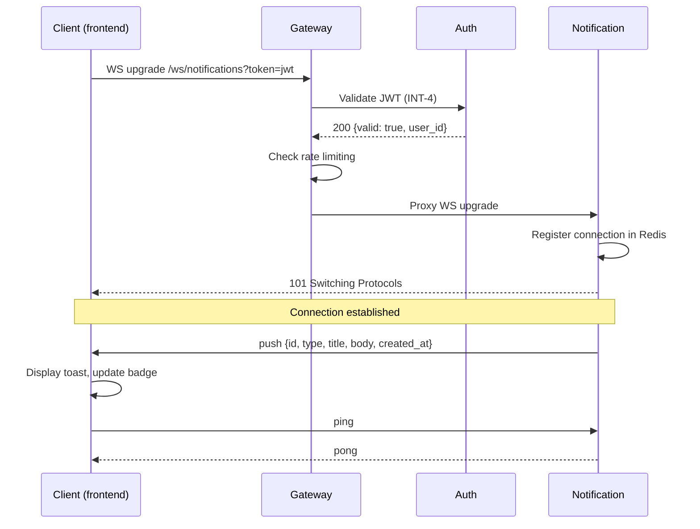
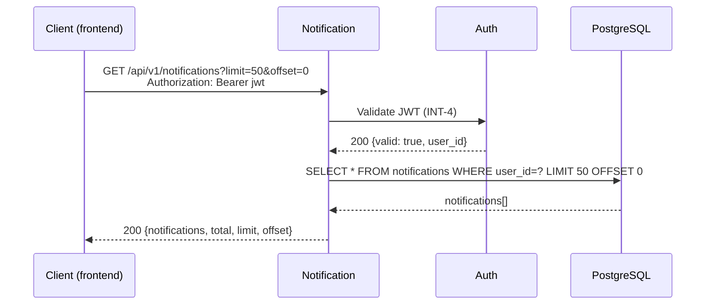
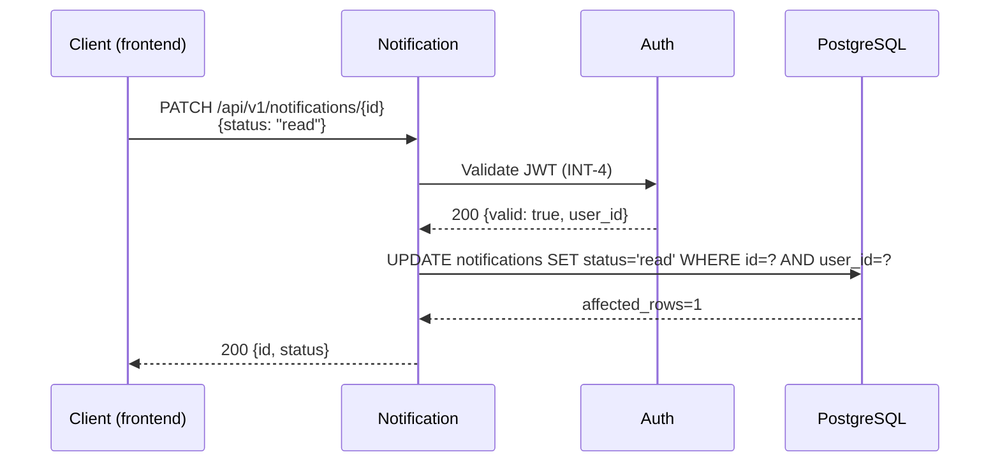
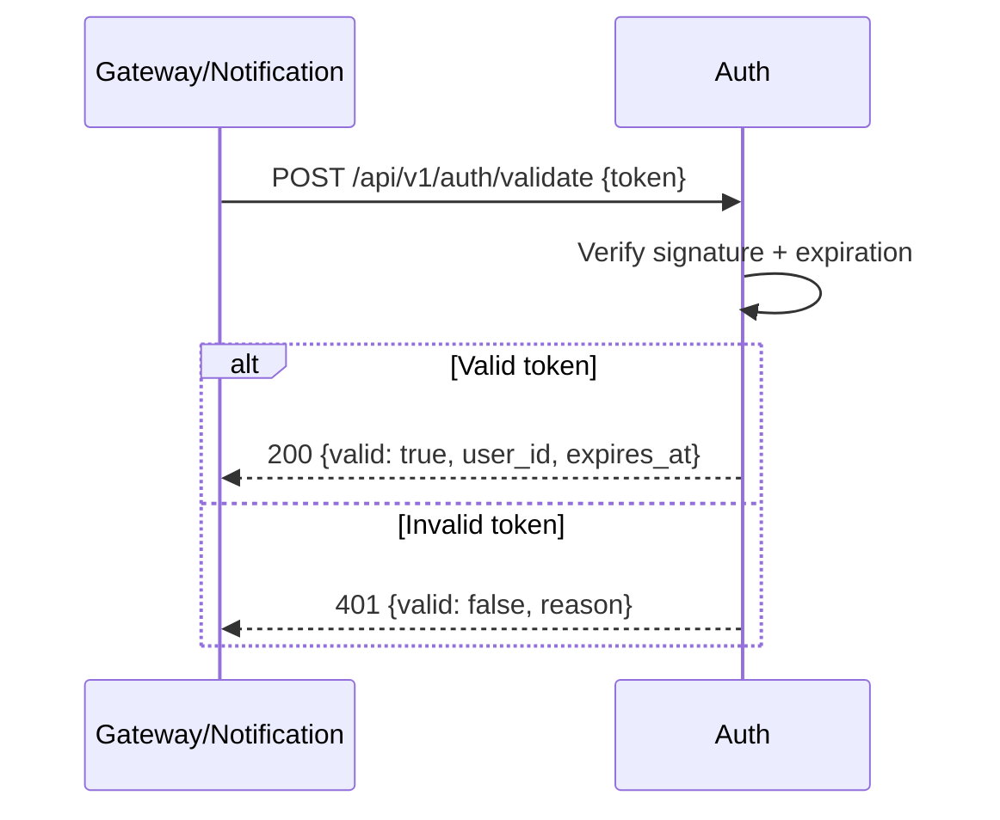
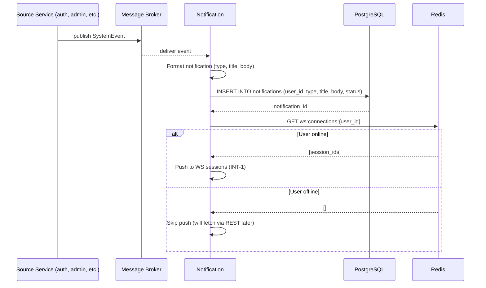

# design-0001: Система уведомлений в реальном времени

## 📋 Резюме

Design подтверждает 4 новых сервиса из Impact: notification и frontend (основные), gateway и auth (вторичные). JWT Middleware изменён — размещается как shared-компонент в /shared/auth/, используется gateway и notification для JWT-валидации. WebSocketClient остаётся local в frontend. 5 блоков взаимодействия (WebSocket push, REST API, event-driven формирование уведомлений), 6 системных тест-сценариев (e2e happy path, reconnect, rate limiting, REST API history/status, JWT validation).

## SVC-1: notification

**Impact:** SVC-1 (Новый, Предположительно) | **Решение Design:** Подтверждён (новый, Основной)

Когда в системе происходит значимое событие (регистрация пользователя, смена пароля, действие администратора), сервис-источник публикует его в message broker (INT-5). Event Consumer подхватывает событие, формирует из него уведомление и сохраняет в PostgreSQL. Одновременно WebSocket Hub проверяет в Redis, есть ли у целевого пользователя активное соединение, и если есть — пушит уведомление в реальном времени (INT-1). Пользователь также может запросить историю уведомлений через REST API (INT-2) или обновить статус прочтения (INT-3). Аутентификация всех запросов — через shared JWT Middleware из /shared/auth/ (INT-4).

### 📋 Ответственность

- Управление WebSocket-соединениями пользователей (установка, keepalive, disconnect)
- Подписка на системные события от других сервисов (INT-5)
- Формирование уведомлений из событий и сохранение в PostgreSQL
- Доставка уведомлений в реальном времени через WebSocket (INT-1)
- Предоставление REST API для истории уведомлений (INT-2, INT-3)
- TTL cleanup уведомлений старше 90 дней

### 📦 Компоненты

| ID | Компонент | Scope | Решение |
|----|-----------|-------|---------|
| CMP-1 | WebSocket Hub | local | Подтверждён из Impact (CMP-1) |
| CMP-2 | Event Consumer | local | Подтверждён из Impact (CMP-2) |
| CMP-3 | Notification Repository | local | Подтверждён из Impact (CMP-3) |

### 🔗 Зависимости

- **Предоставляет:** INT-1 (WebSocket push → frontend через gateway), INT-2 (GET /notifications → frontend), INT-3 (PATCH /notifications/{id} → frontend)
- **Потребляет:** INT-4 (JWT-валидация → auth)
- **Подписан:** INT-5 (Системные события ← любой сервис)

## SVC-2: frontend

**Impact:** SVC-2 (Новый, Предположительно) | **Решение Design:** Подтверждён (новый, Основной)

При загрузке приложения WebSocketClient устанавливает соединение с notification через gateway (INT-1), передавая JWT в handshake. Когда notification пушит новое уведомление по WebSocket, ToastNotification отображает toast, а badge на NotificationBell увеличивается. При клике на bell NotificationDropdown подгружает полную историю через REST API (INT-2), а при клике на конкретное уведомление — PATCH обновляет статус на read (INT-3) и badge пересчитывается. При обрыве соединения WebSocketClient автоматически выполняет reconnect с exponential backoff.

### 📋 Ответственность

- Установка и поддержание WebSocket-соединения с notification через gateway
- Отображение toast-нотификаций при получении новых уведомлений
- Отображение bell-иконки с badge-счётчиком непрочитанных
- Подгрузка истории уведомлений через REST API
- Обновление статуса уведомлений (read/unread)
- Reconnect с exponential backoff при обрыве WebSocket

### 📦 Компоненты

| ID | Компонент | Scope | Решение |
|----|-----------|-------|---------|
| CMP-4 | NotificationBell | local | Подтверждён из Impact (CMP-4) |
| CMP-5 | NotificationDropdown | local | Подтверждён из Impact (CMP-5) |
| CMP-6 | ToastNotification | local | Подтверждён из Impact (CMP-6) |
| CMP-7 | WebSocketClient | local | Изменён: Impact (CMP-7, shared (notification)) → scope: local |

### 🔗 Зависимости

- **Потребляет:** INT-1 (WebSocket push ← notification через gateway), INT-2 (GET /notifications ← notification), INT-3 (PATCH /notifications/{id} ← notification)

## SVC-3: gateway

**Impact:** SVC-3 (Новый, Предположительно) | **Решение Design:** Подтверждён (новый, Вторичный)

Gateway проксирует WebSocket upgrade-запросы на notification: при handshake извлекает JWT из query parameter, валидирует через JWT Middleware из /shared/auth/ (обращение к auth через INT-4), проверяет rate limiting (max 10 одновременных WS-соединений на пользователя). После успешной аутентификации WebSocket Proxy выполняет upgrade и проксирует соединение на notification. При превышении лимита — возвращает 429. Для REST-запросов к notification API Gateway не участвует — frontend обращается напрямую.

### 📋 Ответственность

- Проксирование WebSocket upgrade-запросов на notification
- JWT-валидация при WebSocket handshake (через JWT Middleware из /shared/auth/)
- Rate limiting WebSocket-соединений (max 10 на пользователя)

### 📦 Компоненты

| ID | Компонент | Scope | Решение |
|----|-----------|-------|---------|
| CMP-8 | WebSocket Proxy | local | Подтверждён из Impact (CMP-8) |
| CMP-9 | JWT Middleware | shared (/shared/auth/) | Изменён: Impact (CMP-9, shared (auth)) → размещение в /shared/auth/, используется gateway и notification |

### 🔗 Зависимости

- **Потребляет:** INT-4 (JWT-валидация ← auth)

## SVC-4: auth

**Impact:** SVC-4 (Новый, Предположительно) | **Решение Design:** Подтверждён (новый, Вторичный)

Auth генерирует JWT-токены при логине пользователя и предоставляет endpoint для валидации токенов. Gateway и notification используют JWT Middleware из /shared/auth/, который обращается к auth через INT-4 для проверки подписи и актуальности токена. Auth не инициирует взаимодействие с notification напрямую — только предоставляет валидацию по запросу.

### 📋 Ответственность

- Генерация JWT-токенов при логине пользователя
- Валидация JWT-токенов по запросу от других сервисов
- Хранение секретных ключей для подписи JWT

### 📦 Компоненты

_Компоненты наследуются из Impact без изменений._

### 🔗 Зависимости

- **Предоставляет:** INT-4 (JWT-валидация → gateway, notification)

## INT-1: WebSocket Push Notifications

**Участники:** notification (provider) ↔ frontend (consumer), gateway (proxy)
**Паттерн:** async (WebSocket)
**Источник Impact:** DEP-1 (gateway → notification, sync)

### Контракт

**Endpoint:** `WS /ws/notifications`

**Handshake (Client → Gateway → Notification):**
- JWT передаётся через query parameter: `wss://gateway/ws/notifications?token={jwt}`
- Gateway валидирует токен через INT-4, проверяет rate limiting
- При успехе — upgrade и проксирование на notification
- При неудаче — 401 Unauthorized или 429 Too Many Requests

**Server → Client (push):**
```json
{
  "id": "UUID",
  "type": "user_registered | password_changed | admin_action | system_error",
  "title": "string",
  "body": "string",
  "created_at": "ISO 8601"
}
```

**Client → Server (keepalive):**
```json
{
  "type": "ping"
}
```

**Server → Client (pong):**
```json
{
  "type": "pong"
}
```

**Keepalive:** Client отправляет ping каждые 30s. Если pong не получен за 5s — reconnect.

**Ошибки:**

| Код | Описание |
|-----|----------|
| 401 | JWT невалиден или истёк |
| 429 | Rate limit exceeded (> 10 WS-соединений на пользователя) |

### Sequence



## INT-2: Get Notifications

**Участники:** notification (provider) ↔ frontend (consumer)
**Паттерн:** sync (REST)
**Источник Impact:** API-1 (GET /api/v1/notifications)

### Контракт

**Endpoint:** `GET /api/v1/notifications`

**Headers:**
- `Authorization: Bearer {jwt}` — валидация через JWT Middleware (shared, обращение к auth через INT-4)

**Query Parameters:**
- `limit` (int, default 50, max 100) — количество уведомлений на страницу
- `offset` (int, default 0) — смещение для пагинации

**Response (200):**
```json
{
  "notifications": [
    {
      "id": "UUID",
      "type": "user_registered | password_changed | admin_action | system_error",
      "title": "string",
      "body": "string",
      "status": "read | unread",
      "created_at": "ISO 8601"
    }
  ],
  "total": 142,
  "limit": 50,
  "offset": 0
}
```

**Ошибки:**

| Код | Описание |
|-----|----------|
| 401 | JWT невалиден или истёк |
| 400 | Невалидные параметры (limit > 100, offset < 0) |

### Sequence



## INT-3: Update Notification Status

**Участники:** notification (provider) ↔ frontend (consumer)
**Паттерн:** sync (REST)
**Источник Impact:** API-2 (PATCH /api/v1/notifications/{id})

### Контракт

**Endpoint:** `PATCH /api/v1/notifications/{id}`

**Headers:**
- `Authorization: Bearer {jwt}` — валидация через JWT Middleware

**Request:**
```json
{
  "status": "read | unread"
}
```

**Response (200):**
```json
{
  "id": "UUID",
  "status": "read"
}
```

**Ошибки:**

| Код | Описание |
|-----|----------|
| 401 | JWT невалиден или истёк |
| 404 | Уведомление не найдено или не принадлежит пользователю |
| 400 | Невалидный статус |

### Sequence



## INT-4: JWT Validation

**Участники:** auth (provider) ↔ gateway, notification (consumers)
**Паттерн:** sync (REST)
**Источник Impact:** DEP-2 (notification → auth, sync)

### Контракт

**Endpoint:** `POST /api/v1/auth/validate`

**Request:**
```json
{
  "token": "string (JWT)"
}
```

**Response (200):**
```json
{
  "valid": true,
  "user_id": "UUID",
  "expires_at": "ISO 8601"
}
```

**Response (401):**
```json
{
  "valid": false,
  "reason": "expired | invalid_signature | revoked"
}
```

**Ошибки:**

| Код | Описание |
|-----|----------|
| 400 | Токен не предоставлен |

### Sequence



## INT-5: System Events

**Участники:** * (любой сервис) (publishers) → notification (consumer)
**Паттерн:** async (events, message broker)
**Источник Impact:** DEP-3 (* → notification, async)

### Контракт

**События:** `UserRegisteredEvent`, `PasswordChangedEvent`, `AdminActionEvent`, `SystemErrorEvent`
**Канал:** `system.events` (message broker)

**Формат (общий для всех событий):**
```json
{
  "event_type": "UserRegistered | PasswordChanged | AdminAction | SystemError",
  "user_id": "UUID",
  "timestamp": "ISO 8601",
  "metadata": {}
}
```

**Metadata для UserRegistered:**
```json
{
  "username": "string",
  "email": "string"
}
```

**Metadata для PasswordChanged:**
```json
{
  "ip_address": "string"
}
```

**Metadata для AdminAction:**
```json
{
  "admin_id": "UUID",
  "action": "block | unblock | change_role",
  "details": "string"
}
```

**Metadata для SystemError:**
```json
{
  "service": "string",
  "error_code": "string",
  "severity": "low | medium | high | critical"
}
```

### Sequence



## 🧪 Системные тест-сценарии

| ID | Сценарий | Участники | Тип | Источник |
|----|----------|-----------|-----|----------|
| STS-1 | Happy path: регистрация пользователя → публикация UserRegisteredEvent → формирование уведомления → push через WebSocket → toast отображается на frontend → badge увеличивается | auth, notification, frontend, gateway | e2e | INT-1, INT-5 |
| STS-2 | Reconnect: обрыв WebSocket-соединения → exponential backoff → успешный reconnect → подтверждение соединения (pong) | frontend, gateway, notification | integration | INT-1 |
| STS-3 | Rate limiting: пользователь открывает WebSocket-соединение сверх лимита → gateway возвращает 429 Too Many Requests | frontend, gateway | integration | INT-1 |
| STS-4 | История уведомлений: пользователь открывает dropdown → GET /notifications с пагинацией → список уведомлений с total count | frontend, notification | integration | INT-2 |
| STS-5 | Обновление статуса: пользователь кликает уведомление → PATCH /notifications/{id} → статус read → badge обновлён | frontend, notification | integration | INT-3 |
| STS-6 | JWT-валидация: запрос с невалидным/истёкшим токеном → 401 Unauthorized → соединение/запрос отклонён | frontend, gateway, auth | integration | INT-4 |
