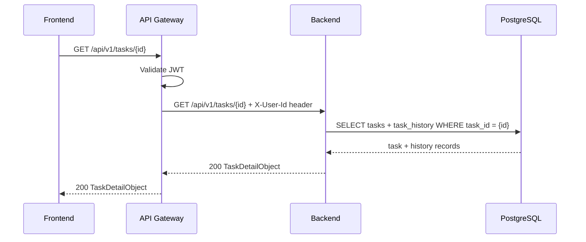
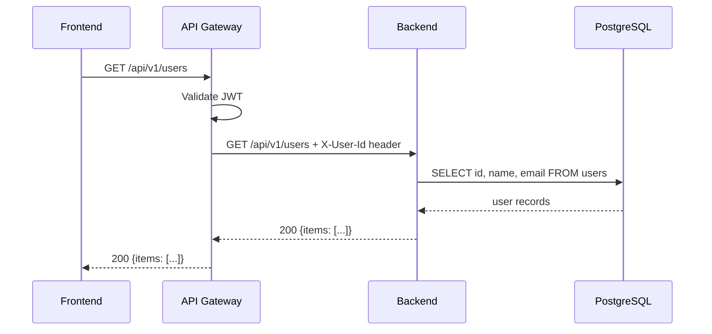
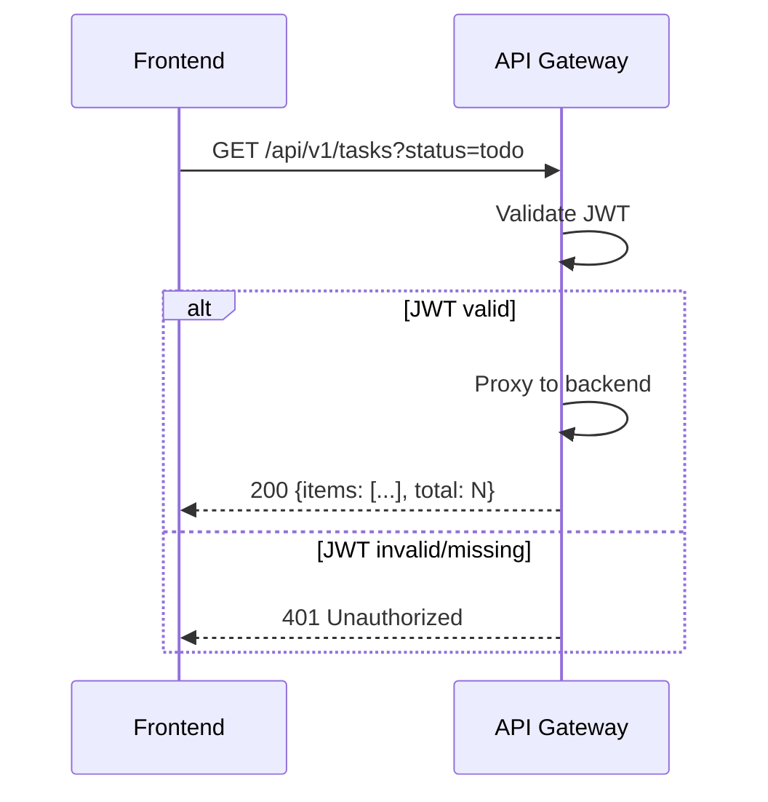

# 0001: Task dashboard — Design

## Резюме

Design охватывает 3 новых сервиса: **frontend** (основной — SPA-интерфейс канбан-доски), **backend** (основной — бизнес-логика и персистентность задач), **api-gateway** (вторичный — маршрутизация и аутентификация). Все три сервиса отсутствуют в `specs/docs/README.md` и создаются с нуля в рамках v0.1.0. Docs/ содержит только демо-сервис `example` — проект новый.

Ключевые архитектурные решения: синхронное REST-взаимодействие через API Gateway (единая точка входа), хранение задач и истории изменений в PostgreSQL на стороне backend, stateless JWT-аутентификация (токен выдаётся gateway или внешним провайдером — детали аутентификации вынесены за рамки v0.1.0 согласно REQ-9). Drag-and-drop статусов обрабатывается на frontend, изменение персистируется через PATCH /tasks/{id}.

Итого: 4 блока взаимодействия (INT-1..INT-4), 7 системных тест-сценариев (STS-1..STS-7). Shared-компоненты: типы задач и контракты REST вынесены в `/shared/contracts/` (OpenAPI-спецификация).

## Выбор технологий

### Frontend Framework (SVC-1: frontend)

| Критерий              | React       | Vue 3        | Svelte       |
|-----------------------|-------------|--------------|--------------|
| Соответствие задаче   | ★★★★★ (5)  | ★★★★☆ (4)   | ★★★★☆ (4)   |
| Экосистема            | ★★★★★ (5)  | ★★★★☆ (4)   | ★★★☆☆ (3)   |
| Производительность    | ★★★★☆ (4)  | ★★★★☆ (4)   | ★★★★★ (5)   |
| DX                    | ★★★★☆ (4)  | ★★★★★ (5)   | ★★★★☆ (4)   |
| Качество кода LLM     | ★★★★★ (5)  | ★★★★☆ (4)   | ★★★☆☆ (3)   |
| Покрытие в обучении   | ★★★★★ (5)  | ★★★★☆ (4)   | ★★★☆☆ (3)   |
| Долгосрочная поддержка | ★★★★★ (5) | ★★★★☆ (4)   | ★★★★☆ (4)   |
| **Итого**             | **33/35**   | **29/35**    | **26/35**    |

**Рекомендация:** React — зрелая экосистема DnD-библиотек (dnd-kit, react-beautiful-dnd), строгая типизация с TypeScript, отличное покрытие LLM.

**Выбрано:** React

### Backend Runtime (SVC-2: backend)

**Backend Runtime:** Node.js + Express (указано в Discussion: "Node.js/Express или аналог"). **Выбрано:** Node.js + Express

### Язык (все сервисы)

**Язык:** TypeScript — безальтернативна для fullstack-проекта с React + Node.js. **Выбрано:** TypeScript

### База данных (SVC-2: backend)

**База данных:** PostgreSQL (указано в Discussion: REQ-4, REQ-5). **Выбрано:** PostgreSQL

## SVC-1: frontend

Frontend — основной SPA-сервис (React). Предоставляет пользователям интерфейс канбан-доски с колонками статусов (To Do, In Progress, Done), формы создания и редактирования задач, фильтрацию и поиск. Взаимодействует исключительно с api-gateway через REST (INT-1, INT-2, INT-3). Все состояния задач хранятся на backend; frontend не имеет собственной базы данных.

Drag-and-drop реализован на стороне frontend: при перетаскивании карточки между колонками немедленно применяется оптимистичное обновление UI (< 1000ms согласно критерию успеха), затем отправляется PATCH-запрос на смену статуса через api-gateway. При ошибке — откат UI. **Решение:** добавлен (новый сервис).

### 1. Назначение

Frontend принимает ответственность за весь клиентский опыт Task Dashboard: отображение канбан-доски, управление формами CRUD-операций, drag-and-drop взаимодействие и фильтрацию задач. Сервис является presentation-слоем без собственной логики персистентности.

### 2. API контракты

_Нет изменений в API._

### 3. Data Model

_Нет изменений в Data Model._

### 4. Потоки

**ADDED:** Поток "Загрузка канбан-доски":
1. Пользователь открывает дашборд
2. Frontend → api-gateway: GET /api/v1/tasks (с фильтрами, если применены)
3. api-gateway → backend: проксирует запрос
4. Frontend: рендерит задачи по колонкам статусов (To Do / In Progress / Done)

**ADDED:** Поток "Создание задачи":
1. Пользователь заполняет форму (заголовок обязателен, остальное опционально)
2. Frontend: валидация на клиенте (непустой заголовок)
3. Frontend → api-gateway: POST /api/v1/tasks
4. При 200: добавить карточку в колонку "To Do"; при 400: показать ошибку валидации

**ADDED:** Поток "Drag-and-drop смены статуса":
1. Пользователь перетаскивает карточку в другую колонку
2. Frontend: оптимистичное обновление UI (карточка отображается в новой колонке немедленно)
3. Frontend → api-gateway: PATCH /api/v1/tasks/{id} {status: "новый_статус"}
4. При ошибке: откатить карточку в исходную колонку, показать уведомление

**ADDED:** Поток "Фильтрация задач":
1. Пользователь выбирает фильтр (статус, приоритет, исполнитель) или вводит поисковый запрос
2. Frontend → api-gateway: GET /api/v1/tasks?status=...&priority=...&assignee_id=...&search=...
3. Frontend: рендерит только задачи, соответствующие фильтрам

**ADDED:** Поток "Детальный просмотр задачи":
1. Пользователь кликает на карточку задачи
2. Frontend → api-gateway: GET /api/v1/tasks/{id}
3. Frontend: отображает все поля и историю изменений из поля `history`

### 5. Code Map

#### Tech Stack

| Технология | Версия | Назначение |
|-----------|--------|-----------|
| React | 18 | UI-фреймворк (→ Выбор технологий: Frontend Framework) |
| TypeScript | 5.x | Типизация (→ Выбор технологий: Язык) |

**ADDED:** `src/frontend/` — корень SPA (React + TypeScript)
**ADDED:** `src/frontend/src/pages/Dashboard` — страница канбан-доски
**ADDED:** `src/frontend/src/components/KanbanBoard` — компонент доски с колонками
**ADDED:** `src/frontend/src/components/TaskCard` — карточка задачи с drag-and-drop
**ADDED:** `src/frontend/src/components/TaskForm` — форма создания/редактирования задачи
**ADDED:** `src/frontend/src/components/TaskDetail` — детальный просмотр + история изменений
**ADDED:** `src/frontend/src/components/FilterPanel` — панель фильтров и поиска
**ADDED:** `src/frontend/src/api/tasksApi` — HTTP-клиент для взаимодействия с api-gateway
**ADDED:** `src/frontend/src/store/tasksSlice` — state management (Redux Toolkit или Zustand)

### 6. Зависимости

**ADDED:**
- **Потребляет:** INT-4 (Frontend API Requests ← api-gateway)
- **Shared:** `/shared/contracts/openapi/backend.yaml` — типы TaskResponse, TaskCreateRequest, TaskUpdateRequest

### 7. Доменная модель

_Нет изменений в доменной модели._

### 8. Границы автономии LLM

**ADDED:**

| Уровень | Действие |
|---------|----------|
| Свободно | Добавлять UI-компоненты, стили, анимации drag-and-drop |
| Свободно | Менять библиотеку state management (Redux Toolkit / Zustand) |
| Флаг | Добавлять новые API-вызовы (потенциальное изменение контракта с api-gateway) |
| Флаг | Менять логику оптимистичных обновлений (влияет на UX критерия < 1000ms) |
| CONFLICT | Обходить api-gateway и обращаться к backend напрямую |
| CONFLICT | Добавлять клиентское хранилище (localStorage, IndexedDB) для задач |

### 9. Решения по реализации

- **React + TypeScript:** Стандартный выбор для интерактивного SPA с drag-and-drop. WHY: строгая типизация снижает ошибки контракта с API; React-экосистема имеет зрелые библиотеки DnD (react-beautiful-dnd / dnd-kit).
- **Оптимистичные обновления при drag-and-drop:** Немедленное обновление UI до получения ответа от сервера. WHY: критерий успеха < 1000ms для визуального отображения; сетевая задержка не должна блокировать UX.
- **Клиентская валидация форм:** Проверка обязательного заголовка задачи на фронтенде до отправки. WHY: UX — мгновенная обратная связь без сетевого запроса (REQ-6).
- **Фильтрация через query params:** GET /api/v1/tasks?status=&priority=&assignee_id=&search= — серверная фильтрация вместо клиентской. WHY: при больших объёмах данных клиентская фильтрация неэффективна; серверная обеспечивает корректность для всех комбинаций (REQ-3).

## SVC-2: backend

Backend — основной сервис (Node.js/Express или аналог). Отвечает за хранение задач в PostgreSQL, CRUD-операции, фильтрацию, поиск и историю изменений. Принимает запросы только от api-gateway (не доступен напрямую из frontend). Обеспечивает персистентность всех операций с задачами и хранит список пользователей для назначения исполнителей. **Решение:** добавлен (новый сервис).

### 1. Назначение

Backend принимает ответственность за всю бизнес-логику Task Dashboard: создание, чтение, обновление и удаление задач, ведение истории изменений каждой задачи, фильтрацию и поиск. Является единственным источником истины для состояния задач.

### 2. API контракты

**ADDED:** `GET /api/v1/tasks` — список задач с фильтрацией и поиском
- Auth: Bearer JWT (обязателен)
- Query params: `status` (enum: todo|in_progress|done), `priority` (enum: low|medium|high), `assignee_id` (UUID), `search` (строка, полнотекстовый поиск по title+description)
- Response (200):
```json
{
  "items": [{ "id": "UUID", "title": "string", "description": "string|null", "status": "todo|in_progress|done", "priority": "low|medium|high", "assignee_id": "UUID|null", "created_at": "ISO8601", "updated_at": "ISO8601" }],
  "total": 42
}
```
- Errors: 401 (не аутентифицирован)

**ADDED:** `POST /api/v1/tasks` — создание задачи
- Auth: Bearer JWT (обязателен)
- Request body:
```json
{ "title": "string (required)", "description": "string|null", "priority": "low|medium|high (default: medium)", "assignee_id": "UUID|null" }
```
- Response (201):
```json
{ "id": "UUID", "title": "string", "description": "string|null", "status": "todo", "priority": "low|medium|high", "assignee_id": "UUID|null", "created_at": "ISO8601", "updated_at": "ISO8601" }
```
- Errors: 400 (невалидные данные, пустой title), 401 (не аутентифицирован)

**ADDED:** `GET /api/v1/tasks/{id}` — детальная карточка задачи с историей изменений
- Auth: Bearer JWT (обязателен)
- Response (200):
```json
{ "id": "UUID", "title": "string", "description": "string|null", "status": "todo|in_progress|done", "priority": "low|medium|high", "assignee_id": "UUID|null", "created_at": "ISO8601", "updated_at": "ISO8601", "history": [{ "changed_at": "ISO8601", "changed_by": "UUID", "field": "string", "old_value": "string", "new_value": "string" }] }
```
- Errors: 401 (не аутентифицирован), 404 (задача не найдена)

**ADDED:** `PATCH /api/v1/tasks/{id}` — частичное обновление задачи
- Auth: Bearer JWT (обязателен)
- Request body:
```json
{ "title": "string|null", "description": "string|null", "status": "todo|in_progress|done|null", "priority": "low|medium|high|null", "assignee_id": "UUID|null" }
```
- Response (200): полный объект задачи (аналогично GET /tasks/{id}, без history)
- Errors: 400 (невалидные данные), 401 (не аутентифицирован), 404 (задача не найдена)

**ADDED:** `DELETE /api/v1/tasks/{id}` — удаление задачи
- Auth: Bearer JWT (обязателен)
- Response (204): пустое тело
- Errors: 401 (не аутентифицирован), 404 (задача не найдена)

**ADDED:** `GET /api/v1/users` — список пользователей для выбора исполнителя
- Auth: Bearer JWT (обязателен)
- Response (200):
```json
{ "items": [{ "id": "UUID", "name": "string", "email": "string" }] }
```
- Errors: 401 (не аутентифицирован)

### 3. Data Model

**ADDED:** Таблица `tasks`:

| Колонка | Тип | Constraints | Описание |
|---------|-----|-------------|----------|
| id | UUID | PK, DEFAULT gen_random_uuid() | Идентификатор задачи |
| title | VARCHAR(255) | NOT NULL | Заголовок (обязателен) |
| description | TEXT | NULL | Описание |
| status | VARCHAR(20) | NOT NULL, DEFAULT 'todo', CHECK (status IN ('todo','in_progress','done')) | Статус |
| priority | VARCHAR(10) | NOT NULL, DEFAULT 'medium', CHECK (priority IN ('low','medium','high')) | Приоритет |
| assignee_id | UUID | NULL, FK → users.id | Исполнитель |
| created_at | TIMESTAMPTZ | NOT NULL, DEFAULT now() | Дата создания |
| updated_at | TIMESTAMPTZ | NOT NULL, DEFAULT now() | Дата последнего обновления |

**Индексы tasks:** `idx_tasks_status` (status), `idx_tasks_priority` (priority), `idx_tasks_assignee_id` (assignee_id), `idx_tasks_title_desc_fts` (GIN на to_tsvector для полнотекстового поиска)

**ADDED:** Таблица `task_history`:

| Колонка | Тип | Constraints | Описание |
|---------|-----|-------------|----------|
| id | UUID | PK, DEFAULT gen_random_uuid() | Идентификатор записи |
| task_id | UUID | NOT NULL, FK → tasks.id ON DELETE CASCADE | Задача |
| changed_by | UUID | NOT NULL, FK → users.id | Автор изменения |
| field | VARCHAR(50) | NOT NULL | Изменённое поле |
| old_value | TEXT | NULL | Предыдущее значение |
| new_value | TEXT | NULL | Новое значение |
| changed_at | TIMESTAMPTZ | NOT NULL, DEFAULT now() | Время изменения |

**Индексы task_history:** `idx_task_history_task_id` (task_id), `idx_task_history_changed_at` (changed_at DESC)

**ADDED:** Таблица `users`:

| Колонка | Тип | Constraints | Описание |
|---------|-----|-------------|----------|
| id | UUID | PK, DEFAULT gen_random_uuid() | Идентификатор пользователя |
| name | VARCHAR(100) | NOT NULL | Имя |
| email | VARCHAR(255) | UNIQUE, NOT NULL | Email |
| created_at | TIMESTAMPTZ | NOT NULL, DEFAULT now() | Дата создания |

### 4. Потоки

**ADDED:** Поток "Создание задачи":
1. Получить POST /api/v1/tasks, Bearer JWT (из api-gateway)
2. Валидировать: title непустой; priority в допустимых значениях; assignee_id существует в users (если передан)
3. INSERT в tasks (status = 'todo')
4. Вернуть 201 с объектом задачи

**ADDED:** Поток "Обновление задачи (PATCH)":
1. Получить PATCH /api/v1/tasks/{id}, Bearer JWT
2. Валидировать тело; проверить существование задачи (404 если нет)
3. Для каждого изменённого поля: INSERT в task_history (field, old_value, new_value, changed_by из JWT)
4. UPDATE tasks SET ...изменённые поля..., updated_at = now()
5. Вернуть 200 с обновлённым объектом задачи

**ADDED:** Поток "Получение задач с фильтрацией":
1. Получить GET /api/v1/tasks с query params
2. Построить SQL-запрос с WHERE-условиями по переданным фильтрам
3. Для поиска: WHERE to_tsvector('russian', title || ' ' || COALESCE(description, '')) @@ plainto_tsquery('russian', :search)
4. Вернуть paginated список задач

**ADDED:** Поток "Удаление задачи":
1. Получить DELETE /api/v1/tasks/{id}
2. Проверить существование (404 если нет)
3. DELETE FROM tasks WHERE id = :id (CASCADE удалит task_history)
4. Вернуть 204

### 5. Code Map

#### Tech Stack

| Технология | Версия | Назначение |
|-----------|--------|-----------|
| Node.js | 20 | Backend runtime (→ Выбор технологий: Backend Runtime) |
| Express | 4 | HTTP-фреймворк (→ Выбор технологий: Backend Runtime) |
| TypeScript | 5.x | Типизация (→ Выбор технологий: Язык) |
| PostgreSQL | 16 | СУБД (→ Выбор технологий: База данных) |

**ADDED:** `src/backend/` — корень сервиса
**ADDED:** `src/backend/src/routes/tasks.ts` — маршруты /api/v1/tasks
**ADDED:** `src/backend/src/routes/users.ts` — маршруты /api/v1/users
**ADDED:** `src/backend/src/controllers/tasks.controller.ts` — обработчики CRUD-запросов
**ADDED:** `src/backend/src/controllers/users.controller.ts` — список пользователей
**ADDED:** `src/backend/src/services/tasks.service.ts` — бизнес-логика: валидация, история изменений
**ADDED:** `src/backend/src/repositories/tasks.repository.ts` — SQL-запросы к таблице tasks + task_history
**ADDED:** `src/backend/src/repositories/users.repository.ts` — SQL-запросы к таблице users
**ADDED:** `src/backend/src/middleware/auth.middleware.ts` — проверка Bearer JWT (валидация подписи)
**ADDED:** `src/backend/src/db/migrations/` — SQL-миграции (tasks, task_history, users)
**ADDED:** `src/backend/src/db/pool.ts` — PostgreSQL connection pool

### 6. Зависимости

**ADDED:**
- **Предоставляет:** INT-1 (Tasks CRUD → api-gateway), INT-2 (Task Detail → api-gateway), INT-3 (Users list → api-gateway)
- **Shared:** `/shared/contracts/openapi/backend.yaml` — OpenAPI-спецификация (provider)

### 7. Доменная модель

**ADDED:** Агрегат `Task` — жизненный цикл задачи
- Инвариант: `title` не может быть пустым
- Инвариант: `status` принимает только значения todo | in_progress | done
- Инвариант: `priority` принимает только значения low | medium | high
- Поведение: при изменении любого поля — автоматически создаётся запись в `task_history`

**ADDED:** Value Object `TaskStatus` — enum (todo, in_progress, done)
**ADDED:** Value Object `TaskPriority` — enum (low, medium, high)
**ADDED:** Entity `TaskHistoryEntry` — запись об одном изменении поля задачи
**ADDED:** Entity `User` — пользователь системы (только read для v0.1.0; создание — вне scope)

### 8. Границы автономии LLM

**ADDED:**

| Уровень | Действие |
|---------|----------|
| Свободно | Добавлять индексы к существующим таблицам |
| Свободно | Добавлять поля в task_history |
| Свободно | Оптимизировать SQL-запросы фильтрации |
| Флаг | Добавлять новые поля в таблицу tasks (изменяет API-контракт) |
| Флаг | Изменять значения enum status или priority (Breaking change для frontend) |
| Флаг | Менять стратегию полнотекстового поиска (другой язык, алгоритм) |
| CONFLICT | Удалять поля из таблицы tasks |
| CONFLICT | Изменять схему task_history (структура истории критична для REQ-4) |

### 9. Решения по реализации

- **PostgreSQL для задач и истории:** Реляционная БД с транзакциями обеспечивает атомарность UPDATE tasks + INSERT task_history. WHY: история изменений требует консистентности — нельзя записать факт изменения без самого изменения.
- **Полнотекстовый поиск через GIN-индекс PostgreSQL:** to_tsvector + plainto_tsquery вместо ILIKE. WHY: ILIKE '%search%' не использует индексы, деградирует на больших таблицах; GIN-индекс обеспечивает O(log N) поиск.
- **PATCH вместо PUT для обновления:** Частичное обновление — только переданные поля меняются. WHY: drag-and-drop меняет только status; форма редактирования меняет конкретные поля; PUT требовал бы передачи всего объекта.
- **История изменений внутри backend (не отдельный сервис):** Запись task_history в той же транзакции, что и UPDATE tasks. WHY: v0.1.0 — монолитный backend достаточен; event sourcing или отдельный audit-сервис — избыточно для scope.
- **Connection pool size = 10:** Для v0.1.0 с умеренной нагрузкой. WHY: < 500ms p95 (REQ-5) при 10 соединениях достижимо; можно увеличить при нагрузочном тестировании.

## SVC-3: api-gateway

Api-gateway — вторичный сервис. Служит единой точкой входа для всех запросов от frontend к backend: маршрутизирует HTTP-запросы, проверяет Bearer JWT-токены перед проксированием. Не содержит бизнес-логики — только маршрутизация и аутентификация. **Решение:** добавлен (новый сервис).

### 1. Назначение

Api-gateway принимает ответственность за: проверку аутентификации (Bearer JWT) всех входящих запросов, маршрутизацию к backend-сервису, и предоставление единого URL для frontend-клиента. Изолирует frontend от прямого доступа к backend.

### 2. API контракты

**ADDED:** `GET /api/v1/tasks` — проксирует к backend (INT-4)
**ADDED:** `POST /api/v1/tasks` — проксирует к backend (INT-4)
**ADDED:** `GET /api/v1/tasks/{id}` — проксирует к backend (INT-4)
**ADDED:** `PATCH /api/v1/tasks/{id}` — проксирует к backend (INT-4)
**ADDED:** `DELETE /api/v1/tasks/{id}` — проксирует к backend (INT-4)
**ADDED:** `GET /api/v1/users` — проксирует к backend (INT-4)

Все маршруты принимают Bearer JWT, валидируют токен и проксируют запрос к backend с заголовком `X-User-Id`. Контракты request/response идентичны backend (SVC-2 § 2).

### 3. Data Model

_Нет изменений в Data Model._

### 4. Потоки

**ADDED:** Поток "Аутентифицированный проксируемый запрос":
1. Получить входящий HTTP-запрос от frontend
2. Извлечь Bearer-токен из заголовка Authorization
3. Валидировать JWT (подпись, expiry) — при ошибке → 401
4. Проксировать запрос к backend с добавлением заголовка `X-User-Id: {user_id из JWT}`
5. Вернуть ответ backend клиенту без изменений

### 5. Code Map

#### Tech Stack

| Технология | Версия | Назначение |
|-----------|--------|-----------|
| Node.js | 20 | Runtime (→ Выбор технологий: Backend Runtime) |
| Express | 4 | HTTP-фреймворк (→ Выбор технологий: Backend Runtime) |
| TypeScript | 5.x | Типизация (→ Выбор технологий: Язык) |

**ADDED:** `src/api-gateway/` — корень сервиса
**ADDED:** `src/api-gateway/src/middleware/auth.middleware.ts` — JWT-валидация
**ADDED:** `src/api-gateway/src/routes/proxy.ts` — маршруты проксирования /api/v1/* → backend
**ADDED:** `src/api-gateway/src/config/services.ts` — конфигурация upstream-адресов (backend URL)

### 6. Зависимости

**ADDED:**
- **Потребляет:** INT-1 (Tasks CRUD → backend), INT-2 (Task Detail → backend), INT-3 (Users list → backend)
- **Предоставляет:** INT-4 (Frontend API Requests → frontend)

### 7. Доменная модель

_Нет изменений в доменной модели._

### 8. Границы автономии LLM

**ADDED:**

| Уровень | Действие |
|---------|----------|
| Свободно | Добавлять logging, metrics, tracing middleware |
| Свободно | Настраивать таймауты и retry-политику проксирования |
| Флаг | Добавлять новые маршруты (новые upstream-сервисы) |
| CONFLICT | Отключать JWT-валидацию |
| CONFLICT | Добавлять бизнес-логику в gateway (нарушение принципа SRP) |

### 9. Решения по реализации

- **Stateless gateway без хранилища:** Gateway не хранит сессии и не обращается к БД. WHY: горизонтальное масштабирование; JWT содержит все необходимые claims (user_id) для маршрутизации.
- **X-User-Id header к backend:** Gateway передаёт user_id из JWT как заголовок, а не тело. WHY: backend не обязан повторно парсить JWT; стандартная практика для API Gateway паттерна.
- **Единый upstream: backend:** Для v0.1.0 один backend-сервис. WHY: YAGNI — усложнение маршрутизации на несколько сервисов нецелесообразно в рамках v0.1.0.

## INT-1: Tasks CRUD

**Участники:** backend (provider) ↔ api-gateway (consumer)
**Паттерн:** sync (REST)

### Контракт

**Endpoint 1:** `GET /api/v1/tasks`
- Query params: `status`, `priority`, `assignee_id`, `search`
- Response (200): `{ "items": [TaskObject], "total": number }`
- Errors: 401

**Endpoint 2:** `POST /api/v1/tasks`
- Request: `{ "title": "string", "description": "string|null", "priority": "low|medium|high", "assignee_id": "UUID|null" }`
- Response (201): TaskObject
- Errors: 400 (пустой title или невалидные данные), 401

**Endpoint 3:** `PATCH /api/v1/tasks/{id}`
- Request: `{ "title": "string|null", "description": "string|null", "status": "todo|in_progress|done|null", "priority": "low|medium|high|null", "assignee_id": "UUID|null" }`
- Response (200): TaskObject
- Errors: 400, 401, 404

**Endpoint 4:** `DELETE /api/v1/tasks/{id}`
- Response (204): пустое тело
- Errors: 401, 404

**TaskObject:**
```json
{
  "id": "UUID",
  "title": "string",
  "description": "string|null",
  "status": "todo|in_progress|done",
  "priority": "low|medium|high",
  "assignee_id": "UUID|null",
  "created_at": "ISO8601",
  "updated_at": "ISO8601"
}
```

Заголовок `X-User-Id` передаётся api-gateway к backend для идентификации автора изменений.

### Sequence

```mermaid
sequenceDiagram
    participant FE as Frontend
    participant GW as API Gateway
    participant BE as Backend
    participant DB as PostgreSQL

    FE->>GW: POST /api/v1/tasks {title, priority, ...}
    GW->>GW: Validate JWT
    GW->>BE: POST /api/v1/tasks + X-User-Id header
    BE->>DB: INSERT INTO tasks
    DB-->>BE: task record
    BE-->>GW: 201 TaskObject
    GW-->>FE: 201 TaskObject

    FE->>GW: PATCH /api/v1/tasks/{id} {status: "in_progress"}
    GW->>GW: Validate JWT
    GW->>BE: PATCH /api/v1/tasks/{id} + X-User-Id header
    BE->>DB: BEGIN; UPDATE tasks; INSERT task_history; COMMIT
    DB-->>BE: updated record
    BE-->>GW: 200 TaskObject
    GW-->>FE: 200 TaskObject
```

## INT-2: Task Detail

**Участники:** backend (provider) ↔ api-gateway (consumer)
**Паттерн:** sync (REST)

### Контракт

**Endpoint:** `GET /api/v1/tasks/{id}`
- Auth: Bearer JWT (проверяется api-gateway)
- Response (200):
```json
{
  "id": "UUID",
  "title": "string",
  "description": "string|null",
  "status": "todo|in_progress|done",
  "priority": "low|medium|high",
  "assignee_id": "UUID|null",
  "created_at": "ISO8601",
  "updated_at": "ISO8601",
  "history": [
    {
      "changed_at": "ISO8601",
      "changed_by": "UUID",
      "field": "string",
      "old_value": "string|null",
      "new_value": "string|null"
    }
  ]
}
```
- Errors: 401 (не аутентифицирован), 404 (задача не найдена)

### Sequence



## INT-3: Users List

**Участники:** backend (provider) ↔ api-gateway (consumer)
**Паттерн:** sync (REST)

### Контракт

**Endpoint:** `GET /api/v1/users`
- Auth: Bearer JWT (проверяется api-gateway)
- Response (200):
```json
{
  "items": [
    {
      "id": "UUID",
      "name": "string",
      "email": "string"
    }
  ]
}
```
- Errors: 401 (не аутентифицирован)

Используется frontend для заполнения выпадающего списка исполнителей при создании/редактировании задачи (F-1, F-5, US-6).

### Sequence



## INT-4: Frontend API Requests

**Участники:** api-gateway (provider) ↔ frontend (consumer)
**Паттерн:** sync (REST)

### Контракт

Frontend обращается к api-gateway по единому base URL. Все маршруты `/api/v1/*` проксируются к backend после JWT-валидации. Контракты request/response идентичны SVC-2 § 2 (backend).

**Endpoint 1:** `GET /api/v1/tasks` — список задач с фильтрацией
**Endpoint 2:** `POST /api/v1/tasks` — создание задачи
**Endpoint 3:** `GET /api/v1/tasks/{id}` — детальная карточка с историей
**Endpoint 4:** `PATCH /api/v1/tasks/{id}` — обновление задачи
**Endpoint 5:** `DELETE /api/v1/tasks/{id}` — удаление задачи
**Endpoint 6:** `GET /api/v1/users` — список пользователей

Ошибки, специфичные для gateway: 401 (невалидный или отсутствующий JWT).

### Sequence



## Системные тест-сценарии

| ID | Сценарий | Участники | Тип | Источник |
|----|----------|-----------|-----|----------|
| STS-1 | Создание задачи: заполнить форму (с исполнителем) → POST /tasks → задача появляется в колонке "To Do" | Frontend, API Gateway, Backend, PostgreSQL | e2e | INT-1 |
| STS-2 | Смена статуса drag-and-drop: перетащить карточку → PATCH /tasks/{id} {status} → статус персистируется после перезагрузки | Frontend, API Gateway, Backend, PostgreSQL | e2e | INT-1 |
| STS-3 | Детальный просмотр с историей: открыть карточку → GET /tasks/{id} → отображаются все поля и история изменений | Frontend, API Gateway, Backend, PostgreSQL | e2e | INT-2 |
| STS-4 | Фильтрация: выбрать фильтр priority=high → GET /tasks?priority=high → отображаются только задачи с High приоритетом | Frontend, API Gateway, Backend, PostgreSQL | e2e | INT-1 |
| STS-5 | Валидация создания: отправить форму с пустым title → 400 → ошибка валидации отображается на фронтенде | Frontend, API Gateway, Backend | e2e | INT-1 |
| STS-6 | Неаутентифицированный доступ: запрос без Bearer JWT → 401 от api-gateway | Frontend, API Gateway | integration | INT-1 |
| STS-7 | Удаление задачи: нажать "Удалить" → подтверждение → DELETE /tasks/{id} → задача исчезает с доски | Frontend, API Gateway, Backend, PostgreSQL | e2e | INT-1 |

## Отвергнутые предложения

| ID | Приоритет | Предложение | Причина отклонения |
|----|-----------|-------------|-------------------|
| PROP-1 | P1 | SVC-3 § 2: заглушка некорректна для нового сервиса — перечислить endpoint-ы с маркером ADDED | Принято и уже применено (SVC-3 § 2 обновлён с ADDED маркерами) |
| PROP-2 | P2 | SVC-3 § 6: нет ссылки на INT-N блок | Принято — добавлен INT-4, ссылки скорректированы |
| PROP-3 | P1 | Взаимодействие frontend ↔ api-gateway не оформлено INT-блоком | Принято — добавлен INT-4 (Frontend API Requests) |
| PROP-4 | P2 | INT-1 sequence неполная: нет GET и DELETE | Smoke test — отклонено, будет пересоздано /chain |
| PROP-5 | P1 | INT-3 не покрыт STS-N | Smoke test — отклонено, будет пересоздано /chain |
| PROP-6 | P2 | Нет load-типа STS | Smoke test — отклонено, будет пересоздано /chain |
| PROP-7 | P2 | ↑ Discussion: механизм создания пользователей не определён | Smoke test — отклонено, будет пересоздано /chain |
