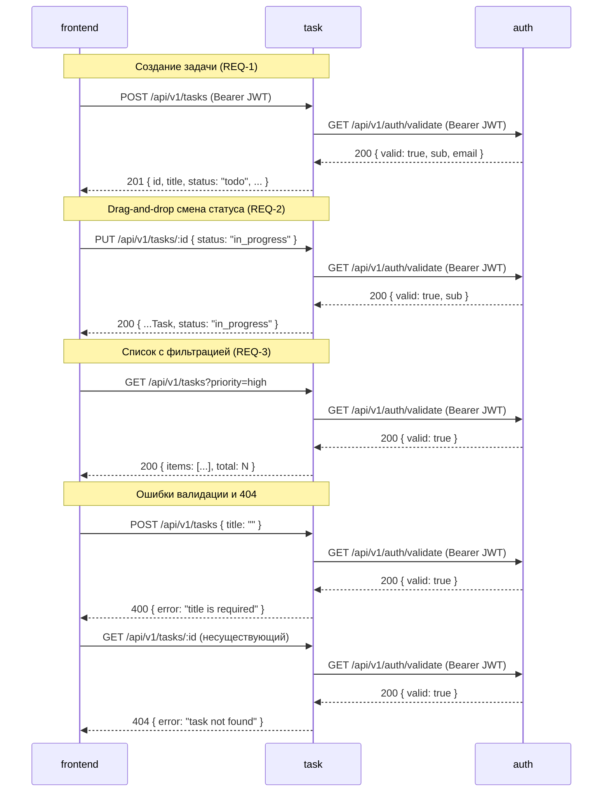
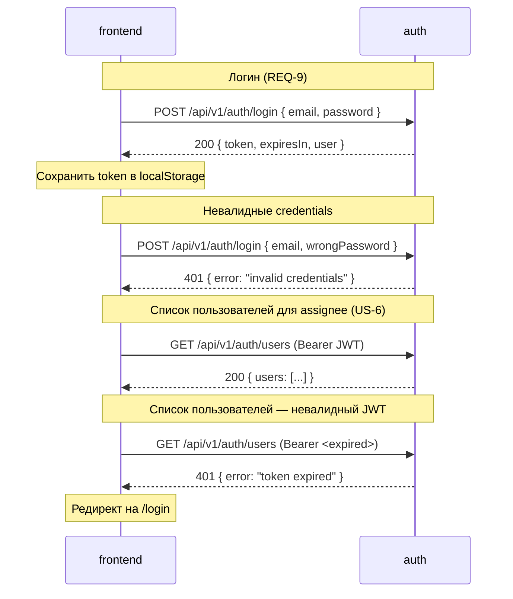
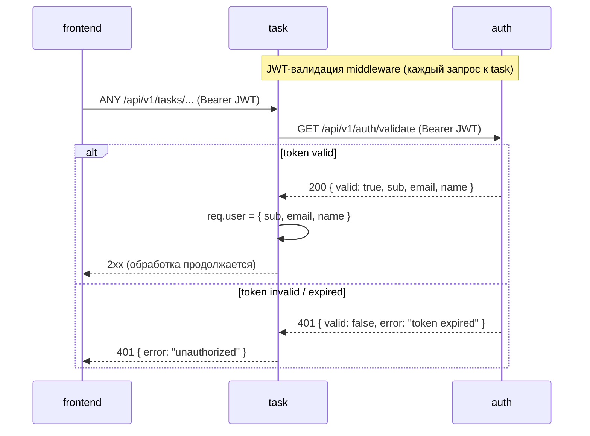

# 0001: Task dashboard — Design

## Резюме

Design затрагивает 3 новых сервиса: **task** (основной — CRUD задач, история изменений, фильтрация), **auth** (новый — пользователи, JWT-аутентификация, список исполнителей), **frontend** (новый — React-дашборд с канбан-доской, drag-and-drop, формы). Все три сервиса создаются с нуля: `specs/docs/` содержит только демо-сервис `example`, реальных сервисов в проекте нет.

Ключевые решения: единый стек Node.js + TypeScript для backend-сервисов обеспечивает единообразие кода и LLM-генерации; Prisma обеспечивает типобезопасные миграции и ORM для PostgreSQL; разделение server/client state во frontend (TanStack Query для API-данных, Zustand для UI-состояния канбана и фильтров). Аутентификация централизована в сервисе auth — task-сервис потребляет JWT-валидацию через middleware, не хранит пользователей напрямую. История изменений задач реализуется через отдельную таблицу `task_history` в task-сервисе (REQ-4 — детальный просмотр с историей).

Планируется: 3 блока взаимодействия (INT-1: frontend → task REST API; INT-2: frontend → auth REST API; INT-3: task → auth JWT-валидация middleware) и 8 системных тест-сценариев (STS), покрывающих логин, CRUD задач end-to-end, drag-and-drop статус, фильтрацию, аутентификацию и граничные случаи (пустой заголовок, удаление с подтверждением, назначение исполнителя).

## Выбор технологий

### Frontend Framework (SVC-3: frontend)

| Критерий | React 18 | Vue 3 | Svelte 5 |
|---|---|---|---|
| Соответствие задаче | ★★★★★ (5) | ★★★★★ (5) | ★★★★☆ (4) |
| Экосистема | ★★★★★ (5) | ★★★★☆ (4) | ★★★☆☆ (3) |
| Производительность | ★★★★☆ (4) | ★★★★☆ (4) | ★★★★★ (5) |
| DX | ★★★★☆ (4) | ★★★★★ (5) | ★★★★★ (5) |
| Качество кода LLM | ★★★★★ (5) | ★★★★☆ (4) | ★★★☆☆ (3) |
| Покрытие в обучении | ★★★★★ (5) | ★★★★☆ (4) | ★★★☆☆ (3) |
| Долгосрочная поддержка | ★★★★★ (5) | ★★★★★ (5) | ★★★★☆ (4) |
| **Итого** | **33/35** | **31/35** | **27/35** |

**Рекомендация:** React 18 — наибольшая экосистема drag-and-drop библиотек (dnd-kit), максимальное LLM-покрытие, зрелые компонентные библиотеки для канбан.

**Выбрано:** React 18

---

### Backend Language & Runtime (SVC-1: task, SVC-2: auth)

| Критерий | Node.js + TypeScript | Python + FastAPI | Go |
|---|---|---|---|
| Соответствие задаче | ★★★★★ (5) | ★★★★☆ (4) | ★★★★☆ (4) |
| Экосистема | ★★★★★ (5) | ★★★★★ (5) | ★★★★☆ (4) |
| Производительность | ★★★★☆ (4) | ★★★☆☆ (3) | ★★★★★ (5) |
| DX | ★★★★★ (5) | ★★★★★ (5) | ★★★☆☆ (3) |
| Качество кода LLM | ★★★★★ (5) | ★★★★★ (5) | ★★★★☆ (4) |
| Покрытие в обучении | ★★★★★ (5) | ★★★★★ (5) | ★★★★☆ (4) |
| Долгосрочная поддержка | ★★★★★ (5) | ★★★★★ (5) | ★★★★★ (5) |
| **Итого** | **34/35** | **32/35** | **29/35** |

**Рекомендация:** Node.js + TypeScript — единый язык для frontend и backend (меньше контекстных переключений), отличный DX, максимальное LLM-покрытие для TypeScript-кода.

**Выбрано:** Node.js + TypeScript

---

### База данных (SVC-1: task, SVC-2: auth)

| Критерий | PostgreSQL 16 | MySQL 8 | SQLite |
|---|---|---|---|
| Соответствие задаче | ★★★★★ (5) | ★★★★☆ (4) | ★★★☆☆ (3) |
| Экосистема | ★★★★★ (5) | ★★★★☆ (4) | ★★★★☆ (4) |
| Производительность | ★★★★★ (5) | ★★★★☆ (4) | ★★★☆☆ (3) |
| DX | ★★★★★ (5) | ★★★★☆ (4) | ★★★★★ (5) |
| Качество кода LLM | ★★★★★ (5) | ★★★★☆ (4) | ★★★★☆ (4) |
| Покрытие в обучении | ★★★★★ (5) | ★★★★☆ (4) | ★★★★☆ (4) |
| Долгосрочная поддержка | ★★★★★ (5) | ★★★★★ (5) | ★★★★★ (5) |
| **Итого** | **35/35** | **29/35** | **28/35** |

**Рекомендация:** PostgreSQL 16 — лучшая реляционная БД для задачного домена, полнотекстовый поиск built-in, максимальная экосистема.

**Выбрано:** PostgreSQL 16

---

### ORM (SVC-1: task, SVC-2: auth)

| Критерий | Prisma | TypeORM | Drizzle |
|---|---|---|---|
| Соответствие задаче | ★★★★★ (5) | ★★★★☆ (4) | ★★★★☆ (4) |
| Экосистема | ★★★★★ (5) | ★★★★☆ (4) | ★★★☆☆ (3) |
| Производительность | ★★★★☆ (4) | ★★★★☆ (4) | ★★★★★ (5) |
| DX | ★★★★★ (5) | ★★★☆☆ (3) | ★★★★☆ (4) |
| Качество кода LLM | ★★★★★ (5) | ★★★★☆ (4) | ★★★☆☆ (3) |
| Покрытие в обучении | ★★★★★ (5) | ★★★★☆ (4) | ★★★☆☆ (3) |
| Долгосрочная поддержка | ★★★★☆ (4) | ★★★★★ (5) | ★★★★☆ (4) |
| **Итого** | **33/35** | **28/35** | **26/35** |

**Рекомендация:** Prisma — лучший DX, автогенерация типов из схемы, встроенные миграции, максимальное LLM-покрытие для TypeScript.

**Выбрано:** Prisma

---

### Backend Framework (SVC-1: task, SVC-2: auth)

| Критерий | Express + Zod | Fastify + Zod | NestJS |
|---|---|---|---|
| Соответствие задаче | ★★★★★ (5) | ★★★★★ (5) | ★★★★☆ (4) |
| Экосистема | ★★★★★ (5) | ★★★★☆ (4) | ★★★★★ (5) |
| Производительность | ★★★★☆ (4) | ★★★★★ (5) | ★★★★☆ (4) |
| DX | ★★★★★ (5) | ★★★★☆ (4) | ★★★☆☆ (3) |
| Качество кода LLM | ★★★★★ (5) | ★★★★☆ (4) | ★★★★★ (5) |
| Покрытие в обучении | ★★★★★ (5) | ★★★★☆ (4) | ★★★★★ (5) |
| Долгосрочная поддержка | ★★★★★ (5) | ★★★★★ (5) | ★★★★★ (5) |
| **Итого** | **34/35** | **31/35** | **31/35** |

**Рекомендация:** Express + Zod — максимальная простота, минимум магии, отличное LLM-покрытие, Zod обеспечивает runtime-валидацию с TypeScript-интеграцией. NestJS избыточен для v0.1.0.

**Выбрано:** Express + Zod

---

### JWT / Аутентификация (SVC-2: auth)

| Критерий | jose (RFC-compliant) | jsonwebtoken | passport.js |
|---|---|---|---|
| Соответствие задаче | ★★★★★ (5) | ★★★★☆ (4) | ★★★☆☆ (3) |
| Экосистема | ★★★★★ (5) | ★★★★★ (5) | ★★★★★ (5) |
| Производительность | ★★★★★ (5) | ★★★★☆ (4) | ★★★☆☆ (3) |
| DX | ★★★★★ (5) | ★★★★☆ (4) | ★★★☆☆ (3) |
| Качество кода LLM | ★★★★☆ (4) | ★★★★★ (5) | ★★★★☆ (4) |
| Покрытие в обучении | ★★★★☆ (4) | ★★★★★ (5) | ★★★★★ (5) |
| Долгосрочная поддержка | ★★★★★ (5) | ★★★★☆ (4) | ★★★★☆ (4) |
| **Итого** | **33/35** | **31/35** | **27/35** |

**Рекомендация:** jose — современный RFC-совместимый (JOSE, JWA, JWK), поддерживает RS256/ES256, работает в Edge Runtime. jsonwebtoken устаревает (нет ESM/Edge). passport.js избыточен для v0.1.0.

**Выбрано:** jose

---

### Frontend State Management (SVC-3: frontend)

| Критерий | TanStack Query + Zustand | Redux Toolkit | Jotai + SWR |
|---|---|---|---|
| Соответствие задаче | ★★★★★ (5) | ★★★★☆ (4) | ★★★★☆ (4) |
| Экосистема | ★★★★★ (5) | ★★★★★ (5) | ★★★★☆ (4) |
| Производительность | ★★★★★ (5) | ★★★★☆ (4) | ★★★★☆ (4) |
| DX | ★★★★★ (5) | ★★★☆☆ (3) | ★★★★☆ (4) |
| Качество кода LLM | ★★★★★ (5) | ★★★★★ (5) | ★★★☆☆ (3) |
| Покрытие в обучении | ★★★★★ (5) | ★★★★★ (5) | ★★★☆☆ (3) |
| Долгосрочная поддержка | ★★★★★ (5) | ★★★★★ (5) | ★★★★☆ (4) |
| **Итого** | **35/35** | **31/35** | **26/35** |

**Рекомендация:** TanStack Query + Zustand — TanStack Query для server state (кэш задач, инвалидация при CRUD), Zustand для UI state (фильтры, drag-and-drop). Минимальный boilerplate, современный паттерн разделения server/client state.

**Выбрано:** TanStack Query + Zustand

## SVC-1: task

**Тип:** основной — новый сервис, создаётся с нуля. Управляет полным жизненным циклом задач: создание, чтение, обновление, удаление, смена статуса (To Do → In Progress → Done), хранение истории изменений. Предоставляет REST API для frontend, получает и валидирует JWT через middleware (вызов auth-сервиса). Стек: Node.js, TypeScript, Express, Zod, Prisma, PostgreSQL 16. **Решение:** добавлен (новый сервис).

### 1. Назначение

Сервис task — основной владелец доменной сущности «задача». Отвечает за CRUD-операции с задачами, переходы статусов (To Do → In Progress → Done), фиксацию истории изменений в отдельной таблице, фильтрацию и полнотекстовый поиск. Аутентификация делегирована сервису auth через JWT-middleware (task не хранит пользователей), но task хранит ссылку `assigneeId` на пользователя.

### 2. API контракты

- **ADDED:**`POST /api/v1/tasks` — создать задачу.
  - Auth: Bearer JWT (обязателен)
  - Request body: `{ "title": string (required), "description": string (optional), "priority": "low"|"medium"|"high" (optional, default "medium"), "assigneeId": string (optional) }`
  - Response 201: `{ "id": string, "title": string, "description": string|null, "priority": string, "status": "todo", "assigneeId": string|null, "createdAt": string, "updatedAt": string }`
  - Errors: 400 (валидация), 401 (нет/невалидный JWT)

- **ADDED:**`GET /api/v1/tasks` — список задач с фильтрацией.
  - Auth: Bearer JWT (обязателен)
  - Query params: `status`, `priority`, `assigneeId`, `search` (полнотекстовый)
  - Response 200: `{ "items": Task[], "total": number }`
  - Errors: 401

- **ADDED:**`GET /api/v1/tasks/:id` — получить задачу по ID.
  - Auth: Bearer JWT (обязателен)
  - Response 200: `{ ...Task, "history": HistoryEntry[] }`
  - Errors: 401, 404

- **ADDED:**`PUT /api/v1/tasks/:id` — обновить задачу.
  - Auth: Bearer JWT (обязателен)
  - Request body: `{ "title": string (optional), "description": string (optional), "priority": string (optional), "status": string (optional), "assigneeId": string|null (optional) }`
  - Response 200: `{ ...Task }`
  - Errors: 400, 401, 404

- **ADDED:**`DELETE /api/v1/tasks/:id` — удалить задачу.
  - Auth: Bearer JWT (обязателен)
  - Response 204: (no content)
  - Errors: 401, 404

### 3. Data Model

- **ADDED:**таблица `tasks`:
  | Колонка | Тип | Constraints |
  |---------|-----|-------------|
  | id | UUID | PK, default gen_random_uuid() |
  | title | VARCHAR(255) | NOT NULL |
  | description | TEXT | NULL |
  | status | VARCHAR(20) | NOT NULL, default 'todo', CHECK IN ('todo','in_progress','done') |
  | priority | VARCHAR(10) | NOT NULL, default 'medium', CHECK IN ('low','medium','high') |
  | assigneeId | UUID | NULL (FK → нет таблицы users в task-БД, хранится как внешний ID) |
  | createdAt | TIMESTAMPTZ | NOT NULL, default now() |
  | updatedAt | TIMESTAMPTZ | NOT NULL, default now() |
  - Индексы: `idx_tasks_status`, `idx_tasks_priority`, `idx_tasks_assigneeId`
  - Полнотекстовый поиск: GIN-индекс `idx_tasks_fts` по `to_tsvector('russian', title || ' ' || coalesce(description, ''))`

- **ADDED:**таблица `task_history`:
  | Колонка | Тип | Constraints |
  |---------|-----|-------------|
  | id | UUID | PK, default gen_random_uuid() |
  | taskId | UUID | NOT NULL, FK → tasks.id ON DELETE CASCADE |
  | field | VARCHAR(50) | NOT NULL |
  | oldValue | TEXT | NULL |
  | newValue | TEXT | NULL |
  | changedBy | UUID | NOT NULL (JWT sub) |
  | changedAt | TIMESTAMPTZ | NOT NULL, default now() |
  - Индекс: `idx_task_history_taskId`

### 4. Потоки

- **ADDED:**Поток «Создание задачи» (REQ-1):
  1. Frontend отправляет `POST /api/v1/tasks` с Bearer JWT
  2. JWT-middleware валидирует токен (вызов auth через `GET /api/v1/auth/validate`, см. INT-3)
  3. Zod-схема валидирует тело запроса (title обязателен — REQ-6)
  4. Prisma создаёт запись в `tasks` со статусом `todo`
  5. Ответ 201 с созданной задачей

- **ADDED:**Поток «Смена статуса» (REQ-2, US-2):
  1. Frontend отправляет `PUT /api/v1/tasks/:id` с `{ status: "in_progress" }`
  2. JWT-middleware валидирует токен
  3. Prisma обновляет статус в `tasks`
  4. Prisma создаёт запись в `task_history` (field: "status", oldValue, newValue, changedBy из JWT sub)
  5. Ответ 200 с обновлённой задачей

- **ADDED:**Поток «Фильтрация» (REQ-3):
  1. Frontend отправляет `GET /api/v1/tasks?priority=high&assigneeId=...`
  2. Zod валидирует query params
  3. Prisma строит WHERE-условие по переданным фильтрам
  4. При наличии `search` — применяется полнотекстовый поиск через GIN-индекс
  5. Ответ 200 с отфильтрованными задачами

- **ADDED:**Поток «Детальный просмотр с историей» (REQ-4):
  1. Frontend отправляет `GET /api/v1/tasks/:id`
  2. Prisma выбирает задачу + связанные записи `task_history` (ORDER BY changedAt DESC)
  3. Ответ 200 с задачей и массивом history

### 5. Code Map

#### Tech Stack

| Технология | Версия | Назначение |
|-----------|--------|-----------|
| Node.js | 20 | Runtime (→ [Выбор технологий](#выбор-технологий): Backend Language & Runtime) |
| TypeScript | 5 | Типизация (→ [Выбор технологий](#выбор-технологий): Backend Language & Runtime) |
| Express | 4 | HTTP-фреймворк (→ [Выбор технологий](#выбор-технологий): Backend Framework) |
| Zod | 3 | Runtime-валидация схем (→ [Выбор технологий](#выбор-технологий): Backend Framework) |
| Prisma | 5 | ORM + миграции (→ [Выбор технологий](#выбор-технологий): ORM) |
| PostgreSQL | 16 | Основная БД (→ [Выбор технологий](#выбор-технологий): База данных) |

- **ADDED:**`src/task/` — корневая папка сервиса
- **ADDED:**`src/task/index.ts` — точка входа, инициализация Express
- **ADDED:**`src/task/routes/tasks.ts` — маршруты `/api/v1/tasks`
- **ADDED:**`src/task/controllers/tasks.controller.ts` — обработчики запросов
- **ADDED:**`src/task/services/tasks.service.ts` — бизнес-логика CRUD, history
- **ADDED:**`src/task/middleware/auth.middleware.ts` — JWT-валидация (вызов auth-сервиса)
- **ADDED:**`src/task/schemas/task.schema.ts` — Zod-схемы для request/response
- **ADDED:**`src/task/prisma/schema.prisma` — Prisma-схема (tasks, task_history)
- **ADDED:**`src/task/prisma/migrations/` — папка миграций

### 6. Зависимости

- **ADDED:**Потребляет: **INT-3** (task → auth: JWT-валидация middleware) — для каждого входящего запроса
- **ADDED:**Предоставляет: **INT-1** (frontend → task: CRUD API) — REST API для канбан-доски

### 7. Доменная модель

- **ADDED:**Агрегат `Task` — корень агрегата:
  - Поля: id, title, description, status, priority, assigneeId, createdAt, updatedAt
  - Инварианты: title не может быть пустым; status ∈ {todo, in_progress, done}; priority ∈ {low, medium, high}
  - Переходы статусов: todo → in_progress → done (и обратно — без ограничений в v0.1.0)

- **ADDED:**Value Object `TaskHistory` — запись об изменении:
  - Поля: id, taskId, field, oldValue, newValue, changedBy, changedAt
  - Создаётся автоматически при каждом PUT-запросе, фиксирует какие поля изменились

- **ADDED:**Доменное событие `TaskStatusChanged` — триггер записи в task_history при смене статуса (REQ-2)

### 8. Границы автономии LLM

| Область | Уровень | Примечание |
|---------|---------|------------|
| Реализация CRUD-эндпоинтов (Express routes, controllers) | Свободно | Стандартный паттерн |
| Zod-схемы валидации | Свободно | Соответствуют § 2 API контракты |
| Prisma-схема и миграции | Свободно | Соответствуют § 3 Data Model |
| Логика записи в task_history | Свободно | Фиксировать все изменённые поля через diff |
| JWT-middleware (вызов auth-сервиса) | Флаг | Протокол вызова строго по INT-3 |
| Полнотекстовый поиск (GIN-индекс) | Флаг | Проверить locale (russian/simple) |
| Переходы статусов (ограничения FSM) | CONFLICT | В v0.1.0 без ограничений; в v0.2+ возможна FSM — требует Discussion |
| Удаление задачи (soft vs hard delete) | CONFLICT | В v0.1.0 hard delete; soft delete — отдельный Discussion |

### 9. Решения по реализации

- **JWT-валидация через вызов auth-сервиса (не локальная верификация):** task-middleware делает HTTP-запрос `GET /api/v1/auth/validate` к auth-сервису вместо локальной верификации JWT с публичным ключом. WHY: упрощает v0.1.0 (не нужно управление ключами/JWKS), централизует логику инвалидации сессий. Trade-off: +1 сетевой вызов на каждый запрос (~5-10ms); в v0.2+ при нагрузке — перейти на локальную верификацию с JWKS.

- **История изменений через отдельную таблицу task_history:** при каждом PUT сервис вычисляет diff между старым и новым значением и пишет записи в task_history. WHY: требование REQ-4 (детальный просмотр с историей); отдельная таблица позволяет не раздувать основную таблицу tasks и строить историю произвольной глубины.

- **Полнотекстовый поиск через PostgreSQL GIN (не Elasticsearch):** GIN-индекс по `to_tsvector` для поиска по заголовку и описанию. WHY: встроен в PostgreSQL (выбранная БД), не требует отдельного сервиса, достаточен для v0.1.0 (до ~100k задач). Trade-off: при > 1M задач или сложных запросах — рассмотреть Elasticsearch.

- **assigneeId как внешний UUID без FK:** таблица `tasks` хранит `assigneeId` как UUID без foreign key constraint к БД auth-сервиса. WHY: сервисы имеют разные БД (микросервисная архитектура), cross-DB FK невозможен. Ссылочная целостность — best-effort: frontend загружает список пользователей из auth и подставляет только валидные ID, но task-сервис принимает произвольный UUID и обрабатывает несуществующий assigneeId gracefully (отображает «Неизвестный пользователь»). Trade-off: в v0.2+ — валидация assigneeId через вызов auth при создании/обновлении задачи.

## SVC-2: auth

**Тип:** новый — создаётся с нуля. Отвечает за аутентификацию пользователей (логин, выдача JWT), хранение учётных записей и предоставление списка пользователей для назначения исполнителей задач. Task-сервис обращается к auth для валидации JWT в middleware. Стек: Node.js, TypeScript, Express, Zod, jose, Prisma, PostgreSQL 16. **Решение:** добавлен (новый сервис).

### 1. Назначение

Сервис auth — единственный источник истины об учётных записях пользователей и JWT-токенах. Отвечает за регистрацию (seed-данные в v0.1.0, без публичной регистрации), логин с выдачей JWT, валидацию токенов для сервисов-потребителей и предоставление списка пользователей для назначения исполнителей задач. Хранит хэшированные пароли, не передаёт их другим сервисам.

### 2. API контракты

- **ADDED:**`POST /api/v1/auth/login` — аутентификация, выдача JWT.
  - Auth: нет (публичный endpoint)
  - Request body: `{ "email": string (required), "password": string (required) }`
  - Response 200: `{ "token": string, "expiresIn": number, "user": { "id": string, "email": string, "name": string } }`
  - Errors: 400 (валидация), 401 (неверные credentials)

- **ADDED:**`GET /api/v1/auth/validate` — валидация JWT-токена (вызывается task-middleware).
  - Auth: Bearer JWT (обязателен)
  - Response 200: `{ "valid": true, "sub": string, "email": string, "name": string }`
  - Errors: 401 (невалидный/истёкший токен)

- **ADDED:**`GET /api/v1/auth/users` — список пользователей для назначения исполнителей.
  - Auth: Bearer JWT (обязателен)
  - Response 200: `{ "users": [{ "id": string, "email": string, "name": string }] }`
  - Errors: 401

### 3. Data Model

- **ADDED:**таблица `users`:
  | Колонка | Тип | Constraints |
  |---------|-----|-------------|
  | id | UUID | PK, default gen_random_uuid() |
  | email | VARCHAR(255) | NOT NULL, UNIQUE |
  | name | VARCHAR(100) | NOT NULL |
  | passwordHash | VARCHAR(255) | NOT NULL |
  | createdAt | TIMESTAMPTZ | NOT NULL, default now() |
  - Индекс: `idx_users_email` (UNIQUE, для быстрого lookup при логине)

### 4. Потоки

- **ADDED:**Поток «Логин» (REQ-9):
  1. Frontend отправляет `POST /api/v1/auth/login` с email/password
  2. Zod валидирует тело запроса
  3. Prisma находит пользователя по email
  4. bcrypt сравнивает password с passwordHash
  5. При совпадении: jose генерирует JWT (sub=userId, exp=1h, алгоритм HS256)
  6. Ответ 200 с токеном и данными пользователя

- **ADDED:**Поток «Валидация JWT» (вызов от task-middleware, INT-3):
  1. task-middleware получает Bearer-токен из заголовка Authorization
  2. HTTP GET `/api/v1/auth/validate` с этим токеном
  3. auth-сервис верифицирует подпись JWT через jose
  4. При валидном токене: ответ 200 с данными пользователя (sub, email, name)
  5. При невалидном/истёкшем: ответ 401 → task-middleware возвращает 401 клиенту

- **ADDED:**Поток «Список пользователей»:
  1. Frontend отправляет `GET /api/v1/auth/users` с Bearer JWT
  2. auth-сервис валидирует токен (локально через jose)
  3. Prisma возвращает всех пользователей (id, email, name — без passwordHash)
  4. Ответ 200 со списком пользователей

### 5. Code Map

#### Tech Stack

| Технология | Версия | Назначение |
|-----------|--------|-----------|
| Node.js | 20 | Runtime (→ [Выбор технологий](#выбор-технологий): Backend Language & Runtime) |
| TypeScript | 5 | Типизация (→ [Выбор технологий](#выбор-технологий): Backend Language & Runtime) |
| Express | 4 | HTTP-фреймворк (→ [Выбор технологий](#выбор-технологий): Backend Framework) |
| Zod | 3 | Runtime-валидация схем (→ [Выбор технологий](#выбор-технологий): Backend Framework) |
| jose | 5 | JWT генерация и верификация (→ [Выбор технологий](#выбор-технологий): JWT / Аутентификация) |
| Prisma | 5 | ORM + миграции (→ [Выбор технологий](#выбор-технологий): ORM) |
| PostgreSQL | 16 | Основная БД (→ [Выбор технологий](#выбор-технологий): База данных) |
| bcrypt | 5 | Хэширование паролей |

- **ADDED:**`src/auth/` — корневая папка сервиса
- **ADDED:**`src/auth/index.ts` — точка входа, инициализация Express
- **ADDED:**`src/auth/routes/auth.ts` — маршруты `/api/v1/auth`
- **ADDED:**`src/auth/controllers/auth.controller.ts` — обработчики login, validate, users
- **ADDED:**`src/auth/services/auth.service.ts` — бизнес-логика: проверка credentials, выдача JWT
- **ADDED:**`src/auth/services/jwt.service.ts` — обёртка над jose: sign/verify
- **ADDED:**`src/auth/schemas/auth.schema.ts` — Zod-схемы для login request
- **ADDED:**`src/auth/prisma/schema.prisma` — Prisma-схема (users)
- **ADDED:**`src/auth/prisma/migrations/` — папка миграций
- **ADDED:**`src/auth/prisma/seed.ts` — seed: создание тестовых пользователей для v0.1.0

### 6. Зависимости

- **ADDED:**Предоставляет: **INT-2** (frontend → auth: login + users) — публичный логин и список пользователей
- **ADDED:**Предоставляет: **INT-3** (task → auth: JWT-валидация) — внутренний endpoint для task-middleware

### 7. Доменная модель

- **ADDED:**Агрегат `User` — корень агрегата:
  - Поля: id, email, name, passwordHash, createdAt
  - Инварианты: email уникален; passwordHash хранится только хэш (bcrypt, cost=12)
  - В v0.1.0: создание только через seed (нет публичной регистрации)

- **ADDED:**Value Object `JwtToken` — инкапсулирует логику генерации/верификации:
  - claims: sub (userId), iat, exp (1h)
  - Алгоритм: HS256 (симметричный, секрет через env JWT_SECRET)

### 8. Границы автономии LLM

| Область | Уровень | Примечание |
|---------|---------|------------|
| Реализация login-эндпоинта (routes, controller, service) | Свободно | Стандартный паттерн |
| Zod-схемы валидации | Свободно | Соответствуют § 2 API контракты |
| Prisma-схема и миграции | Свободно | Соответствуют § 3 Data Model |
| Seed-данные (тестовые пользователи) | Свободно | Хэш через bcrypt cost=12 |
| JWT: алгоритм и время жизни | Флаг | HS256, exp=1h, секрет из env JWT_SECRET |
| Хэширование паролей | Флаг | Только bcrypt, cost не ниже 10 |
| Публичная регистрация пользователей | CONFLICT | В v0.1.0 только seed; регистрация — отдельный Discussion |
| Refresh-токены | CONFLICT | Вне scope v0.1.0; требует отдельный Discussion |

### 9. Решения по реализации

- **Нет публичной регистрации в v0.1.0:** учётные записи создаются только через seed-скрипт. WHY: REQ-9 требует только аутентификацию (все пользователи аутентифицированы), но не описывает процесс регистрации. Seed упрощает демонстрацию и тестирование v0.1.0. Публичная регистрация — отдельный Discussion в v0.2.0.

- **Отдельный endpoint `/validate` для task-middleware вместо JWKS:** auth предоставляет HTTP endpoint `GET /validate`, который task-middleware вызывает синхронно. WHY: упрощает v0.1.0 (не нужна настройка JWKS, автоматическая ротация ключей). Trade-off: +1 RTT на каждый запрос в task; при росте нагрузки в v0.2+ перейти на публичный JWKS и локальную верификацию.

- **HS256 вместо RS256:** симметричный алгоритм с общим секретом JWT_SECRET в env. WHY: в v0.1.0 task и auth — внутренние сервисы без публичного доступа к токенам третьих сторон. HS256 проще в настройке (один секрет в docker-compose). Trade-off: при масштабировании на несколько независимых сервисов — мигрировать на RS256 с JWKS.

- **bcrypt cost=12 для паролей:** хэширование паролей через bcrypt с cost factor 12. WHY: баланс между безопасностью (~200ms на хэш, достаточно для login) и производительностью. argon2 не выбран — bcrypt достаточен для v0.1.0 и имеет лучшее покрытие в LLM.

## SVC-3: frontend

**Тип:** новый — создаётся с нуля. React-приложение, реализующее канбан-доску с drag-and-drop между колонками статусов, формы создания и редактирования задач, фильтрацию и поиск. Взаимодействует с task-сервисом (CRUD задач) и auth-сервисом (логин, список пользователей). Стек: React 18, TypeScript, TanStack Query, Zustand, dnd-kit. **Решение:** добавлен (новый сервис).

### 1. Назначение

Сервис frontend — единственный UI-слой системы. Реализует канбан-доску с тремя колонками статусов (To Do, In Progress, Done), drag-and-drop для смены статуса, CRUD-формы задач, фильтрацию/поиск и детальный просмотр с историей. Хранит JWT в localStorage, отображает страницу логина при его отсутствии/истечении. Является потребителем REST API обоих backend-сервисов.

### 2. API контракты

_Нет изменений в API._

### 3. Data Model

_Нет изменений в Data Model._

### 4. Потоки

- **ADDED:**Поток «Инициализация приложения»:
  1. Приложение проверяет localStorage на наличие JWT
  2. При отсутствии — редирект на `/login`
  3. При наличии — TanStack Query загружает список задач `GET /api/v1/tasks`
  4. Задачи группируются по статусу → отображаются в колонках канбан-доски

- **ADDED:**Поток «Логин» (REQ-9):
  1. Пользователь заполняет форму login (email, password)
  2. Frontend отправляет `POST /api/v1/auth/login`
  3. Токен сохраняется в localStorage, пользователь — в Zustand authStore
  4. Редирект на `/` (канбан-доска)

- **ADDED:**Поток «Создание задачи через форму» (REQ-1, REQ-6):
  1. Пользователь открывает форму создания
  2. TanStack Query загружает список пользователей `GET /api/v1/auth/users` (для выбора assignee)
  3. Форма валидирует title (обязателен) на клиенте — при пустом показывает ошибку
  4. Frontend отправляет `POST /api/v1/tasks`
  5. TanStack Query инвалидирует кэш tasks → переключает на обновлённый список
  6. Новая карточка появляется в колонке «To Do»

- **ADDED:**Поток «Drag-and-drop смена статуса» (REQ-2, US-2):
  1. Пользователь захватывает карточку задачи (dnd-kit DragStart)
  2. При отпускании в другую колонку (DragEnd): Zustand обновляет UI оптимистично
  3. Frontend отправляет `PUT /api/v1/tasks/:id` с новым статусом
  4. При успехе: TanStack Query инвалидирует кэш, карточка остаётся в новой колонке
  5. При ошибке: Zustand откатывает оптимистичное обновление, показывает уведомление

- **ADDED:**Поток «Детальный просмотр задачи с историей» (REQ-4, US-4):
  1. Пользователь кликает по карточке задачи на канбан-доске
  2. Frontend отправляет `GET /api/v1/tasks/:id`
  3. TanStack Query получает задачу с массивом history
  4. Компонент TaskDetail отображает данные задачи и историю изменений (кто, когда, что изменил)

- **ADDED:**Поток «Удаление задачи с подтверждением» (REQ-8):
  1. Пользователь нажимает кнопку удаления на карточке или в детальном просмотре
  2. Frontend показывает диалог подтверждения
  3. При подтверждении: Frontend отправляет `DELETE /api/v1/tasks/:id`
  4. TanStack Query инвалидирует кэш tasks → карточка исчезает с доски
  5. При отмене: диалог закрывается, никаких действий

- **ADDED:**Поток «Фильтрация» (REQ-3):
  1. Пользователь выбирает фильтры в панели (priority, assigneeId, search)
  2. Zustand filterStore обновляет активные фильтры
  3. TanStack Query пересылает запрос `GET /api/v1/tasks?...` с новыми параметрами
  4. Канбан-доска перерисовывается с отфильтрованными задачами

### 5. Code Map

#### Tech Stack

| Технология | Версия | Назначение |
|-----------|--------|-----------|
| React | 18 | UI-фреймворк (→ [Выбор технологий](#выбор-технологий): Frontend Framework) |
| TypeScript | 5 | Типизация (→ [Выбор технологий](#выбор-технологий): Frontend Framework) |
| TanStack Query | 5 | Server state (кэш задач, пользователей) (→ [Выбор технологий](#выбор-технологий): Frontend State Management) |
| Zustand | 4 | Client/UI state (фильтры, drag-and-drop, auth) (→ [Выбор технологий](#выбор-технологий): Frontend State Management) |
| dnd-kit | 6 | Drag-and-drop для канбан-доски (выбрано без альтернатив — react-beautiful-dnd архивирован с 2022) |
| Vite | 5 | Сборщик/dev-server |

- **ADDED:**`src/frontend/` — корневая папка приложения
- **ADDED:**`src/frontend/src/main.tsx` — точка входа React
- **ADDED:**`src/frontend/src/App.tsx` — корневой компонент с роутингом
- **ADDED:**`src/frontend/src/pages/LoginPage.tsx` — страница логина
- **ADDED:**`src/frontend/src/pages/DashboardPage.tsx` — главная страница с канбан-доской
- **ADDED:**`src/frontend/src/components/KanbanBoard.tsx` — доска (3 колонки, dnd-kit DndContext)
- **ADDED:**`src/frontend/src/components/KanbanColumn.tsx` — колонка статуса (SortableContext)
- **ADDED:**`src/frontend/src/components/TaskCard.tsx` — карточка задачи (draggable)
- **ADDED:**`src/frontend/src/components/TaskForm.tsx` — форма создания/редактирования задачи
- **ADDED:**`src/frontend/src/components/TaskDetail.tsx` — детальный просмотр с историей
- **ADDED:**`src/frontend/src/components/FilterPanel.tsx` — панель фильтрации
- **ADDED:**`src/frontend/src/store/authStore.ts` — Zustand: данные пользователя, JWT
- **ADDED:**`src/frontend/src/store/filterStore.ts` — Zustand: активные фильтры канбан-доски
- **ADDED:**`src/frontend/src/api/tasks.api.ts` — функции-обёртки для task REST API
- **ADDED:**`src/frontend/src/api/auth.api.ts` — функции-обёртки для auth REST API
- **ADDED:**`src/frontend/src/hooks/useTasks.ts` — TanStack Query хуки для задач
- **ADDED:**`src/frontend/src/hooks/useUsers.ts` — TanStack Query хук для списка пользователей

### 6. Зависимости

- **ADDED:**Потребляет: **INT-1** (frontend → task: CRUD задач)
- **ADDED:**Потребляет: **INT-2** (frontend → auth: логин + список пользователей)

### 7. Доменная модель

Frontend не имеет собственных доменных агрегатов — оперирует DTO из backend API.

- **ADDED:**DTO `Task` — клиентское представление задачи (mirrors SVC-1 API response)
- **ADDED:**DTO `User` — клиентское представление пользователя (id, email, name)
- **ADDED:**UI-состояние `FilterState` (Zustand filterStore): `{ status?: string, priority?: string, assigneeId?: string, search?: string }`
- **ADDED:**UI-состояние `AuthState` (Zustand authStore): `{ token: string|null, user: User|null }`

### 8. Границы автономии LLM

| Область | Уровень | Примечание |
|---------|---------|------------|
| React-компоненты (разметка, стили) | Свободно | Реализация по требованиям Discussion |
| TanStack Query хуки (useQuery, useMutation) | Свободно | Стандартный паттерн |
| Zustand stores (filterStore, authStore) | Свободно | Структура определена в § 7 |
| dnd-kit DndContext/SortableContext | Свободно | Паттерн из документации dnd-kit |
| Оптимистичное обновление drag-and-drop | Флаг | Откат при ошибке API обязателен |
| Маршрутизация и защита маршрутов | Флаг | Редирект на `/login` при отсутствии JWT |
| CSS-фреймворк/компонентная библиотека | Флаг | Выбор на усмотрение LLM (Tailwind рекомендован) |
| Offline-режим / ServiceWorker | CONFLICT | Вне scope v0.1.0; требует Discussion |
| Сохранение фильтров между сессиями | CONFLICT | В v0.1.0 фильтры не персистируются; требует Discussion |

### 9. Решения по реализации

- **Разделение server/client state:** TanStack Query управляет данными задач и пользователей (server state: кэш, инвалидация, refetch), Zustand управляет UI-состоянием (фильтры, auth token). WHY: избегает дублирования API-данных в Zustand, обеспечивает автоматическую инвалидацию кэша после мутаций, снижает boilerplate.

- **Оптимистичное обновление при drag-and-drop:** при DragEnd Zustand немедленно обновляет локальный порядок карточек, затем отправляет PUT запрос. При ошибке — откат. WHY: требование «<1000ms» (критерий успеха) — без оптимистичного обновления анимация drag-and-drop ждёт ответа API (~100-300ms), что создаёт заметный lag.

- **JWT в localStorage (не httpOnly cookie):** токен хранится в localStorage для простоты доступа из JavaScript. WHY: в v0.1.0 нет SSR, нет cross-site рисков (одно origin). Trade-off: уязвимость к XSS; в production/v0.2+ — мигрировать на httpOnly cookie с refresh-token.

- **dnd-kit вместо react-beautiful-dnd:** выбран dnd-kit для реализации drag-and-drop. WHY: react-beautiful-dnd не поддерживается с 2022 (архивирован), dnd-kit — современная альтернатива с активной поддержкой, TypeScript-first, гибкий API для канбан-паттернов.

## INT-1: frontend → task CRUD API

**Участники:** task (provider) ↔ frontend (consumer). **Транзитивный:** auth (JWT-валидация через INT-3 при каждом запросе)
**Паттерн:** sync (REST)

### Контракт

Endpoint: `POST /api/v1/tasks`, `GET /api/v1/tasks`, `GET /api/v1/tasks/:id`, `PUT /api/v1/tasks/:id`, `DELETE /api/v1/tasks/:id`

**Создание задачи:**
```
POST /api/v1/tasks
Authorization: Bearer <jwt>
Content-Type: application/json

{
  "title": "Разработать login-форму",
  "description": "Форма с полями email и password",
  "priority": "high",
  "assigneeId": "550e8400-e29b-41d4-a716-446655440000"
}

→ 201 Created
{
  "id": "7f3a...",
  "title": "Разработать login-форму",
  "description": "Форма с полями email и password",
  "priority": "high",
  "status": "todo",
  "assigneeId": "550e8400-...",
  "createdAt": "2026-02-27T10:00:00Z",
  "updatedAt": "2026-02-27T10:00:00Z"
}

→ 400 Bad Request  { "error": "title is required" }
→ 401 Unauthorized { "error": "invalid token" }
```

**Список задач с фильтрацией:**
```
GET /api/v1/tasks?priority=high&status=todo&search=login
Authorization: Bearer <jwt>

→ 200 OK
{
  "items": [ ...Task[] ],
  "total": 5
}

→ 401 Unauthorized
```

**Обновление (смена статуса / drag-and-drop):**
```
PUT /api/v1/tasks/:id
Authorization: Bearer <jwt>
Content-Type: application/json

{ "status": "in_progress" }

→ 200 OK { ...Task }
→ 401 Unauthorized
→ 404 Not Found
```

**Удаление:**
```
DELETE /api/v1/tasks/:id
Authorization: Bearer <jwt>

→ 204 No Content
→ 401 Unauthorized
→ 404 Not Found
```

### Sequence



## INT-2: frontend → auth (логин + список пользователей)

**Участники:** auth (provider) ↔ frontend (consumer)
**Паттерн:** sync (REST)

### Контракт

**Логин:**
```
POST /api/v1/auth/login
Content-Type: application/json

{ "email": "user@example.com", "password": "secret" }

→ 200 OK
{
  "token": "eyJ...",
  "expiresIn": 3600,
  "user": { "id": "...", "email": "user@example.com", "name": "Иван Иванов" }
}

→ 400 Bad Request  { "error": "email is required" }
→ 401 Unauthorized { "error": "invalid credentials" }
```

**Список пользователей (для выбора assignee):**
```
GET /api/v1/auth/users
Authorization: Bearer <jwt>

→ 200 OK
{
  "users": [
    { "id": "...", "email": "user1@example.com", "name": "Иван Иванов" },
    { "id": "...", "email": "user2@example.com", "name": "Мария Петрова" }
  ]
}

→ 401 Unauthorized
```

### Sequence



## INT-3: task → auth JWT-валидация

**Участники:** auth (provider) ↔ task (consumer)
**Паттерн:** sync (REST)

### Контракт

```
GET /api/v1/auth/validate
Authorization: Bearer <jwt>

→ 200 OK
{
  "valid": true,
  "sub": "550e8400-e29b-41d4-a716-446655440000",
  "email": "user@example.com",
  "name": "Иван Иванов"
}

→ 401 Unauthorized
{
  "valid": false,
  "error": "token expired"
}
```

Вызов выполняется JWT-middleware сервиса task при каждом входящем HTTP-запросе. Результат (sub, email) прокидывается в `req.user` для использования в контроллерах (например, changedBy при записи в task_history).

### Sequence



## Системные тест-сценарии

| ID | Сценарий | Участники | Тип | Источник |
|----|----------|-----------|-----|----------|
| STS-1 | Пользователь логинится и получает JWT | frontend, auth | e2e | INT-2 |
| STS-2 | Создание задачи end-to-end: frontend → task → auth (JWT) → DB | frontend, task, auth | e2e | INT-1, INT-3 |
| STS-3 | Drag-and-drop: смена статуса через PUT, задача остаётся в новой колонке после перезагрузки | frontend, task, auth | e2e | INT-1, INT-3 |
| STS-4 | Фильтрация по priority=high возвращает только задачи с high приоритетом | frontend, task | e2e | INT-1 |
| STS-5 | Создание задачи с пустым заголовком — форма не сохраняется, показывается ошибка | frontend, task | e2e | INT-1 |
| STS-6 | Удаление задачи с диалогом подтверждения: задача исчезает с канбан-доски | frontend, task, auth | e2e | INT-1, INT-3 |
| STS-7 | Запрос к task без JWT (или с истёкшим) возвращает 401 | frontend, task, auth | integration | INT-3 |
| STS-8 | Назначение исполнителя задачи: список пользователей загружается из auth | frontend, task, auth | e2e | INT-1, INT-2 |
| STS-9 | JWT истекает mid-session: frontend получает 401 при следующем запросе, редирект на /login | frontend, task, auth | e2e | INT-1, INT-3, REQ-9 |
| STS-10 | Время ответа API < 500ms (p95) для всех эндпоинтов task-сервиса под нагрузкой | task, auth | load | INT-1, INT-3, REQ-5 |

## Предложения

_Все предложения обработаны._

## Отвергнутые предложения

| ID | Приоритет | Предложение | Причина отклонения |
|----|-----------|-------------|-------------------|
| PROP-2 | P2 | SVC-3 § 4: отсутствует поток «Редактирование задачи через форму» (REQ-7, US-5) | Поток редактирования покрывается через существующий PUT endpoint; отдельный UI-поток для формы — деталь реализации, не Design |
| PROP-4 | P2 | SVC-1 § 4: отсутствует поток «Редактирование задачи» (REQ-7) — PUT для полей кроме статуса | Поток «Смена статуса» использует PUT /api/v1/tasks/:id, который принимает все поля; отдельный поток не требуется |
| PROP-6 | P2 | SVC-2 § 9: асимметрия валидации JWT (auth локально jose, task через HTTP /validate) | Асимметрия логична: auth владеет секретом и валидирует локально, task — внешний потребитель и вызывает HTTP |
| PROP-11 | P3 | STS-4: тип e2e спорен, API-level фильтрация ближе к integration | Оба типа допустимы, e2e корректен для сквозного сценария с frontend |
| PROP-15 | P1 | SVC-3 § 4: отсутствует поток «JWT истёк mid-session → редирект на /login» (REQ-10) | STS-9 покрывает сценарий; отдельный поток в § 4 — деталь реализации, поведение описано в § 1 |
| PROP-16 | P1 | INT-1: endpoint GET /api/v1/tasks/:id не включён в контракт и sequence | Endpoint задокументирован в SVC-1 § 2; INT-1 фокусируется на ключевых потоках, не на полном перечислении |
| PROP-17 | P2 | Нет STS для REQ-7 (редактирование полей задачи) | Редактирование — тот же PUT endpoint что и смена статуса (STS-3); отдельный STS избыточен |
| PROP-19 | P2 | dnd-kit без строки подтверждения в «Выбор технологий» | Уже задокументировано в SVC-3 § 5 Tech Stack и § 9 с обоснованием; отдельная категория избыточна |
