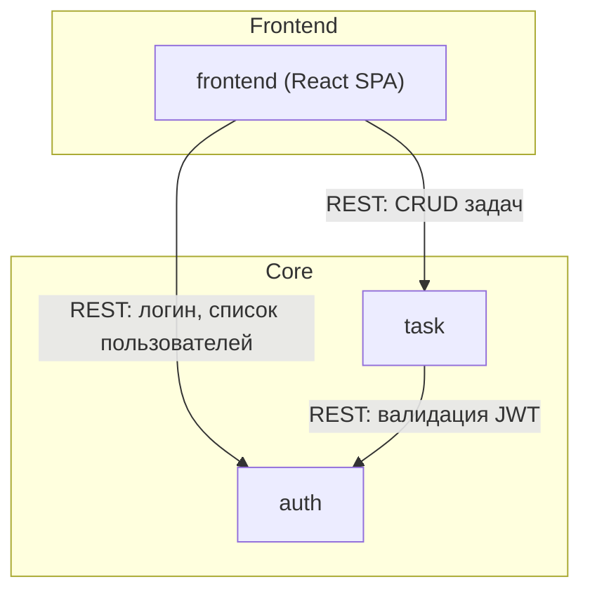

# Архитектура системы

## Назначение системы

Task Dashboard — платформа управления задачами с канбан-доской для команд. Пользователи аутентифицируются через сервис auth, создают задачи, назначают исполнителей, меняют статусы перетаскиванием карточек (drag-and-drop) и отслеживают историю изменений. Система состоит из трёх сервисов: task (CRUD задач, история), auth (аутентификация, JWT, список пользователей) и frontend (React-приложение, канбан-доска).

## Карта сервисов

Система разделена на 2 backend-сервиса по принципу бизнес-домена. auth — центральный сервис: все запросы к task проходят JWT-валидацию через auth. task — основная бизнес-логика домена задач. frontend (React SPA) — клиентское приложение, потребляет REST API обоих backend-сервисов напрямую.

| Сервис | Зона ответственности | Критичность | Владеет данными | Ключевые API |
|--------|---------------------|-------------|----------------|-------------|
| auth | Аутентификация, JWT, список пользователей | critical-high | users | POST /api/v1/auth/login, GET /api/v1/auth/validate, GET /api/v1/auth/users |
| frontend | React SPA: канбан-доска, drag-and-drop, формы задач, фильтрация | critical-medium | — | — |
| task | CRUD задач, история изменений, фильтрация | critical-high | tasks, task_history | POST /api/v1/tasks, GET /api/v1/tasks, PUT /api/v1/tasks/:id, DELETE /api/v1/tasks/:id |



## Связи между сервисами

В системе один паттерн коммуникации — **синхронный REST**. frontend обращается к обоим backend-сервисам напрямую: к auth для логина и получения списка пользователей, к task для всех операций с задачами. task при каждом входящем запросе валидирует JWT через вызов auth (INT-3). auth — центральная зависимость: без него task не обработает ни один запрос, а frontend не аутентифицируется. Прямых связей между frontend и task в обход auth нет — все запросы к task требуют Bearer JWT, выданный auth.

| Источник | Приёмник | Протокол | Назначение | Паттерн |
|----------|---------|----------|-----------|---------|
| frontend | auth | REST | Логин и получение списка пользователей | sync, request-reply |
| frontend | task | REST | CRUD задач, фильтрация, история | sync, request-reply |
| task | auth | REST | Валидация JWT при каждом входящем запросе | sync, request-reply |

При добавлении нового сервиса: он должен валидировать JWT через auth (вызов `GET /api/v1/auth/validate`) при каждом входящем запросе. Если сервис генерирует события — добавить описание в [conventions.md](conventions.md).

## Сквозные потоки

Ниже описаны ключевые сценарии, покрывающие основные бизнес-функции системы и взаимодействие 2–3 сервисов. Отобраны happy-path для: аутентификации, создания задачи end-to-end и смены статуса через drag-and-drop.

### Логин пользователя

**Участники:** frontend, auth

```
1. frontend -> auth: POST /api/v1/auth/login (REST)
   Тело: { email, password }
2. auth: проверяет credentials, генерирует JWT (HS256, exp=1h)
3. auth -> frontend: 200 { token, expiresIn, user }
4. frontend: сохраняет token в localStorage, user — в Zustand authStore
5. frontend: редирект на / (канбан-доска)
```

**Ключевые контракты:**
- Шаг 1: см. [auth.md#post-apiv1authlogin](../auth.md#post-apiv1authlogin)

### Создание задачи end-to-end

**Участники:** frontend, task, auth

```
1. frontend -> task: POST /api/v1/tasks (REST, Bearer JWT)
   Тело: { title, description, priority, assigneeId }
2. task -> auth: GET /api/v1/auth/validate (REST, Bearer JWT)
3. auth -> task: 200 { valid: true, sub, email, name }
4. task: валидирует тело через Zod, создаёт запись в tasks (status: todo)
5. task -> frontend: 201 { id, title, status: "todo", ... }
6. frontend: TanStack Query инвалидирует кэш, новая карточка появляется в колонке To Do
```

**Ключевые контракты:**
- Шаг 1: см. [task.md#post-apiv1tasks](../task.md#post-apiv1tasks)
- Шаг 2: см. [auth.md#get-apiv1authvalidate](../auth.md#get-apiv1authvalidate)

### Drag-and-drop смена статуса

**Участники:** frontend, task, auth

```
1. frontend: пользователь перетаскивает карточку в другую колонку (dnd-kit DragEnd)
2. frontend: Zustand обновляет UI оптимистично
3. frontend -> task: PUT /api/v1/tasks/:id (REST, Bearer JWT)
   Тело: { status: "in_progress" }
4. task -> auth: GET /api/v1/auth/validate (REST, Bearer JWT)
5. auth -> task: 200 { valid: true, sub }
6. task: обновляет статус в tasks, создаёт запись в task_history
7. task -> frontend: 200 { ...Task, status: "in_progress" }
8. frontend: TanStack Query инвалидирует кэш, карточка остаётся в новой колонке
```

**Ключевые контракты:**
- Шаг 3: см. [task.md#put-apiv1tasksid](../task.md#put-apiv1tasksid)
- Шаг 4: см. [auth.md#get-apiv1authvalidate](../auth.md#get-apiv1authvalidate)

## Контекстная карта доменов

Каждый backend-домен реализуется ровно одним сервисом (1:1). Identity — корневой домен, от которого зависит Task Management (JWT-валидация при каждом запросе). Паттерн связи: task принимает JWT claims без адаптации (Conformist). frontend (React SPA) не имеет собственного домена — оперирует DTO из backend API.

| Домен | Реализует сервис | Агрегаты | Связь с другими доменами |
|-------|-----------------|----------|------------------------|
| Identity | auth | User, JwtToken | Published Language: предоставляет JWT-токен как контракт для Task Management |
| Presentation | frontend | — (DTO из backend API) | Потребитель: оперирует DTO Task и User без собственных агрегатов |
| Task Management | task | Task, TaskHistory | Conformist: конформен к Identity — принимает sub (userId) из JWT без адаптации |

**DDD-паттерны связей:**
- **Conformist:** task конформен к auth — принимает sub и JWT-claims без адаптации (changedBy = JWT sub)
- **Published Language:** auth предоставляет стандартный JWT-контракт (sub, email, name); task потребляет его

Если task начнёт использовать новое поле из JWT (например, `role`) — это Conformist, task просто читает поле, ничего адаптировать не нужно. Если появится новый сервис с дополнительной проверкой прав — это ACL, нужен слой адаптации в новом сервисе, а не изменения в auth.

## Shared-код

*Shared-пакеты будут добавлены при появлении переиспользуемого кода между сервисами.*
