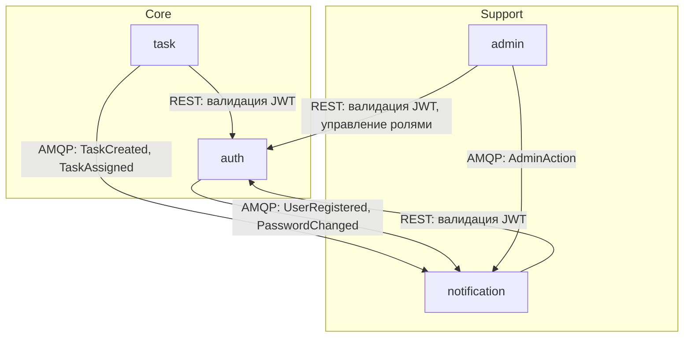

> **Это визуализация.** Содержание ниже (MyApp, 4 сервиса) — пример из стандарта, демонстрирующий как будет выглядеть overview.md в реальном проекте. При старте реального проекта заменить на актуальные данные.

# Архитектура системы

## Назначение системы

MyApp — платформа управления задачами для команд. Пользователи создают задачи,
назначают исполнителей, отслеживают прогресс. Система поддерживает real-time
уведомления через WebSocket, ролевой доступ (admin/manager/member) и
административную панель для управления пользователями и ролями.

## Карта сервисов

Система разделена на 4 сервиса по принципу бизнес-домена. auth — центральный сервис, от которого зависят все остальные (JWT-авторизация). task — основная бизнес-логика. notification — вспомогательный сервис, подписанный на события остальных. admin — надстройка над auth с дополнительной проверкой ролей.

| Сервис | Зона ответственности | Критичность | Владеет данными | Ключевые API |
|--------|---------------------|-------------|----------------|-------------|
| admin | Админ-панель, управление ролями, аудит-лог | critical-low | audit_log | GET /admin/users, PATCH /admin/users/{id}/role |
| auth | Регистрация, логин, JWT, роли | critical-high | users, roles, sessions | POST /auth/register, POST /auth/login, POST /auth/validate |
| notification | Push-уведомления, WebSocket, история | critical-medium | notifications, ws:connections | GET /notifications, WS /ws/notifications |
| task | Задачи, проекты, назначения, статусы | critical-high | tasks, projects, assignments | CRUD /tasks, CRUD /projects |



## Связи между сервисами

В системе два паттерна коммуникации. **Синхронный REST** используется для request-reply: все сервисы валидируют JWT через auth при каждом входящем запросе. **Асинхронный AMQP** используется для событий: auth, task и admin публикуют доменные события в единый exchange `system.events`, notification подписан на все события и создаёт уведомления. auth — центральная зависимость: без него ни один сервис не обработает входящий запрос. Прямых sync-вызовов между task и notification нет — только через события.

| Источник | Приёмник | Протокол | Назначение | Паттерн |
|----------|---------|----------|-----------|---------|
| admin | auth | REST | Валидация JWT + управление ролями | sync, request-reply |
| admin | notification | AMQP | Публикация событий AdminAction | async, pub-sub |
| auth | notification | AMQP | Публикация событий UserRegistered, PasswordChanged | async, pub-sub |
| notification | auth | REST | Валидация JWT при WS-подключении и REST | sync, request-reply |
| task | auth | REST | Валидация JWT при каждом запросе | sync, request-reply |
| task | notification | AMQP | Публикация событий TaskCreated, TaskAssigned | async, pub-sub |

При добавлении нового сервиса: он должен подключить shared/auth middleware для JWT-валидации и, если генерирует события, публиковать их в `system.events` (см. [conventions.md](conventions.md#sharedevents--схемы-событий-amqp)). Если сервис потребляет события — подписаться на `system.events` и обработать нужные типы.

## Сквозные потоки

Ниже описаны ключевые сценарии, покрывающие оба паттерна коммуникации (REST и AMQP) и затрагивающие 3+ сервиса. Отобраны happy-path для основных бизнес-функций: регистрация, создание задачи, административное действие.

### Регистрация пользователя и welcome-уведомление

**Участники:** frontend, auth, notification

```
1. frontend -> auth: POST /auth/register (REST)
   Тело: { email, password, name }
2. auth: создаёт пользователя в users, генерирует JWT
3. auth -> frontend: 201 Created { user, token } (REST)
4. auth -> AMQP: публикует UserRegistered { user_id, email, name }
5. notification: получает UserRegistered из system.events
6. notification: создаёт welcome-уведомление в PostgreSQL
7. notification -> frontend: push через WebSocket (если подключён)
```

**Ключевые контракты:**
- Шаг 1: см. [auth.md#post-apiv1authregister](../auth.md#post-apiv1authregister)
- Шаг 5: см. [notification.md#event-systemevents-subscriber](../notification.md#event-systemevents-subscriber)

### Создание задачи с уведомлением назначенному

**Участники:** frontend, auth, task, notification

```
1. frontend -> task: POST /tasks (REST, Bearer JWT)
2. task -> auth: POST /auth/validate (REST, внутренний вызов)
3. auth -> task: 200 { valid: true, user_id, role }
4. task: создаёт задачу в tasks, назначение в assignments
5. task -> frontend: 201 Created { task } (REST)
6. task -> AMQP: публикует TaskCreated { task_id, creator_id }
7. task -> AMQP: публикует TaskAssigned { task_id, assignee_id }
8. notification: получает TaskAssigned из system.events
9. notification: создаёт уведомление для assignee в PostgreSQL
10. notification -> assignee frontend: push через WebSocket
```

**Ключевые контракты:**
- Шаг 1: см. [task.md#post-apiv1tasks](../task.md#post-apiv1tasks)
- Шаг 2: см. [auth.md#post-apiv1authvalidate](../auth.md#post-apiv1authvalidate)
- Шаг 8: см. [notification.md#event-systemevents-subscriber](../notification.md#event-systemevents-subscriber)

### Административное изменение роли

**Участники:** admin frontend, auth, admin, notification

```
1. admin frontend -> admin: PATCH /admin/users/{id}/role (REST, Bearer JWT)
2. admin -> auth: POST /auth/validate (REST)
3. auth -> admin: 200 { valid: true, user_id, role: "admin" }
4. admin: проверяет role == "admin"
5. admin -> auth: PATCH /auth/users/{id}/role (REST, внутренний)
6. auth: обновляет роль в users
7. admin: записывает audit_log
8. admin -> AMQP: публикует AdminAction { action: "role_changed", target_user_id }
9. notification: создаёт admin-уведомление для target user
10. notification -> target user frontend: push через WebSocket
```

**Ключевые контракты:**
- Шаг 1: см. [admin.md#patch-apiv1adminusersid-role](../admin.md#patch-apiv1adminusersid-role)
- Шаг 5: см. [auth.md#patch-apiv1authusersid-role](../auth.md#patch-apiv1authusersid-role)
- Шаг 8: см. [notification.md#event-systemevents-subscriber](../notification.md#event-systemevents-subscriber)

## Контекстная карта доменов

Каждый домен реализуется ровно одним сервисом (1:1). Identity — корневой домен, от которого зависят все остальные. Паттерн связи выбирается так: если сервис просто принимает чужую модель (user_id, JWT claims) — Conformist. Если нужна адаптация чужой модели (добавить проверку роли) — ACL. Если сервис публикует события для подписчиков — Published Language.

| Домен | Реализует сервис | Агрегаты | Связь с другими доменами |
|-------|-----------------|----------|------------------------|
| Administration | admin | AuditLog | ACL: адаптирует Identity API (дополняет проверкой role == admin). Conformist: к Task Management для чтения статистики |
| Identity | auth | User, Role, Session | Published Language: публикует UserRegistered, PasswordChanged |
| Notifications | notification | Notification, WebSocketConnection | Conformist: конформен к Identity. Published Language: подписан на события всех доменов |
| Task Management | task | Task, Project, Assignment | Conformist: конформен к Identity (принимает user_id без адаптации) |

**DDD-паттерны связей:**
- **Conformist:** task, notification, admin конформны к auth — принимают user_id и JWT-модель без адаптации
- **ACL:** admin оборачивает auth API дополнительной проверкой role == admin перед вызовом
- **Published Language:** auth, task, admin публикуют стандартные события в system.events; notification подписывается
- **Shared Kernel:** shared/auth/ — JWT middleware, используется task, notification, admin (владелец: auth)

Если task начнёт использовать новое поле из JWT (например, `organization_id`) — это Conformist, task просто читает поле, ничего адаптировать не нужно. Но если admin добавит новую проверку прав (например, `can_manage_users`) — это ACL, нужно расширить слой адаптации в admin, а не менять auth.

## Shared-код

В shared/ выносится код, который используется 2+ сервисами и имеет одного владельца. Владелец отвечает за API пакета и обратную совместимость. Потребители используют пакет как есть, без модификаций. Полные интерфейсы (сигнатуры, параметры, примеры вызова) — в [conventions.md](conventions.md#shared-пакеты).

| Пакет | Назначение | Владелец | Потребители |
|-------|-----------|---------|-------------|
| shared/auth | JWT middleware — валидация токена, извлечение user_id и role из claims | auth | task, notification, admin |
| shared/events | Схемы событий AMQP — UserRegistered, TaskCreated и др. TypedDict-определения | auth (Identity-события), task (Task-события) | notification |

Когда создавать новый shared-пакет: если два сервиса дублируют одинаковую логику (middleware, схемы данных, утилиты). Не выносить в shared: бизнес-логику конкретного домена, конфигурацию специфичную для одного сервиса.
